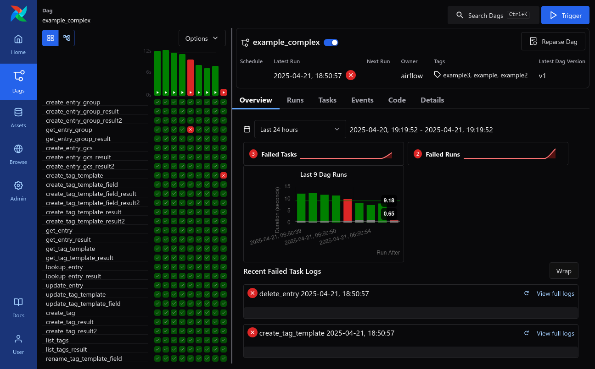
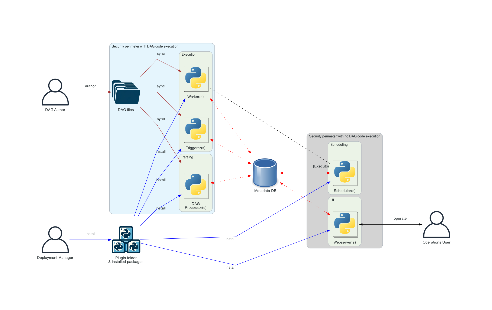

## What is Apache Airflow?

> Apache Airflow – A platform to programmatically author, schedule, and monitor workflows  
> 

[Apache Airflow](https://github.com/apache/airflow) is an open-source workflow management platform  
that enables developers to define data pipelines using the **Workflow as Code** paradigm.  

> In Airflow, an entire workflow is called a **DAG**   
> which stands for **Directed Acyclic Graph**.  
>
> A **DAG** consists of multiple **Tasks**   
> and these DAGs or tasks can have **various dependencies**,  
> as long as they do **not form cycles**.  

Airflow supports **various scheduling strategies**   
and allows developers to define complex DAGs.
It also provides a comprehensive UI for monitoring and managing workflows.

Airflow is one of the **most popular** workflow orchestration tools today:
- Over **40,000 stars** on GitHub
- The **5th largest project** under the Apache Software Foundation
- Used by more than **20,000 companies** worldwide  
  > According to [HG Insight](https://discovery.hgdata.com/product/apache-airflow)

## Key Features of Apache Airflow

- **Powerful Scheduling Capabilities**
  - Supports various scheduling options for executing DAGs:
    - [Cron, Interval](https://airflow.apache.org/docs/apache-airflow/stable/authoring-and-scheduling/cron.html)
    - [Asset Scheduling](https://airflow.apache.org/docs/apache-airflow/stable/authoring-and-scheduling/asset-scheduling.html)
    - [External Triggers (via UI, REST API, CLI)](https://airflow.apache.org/docs/apache-airflow/stable/stable-rest-api-ref.html#operation/trigger_dag_run)

- **Support for Complex Workflows**
  - [XCom: Cross-task communication](https://airflow.apache.org/docs/apache-airflow/stable/core-concepts/xcoms.html)
  - [Branching: Conditional task logic (if/else)](https://www.astronomer.io/docs/learn/airflow-branch-operator/)
  - [Dynamic Task Mapping: Generate tasks based on runtime data](https://airflow.apache.org/docs/apache-airflow/stable/authoring-and-scheduling/dynamic-task-mapping.html)
  - [Dynamic DAG Generation: Generate DAGs dynamically based on current data](https://airflow.apache.org/docs/apache-airflow/stable/howto/dynamic-dag-generation.html)

- **Multiple Execution Backends (Executors)**
  - [LocalExecutor](https://airflow.apache.org/docs/apache-airflow/stable/core-concepts/executor/local.html)
  - [CeleryExecutor](https://airflow.apache.org/docs/apache-airflow/stable/core-concepts/executor/celery.html)
  - [KubernetesExecutor](https://airflow.apache.org/docs/apache-airflow/stable/core-concepts/executor/kubernetes.html)
  - [EdgeExecutor](https://airflow.apache.org/docs/apache-airflow-providers-edge3/stable/edge_executor.html)

- **Backfilling Mechanism**
  - Enables **data backfilling** for historical time intervals

- **Monitoring and Logging**
  - A variety of UI views to monitor the status of DAGs and tasks  
    > Screenshots below are from the [Apache Airflow GitHub](https://github.com/apache/airflow)  
    > For a detailed UI overview, see the [UI Documentation](https://airflow.apache.org/docs/apache-airflow/stable/ui.html#ui-screenshots)
    - **DAG View**  
      >   
      > Displays the status of all DAGs
    - **Grid View**  
      >   
      > Shows recent DAG runs and task statuses for a single DAG
    - **Graph View**  
      >   
      > Clearly visualizes task dependencies
    - **Task Instance Log View**  
      >   
      > View task logs directly in the UI  
      > No need to SSH into workers to check logs
      - Supports various remote logging backends:
        - Local, Elasticsearch, S3, GCS, and more

    - Most importantly, you can **manually retry** DAGs or individual tasks directly from the UI

- **Alerting & Notifications**
  - Notifies users of DAG or task failures via:
    - Email, Slack, and other integrations

- **Integrations with Third-Party Services**
  - Supports a wide range of tools and platforms:
    - AWS, GCP, Azure
    - MySQL, PostgreSQL, MongoDB
    - Kafka, Spark, and more

## The Role of Apache Airflow in a Data Pipeline

Airflow is often described as a **Data Orchestration Tool**.  

In the context of a data platform architecture,  
Airflow functions as the **orchestration layer**—essentially the **brain** of the entire platform.  
It is responsible for precisely scheduling, coordinating, logging, and monitoring the status of every task within each workflow.  

>   
> Reference from [chaossearch.io / cloud-data-platform-architecture-guide](https://www.chaossearch.io/blog/cloud-data-platform-architecture-guide)

In large-scale data platforms,  
Airflow typically sits at the **top layer**, orchestrating every step from the data source all the way to the final data product delivered to end users.  
However, each individual task is usually executed by **specialized tools** dedicated to specific purposes.  

**For example:**
- An Airflow DAG might be responsible for periodically initiating data ingestion, then running ETL processes, and finally landing the data into the appropriate tables or views based on its type.  
  - Within this process:
    - Data ingestion might be handled by tools like Airbyte
    - ETL might be processed by Spark, Flink, DuckDB, or other compute engines
  - Airflow's focus is solely on **orchestration**  
  > For small to medium-sized data platforms,  
  > using Airflow with LocalExecutor or CeleryExecutor is often more than sufficient!  

The relationship between Airflow and other common components of a data pipeline is illustrated below:  

>   
> Reference from [ml4devs.com / scalable-efficient-big-data-analytics-machine-learning-pipeline-architecture-on-cloud](https://www.ml4devs.com/en/articles/scalable-efficient-big-data-analytics-machine-learning-pipeline-architecture-on-cloud/)

## What Problems Does Airflow Solve?

Based on my experience working in data teams,  
Airflow addresses several key challenges:

- **Workflow Observability**
  - The Grid View (DagRun/TaskInstance records) can act as a real-time metric dashboard for pipeline execution.
  - Examples:
    - 1. If the UI shows (or you receive alerts about) frequent failures in a specific task like `xxx`:
      - This could indicate an issue with the component or service responsible for that task.
    - 2. If recent DAG runs are taking longer to complete:
      - You can investigate specific DagRuns and TaskInstances to identify performance issues,
      - such as increased data volume or a performance degradation in one of the tasks.

- **Retryability of Workflows**
  - DAGs or individual tasks can be manually retried directly from the UI.
  - This **reduces operational overhead**.
  - Common scenarios:
    - 1. Downstream services occasionally experience transient failures:
      - Operations can simply review TaskInstance logs and retry the affected tasks or entire DAGs—all from the UI.
    - 2. Upstream services produce incorrect data, requiring reprocessing of X days of data:
      - You can easily perform a [backfill](https://airflow.apache.org/docs/apache-airflow/stable/core-concepts/dag-run.html#backfill) to fill in the missing or corrected data.  
        > Good news: [As of Airflow 3, backfills can now be triggered directly from the UI!](https://raw.githubusercontent.com/apache/airflow/main/airflow-core/docs/img/ui-dark/backfill.png)

- **Dynamic DAG Generation Based on Configuration**
  - DAGs can be dynamically created based on configuration within the DAG code itself.
  - Example:
    - Use a list of current customer IDs from a config file to dynamically generate DAGs like `client_<client_id>_dag`.
    - This enables **dynamic generation and updating** of DAGs.

- **Automated Onboarding**
  - While backfilling might not be necessary for every data team,  
  - it's a common use case in onboarding scenarios:
    - Example:
      - A `@daily` DAG generates a daily snapshot view.
      - When a new client is onboarded, setting up [catchup](https://airflow.apache.org/docs/apache-airflow/stable/core-concepts/dag-run.html#catchup) or triggering a [backfill](https://airflow.apache.org/docs/apache-airflow/stable/core-concepts/dag-run.html#backfill) ensures their historical data is automatically processed.

In summary,  
using Airflow can **significantly reduce operational workload** and streamline workflow management.  

## Airflow Architecture

>   
> Reference from [airflow.apache.org / 2.10.5/core-concepts](https://airflow.apache.org/docs/apache-airflow/2.10.5/core-concepts/overview.html#airflow-components)

- **Meta Database**
  - All DAG and Task states are stored in the Meta Database.  
  - It is recommended to use a connection pool proxy like [PgBouncer](https://www.pgbouncer.org/),  
    as nearly **all components access the Meta Database constantly**.

- **Scheduler**
  - Responsible for monitoring all tasks and DAGs:  
    - Checks if any DAG needs to trigger a new DagRun.  
    - Checks within each DagRun if any TaskInstances or the entire DAG need to be scheduled.  
    - Selects TaskInstances to be scheduled, and adds them to the execution queue considering execution pools and concurrency limits.  
  - See more about [how to fine-tune the Scheduler](https://airflow.apache.org/docs/apache-airflow/stable/administration-and-deployment/scheduler.html).

- **Worker**
  - Executes the callable for each TaskInstance.

- **Trigger**
  - Used for [**Deferrable Tasks**](https://airflow.apache.org/docs/apache-airflow/stable/authoring-and-scheduling/deferring.html)  
    - **Use case:** Tasks that wait for an external system to change state or need to be delayed for a long time.  
    - Triggers run `asyncio` coroutines to perform polling in the background.  
      - Example: See the `poll_interval` in [`AwaitMessageTrigger`](https://airflow.apache.org/docs/apache-airflow-providers-apache-kafka/stable/_modules/airflow/providers/apache/kafka/triggers/await_message.html#AwaitMessageTrigger).

- **DAG Processor (DAG Parser)**
  - Periodically parses DAG files (Python scripts) and stores them as `Dag` records in the Meta Database.

- **Web Server (API Server)**
  - Provides the UI and REST API for interacting with Airflow.

## Common Use Cases for Airflow

### Ideal Scenarios for Using Airflow

- **Recurring Workflows**
  - Workflows that must run at regular time intervals.  
  - For example: every few hours, days, or weeks.

- **Workflows Split into Retryable Tasks**
  - Suitable when a workflow involves multiple services and each task may need to be retried manually.  
  - Example: a multi-step ETL process spanning several services.

- **Workflows with Complex Task Dependencies**
  - Where task execution order depends on certain conditions or outcomes.

- **Workflows that Expand Dynamically Based on External State**
  - Dynamic DAG rendering based on configuration, metadata, or queries.  
  - Example: DAGs and tasks are determined based on dynamic configs or query results.

### Real-World Use Cases of Airflow

- **Data Pipelines / ETL / Business Intelligence**
- **Infrastructure Automation**
- **MLOps (Machine Learning Operations)**

These use cases align closely with the ideal scenarios outlined above.

> For more practical examples, refer to [astronomer.io / use-cases](https://www.astronomer.io/airflow/use-cases/)

## Limitations of Airflow

Based on the Airflow architecture diagram above, we can already infer the following:  

**The Meta Database I/O is the bottleneck of Airflow!**  
> Every component constantly reads from and writes to the Meta Database.  
> For example: each DagRun creates a new record; each TaskInstance creates another.  
> These are continuously updated based on their execution status.  

Therefore, Airflow is **not suitable for**:

- **Low-latency, event-driven workflows**
  - Here, "low-latency" refers to **millisecond-level** execution.  
    - 1. As mentioned in the architecture, even with the Trigger component, the internal implementation involves **polling the external system every few seconds**.  
    - 2. Even if you use the [REST API to trigger a DAG](https://airflow.apache.org/docs/apache-airflow/stable/stable-rest-api-ref.html#operation/trigger_dag_run), the task still has to go through the Scheduler before being picked up by a Worker.

- **Consumers processing thousands to tens of thousands of messages per second**

Currently, the maximum throughput of Airflow is approximately **a little over 100 DAG runs per second**.  
> Based on:  
> [Airflow Summit 2024: How we Tuned our Airflow to Make 1.2 Million DAG Runs per Day](https://airflowsummit.org/sessions/2024/how-we-tuned-our-airflow-to-make-1-2-million-dag-runs-per-day/)  
> Calculation: `1,200,000 / 86,400 = 138.89`  
> Even with fine-tuned Airflow configurations,  
> due to database I/O bottlenecks, throughput is still limited to just **over 100 DAG runs per second**.  

**Anti-pattern:** Using a _single Airflow cluster_ as a consumer downstream of RabbitMQ or Kafka.  
A _single Airflow cluster_ is **not suitable** for handling **thousands or tens of thousands of messages per second**.  

> The emphasis on _single cluster_ is important because:  
> It’s possible to leverage the concept of **partitions** and use **multiple Airflow clusters** to handle different Kafka topics.  
>
> For example:  
> `airflow-cluster-a` handles all messages from `topic-group-a-*`  
> `airflow-cluster-b` handles all messages from `topic-group-b-*`  
> ...  
>
> By partitioning the workload, we can achieve Kafka-level message throughput  
> while preserving the benefits of easy monitoring and manual retries at the DAG or Task level.  

## Conclusion

Through this article, you should now have a solid understanding of **Apache Airflow's overall architecture and its suitable use cases**.  

- For **small to medium-sized data pipelines**:  
  - Use the default [LocalExecutor](https://airflow.apache.org/docs/apache-airflow/stable/core-concepts/executor/local.html) along with various [third-party providers](https://airflow.apache.org/docs/apache-airflow-providers/index.html) to quickly meet business needs.  
  - If your DAGs/Tasks require more compute resources, scale up to [CeleryExecutor](https://airflow.apache.org/docs/apache-airflow/stable/core-concepts/executor/celery.html) or [KubernetesExecutor](https://airflow.apache.org/docs/apache-airflow/stable/core-concepts/executor/kubernetes.html) to distribute tasks across multiple workers, depending on your use case.  
    - You can refer to the [Remote Executor comparison guide](https://airflow.apache.org/docs/apache-airflow/stable/core-concepts/executor/index.html#remote-executors) to choose the most appropriate executor.

- For **large-scale data pipelines**:
  - Let Airflow focus solely on its role as the **orchestration layer**.  
    - Delegate actual task execution to specialized tools for each domain.  
  - Fine-tune the Scheduler and Meta Database settings for performance and scalability.

- Leverage Airflow's built-in strengths to build a **flexible**, **observable**, and **retryable** data pipeline.  

At the same time, it’s crucial to **understand Airflow’s limitations**:  

For scenarios requiring **low-latency (millisecond-level)** or **message throughput in the thousands to tens of thousands per second**,  
Apache Airflow may **not be the best fit**.  
