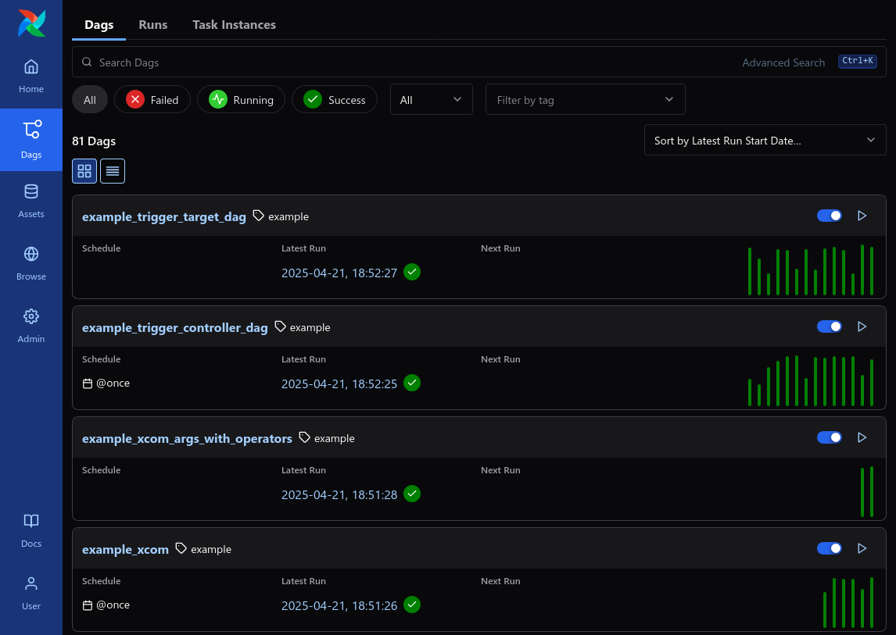
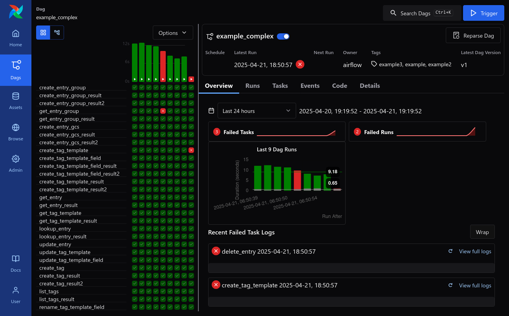
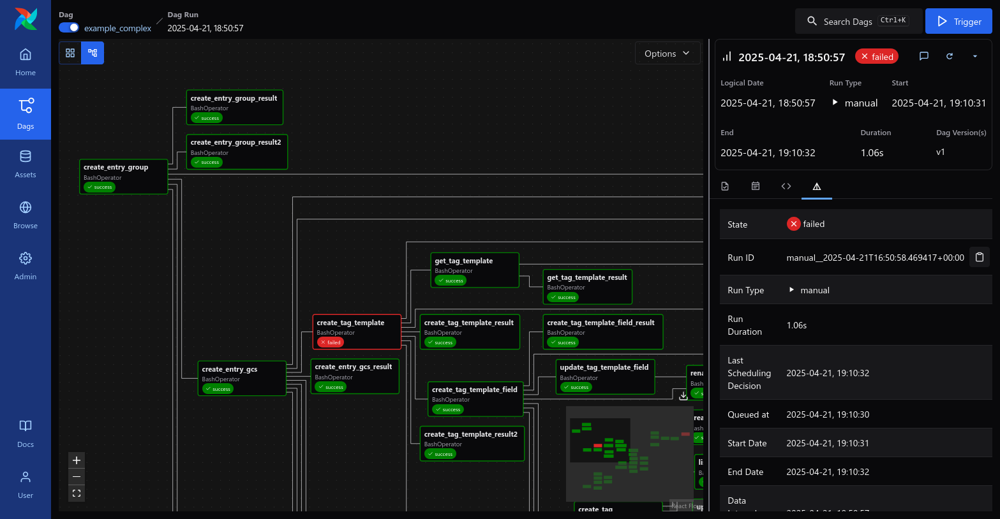
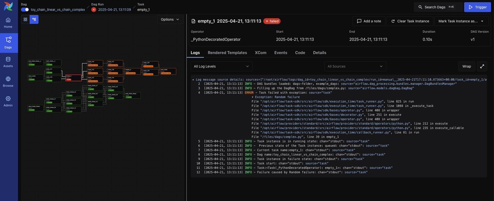
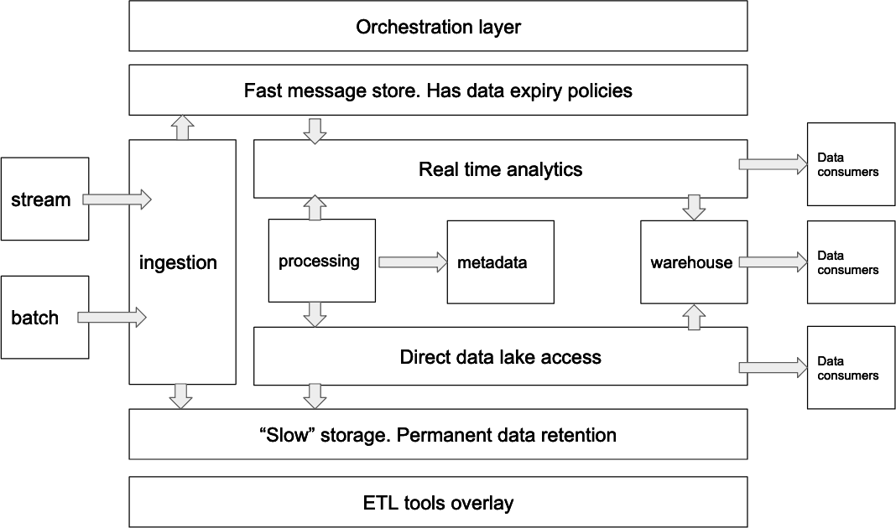
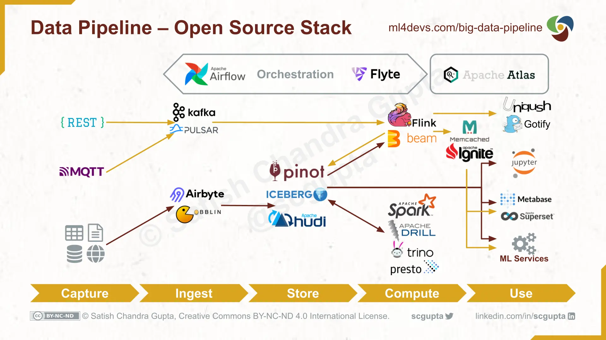
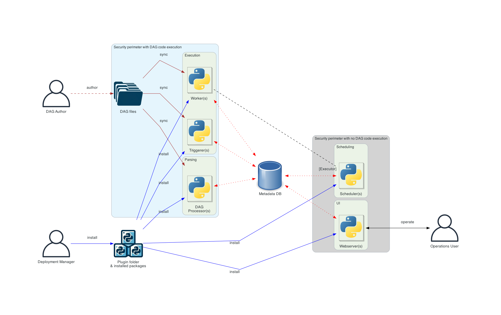

## 什麼是 Apache Airflow？

> Apache Airflow - A platform to programmatically author, schedule, and monitor workflows
> 

[Apache Airflow](https://github.com/apache/airflow) 是一個開源的 Workflow 管理平台  
讓開發者以 **Workflow as Code** 去定義 Data Pipeline  
> 在 Airflow 中，會把一整個 Workflow 叫做 **Dag**  
> 同時也代表 **Directed Acyclic Graph(有向無環圖)**  
>
> 而 **Dag** 是由多個 **Task(任務)** 組成的  
> 這些 **Dag** 或 **Task** 之間可以有**各種依賴關係**，只要**不形成環**(Cycle)就可以  

支援**多種排程方式**或是讓開發者定義複雜的 Dag  
也提供 UI 介面來監控、管理 Dag  

是目前**最流行**的 Workflow Orchestration Tool 之一  
- 在 GitHub 上有**超過 40,000**顆星星
- 是 Apache Software Foundation **第 5 大的專案**
- 超過 **20,000 個企業**使用 Apache Airflow
  > According to [HG Insight](https://discovery.hgdata.com/product/apache-airflow)

## Apache Airflow 的 Feature

- **強大的排程功能**
  - 支援多種排程方式來執行這些 Dag
    - [Cron, Interval](https://airflow.apache.org/docs/apache-airflow/stable/authoring-and-scheduling/cron.html), [Asset Scheduling](https://airflow.apache.org/docs/apache-airflow/stable/authoring-and-scheduling/asset-scheduling.html), [External Trigger (UI/Rest API/CLI)](https://airflow.apache.org/docs/apache-airflow/stable/stable-rest-api-ref.html#operation/trigger_dag_run)
- **定義複雜的 Workflow**
  - [XCom (Tasks 之間的 Cross Communication)](https://airflow.apache.org/docs/apache-airflow/stable/core-concepts/xcoms.html)
  - [Branching (Task Level 的 If/Else)](https://www.astronomer.io/docs/learn/airflow-branch-operator/)
  - [Dynamic Task Mapping (根據當前 data 來生成 tasks)](https://airflow.apache.org/docs/apache-airflow/stable/authoring-and-scheduling/dynamic-task-mapping.html)
  - [Dynamic Dag Generation (根據當前 data 來生成 Dags)](https://airflow.apache.org/docs/apache-airflow/stable/howto/dynamic-dag-generation.html)
- **支援多種 Execution Backend (Executor)**
  - [LocalExecutor](https://airflow.apache.org/docs/apache-airflow/stable/core-concepts/executor/local.html), [CeleryExecutor](https://airflow.apache.org/docs/apache-airflow/stable/core-concepts/executor/celery.html), [KubernetesExecutor](https://airflow.apache.org/docs/apache-airflow/stable/core-concepts/executor/kubernetes.html), [EdgeExecutor](https://airflow.apache.org/docs/apache-airflow-providers-edge3/stable/edge_executor.html).
- **Backfilling 機制**
  - 可以針對過去的時間區段進行**資料回補**
- **Monitoring 和 Logging**
  - 有多種 UI 可以監控 Dags 和 Tasks 的狀態
    > 以下 UI 的截圖都來自[apache/airflow GitHub](https://github.com/apache/airflow)  
    > 更詳細關於 UI 的介紹可以參考[UI Overview](https://airflow.apache.org/docs/apache-airflow/stable/ui.html#ui-screenshots)
    - Dag View
      > 
      > 可以看所有 Dag 的狀態 
    - Grid View
      > 
      > 看單個 Dag 近期的 DagRun 還有 Tasks 的狀態
    - Graph View
      > 
      > 可以清楚看出 Task 之間的依賴關係
    - TaskInstance Log
      > 
      > 直接在 UI 就可以看到 TaskInstance 的 Log  
      > User 不用 exec 到 Worker 上去看 Log
      - 也支援多種 Remote Logging Backend 來儲存 Logs
        - Local, Elastic Search, S3, GCS, etc.
    - 最重要是**可以在 UI 直接針對 Dag Level 或 Task Level 進行人工重試**
- **Alerting**
  - 當 Dag 或 Task 失敗時可以透過多種方式發送通知
    - Email, Slack, etc.
- **支援多種第三方服務的整合**
  - AWS, GCP, Azure, MySQL, PostgreSQL, MongoDB, Kafka, Spark, etc.

## Apache Airflow 在 Data Pipeline 中的角色

Airflow 也會說是「Data Orchestration Tool」  

以 Data Platform 架構來說  
Airflow 是 Orchestration Layer，可以說是**整個平台的大腦**  
負責精確的調度、規劃、並詳細記錄和監控所有的 Workflow 各個 Task 的狀態  
> 
> Reference from [chaossearch.io / cloud-data-platform-architecture-guide](https://www.chaossearch.io/blog/cloud-data-platform-architecture-guide)

以大型的 Data Platform 架構來說  
Airflow 會是**在最上層規劃**一路從 Data Source 到最終給 End User 的 Data Product 的所有步驟  
但每個 Task 實際執行通常是**交給其他專項工具**來執行  

**例如:**
- Airflow Dag 負責定期開始 Data Ingestion, 再接著跑 ETL, 最後根據 Data 類別決定要 Land 到哪個 Table、View 
  - 而其中的
    - Data Ingestion 可能是交給 Airbyte
    - ETL 可能是交給 Spark、Flink、DuckDB 等其他 Compute 來執行
  - Airflow 只專注於**調度(Orchestration)**
  > 但以中小型的 Data Platform 來說  
  > 拿 Airflow 的 LocalExecutor 或搭配 CeleryExecutor 來執行 Dag 是非常夠用的 !  

Airflow 與其他常見的 Data Pipeline 的 Component 更詳細的關係可以參考下圖  
>
> Reference from [ml4devs.com / scalable-efficient-big-data-analytics-machine-learning-pipeline-architecture-on-cloud](https://www.ml4devs.com/en/articles/scalable-efficient-big-data-analytics-machine-learning-pipeline-architecture-on-cloud/)

## Airflow 解決了什麼問題？  

以我在 Data Team 的經驗來說  
Airflow 解決以下問題:

- **Workflow 的 Observability**
  - 尤其是其中的 Grid View (DagRun/TaskInstance records) 也可以當做整體 Pipeline 執行的指標(Metrics)
  - 例如:
    - 1. 在 UI 看到(或是收到 Failure 通知) `xxx` Task 最近很常失敗
      - 負責 `xxx` Task 的 component/ service 可能有問題需要修復
    - 2. 看到近幾次 DagRun 的執行時間變長
      - 再針對最近的 DagRun 和 TaskInstance 進行排查
      - 有可能是最近的資料量變多了，或是某個 Task 的效能變差了
- **Workflow 的可重試性**
  - 可以直接在 UI 針對 Dag Level 或 Task Level 進行人工重試
  - 可以**減輕 operation 時的負擔**
  - 常見的使用場境可能是:
    - 1. 下游服務零星的異常
      - 這時候 Operation 看 TaskInstance Log 再針對單個 Tasks 或整個 Dag 重試 (這些都可以在 UI 完成)
    - 2. 上游服務 produce 錯誤資料，導致需要重新計算 X 天的資料
      - 只需要透過[backfill](https://airflow.apache.org/docs/apache-airflow/stable/core-concepts/dag-run.html#backfill) 把資料補齊
        > 好消息[現在 Airflow 3 也可以在 UI 上 trigger Backfill 了！](https://raw.githubusercontent.com/apache/airflow/main/airflow-core/docs/img/ui-dark/backfill.png)
- **根據 config 動態生成 Dag**
  - 可以在 Dag Code 中動態根據 config 來生成 Dag
  - 例如:
    - 有根據目前有的客戶 id 設定檔來生成 `client_<client_id>_dag` 的 Dag
    - **達到動態生成、動態更新 Dag 的目的**
- **自動化 onboarding**
  - backfilling 不一定會是每個 Data Team 都會需要的功能  
  - 常見的使用場境可能是:
    - 例如:
      - 有一個 `@daily` 的 Dag 會產每天的 snapshot view
      - 如果有新的客戶 onboard 時，只需要設好[catchup](https://airflow.apache.org/docs/apache-airflow/stable/core-concepts/dag-run.html#catchup) 或是透過[backfill](https://airflow.apache.org/docs/apache-airflow/stable/core-concepts/dag-run.html#backfill) 就可以自動把新客戶的資料補齊

總結來說  
使用 Airflow 可以**很大程度的減少 Operation 的負擔**  

## Airflow 本身的架構

> 
> Reference from [airflow.apache.org / 2.10.5/core-concepts](https://airflow.apache.org/docs/apache-airflow/2.10.5/core-concepts/overview.html#airflow-components)

- **Meta Database**
  - 所有 Dag, Task 的狀態都是存在 Meta Database
  - 也建議使用[如: PgBouncer](https://www.pgbouncer.org/) 這種 connection pool proxy
    - 因為所有 components 幾乎**無時無刻**都需要存取 Meta Database
- **Scheduler**
  - 負責監控所有 tasks 和 dags
    - 檢查是否有任何 dag 需要新的 DagRun
    - 檢查 DagRun 中是否有需要 schedule 的 TaskInstances 或完整的 DagRun
    - 選擇需要 schedule 的 TaskInstance，並在 Execution Pool 和其他 Concurrency 限制下把 TaskInstances 加到 
  - 可以參考[如何 fine-tune Scheduler](https://airflow.apache.org/docs/apache-airflow/stable/administration-and-deployment/scheduler.html)
- **Worker**
  - 負責實際執行 TaskInstance 的 callable
- **Trigger**
  - 用於 [**Deferrable 的 Task**](https://airflow.apache.org/docs/apache-airflow/stable/authoring-and-scheduling/deferring.html)  
    - **適用場景:** 等待某個外部系統的狀態改變、 或是需要等待很長一段時間再執行的 Task  
    - 會在 Trigger 中跑 `asyncio` 的 coroutine 去 polling
      - 例如: [`airflow.providers.apache.kafka.triggers.await_message.AwaitMessageTrigger` 的 `poll_interval`](https://airflow.apache.org/docs/apache-airflow-providers-apache-kafka/stable/_modules/airflow/providers/apache/kafka/triggers/await_message.html#AwaitMessageTrigger)
- **Dag Processor(Dag Parser)**
  - 定期把 Dag Files (Python 檔) parse 成在 Meta Database 的 `Dag` records
- **Web Server(API Server)**
  - 提供 UI 和 Rest API

## 常見的 Airflow 的 Use Cases

### Airflow 適合的場景

- **週期性的 Workflow**
  - 需要固定的時間間隔執行
  - 例如：每 x 小時、每 x 天、每 x 週執行的
- **Workflow 需要拆成多個可人工重試的 Task**
  - 例如：需要經過多個不同 Services 的 ETL 
- **Workflow 有複雜的 Task 依賴關係**
  - 例如：需要根據某些條件來決定 Task 的執行順序
- **Workflow 需要根據外部狀態擴展**
  - Dynamic Dag Rendering
  - 例如：需要根據某些 config, query 來決定有哪些 Dag、Tasks 需要執行

### Airflow 實際的 Use Cases

- **Data Pipeline / ETL / Business Intelligence**
- **Infrastructure Automation**
- **MLOps**

主要也是因為這些 Use Cases 都符合上一節所說的場景

> 可以參考[astronomer.io / use-cases](https://www.astronomer.io/airflow/use-cases/) 的更多實際案例

## Airflow 本身的限制

根據上方 Airflow 的架構圖其實就可以猜到:  

**Meta Database 的 I/O 會是 Airflow 的瓶頸 !**  
> 每個 Component 都隨時需要從 Meta Database 讀取、寫入狀態  
> 例如: 每個 DagRun 都是一個新的 record、每個 TaskInstance 都是一個新的 record  
> 根據執行狀態來更新 DagRun、TaskInstance 的狀態  

所以 Airflow 並**不適合作為**:
- **low latency 的 Event Driven Workflow**
  - 這邊的 low latency 是指**ms 級別的**  
    - 1. 在 Airflow 的架構有提到 Trigger，內部實作其實是**每 x 秒去 poll**外部系統狀態
    - 2. 就算是直接透過[Rest API 去 Trigger Dag](https://airflow.apache.org/docs/apache-airflow/stable/stable-rest-api-ref.html#operation/trigger_dag_run) 還是需要經過 Scheduler 的排程才會真的被 Worker 執行
- **每秒數千、數萬 messages 級別的 consumer**

目前 Airflow 最大的 Throughput 大約是 **每秒 100 多個 DagRun**
> 這邊是根據:  
> [Airflow Submit 2024: How we Tuned our Airflow to Make 1.2 million DAG Runs - per day!](https://airflowsummit.org/sessions/2024/how-we-tuned-our-airflow-to-make-1-2-million-dag-runs-per-day/)
> 我們把 `12000000 / 86400 = 138.89`  
> 就算是 fine tune 過的 Airflow 設定  
> 因為 Database 的 I/O Bottleneck 還是只能處理**每ㄧ百出頭級別**的 message throughput  

**Anti Pattern**: 拿 _單個 Airflow Cluster_ 作為 RabbitMQ 和 Kafka 下游的 consumer
當然 _單個 Airflow Cluster_ 就不適合作為處理**每秒數千、數萬 messages 級別的 consumer**   
> 這邊只說 _單個 Airflow Cluster_ 是因為  
> 我們確實可以用**partition的概念**讓**不同的 Airflow Cluster** 來處理不同的 Kafka Topic  
>
> 例如:  
> `airflow-cluster-a` Cluster 都處理 `topic-group-a-*` 的 messages  
> `airflow-cluster-b` Cluster 都處理 `topic-group-b-*` 的 messages  
> ...  
> 
> 透過**分不同的 partition** 來達到 Kafka 級別的 Message Throughput  
> 同時保有容易監控、方便針對 Dag Level 或 Task Level 人工重試的特性  

## 總結

透過本篇文章  
應該可以**了解 Apache Airflow 整體架構和適合的場景** 

- 對於**中小型的 Data Pipeline**
  - 用預設的 [LocalExecutor](https://airflow.apache.org/docs/apache-airflow/stable/core-concepts/executor/local.html) 搭配各種[第三方Providers](https://airflow.apache.org/docs/apache-airflow-providers/index.html) 快速搭建出商業需求
  - 如果 Dags/ Tasks 需要更多 Compute Resource 再 Scale 成 [CeleryExecutor](https://airflow.apache.org/docs/apache-airflow/stable/core-concepts/executor/celery.html) 或 [KubernetesExecutor](https://airflow.apache.org/docs/apache-airflow/stable/core-concepts/executor/kubernetes.html) 把 Tasks 分散到不同的 Worker 處理 (根據 Use Case 去決定)
    - 可以根據[Remote Executor 的比較](https://airflow.apache.org/docs/apache-airflow/stable/core-concepts/executor/index.html#remote-executors)來決定適合的 Executor
- 對於**大型的 Data Pipeline**
  - 讓 Airflow 專注於**Orchestration**的角色
    - 實際 Task 的執行就交給該子領域的專業工具
  - 並 fine-tune Airflow 的 Scheduler 和 Meta Database 設定
- 利用 Airflow 本身的特性來打造**靈活**、**可觀察**、**可重試**的 Data Pipeline

同時**了解 Airflow 的限制**  

例如:  
**low-latency(ms level)**或是**每秒數千、數萬 messages 級別的 consumer**的情境  
Apache Airflow 可能不是最好的選擇  
