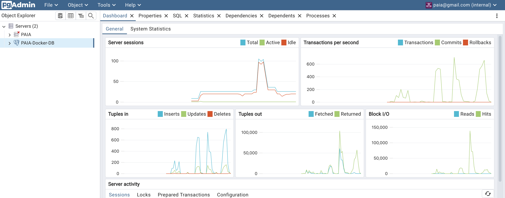

## 前情提要


> `Django` 雖然可以設定 `CONNECTION_MAX_AGE` 之類的 config
但是對於使用 `gunicorn` ( muti-process ) 跑起多個 API instance 
或是在 k8s 用 HPA 擴展 API instance 時
還是會出現 **DB 過多 connection 的問題！**

## 關於 PgBouncer



`PgBouncer` : 可以當作集中的 DB Connection Pool 的中間件
> 讓各個後端服務 instance 透過 `PgBouncer` 重複利用 DB connection

如圖所示：

- 在右側的 `Transactions per second` 可以看到 3 次 load testing 飆高的 transactions 數量
    - 而 **第 2 次** 的 load testing 是 **使用 `Django` 原生的 DB 連接方式**
    - **第 1 、 3 次** 是使用 **`pgbouncer` 作為 WebService instance 的連接對象**
- 可以觀察到左側 `Server sessions` ( 也可以視為當前的 DB connection 數量 )
    - 可以看到 **第 2 次** 的 load testing：有出現 **DB 過多 connection 的問題！**
    - 而 **第 1 、 3 次** 的 load testing : DB connection **穩定的維持在 20 幾**




## 後端服務 Config

需要特別設定的地方：

1. `docker-compose.yml`
2. `.env`

- `docker-compose.yml`
    - `db` 和 `pgbouncer` 要 **掛在同一個 network**
    - 因為是從 Docker 的 internal network
        - 所以對於 `pgbouncer` 的 `postgres` HOST 需要填 `db`

```yaml
db:
    image: postgres:15.1
    container_name: postgres
    restart: always
    environment:
      POSTGRES_USER: your_postgres_user
      POSTGRES_PASSWORD: your_postgres_password
      POSTGRES_DB: dev
    ports:
      - 5432:5432
    volumes:
      - pg_data:/var/lib/postgresql/data
    networks:
      - django_network
pgbouncer:
    image: bitnami/pgbouncer
    container_name: pgbouncer
    restart: always
    ports:
      - 6432:6432 # 如果要連 `pgbouncer` 需要連 6432 port
    environment:
      POSTGRESQL_USERNAME: your_postgres_user
      POSTGRESQL_PASSWORD: your_postgres_password
      POSTGRESQL_HOST: db
      POSTGRESQL_PORT: 5432
      POSTGRESQL_DATABASE: dev
      PGBOUNCER_DATABASE: dev
    networks:
      - django_network # 讓 `db` 和 `pgbouncer` 在同一個 network
```

- `.env`
    - 如果要連 `pgbouncer`
        - 需要把 `DB_BOUNCER=True`
        - 並且 `DB_PORT=6432`
```bash
# if you want to use postgres you should set DB_ENGINE
DB_ENGINE=django.db.backends.postgresql
DB_HOST=127.0.0.1
# DB_PORT=5432
DB_NAME=postgres
DB_USER=USER_NAME
DB_PASSWORD=PASSWORD12345678
# if you want to use `pgbouncer` you should set DB_BOUNCER=True
# and set DB_PORT to 6432
DB_BOUNCER=True
DB_PORT=6432
```

## 後端服務 setting.py 修改

有更改到的細節：
- 這邊使用 `pydantic` 的 `BaseSettings` 來設定 `DB` 的 config
- 並且在 `settings.py` 中，根據 `DB_BOUNCER` 來決定要連接 `DB` 或是 `pgbouncer`

`config.py`
```python
from pydantic import BaseSettings,Field

class DATABASE_SETTINGS(BaseSettings):
    model_config = SettingsConfigDict(env_prefix='DB_')

    ENGINE: str = Field(default='django.db.backends.sqlite3')
    HOST: str = Field(default='')
    PORT: int = Field(default='')
    NAME: str = Field(default='')
    USER: str = Field(default='')
    PASSWORD: str = Field(default='')
    CONN_MAX_AGE: int = Field(default=1)
    CONN_HEALTH_CHECKS: bool = Field(default=True)
    BOUNCER: bool = Field(default=False)

database_settings = DATABASE_SETTINGS()
```

`settings.py`
```python
from config import database_settings

DATABASES = {
  'default': database_settings.model_dump(mode="json")
}
if database_settings.BOUNCER:
  DATABASES['default']['DISABLE_SERVER_SIDE_CURSORS'] = True
```

## Reference
- https://saadmk11.github.io/blog/posts/django-postgresql-database-connection-pooling-with-pgbouncer/
- https://stackoverflow.com/questions/76046768/configure-pgbouncer-and-postgresql-in-docker-compose
https://hub.docker.com/r/bitnami/pgbouncer/
- https://www.pgbouncer.org/config.html