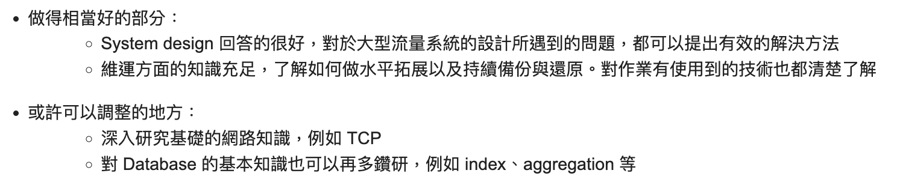

## About Dcard

I’m sure many of you are familiar with Dcard.  
Dcard is an anonymous social platform primarily targeting young people, offering users a space to share and discuss various topics.  
It's a data-intensive, high-traffic, real-time service.

Dcard often shares its backend technologies at various tech conferences.  
Their [Dcard Tech Blog](https://dcardlab.medium.com/) also provides insights into their internal architecture, showing how skilled the Dcard tech team is.

## Process

One unique aspect of Dcard’s process is that there’s an assignment that must be submitted by April 8th.  
Both frontend and backend candidates have their respective assignments.  

Each year, the assignments are quite interesting.  
By working on them seriously, you can learn a lot!

## 2024 Assignment:

This year, Dcard’s backend intern assignment was essentially:  
**Design a read-heavy API capable of multi-condition querying for all data within a specific time-series range.**

Final implementation GitHub Repository:  



## D+0: Assignment Submission

I submitted the assignment by the deadline on April 8th.

## D+3: First Interview Invitation

I was really surprised by Dcard’s speed.  
Only three days after submitting the assignment, I received a first interview invitation.  
On Thursday, April 11th, I got the invite.

Using Greenhouse, I filled out my availability.  
By April 12th, I had confirmed the first interview for Monday morning, April 15th.  
Dcard interviews are **in-person**, so I needed to go to their Taipei office.

It’s funny that I hadn’t noticed that you could schedule interviews for 2–3 weeks later in Greenhouse.  
I only realized this after chatting with my friend who applied for Dcard's Frontend Intern role, [@m4xshen](https://github.com/m4xshen).

Since there wasn’t much time to prepare after confirming the interview, I had to go in as is.

## D+7: First Interview

The first interview was scheduled for April 15th at 10:00 AM.  
I arrived around 9:40 AM and waited in their lounge area.  
It felt familiar, like the office I’d seen in previous YouTube videos featuring Dcard.

The interview was split into two parts:  
1. About 30 minutes of Behavioral Interview  
2. About 45 minutes to 1 hour of Technical Interview

### Behavioral Interview

The Behavioral Interview (BQ) was conducted with two HR members.  
One asked the questions while the other took notes.

They mainly focused on my previous experiences.  
They asked about my motivation for applying, why I chose Dcard, and which other companies I had interviewed with, as well as my thoughts on internships.

This was my first time doing a pure BQ interview, and it was a fresh experience.

After the BQ, the HR team introduced Dcard, their collaboration model, and their internship program.  
At Dcard, teams are organized by feature rather than by tech.  
Everyone working on the same feature is part of the same team.

They also asked if I had any questions, but it was fine if I didn’t have any.

### Technical Interview

A few minutes after the BQ, the Technical Interview took place in the same meeting room with two engineers.

There was no need to open a computer—it was just a face-to-face Q&A session.  
There was no coding involved, and it was divided into three parts:

1. Assignment details  
2. Experience details  
3. Technical questions  

#### Assignment Details

We started with the assignment, going over some implementation details.  
> The depth of these questions depended on the specifics of the assignment.

For example: **You’ve already implemented a layer of Local Cache. Why did you add Cache By URI? Isn’t Local Cache enough?**

There were also follow-up questions about scalability.  
For example: **If the service expanded to more countries, how would you maintain the same QPS?**

#### Experience Details

They also asked about the experiences listed on my resume and followed up on the technical aspects of those projects.

For example: **You mentioned optimizing something by XX%. Can you explain the details?**  
Another example: **I see you’ve worked on a project involving OAuth. Can you explain the OAuth flow? What about CORS? Common HTTP headers?**

#### Technical Questions

This was the area where I was least prepared.  
After the technical questions, I realized I wasn’t as solid on the fundamentals as I thought.  
Relying too much on Copilot for implementation, I knew I needed to revisit the foundational CS concepts.

Topics covered:
- Git  
- Networking  
- Databases (Postgres)  
- SQL  
- Kubernetes  
- Golang  

I was particularly stumped by the **networking** and **SQL** questions.  
It was at that moment that I realized there were big gaps in my understanding.  
> The questions weren’t difficult.  
> I just hadn’t thoroughly grasped the concepts.

I knew about things like Postgres’s `Isolation Levels`, `Phantom Reads`, and `MVCC`.  
But answering the questions revealed I only had surface-level knowledge.

### Office Tour

After the interview, HR gave me a tour of the office.  
There was a huge dashboard showing real-time traffic data.

Each meeting room was themed after popular forums, which looked pretty cool.  

They even asked if I wanted some snacks or drinks from the lounge area.  
~~I totally forgot to grab a sparkling water though!~~

## D+25: Rejection Notification

On May 3rd, I received an official rejection email for the internship.  
They were kind enough to provide feedback as well.

## Conclusion

The assignment was really interesting.  
I tackled it using Real-World Data Hotspot analysis, various cache layers, and sharding.  
I also learned some new technologies: Golang, k6 benchmarking, etc.

It became clear that my technical knowledge wasn’t strong enough.  
Moving forward, I plan to spend more time deeply understanding fundamental concepts.

Congratulations to my talented friend [@peterxcli](https://github.com/peterxcli), who was accepted!  
His implementation approached the problem from a completely different angle and achieved incredible optimizations (up to 10x QPS compared to my cache-centric architecture).  
It’s definitely worth checking out!


