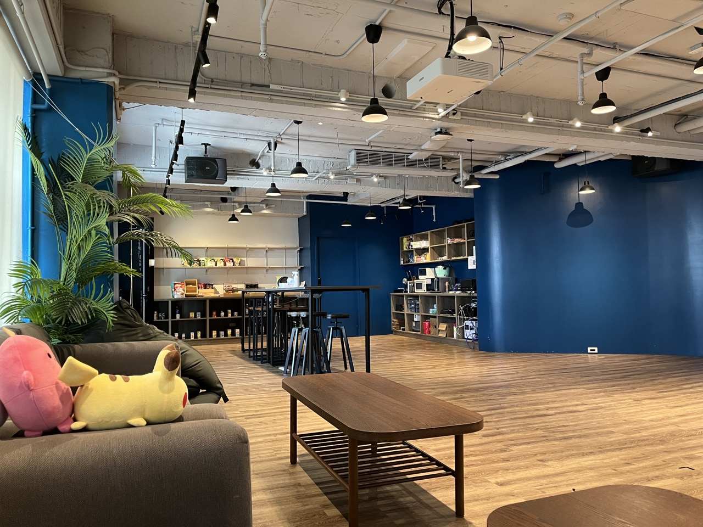
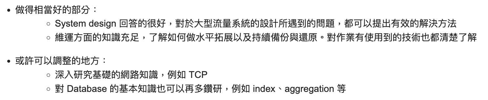

## 關於 Dcard

相信大家對 Dcard 都不陌生  
Dcard 是一個主要 TA 是年經族群的匿名交流平台，提供使用者分享、討論各種話題的空間。  
屬於資料密集、高流量即時性的服務  

也蠻常在各個資訊年會看到 Dcard 分享內部後端的技術  
還有 [Dcard Tech Blog](https://dcardlab.medium.com/) 分享的內部架構  
可以知道 Dcard 技術團隊是很厲害的  

## 流程

很特別的是 Dcard 會有作業需要在 4/8 前提交  
不管是後端還是前端都會有相對應的作業  

其實每年的作業都蠻有趣的  
認真時做完都可以學到蠻多東西的!  

## 2024 作業:

今年 Dcard 的後端 Intern 作業可以廣義成： 
**設計一個 read-heavy 的 API 能夠以多條件查詢特定時序區間的所有資料**  

最後實作完的 GitHub Repository:  



## D+0: 送出作業

作業是在表定的 4/8 送出

## D+3: 一面邀請

對於 Dcard 團隊的速度非常震驚 ~  
沒想到送出作業後 3 天就收到一面邀請了  
在 4/11(四) 收到一面邀請  

一樣使用 greenhouse 填寫可以的時間區段  
並在 4/12 就確認了一面時間  
最後是選擇 4/15 (隔週一早上) 進行一面  
而且 Dcard 是**實體面試**  
需要到台北辦公室進行面試  

但很好笑的是  
我沒有注意到 greenhouse 選時間區段的頁面其實可以選 2、3 個星期以後的面試時段  
是跟當時投 Dcard Frontend Intern 的朋友 [@m4xshen](https://github.com/m4xshen) 聊天才知道的..  

在確認一面時間後沒什麼時間可以準備  
也只能以原本的狀態去面試了  

## D+7: 一面

在 4/15 早上 10:00 進行一面  

面試是約在 10:00 進行  
但是 9 點 40 分就到了  
所以在他們的沙發區休息等待面試  
所以可以看到之前其他 Youtuber 介紹 Dcard 辦公室的熟悉場景  

面試分為 2 個部分  
1. 約 30 分鐘的 Behavioral Interview
2. 約 45 分鐘到 1 小時的 Technical Interview

### Behavioral Interview

BQ 有 2 個 HR 一起進行  
不過只有 1 位主要在問問題  
另外一位負責紀錄  

主要著在之前的經歷  
也有問面試動機、為什麼選擇 Dcard、還有面試哪些公司  
對實習的想法等  

之前沒有面過純 BQ  
在當下是蠻新鮮的體驗  

在面完 BQ 後 HR 會接著介紹 Dcard 和團隊的合作模式與實習計畫  
在 Dcard 不是以 tech 來切 team  
是以 feature 來切 team  
同個 feature 的人會在同個 team  

最後會問你有沒有其他問題  
沒有問題也沒關係 ~  

### Technical Interview

過幾分鐘後  
在同一個會議室進行 Technical Interview  
是 2 位工程師一起進行  

不需要開電腦，是直接當面的問答  
也不會考任何的 coding  
主要分成 3 個部分  

1. 作業細節
2. 經歷細節
3. 技術問題

#### 作業細節

最一開始是從作業開始  
問一些實作的細節  
> 這邊就取決於作業的實作細節  

如：**已經有實作一層 Local Cache 了，為什麼還需要多一個 Cache By URI，單純 Local Cache 不夠嗎？**  

也有對於 scalability 的 follow up 問題  
如：**如果服務的國家更多，如何維持一樣的 QPS**  

#### 經歷細節

同樣也是從 Resume 提到的經歷問起  
也會在經歷提到的技術點做 follow up  

如：**有寫到「  optimize XXX 東西 XX% 」可以說一下這邊的細節嗎？**  

如：**有看到你某個專案 OAuth 有關，可以解釋 OAuth 的 Flow 嗎？CORS 是什麼？ Common HTTP Headers?**  

#### 技術問題

這邊是最沒有準備好的部分  
在技術問題問完後  
有深刻的感受到自己的基礎功不夠扎實  
在實作上利用 Copilot 之餘，也需要多回顧 CS 的基石  

有問到的主題：
- Git
- 網概
- Database(Postgres)
- SQL
- Kubernetes
- Golang 

很誠實的說  
是在**網概和 SQL** 的問題上答不太出來  
在被問的當下才發現對這邊其實有很大塊盲點  
> 問題真的不難  
> 在當下才發現沒有透徹的理解過  

在 Postgres 的部分雖然知道  
`Isolation Level`、`幻讀`、`MVCC`  
但在回答的當下也發覺知道的只有表面  
還沒深入過所以然  

### 逛辦公室

面試完後 HR 會帶你介紹辦公室  
中間有個超大的 Dashboard 可以看即時的流量  

各個會議室會以熱門看板來佈置  
看起來蠻酷的  

最後問你要不要拿一下沙發區的零食、飲料  
~~結果那時候忘記拿氣泡水了~~  

## D+25: 沒錄取通知

在 5/3 收到實習計畫沒錄取的正式通知  
也很貼心的給予面試者回饋  

## 總結

作業很有趣  
我主要是從 Real World Data Hotspot 分析 + 各種 Cache 層面 + Sharding 下手  
也有學到新技術: Golang、k6 benchmark 等  

很明確知道是因為技術問題還不夠扎實  
接下來應該會多花一些時間透徹徹理解一些運作原理  

也恭喜很強的朋友 [@peterxcli](https://github.com/peterxcli) 最後有錄取！  
他的實作從完全不同的維度出發  
真的是達到極致的優化 (跟從 Cache 出發的架構比，可以達到多 10 倍的 QPS)  
很直得一看！  

