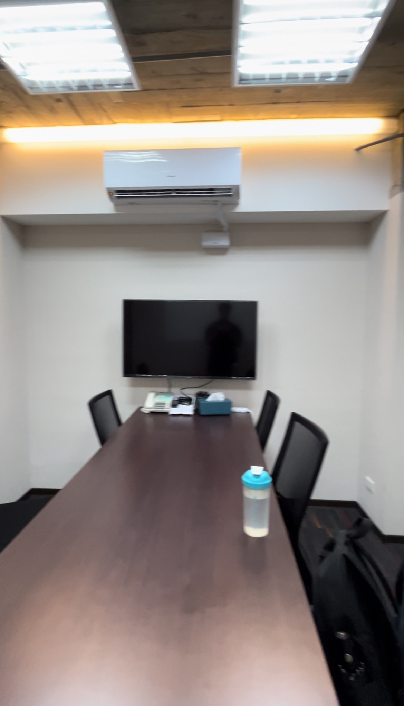

## About TSMC

I participated in the [TSMC Hackathon](https://www.linkedin.com/feed/update/urn:li:activity:7159246053374926848/) and managed to place.  
The hackathon took place from January 26th to 27th.

Later, on February 2nd, they sent out IT job invitation info to teams that had participated in the hackathon, with two categories:  
- **Full-time positions**: For 2024 graduates  
- **DNA Internship**: For university students in their fourth year or above

Even though I was only in my second year, I decided to give it a try and applied.

## Process

- Submitted resume on the TSMC official website
- Received a remote interview invitation
- Completed an online asynchronous coding interview
- Attended the remote technical interview

## D+0: Resume Submission

First, I had to register an account on the TSMC website.  
I uploaded my resume, filled in basic information, technical skills, education, and work experience.

On February 2nd, I officially applied to the DNA program via the website.

## D+68: First Interview Inquiry

On April 10th, in the afternoon, I received an invitation for a remote interview.  
I had to fill in my availability, and about two hours later, my interview time was confirmed.

The department inviting me was **BSID (Business Systems Integration Division)**.  
> https://www.tsmc.com/static/chinese/careers/it_career/index.html

## D+68: Asynchronous Coding Interview

A few hours later, around 10 PM on April 10th, I received a system-generated email for an online coding interview.  
It was a HackerRank Online Judge test.

There were 90 minutes to complete 3 problems.  
They were all basic syntax and implementation problems, and I finished in about an hour.

HackerRank had a VSCode-like syntax autocomplete, which made it more convenient than LeetCode.

## D+69: Technical Interview

The technical interview took place on the afternoon of April 15th.  
Interestingly, I had both Dcard and TSMC interviews on the same day.  
Luckily, TSMC's was in the afternoon.

I rented a two-hour meeting room in a coworking space near the Dcard office to do the interview.  
  
> [Strands Shared Space (Building 1)](https://maps.app.goo.gl/sybdamydyAS94aN58)

Only one supervisor conducted the interview.  
The interview was divided into two parts:  
1. Questions about past experiences  
2. Introduction to the work of BSID at TSMC  
Each section lasted around 30 minutes.

### Past Experience

They started by asking about the experiences listed on my resume, diving into the details.  
No additional technical questions were asked.

### Introduction to BSID’s Work at TSMC

The supervisor had prepared a presentation to introduce the BSID department.  
They also asked if I had any questions.

I inquired about the specifics of the summer internship program, but it seemed like the program details were not finalized at that time, so they couldn't provide more information.

## Silence

In the end, the system didn’t send any feedback.  
I received silence as my final answer.

It seems that students in their fourth year or graduate students have a better chance for these positions.
