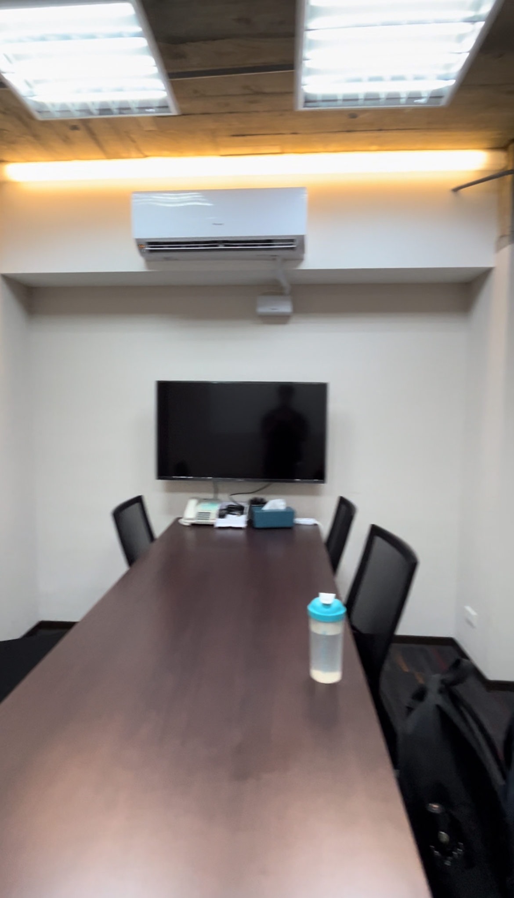

## 關於 TSMC

主要是參加過[台積電黑客松](https://www.linkedin.com/feed/update/urn:li:activity:7159246053374926848/)有拿到名次  
黑客松是在 1/26 ~ 1/27 比的  

後來在 2/2 有寄給參加黑客松的隊伍 IT 職缺邀請資訊  
分為：  
- **一般正職**: 2024 年應屆畢業生
- **DNA實習**: 大四以上在學生

雖然才當時才大二  
但抱著試一試的就投履歷了  

## 流程

- 在台積官網投履歷
- 遠端面試邀請
- 線上非同步 Coding Interview
- 遠端 Tech Interview

## D+0: 寄出履歷

會需要先到台積官網註冊帳號  
並上傳履歷、填寫基本資料、技術、學經歷等  

是在 2/2 正式在官網投出 DNA 計畫申請  

## D+68: 一面詢問

在 4/10 下午收到遠端面試邀請  
一樣需要填寫可以面試的時間區段  
過約 2 小時候就確認面試時間了  

收到邀請的單位是 **BSID(企業系統整合處)**
> https://www.tsmc.com/static/chinese/careers/it_career/index.html

## D+68: 非同步 Coding Interview

又過幾個小時  
在 4/10 晚上約 10 點收到系統寄來線上 Coding Interview  
是 HackerRank 的 Online Judge  

共有 90 分鐘可以完成 3 題  
都算基礎語法實作題  
大概在 1 小時左右完成了  

HackerRank 還有 vscode-liked 的語法 auto complete  
寫起來比 LeetCode 還要方便  

## D+69: Technical Interview

在 4/15 下午進行一面  
與 Dcard 雖然在同一天面試  
不過台積電剛好在下午  

所以特別在 Dcard 辦公室附近租一個 2 小時的工作空間會議室來面試  

> [Strands傳傳共享空間 (一館)](https://maps.app.goo.gl/sybdamydyAS94aN58)

只有一位主管來面試  
面試主要分位 2 個部分  
1. 問過去的經歷
2. 介紹 BSID 在台積電的工作內容
大概都各 30 分鐘左右  

### 問過去的經歷

也是從 Resume 有提到的經歷出發  
問一些其中的細節  
沒有再多問其他技術問題  

### 介紹 BSID 在台積電的工作內容

主管有準備簡報來介紹 BSID 部門  
也有問有沒有其他問題想問  

有問具體暑期實習計畫內容  
不過在當時好像實習計畫還沒定案  
也沒辦法給更多資訊  

## 無聲卡

最後系統也沒有給任何回覆  
收到無聲卡收尾 

可能還是要大四、碩班比較有機會~  