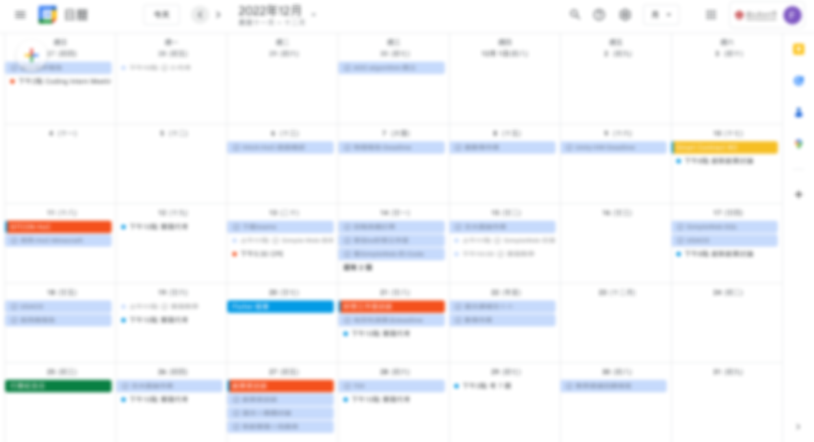
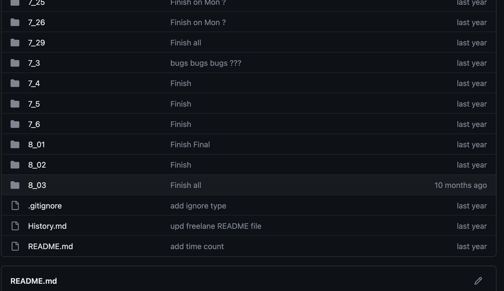
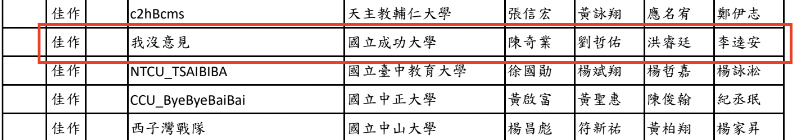
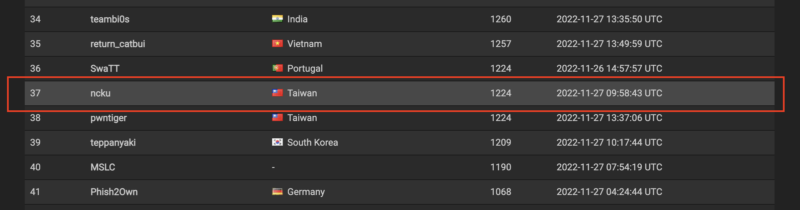

# Record of My First Semester at NCKU Computer Science

> Actually, I wrote this article during the summer break between my freshman and sophomore years.
> Mainly, I went through my calendar to organize what I did during my first semester.

The focus of my first semester wasn't on academics.
Instead, it was on freelancing, clubs, hands-on courses,
and courses I was genuinely interested in.

(Blurred Calendar)

However, by the end of the semester, I realized I might have taken on too many external projects.
It got a bit overwhelming, with multiple deadlines every week.

> This might be because, towards the end of high school, I got tired of academics.
> I felt that the knowledge I was learning couldn't be applied in future scenarios.
> It seemed meaningless to learn these things (?).
> Most of the time, I was memorizing things just for the grades.
> This is why I was less interested in academics.

## What Did I Do in My First Semester?

I will mainly categorize into the following directions:

- **Homework/Freelancing**
- **Clubs**
- **Competitions**
- **Organizing HSPC**
- **Courses**

## Homework/Freelancing

Because I didn't want to spend effort studying subjects just for exam scores,
I focused my time on homework and freelancing,
trying to accumulate as much practical experience as possible.

### Homework

Actually, I started taking on college DSA-related homework assignments in my last year of high school.
Mainly as practice and to earn some extra money.

During the school term, I took on quite a few assignments, mostly in C++.
Occasionally, there were special assignments:
- Implementing algorithms using `Matlab`.
- Writing in `Scala`, a functional programming language I had never heard of.
- Writing `generic functions` in `C`, a topic I found really difficult to grasp initially.
- Extremely challenging graph theory problems.

### Freelancing

I happened to see a post recruiting a **web development intern** on the NCKU second-hand forum.
Since I had started learning front-end in my senior year of high school and had done some back-end CRUD during the summer before college,
I thought I had a basic understanding of both front-end and back-end,
so I applied.

(Recruitment Post at the Time)

The client was also a senior at NCKU.
The website was originally completed by an outsourcing company.
Later, another senior helped modify and add features.

The entire tech stack of the website was:
- **Hosting**: 
    - [`Hostinger`](https://www.hostinger.com/) (I hadn't heard of it, but sometimes it had serious latency issues.)
- **Frontend**:
    - `jQuery`
    - `raw HTML/CSS/JS`
- **Backend**:
    - `PHP`: [`Slim framework`](https://www.slimframework.com/) (I only knew about `Laravel` at the time, hadn't heard of `Slim`)
    - `MySQL`
- **Structure**:
    - `MVC`
- **Version Control**:
    - `Git`
    - `Self hosted Git server`: [`Gitea`](https://about.gitea.com/)
- **CI/CD**:
    - null (?)

The website didn't have high traffic, but the overall architecture was quite complex (some code was difficult to read and modify).
There were many features the client wanted to add or modify,
mainly for an insurance-related website system.

**Features**:
- Frontend:
    - Insurance calculation
    - Insurance recommendation
    - Insurance information
    - Article system
- Backend:
    - Member system management
    - Insurance CRUD
    - Article CRUD

**Tasks I Handled**:
- Fixing small bugs:
    - Some data needed to be sorted before being sent to the frontend
        - Added `ORDER BY...` in the corresponding SQL query
    - Fixed some frontend RWD issues
        - Constant back-and-forth with the client to confirm the layout
- Adding a WYSIWYG editor to the backend article system:
    - A WYSIWYG editor is a tool similar to `Google Docs` that allows editing paragraphs, sizes, colors, adding images, etc., directly on the web.
    - The original article system only had a simple `textarea`, without a WYSIWYG editor.
    - Later implemented using [`quill.js`](https://github.com/quilljs/quill), an open-source JS library.
    - Initially found a paid one, [ `froala` ](https://froala.com/), mistakenly thought it had a free trial, later realized it was paid.
- Many frontend adjustments:
    - Some RWD issues
    - Some UI/UX adjustments
    - Adding frontend features
    - Encountering various `JS` pitfalls
    - Since no modern frontend framework was used, the overall frontend architecture was quite messy, making it time-consuming to find the corresponding `CSS`.

(Adding WYSIWYG editor to the backend article system)

**Weird Experiences**:
- `Eyes + SMTP` = The project's `CI/CD` 🤯:
    - After completing a feature, run it locally, then use `ngrok` to let the client test.
    - Once approved, push the code to `Gitea`.
    - How to deploy to `Hostinger`?
        - Truly understanding the importance of good `CI/CD`:
        - First back up the files that will be modified using `SMTP` (for easy rollback in case of issues).
        - Then copy the updated files to `Hostinger`.
        - This often led to discrepancies between the code on `Hostinger` and `Gitea`.
- Writing frontend logic in the backend:
    - Although it was an `MVC` architecture,
    - Sometimes a `PHP` file would return an entire HTML component without separating it into a view (took a long time to find where to modify a frontend component).
- Resistance to GitHub:
    - Not sure why the senior and client initially resisted using GitHub.
    - Instead, they set up their own git server.
    - The senior's home WAN didn't have a fixed IP, so each time we had to connect to the git server via `ngrok`.
    - This meant we had to be online simultaneously to push code (and add new remotes each time).
    - Using GitHub would have avoided this issue and enabled some CI/CD processes.

> This was my first freelance project.
> I worked on it for about 3-4 months.
> It was also my first encounter with the importance of `CI/CD`.

**Lessons Learned from This Project**:
- Quickly getting up to speed with unfamiliar languages and frameworks
- Design patterns extended from frameworks:
    - `MVC`, `DAO`
- Speed in understanding others' code
- Speed in getting up to speed with others' projects
    - Initially struggled to understand the logic in some parts
    - Later became familiar and could quickly find the corresponding code
- Understanding the importance of `CI/CD`
- Becoming more proficient with `git`
    - Followed a `git flow` approach: creating branches for features, with `master` on `Hostinger`

## Clubs

Before the semester started, I joined the NCKU Electrical Engineering FB group and happened to see a promotional post for **GDCS** (Google Developer Student Club in NCKU).
So I signed up.

> At that time, I thought I needed to be a "core member" to attend classes.
> It turned out that "core members" were the ones teaching.
> The "general members" recruited at the beginning of the semester were the ones attending classes.
> By mistake, I became a core member in my freshman year 🥵.

[NCKU GDSC Groups for the Semester](https://hackmd.io/@gdsc-pr/HkKvD0-Zj)

So I ended up being a core member teaching `Flutter`.
(Joined the `Flutter` group at the time)

> [Flutter Tutorial 的 repository](github.com/jason810496/FlutterToturial)


At the beginning of the semester, there wasn't much pressure from courses.
Feeling a bit idle, I joined additional groups:

- `Solidity` Study Group:
    - Learning `Solidity` and `Ethereum` related knowledge.
    - The group leader assigned readings, and everyone had to review all the readings and discuss them in the next study session.
- Cybersecurity and Cryptography Group:
    - Initially focused on pure cryptography,
    - Later shifted towards practical CTF (Capture the Flag).
    - Only attended two classes before the end-of-semester rush.

> But with the bombardment of various deadlines towards the end of the semester,
> I realized I had joined too many groups,
> Couldn't keep up with all of them.
> In the end, I only attended the `Flutter` group,
> Apologies to the leaders of the other groups 😥.

## Competitions

### NCPC
Probably because I entered through the APCS track, I happened to have the same advisor (Professor Qi Ye, who is super nice!) as two competitive programming seniors, [@ColtenOuO](https://github.com/ColtenOuO/) and [@erichung1113](https://github.com/erichung1113/).  
During our chats, we discussed [`ICPC`](https://ithelp.ithome.com.tw/m/articles/10294718) and [`NCPC`](https://ncpc.ntnu.edu.tw/).  
I originally didn't plan to participate in competitions in college, but after talking about it, I ended up signing up.  
Finally, I teamed up with [@erichung1113](https://github.com/erichung1113/) and another super-fast typist senior, [@jerrykal](https://github.com/jerrykal).  

(We received an Honorable Mention in NCPC, just a few ranks short of qualifying for ICPC.)

### EOF CTF
One day, [@ColtenOuO](https://github.com/ColtenOuO/) suddenly asked if I wanted to join `EOF CTF`, saying that senior [@bacon-cy](https://github.com/bacon-cy) had asked him to join.  
He asked if I wanted to play together, and we ended up needing one more teammate.  
(At that time, I was in the GDSC Cryptography and Cybersecurity group) I happened to know a very strong senior [@三腳蛇]().  
So I invited him to join us in the competition.  

> On the first day of the competition, I happened to be riding to Chiayi and Alishan.  
> Later, I couldn't solve any of the problems.  
> (I only knew web security, but the web challenges that time were tough, and I hadn't touched CTF in a while.)  

So, basically, I made no contributions and had to apologize to my teammates 😢.  

### HITCON CTF
Previously, when chatting, senior [@Vincent550102](https://github.com/Vincent550102) in his sophomore year added me to the NCKU CTF Discord.  
They occasionally gathered teams to participate in CTFs.  
The annual `HITCON CTF` was a must for the seniors.  

I checked out the first web challenge,  
(mainly about bypassing the frontend `js`, where the content sent to the backend had to meet length restrictions and some byte operations)  
I looked at it for a long time and tried many methods but couldn't figure out the key code.  
(I can only say I wasn't familiar enough with some of the native methods in `js`＠＠)  

Later, other seniors in the group solved it!!!  
And more seniors solved several other challenges.  
In the end, NCKU CTF ranked 37th globally (2nd in Taiwan; out of 95 countries, 1243 teams).  

> Again, I made no contributions 🥲.  
> The seniors are incredibly strong Orz.  
> I only know web security, but when faced with difficult web challenges, I couldn't solve them. I really lack a lot of experience.  

  
(End Ranking)

## Courses

### Practical Courses

- **Programming I**

Teaching `C` syntax, with some tricky homework problems.  
The exams are over 100 points, which can be tough for beginners.  
> But the professor is quite nice, giving a square root times 10 boost for scores below 60.

> [程式設計（一）的 repository](https://github.com/jason810496/CKJudge)


Since I had prior experience with `C`, the homework was manageable.  
Ended up passing with 100 points.  

- **Windows Programming**
    - `C#`, `OOP`
    - `WinForm`
    - `Unity`
    - Final Project

**Early Course**
The early part of the course focused on teaching `C#` `WinForm`.  
It also covered very basic `OOP`, but didn't touch on some key `OOP` concepts.  
(Only covered constructor and inheritance, but not interface or polymorphism.)

The TA set tight deadlines but graded very slowly...  
There were bonus points for completing tasks in class, but it was almost impossible to finish before the end of class.  

For Mac M1 users, you had to set up a Windows VM to complete `WinForm` assignments.  
The midterm exam was an on-site exam, similar to the `WinForm` assignments.  

> [視窗程式設計的 repository](https://github.com/jason810496/Window-Programming)


**Mid-Course**

Started teaching `Unity`, with the TA instructing on `Unity 3D` for game development.  
If you didn't follow the TA closely, it was hard to understand the operations.  
After about 3 weeks of instruction, we had to create a game with quite a few features.  

> [Legend of Viking](https://github.com/jason810496/Legend-of-Viking)

（ Big project of Unity 3D ）

[Github Page Demo](https://jason810496.github.io/Legend-of-Viking/)

**Late Course**

Finally, we had to complete a final project.  
The topic was open, could be: `WinForm` tools, `Unity` multiplayer games, or anything written in `C#`.  
(Maybe even `Asp.Net` XD)

My final small project was creating **Live Share IDE**,  
an IDE that supports real-time information sharing.  

Tech stack:
- `WinForm`
- Native `Python` socket
Just used these to build it ouo.  
(At that time, I didn't know why I liked doing things from scratch and didn't like using existing packages.)

Result:  
> [Live Share IDE 的 repository](github.com/jason810496/Live-Share-IDE)



(Looks similar to `VSCode` interface but natively supports a chatroom)

After deciding on the topic, I didn't start working on it until a day and a half before the demo.  
This course mainly trained my ability to "meet deadlines."

### Theoretical Courses

- **General Physics**

- **Calculus**

- **Introduction to Digital Circuits**

## Conclusion

By maintaining the minimum effort required for theoretical courses, I managed to pass all subjects!  
But the grades weren't very impressive.

For courses related to programming,  
because of my previous experience with assignments in high school, I didn't find the more complex assignments intimidating.  
No need for special review.

I gained a lot from freelancing and using the `HSPC` system.  
I understood why we need technologies like `framework`, `CI/CD`, and `DevOps`.  

However, I need to adjust my overall time allocation.  
Participating in too many activities at once eventually made everything overwhelming.  