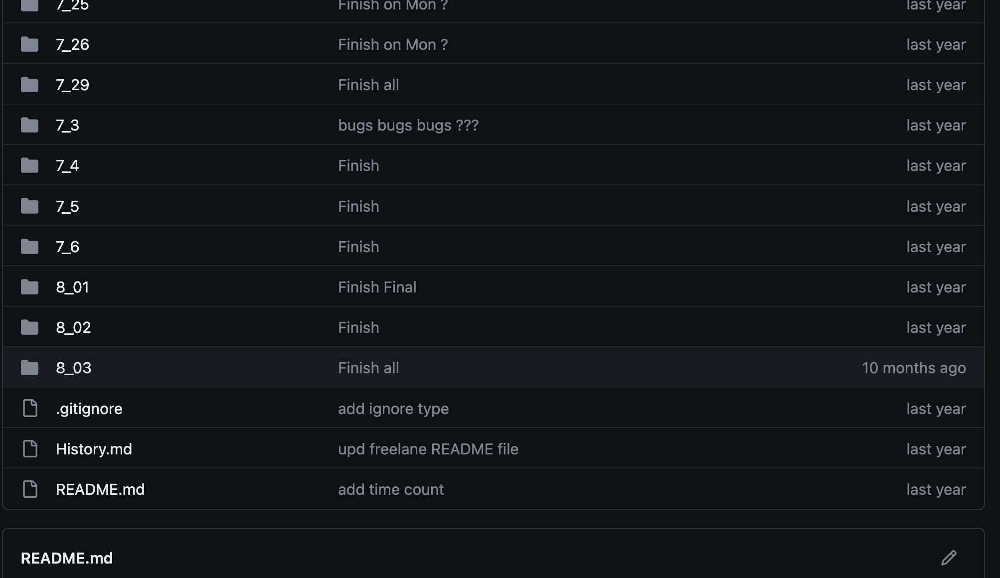
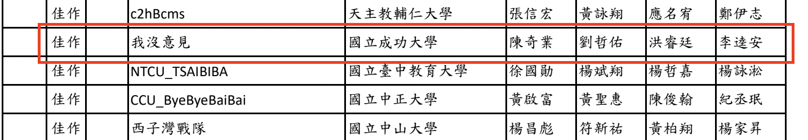

# 成大資工大一上紀錄

> 其實這篇文章是在大一升大二暑假寫的  
> 主要是翻行事曆整理一下我到底大一上有做什麼  

其實我大一上的重心並不是在學科  
而是在接案、社團、偏實作的課程 
還有我真的有興趣的課程上  

( 模糊化的行事曆 )

不過到期末發現好像接太多外務ㄌ  
有點忙不過來，大概一週就有好幾個 Deadline  

> 可能是因為高中後期對於學科疲乏  
> 覺得學到的知識都無法運用在未來的場景  
> 好像學這些沒什麼意義（？  
> 比較多都是為了當下的分數而硬背起來的  
> 這也是我比較不想管學科的原因  

## 大一上到底做了什麼

主要會以這幾個方向來分類：

- **作業/接案**
- **社團**
- **比賽**
- **籌辦HSPC**
- **課程**

## 作業/接案

因為不想花心力念一些只為了考試分數的學科  
所以我就把時間花在作業和接案上  
盡量多累積一些實作經驗  

### 作業

其實在高三下我就有開始在接大學 DSA 相關的作業了  
主要是當作練功，也順變賺點小外快  

在上學期間接了不少個作業，主要也是寫 C++  
偶爾有一些特別的作業： 
用 `Matlab` 來實作一些演算法  
寫 `Scala` 這個完全沒聽過的 `functional programming language`  
寫 `C` 的 `generic function` 這種第一次接觸真的很難弄會的主題
或是超難的圖論題 

### 接案

剛好在成大二手版看到一個徵**網頁工讀生**的貼文  
從高三上接觸前端，升大一暑假也有寫過一些後端 CRUD  
對基本的前後端應該都有一些概念  
就去應徵看看  

（ 當時的招募貼文 ）

案主是也是成大的大學長  
網站原本是由外包公司完成的  
後來由另一位學長在幫忙修改、新增功能  

整個網站的 tech stack 是：
- **Hosting** : 
    - [`Hostinger`](https://www.hostinger.com/) ( 我自己沒聽過，不過用起來延遲有時候有點嚴重 )
- **Frontend** :
    - `jQuery`
    - `raw HTML/CSS/JS`
- **Backend** :
    - `PHP`: [`Slim framework`](https://www.slimframework.com/) ( 那時候只知道 `Laravel`，沒聽過 `Slim` )
    - `MySQL`
- **Structure** :
    - `MVC`
- **Version Control** :
    - `Git`
    - `Self hosted Git server`: [`Gitea`](https://about.gitea.com/)
- **CI/CD** :
    - null (?)

網頁的瀏覽人數不高，不過整體的網頁架構也蠻複雜的（ 有些 Code 不太好看，蠻難改的 ）  
不過有蠻多 features 案主想要新增修改的  
主要是跟保險有關的網站系統  

**Features** ：
- 網頁前台
    - 保險計算
    - 保險推薦
    - 保險資訊
    - 文章系統
- 網頁後台
    - 會員系統管理
    - 保險 CRUS
    - 文章 CRUD

**負責的任務：**
- 一些小 bug fix：
    - 有些資料要先排序才再送到前端
        - 找到相對應的 SQL query，加上 `ORDER BY...`
    - 一些前端 RWD 跑版修正
        - 需要一直跟案主來回確認版型
- 新增後台文章 `wsywig` 編輯器：
    - `wsywig` 編輯器：類似 `Google doc` ，可以在網頁上直接編輯文章的段落、大小、顏色、加圖片...的工具
    - 原本的文章系統只有單純一個 `textarea`，沒有 `wsywig` 編輯器
    - 後來用 [`quill.js`](https://github.com/quilljs/quill) 這個開源的 js library 實作
    - 一開始找到付費的 [ `froala` ](https://froala.com/) ，當時沒有把文件看清楚，以為是可以免費試用的，後來才發現是付費的
- 很多前端的修正：
    - 一些 RWD 的跑版
    - 一些前端的 UI/UX 調整
    - 一些前端的功能新增
    - 遇到各種 `js` 的坑
    - 因為沒有用現在前端 `framework` ，整個的前端頁面架構蠻亂的，有時候要找到對應的 `css` 很花時間

( 把 `wsywig` 編輯器到後台文章系統 )

**遇到奇怪的事：**
- `肉眼 + SMTP` = 專案的 `CI/CD` 🤯 :
    - 把當前 feature 弄好後，在 local 跑起來再開 `ngrok` 給案主測
    - 沒問題後把 code push 到 `Gitea` 上
    - 那要怎麼部署到 `Hostinger` 呢？
        - 真的是體會過才會知道好的 `CI/CD` 有多重要
        - 先把會更動到的檔案用 `SMTP` 備份下來 (方便之後有問題 rollback )
        - 再把有更新的檔案複製到 `Hostinger` 上
        - 所以就很容易會有 `Hostinger` 上的 code 跟 `Gitea` 上的 code 不一樣的問題...
- 在 backend 商業邏輯寫前端 :
    - 雖然整體是 `MVC` 架構
    - 不過會看到一個像後端的 `php` 檔案回傳一整個 component 的 html ，但沒有分離到 view (找了超久才知道要在哪裡改前端的某個 compoent )
- 對 Github 的抗拒 :
    - 不知道為什麼一開始學長和案主不想用 Github 
    - 反而大費周張自己架 git server 
    - 而且當時那個學長家裡的 WAN 並沒有申請固定 IP ，所以每次都要透過 `ngrok` 來連到 git server
    - 也就是我跟學長必須要同時在現在才有辦法 push code ( 而且每次都需要加新的 remote )
    - 如果用 Github 就不會有這個問題，而且還可以用 Github 跑一些 CI/CD 的流程

> 這是算是我第一次接到的案子  
> 這個案子我接了大概 3-4 個月  
> 也是我第一次接觸到 `CI/CD` 的重要性  

**透過這個案子學到的：**
- 快速上手不熟悉的語言和框架
- 一些框架延伸的 design pattern
    - `MVC`、`DAO`
- 看懂別人的 code 的速度
- 上手別人專案的速度
    - 一開始真的看不蓋懂哪邊是在寫什麼邏輯
    - 後來慢慢熟悉後，就可以快速找到對應的 code
- 了解到 `CI/CD` 的重要性
- 對 `git` 更熟一些
    - 當時是對 feature 開 branch ，然後 `hostinger` 上的 code 就是 `master`
    - 偏向 `git flow` 的方式

## 社團

在開學前，潛水到成大電機的 FB 社團  
結果剛好看到**GDCS**( Google Developer Student Club in NCKU ) 的推廣貼文  
就去報名了  

> 那時候以為要成為「核心成員」才能聽課  
> 結果是「核心成員」是要教課的  
> 開學才招募的「一般成員」才是聽課的  
> 誤打誤撞大一就當上核心成員了 🥵  

[上學期 NCKU GDSC 的組別](https://hackmd.io/@gdsc-pr/HkKvD0-Zj)

結果就變成核心成員在教 `Flutter`  
( 當時剛好加入 `Flutter` 組 )  

> [Flutter Tutorial 的 repository](github.com/jason810496/FlutterToturial)


在學期初課程都還沒什麼壓力  
感覺還有點閒  
就額外加入其他組 

- `Solidity` 讀書會
    - 學習 `Solidity` 和 `Ethereum` 相關的知識
    - 組長會分配每次的 loading ， 大家要看過所有的 loading ， 下次讀書會的時後會輪流分享討論
- 資安密碼學組
    - 一開始是純密碼學
    - 後來轉為偏實作的 CTF
    - 但只有上過兩堂課就大家都進入期末週了

> 但是在期末各種 Deadline 轟炸下  
> 就發現加太多組別了  
> 完全忙不太過來  
> 最後只有去在 `Flutter` 組  
> 對其他組的組長很砲歉 😥  

## 比賽

### NCPC
應該是因為 APCS 組進來的關係，剛好跟兩個競程特選大佬[@ColtenOuO](https://github.com/ColtenOuO/)跟[@erichung1113](https://github.com/erichung1113/) 是同一個導師（人超好的奇業教授！） 
找我們去聊天的時候剛好聊到 [`ICPC`](https://ithelp.ithome.com.tw/m/articles/10294718) 跟 [`NCPC`](https://ncpc.ntnu.edu.tw/) 這兩個比賽  
原本大學沒有想要打比賽，不過好像講一講就報名了  
最後是 [@erichung1113](https://github.com/erichung1113/) 跟打字超爆快的另一個特選大佬[@jerrykal](https://github.com/jerrykal) 一隊 

( 最後在 NCPC 拿佳作，差幾名就可以去比 ICPC 了 )

### EOF CTF
[@ColtenOuO](https://github.com/ColtenOuO/)某天突然問我要不要報 `EOF CTF` ， 說 [@bacon-cy](https://github.com/bacon-cy)學姊找他一起報  
要不要一起來玩  
結果還缺一個隊友  
（那時候我在 GDSC 密碼學資安組）剛好在裡面認識一個很強的學長 [@三腳蛇]()  
就順便拉他一起來比了  

> 結果比賽第一天剛好騎車去嘉義阿里山  
> 後來也沒解出聲下的題目  
> （ 我只會 web ， 但那次的 web 都沒什麼頭緒，也有點舊沒有碰 CTF 了 ） 

所以基本上沒有貢獻，跟隊友說抱歉 😢  

### HITCON CTF
之前聊天的時候大二的 [@Vincent550102](https://github.com/Vincent550102) 學長有把我拉到 NCKU CTF 的 DC  
裡面不定時會揪團打 CTF  
一年一次的 `HITCON CTF` 學長們當然不會錯過  

結果看了第一題 web 題  
（ 主要是從前端 `js` bypass ， 好像要送到後端的 content 要符合長度限制還有一些 byte 操作 ）
看了很久，測了很多方法，不過還是沒解讀出關鍵的 code  
( 只能說對 `js` 的一些細節原生方法還不夠熟悉＠＠ )  

後來群內有其他大佬解出了！！！  
陸續也有其他大佬解出不少題  
最後 NCKU CTF 全球第 37 名 (台灣第2; 共 95 國，1243 個隊伍參賽)  

> 這場也是打水漂，沒有貢獻 🥲  
> 學長們超強 Orz  
> 只會 web 但遇到有難度的 web 又寫不出來，真的還缺蠻多經驗的  

（ 最後的 Ranking ）

## 課程

### 實作類

- **程式設計（一）**

在教 `C` 的語法，作業題目有些有點毒瘤  
考試會超過 100 分，對初學者來說有點難  
> 不過教授人蠻好的，不到 60 分的都會開根號乘 10  

> [程式設計（一）的 repository](https://github.com/jason810496/CKJudge)


因為之前有 `C` 的經驗，所以作業都算還好  
最後 100 分過  

- **視窗程式設計**
    - `C#` , `OOP`
    - `WindForm`
    - `Unity`
    - `期末專案`

**課程前期**
前期都在教 `C#` 的 `WinForm`  
還有超基本的 `OOP` ，但是又沒有講到一些 `OOP` 的重點  
（ 大概只有講到 constructor 、繼承 ，但是像 interface 或多型這種都沒有特別說到 ）

助教的 Deadline 都壓很緊但是又改超級慢...  
課堂完成有 Bonus 分，但基本上不太可能在下課前完成  

對 Mac M1 的用戶來說，一定要先裝好 Window 的 VM  
才有辦法完成 `WinForm` 的作業  
期中考是上機考，不過也是刻 `WinForm` 跟作業差不多  

> [視窗程式設計的 repository](https://github.com/jason810496/Window-Programming)


**課程中期**

開始教 `Unity` ，由助教教 `Unity 3D` 做遊戲  
沒有跟著助教是真的不知道怎麼操作  
然後教大概 3 週後，就要做一個包含蠻多 features 的遊戲  

> [Legend of Viking](https://github.com/jason810496/Legend-of-Viking)

（ Unity 大作業 repository ）

[Github Page Demo](https://jason810496.github.io/Legend-of-Viking/)

（ 後來有把遊戲 compile 成 WebGL 部署在 Github Page ）

**課程後期**

最後要做一個期末專案  
主題不限，可以是： `WinForm` 工具、`Unity` 多人遊戲、只要是 `C#` 寫的應該都可以 
( 說不定 `Asp.Net` 也可以 XD ) 

最後我做的小專案是做 **Live Share IDE**  
一個可以即時共享資訊的 IDE  

Tech stack：
- `WinForm`
- `Python` 原生 socket
只用這些東西自幹出來的 ouo  
( 那時候不知道為什麽很喜歡硬幹，不喜歡用現成的 packages )

成果：
> [Live Share IDE 的 repository](github.com/jason810496/Live-Share-IDE)




( 可以看成跟 `VSCode` 介面很像，不過本身就有支援 chatroom 的 IDE )

再決定好主題後其實都沒有動工  
是在 Demo 前一天花一天半幹出來的  
這門課對我應該就是在訓練「趕 Deadline 」

### 學科類

- **普物**

- **微積分**

- **數位電路導論**

## 總結

在最低限度維持學科的情況，所有科目都幸運的 Pass 了！ 
但成績真的不太好看

跟程設有關的科目 
因為高三接作業的關係，在實作一些比較複雜的作業就不會排斥 
也不用特別複習 

在接案和用 `HSPC` 系統的過程中比較有收穫 
了解為什麼要有 `框架` 、 `CI/CD` 、 `DevOps` 這些技術 

但是在整體時間分配應該還要再調整一下 
一次參加太多活動最後真的都會忙不過來 

