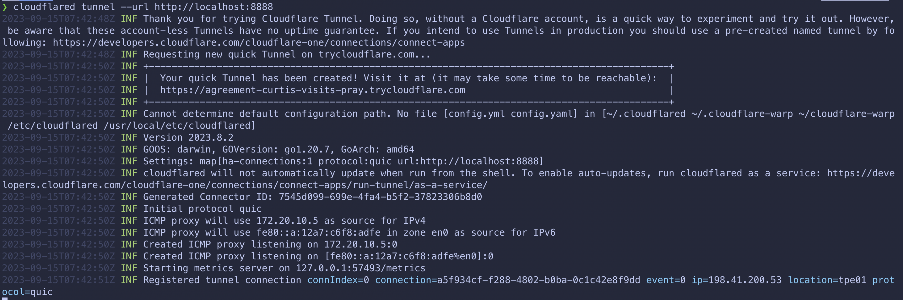
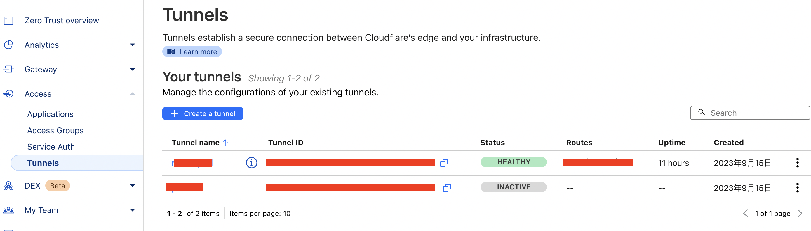
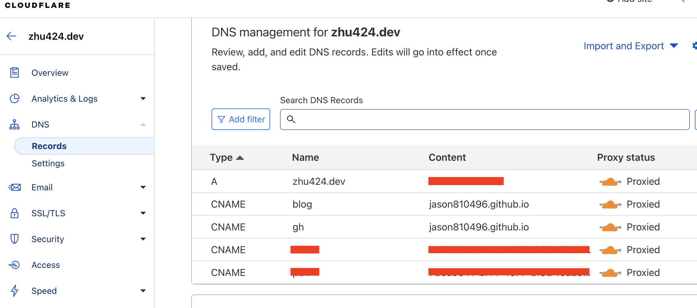

## Introduction

Currently, I am a teaching assistant for Programming 1. <br>
The IPs of the computers in the lab are internal network IPs. <br>
The Online Judge VM for the course only allows school IPs (`140.116.xxx.xxx`) to connect, <br>
and does not allow internal network IPs. <br>

Originally, I used [ngrok](https://ngrok.com/) for NAT, <br>
but the free version of ngrok only allows 40 users per tunnel. <br>
With over 240 students, it is impractical to set up 6 tunnels and distribute them to the students. <br>
> This is very cumbersome... <br>
> Additionally, every time ngrok restarts, it changes the domain. <br>
> This requires students to reset their connection domains each time. <br>

## Alternative to ngrok

[Cloudflare Tunnel](https://developers.cloudflare.com/cloudflare-one/connections/connect-apps) <br>

The free plan of `Cloudflare Tunnel` includes: <br>
- DNS setup 
- No connection limitations (the name server must be on Cloudflare)
- Other features similar to ngrok

## Cloudflare Tunnel Documentation

[https://developers.cloudflare.com/pages/how-to/preview-with-cloudflare-tunnel/](https://developers.cloudflare.com/pages/how-to/preview-with-cloudflare-tunnel/)

### Installation

You can find the appropriate version for your OS at [Cloudflare Tunnel Downloads](https://developers.cloudflare.com/cloudflare-one/connections/connect-networks/downloads/). <br>

For Mac OS:
```bash
brew install cloudflare/cloudflare/cloudflared
```

For Linux: 
```bash
wget https://github.com/cloudflare/cloudflared/releases/latest/download/cloudflared-linux-amd64.deb
sudo apt install ./cloudflared-linux-amd64.deb
```

## Normal Usage

For ngrok:
```bash
ngrok http 8888
```

For Cloudflare Tunnel:
```bash
cloudflared tunnel --url http://localhost:8888
```



This generates a random URL to connect to `localhost:8888`. <br>
If you want to set your own domain, you need to configure the `cloudflared` config file. <br>

## Advanced Usage

**Before setting the domain, ensure that the domain's Nameserver is set to Cloudflare.** <br>
> After setting it up, you can connect to the server's `localhost:<port>` through your DNS.

Next, use the command line to set up the `cloudflared` config file. <br>

- Authentication
    ```bash
    cloudflared tunnel login
    ```
- Create a Tunnel
    ```bash
    cloudflared create <tunnel_name>
    ```
    ```bash
    cloudflared tunnel route dns <tunnel_name> <domain_name>
    ```
    This will generate a `<tunnel_id>.json` file in `~/.cloudflared/`.

You can see the `<tunnel_id>` under `Access` -> `Tunnel` in the [Cloudflare dashboard](https://one.dash.cloudflare.com/). <br>


In `DNS` -> `Records`, you will see the added `<domain_name>`. <br>
The `content` part will be `<tunnel_id>.cfargotunnel.com`. <br>


### Configuration

[Cloudflare Tunnel: Setup Configuration File](https://developers.cloudflare.com/cloudflare-one/connections/connect-networks/install-and-setup/tunnel-guide/local/local-management/configuration-file/)

Next, add a `config.yaml` file in `~/.cloudflared/`. <br>
```yaml
tunnel: <tunnel-id>
credentials-file: /path/to/<tunnel-id>.json # The previously generated JSON file in ~/.cloudflared/
ingress:
  - hostname: <domain-name>
    service: http://localhost:<port1>
  - service: http_status:404
```

When setting up `config.yaml`, you can configure multiple `ingress` entries. <br>
This allows different ports to correspond to different domains. <br>
> For example:
> - `localhost:8888` corresponds to `service1.domain.com`
> - `localhost:9999` corresponds to `service2.domain.com`

## Start Tunnel

To start the tunnel:
```bash
cloudflared tunnel run <tunnel_name>
```

You can use `tmux` to keep the tunnel running in the background. <br>
Refer to [tmux Common Commands](https://jason810496.github.io/blog/tmux/)! <br>

Using `tmux`:

```bash
tmux new -s cloudflare-tunnel
```

Then run `cloudflared tunnel run <tunnel_name>` inside `tmux`. <br>
Press `ctrl + b`, then `d` to detach from `tmux`. <br>

To reattach to `tmux`, use `tmux attach -t cloudflare-tunnel`. <br>

## Command List

- `cloudflared tunnel login`
- `cloudflared create <tunnel_name>`
- `cloudflared tunnel route dns <tunnel_name> <domain_name>` <br>
    > This generates a `<tunnel_id>.json` file in `~/.cloudflared/` and adds `config.yaml` here. <br>
    > You can see the `<tunnel_id>` under `Access` -> `Tunnel` in the [Cloudflare dashboard](https://one.dash.cloudflare.com/).
- `cloudflared tunnel run <tunnel_name>`

## Reference

- [Cloudflare Tunnel: Overview](https://developers.cloudflare.com/cloudflare-one/connections/connect-apps)
- [Cloudflare Tunnel: Downloads](https://developers.cloudflare.com/cloudflare-one/connections/connect-networks/downloads/)
- [Cloudflare Tunnel: Setup Configuration File](https://developers.cloudflare.com/cloudflare-one/connections/connect-networks/install-and-setup/tunnel-guide/local/local-management/configuration-file/)
- [Cloudflare Tunnel: Ingress](https://developers.cloudflare.com/cloudflare-one/connections/connect-networks/install-and-setup/tunnel-guide/local/local-management/ingress/)