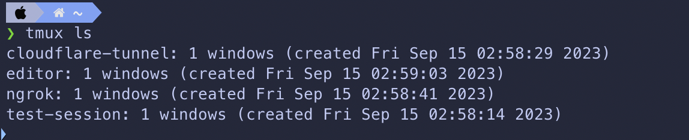
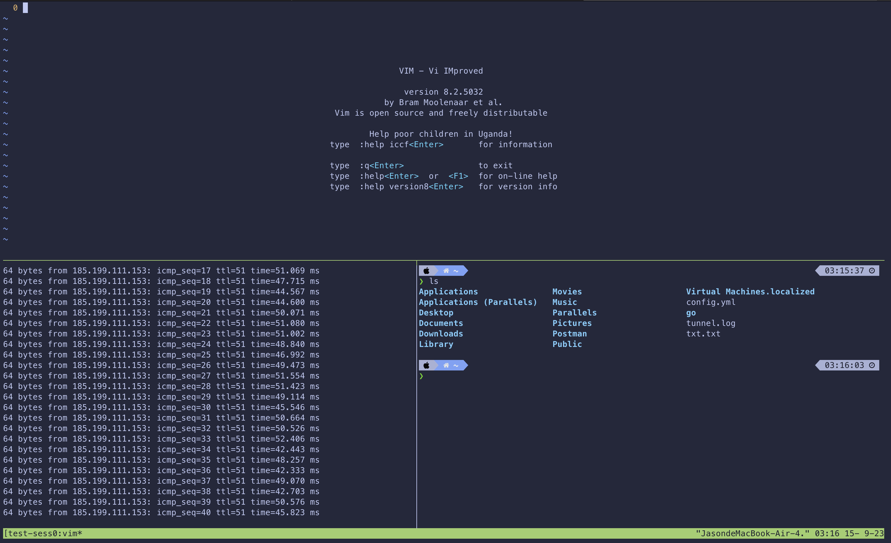
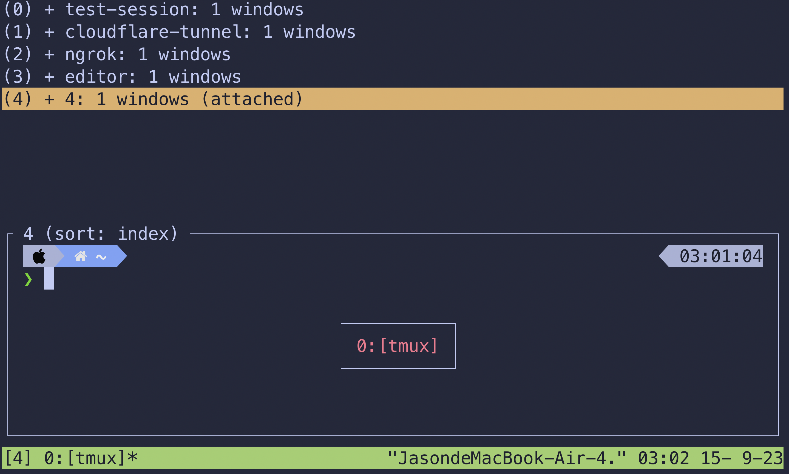
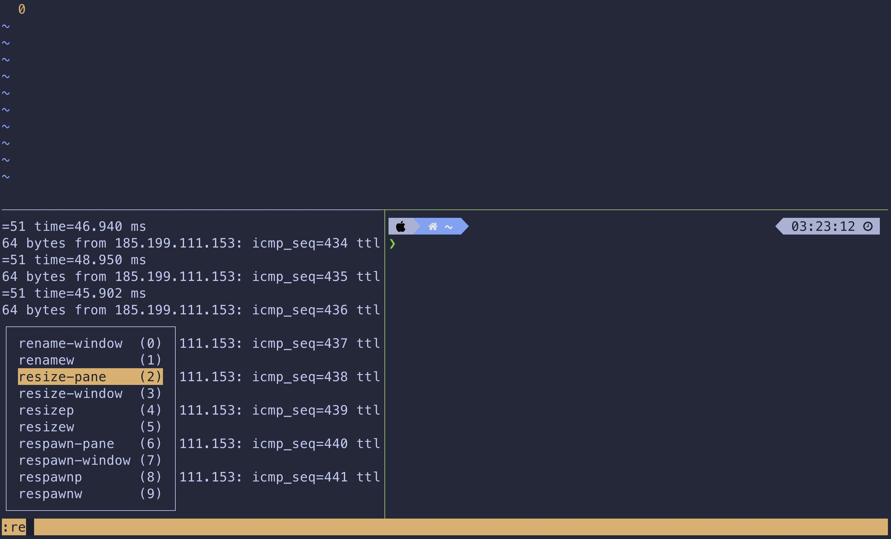
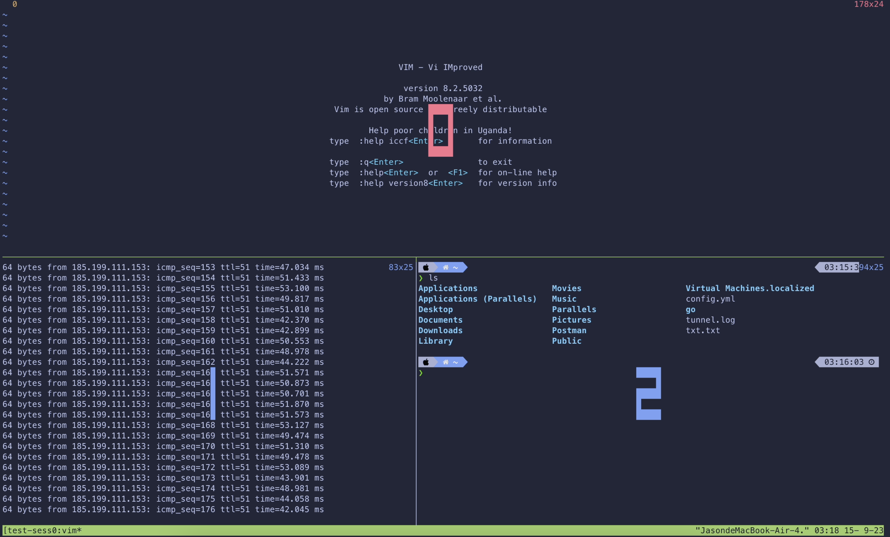



## Introduction

Since the VM provided for the Programming 1 course requires a Cloudflare tunnel setup for connection  
(If interested, you can see [my Cloudflare-tunnel setup process]())  

I wanted to use `tmux` to keep the tunnel running in the background  
and to check the tunnel's status at any time  

## tmux Concepts

`tmux` can be divided into three levels  
1. Session
2. Window
3. Pane

### Session

Session is the highest level in `tmux`  
You can think of it as a workspace in tmux  
A session can have multiple windows  

(List all available sessions)

### Window

Window is the second level in `tmux`  
You can think of it as different windows within a session  
A window can have multiple panes  

### Pane

Pane is the third level in `tmux`  
You can think of it as different split screens within a window  
A pane can only have one shell  
Panes in the same window can be split horizontally or vertically  

(This is how it can be split)

## Common tmux Commands

If you are in tmux, you can press `Ctrl + b` to enter tmux command mode  
(Just like pressing `:` in vim)  

### Session

From the command line:  
- `tmux new -s <session-name>` : Create a new session named `<session-name>`
- `tmux ls` : List all available sessions
- `tmux attach -t <session-name>` : Attach to a session named `<session-name>`

In tmux:  
- `Ctrl + b + d` : Detach from the tmux session  
    This does not close the session; it just detaches  
    The programs in the session will continue to run!!!
- `Ctrl + b + s` : List all available sessions
    

### Window

- `Ctrl + b + c` : Create a new window
- `Ctrl + b + n` : Switch to the next window
- `Ctrl + b + p` : Switch to the previous window
- `Ctrl + b + w` : List all available windows

### Pane

Splitting panes:
- `Ctrl + b + %` : Split the screen vertically (left/right split)
- `Ctrl + b + "` : Split the screen horizontally (top/bottom split)
- `Ctrl + b + x` : Close the current pane

Resizing panes:
You can first press `Ctrl + b` then `:` to enter tmux command mode  
Then type `resize-pane` (you can use `Tab` for auto-completion)  
Then add `-U` (up) `-D` (down) `-L` (left) `-R` (right)  
Followed by a number to adjust the size of the pane  

Switching between panes:
- `Ctrl + b + <arrow-key>` : Switch to the specified pane
- `Ctrl + b + q` : Display a number on each pane
    - `Ctrl + b + q + <number>` : Switch to the specified pane

