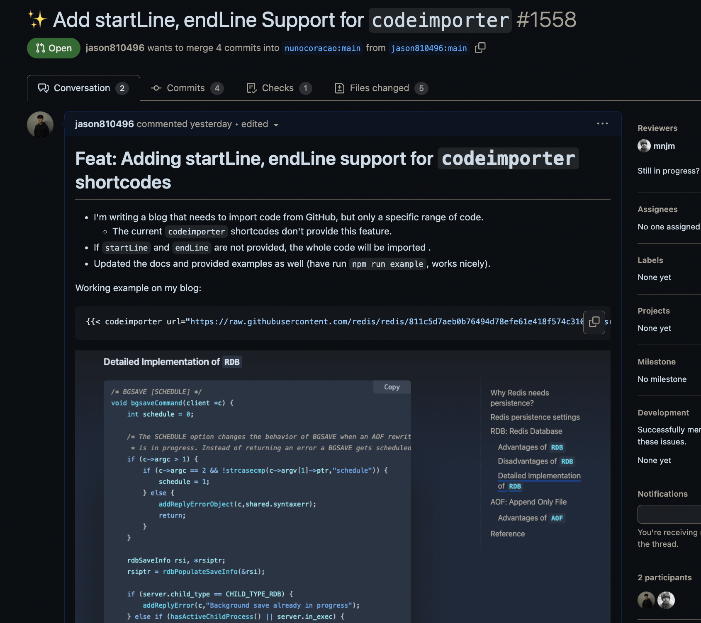

## About Hugo

[Hugo](https://gohugo.io/) is my current static site generator.
- Hugo is much faster than other static site generators like Jekyll, Hexo, etc.
- Supports [partials](https://gohugo.io/templates/partials/) and [shortcodes](https://gohugo.io/templates/shortcode-templates/) for template functions.
- Supports [functions](https://gohugo.io/functions/) for manipulating data in templates.

Common Hugo `shortcodes` example:

`/layouts/shortcodes/myImage.html`
```html
{{ $image := .Get "image" }}


```

And you can use it in your markdown file like this:
```markdown

```

## Current Hugo Theme: Blowfish

I'm using the [blowfish](https://blowfish.page/) as my current Hugo theme! It provides the **[codeimporter](https://blowfish.page/docs/shortcodes/#code-importer) shortcode** for importing code snippets from a URL.

```markdown

```

However, it **doesn't** support getting files **from a specific range**.

## Solution for Getting a Slice from a Specific Range in Hugo

Since Hugo doesn't support `substr` or `cut` functions for **slicing a slice** from a specific range, we can utilize the concept of using the **`head` and `tail` GNU commands** to grep start to end lines of files on Linux.

**For Linux:**
Using `head` and `tail` to specify the range of lines to be displayed.
```bash
head -n 10 file.txt | tail -n 5
# display line 6 to 10
```

**For Hugo:**
We can use the `first` and `after` functions in Hugo to get a slice from a specific range.
> The [first](https://gohugo.io/functions/collections/first/) and [after](https://gohugo.io/functions/collections/after/) functions are in the **collection functions** category.

```html
{{ $lines := slice "line1" "line2" "line3" "line4" "line5" }}
{{ $startLine := 2 }}
{{ $endLine := 4 }}

{{ $startLine := sub $startLine 1 }}
{{ $selectedLines := first $endLine $lines }}
{{ $selectedLines := after $startLine $selectedLines }}
```

## PR for Blowfish Theme: Add startLine and endLine Support for `codeimporter`

I've created a PR for the blowfish theme to add `startLine` and `endLine` support for the `codeimporter` shortcode.

PR: https://github.com/nunocoracao/blowfish/pull/1558



## Reference

- Blowfish theme: https://blowfish.page/
- https://gohugo.io/functions/collections/
- https://gohugo.io/templates/shortcode-templates/
- https://gohugo.io/templates/partials/
- https://gohugo.io/functions/
- https://gohugo.io/functions/collections/first/
- https://gohugo.io/functions/collections/after/