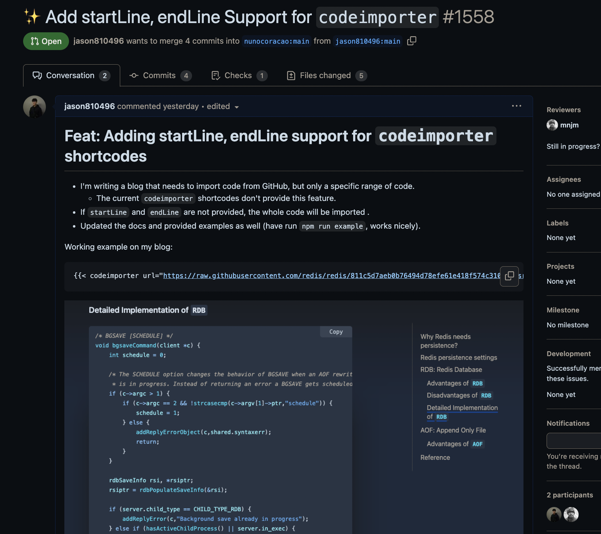

## 關於 Hugo

[Hugo](https://gohugo.io/) 是我目前使用的靜態網站生成器。
- Hugo 比其他靜態網站生成器（如 Jekyll、Hexo 等）快得多。
- 支援用於模板功能的 [partials](https://gohugo.io/templates/partials/) 和 [shortcodes](https://gohugo.io/templates/shortcode-templates/)。
- 支援用於在模板中處理資料的 [functions](https://gohugo.io/functions/)。

常見的 Hugo `shortcodes` 範例：

`/layouts/shortcodes/myImage.html`
```html
{{ $image := .Get "image" }}


```

就可以在 Markdown 文件中這樣使用它：
```markdown

```

## 目前的 Hugo 主題：Blowfish

目前使用 [blowfish](https://blowfish.page/) 作為我目前的 Hugo 主題！<br>
它提供了 **[codeimporter](https://blowfish.page/docs/shortcodes/#code-importer) shortcode** 用於從 URL 引入整份 Code 。

```markdown

```

然而，它原本 **不支援**從特定範圍獲取文件。

## 在 Hugo 從 Slice 中取得特定範圍

由於 Hugo 不支援用於 **切片**的 `substr` 或 `cut` 函數 <br>
不過我們可以利用在 Linux 上使用 **`head` 和 `tail` GNU 命令** 的概念來抓取文件的起始行到結束行。

**對於 Linux：**
使用 `head` 和 `tail` 指定要顯示的範圍。
```bash
head -n 10 file.txt | tail -n 5
# 顯示第 6 到第 10 行
```

**對於 Hugo：**
我們可以使用 Hugo 中的 `first` 和 `after` 函數從 slice 取得特定範圍。
> [first](https://gohugo.io/functions/collections/first/) 和 [after](https://gohugo.io/functions/collections/after/) 函數屬於 **collection functions** 類別。

```html
{{ $lines := slice "line1" "line2" "line3" "line4" "line5" }}
{{ $startLine := 2 }}
{{ $endLine := 4 }}

{{ $startLine := sub $startLine 1 }}
{{ $selectedLines := first $endLine $lines }}
{{ $selectedLines := after $startLine $selectedLines }}
```

## Blowfish 主題的 PR：為 `codeimporter` 添加 startLine 和 endLine 支援

所以順便為 blowfish 主題創發了一個 PR： <br>
為 `codeimporter` shortcode 加上 `startLine` 和 `endLine` 支援。

PR: https://github.com/nunocoracao/blowfish/pull/1558



## 參考

- Blowfish 主題: https://blowfish.page/
- https://gohugo.io/functions/collections/
- https://gohugo.io/templates/shortcode-templates/
- https://gohugo.io/templates/partials/
- https://gohugo.io/functions/
- https://gohugo.io/functions/collections/first/
- https://gohugo.io/functions/collections/after/