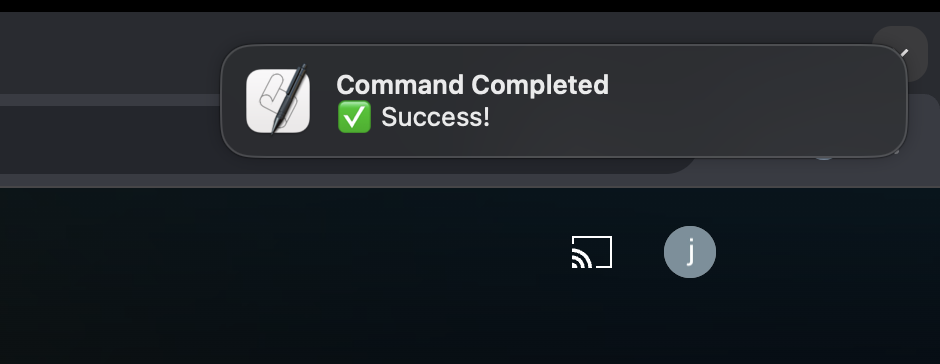
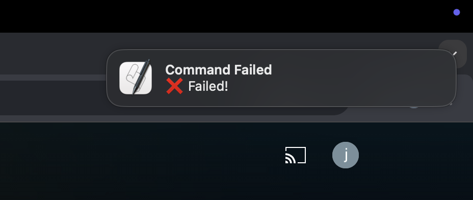

# Push-based CLI Workflow on MacOS

## Push-based vs. Pull-based in System Design

In system design, when you need to monitor the state of data—such as whether an entity has been updated or if a long-running job has completed—there are generally two models: **Push-based** and **Pull-based**.



sequenceDiagram

    participant Client as Client
    participant Server as Server

    Note over Client, Server: Pull-Based (Client keeps polling)

    rect rgba(255, 255, 255, 0.31)
      loop Repeatedly
          Client->>Server: Request state
          Server-->>Client: Respond with state
      end
    end

    Note over Client, Server: Push-Based (Server notifies Client)

    rect rgba(255, 255, 255, 0.31)
      Server->>Server: State changes
      Server-->>Client: Notify update
    end



> The upper part represents Pull-based, while the lower part represents Push-based.

It is clear that:  
- **Pull-based** requires the client to continuously query the server for the current state.  
- **Push-based** has the server proactively notify the client **only when the state changes**.

## Context Switching in CLI Workflows

When using the CLI, you often run commands that take a long time to execute—for instance, a test that runs for several minutes or a build command.

In these situations, you might switch to other tasks but still need to repeatedly check the command's execution status, resulting in unnecessary context switching.

## Reducing Context Switching with Push-based Notifications

Imagine if the CLI could actively notify you when a command finishes. Just like a push-based system, you wouldn’t need to repeatedly check the command’s status.

That’s why there should be a simple script to actively notify you once a CLI command completes.

For example, check out this snippet from my [dotfiles/.zshrc at ee0772 · jason810496/dotfiles](https://github.com/jason810496/dotfiles/blob/ee0772e86bf881878b1e3aa3f5b3df6ad36b40f2/zsh/.zshrc#L144-L156):



Currently, I add the `notify` script to my `.zshrc` (which uses macOS’s `osascript` to invoke `display notification`).

## How to Use

For example, when building a project, you might chain commands using `;` rather than `&&` or `||` so that you can capture the build result (i.e., to know whether the build succeeded or failed):

```bash
make build ; notify "Build done"
```

After completion, the following notifications will appear in the top right corner:

> **On success:**  
> 

> **On failure:**  
> 

## Conclusion

By using push-based notifications, you can reduce context switching in your CLI workflows, allowing you to concentrate more on other tasks. If you have similar needs, consider implementing a solution based on the script above!

I often use push-based notifications when contributing to Apache Airflow. For instance, when rebuilding the Kubernetes Docker image:

```bash
breeze k8s build-k8s-image --rebuild-base-image ; notify
```

For long-running commands like these, you can focus on other work without constantly monitoring the terminal.  
> For example, while writing this article, I was actually building the k8s image xD
