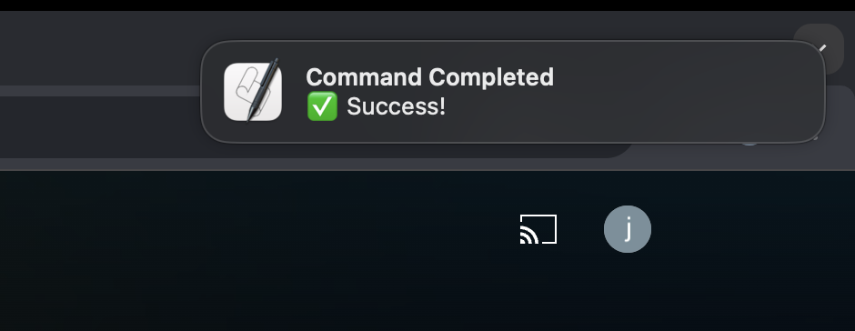

# MacOS 上的 Push-based CLI 工作流

## System Design 中的 Push-based v.s. Pull-based

在系統設計中如果要觀測資料狀態 <br>
如：某個 entity 的狀態是否被更新、某個 long-running job 是否完成 <br>
通常會有 **Push-based** 和 **Pull-based** 兩種模式。




sequenceDiagram

    participant Client as Client
    participant Server as Server

    Note over Client, Server: Pull-Based (Client keeps polling)

    rect rgba(255, 255, 255, 0.31)
      loop Repeatedly
        
          Client->>Server: Request state
          Server-->>Client: Respond with state
      end
    end

    Note over Client, Server: Push-Based (Server notifies Client)

    rect rgba(255, 255, 255, 0.31)
      Server->>Server: State changes
      Server-->>Client: Notify update
    end


> 上半部是 Pull-based，下半部是 Push-based

可以清楚看到 <br>
- **Pull-based** 需要 Client 持續地向 Server 詢問目前狀態
- **Push-based** 則是 **當狀態改變時** Server 才**主動通知 Client**

## CLI 工作流中的 Context Switching

在使用 CLI 時很常會需要跑一些執行時間較長的指令 <br>
如：執行一個需要花幾分鐘的 test、或是一個需要 build 的指令 <br>

這時候我們可能會先去做其他 task，但又需要時常回來看看這個指令的執行狀態 <br>
造成很多不必要的 context switching <br>

## 使用 Push-based 通知來減少 Context Switching

如果有一個方式可以讓 CLI 執行完後主動通知我們 <br>
就可以如同 Push-based 的系統設計一樣，不需要重複去看這個指令的執行狀態 <br>

所以應該要有一個簡單的 script 可以在 CLI 執行完後主動通知我們 <br>

[dotfiles/.zshrc at ee0772 · jason810496/dotfiles](https://github.com/jason810496/dotfiles/blob/ee0772e86bf881878b1e3aa3f5b3df6ad36b40f2/zsh/.zshrc#L144-L156) 



目前我是把 `notify` 這個 script 加到我的 `.zshrc` 裡 <br>
( 透過 macOS 的 `osascript` 來呼叫 `display notification` ) <br>

## 如何使用

以要 build 一個專案為例 <br>
這邊要用 `;` 來串接指令而不是 `&&` 或 `||` 是因為要拿到 build 的結果 <br>
( 這樣才能知道 build 成功或失敗 ) <br>
```bash
make build ; notify "Build done"
```
在完成後會跳出以下的通知在右上角 <br>
> 成功的話
> 

> 失敗的話
> 


## 總結

透過 Push-based 通知可以減少 CLI 工作流中的 context switching <br>
讓我們可以更專注在其他 task 上 <br>
如果有類似的需求，可以參考上面的 script 來實作！ <br>

目前在貢獻 Apache Airflow 蠻常需要用到 Push-based 通知 <br>
例如：重新 build kubernetes 的 Docker image <br>

```bash
breeze k8s build-k8s-image --rebuild-base-image ; notify
```

像這種需要跑很久的指令，可以更專心的做其他事情 <br>
> 例如寫這篇文章時其實就正在 build k8s image xD