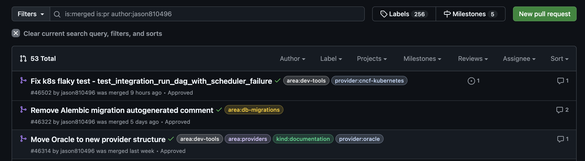
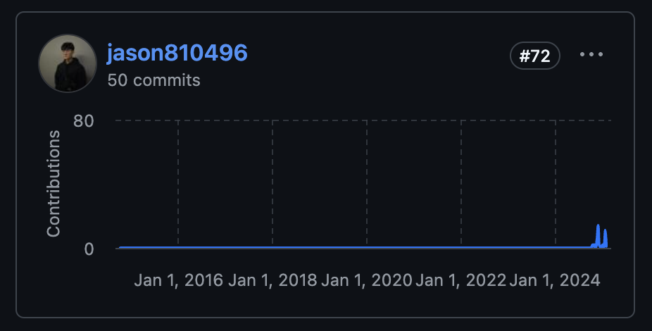
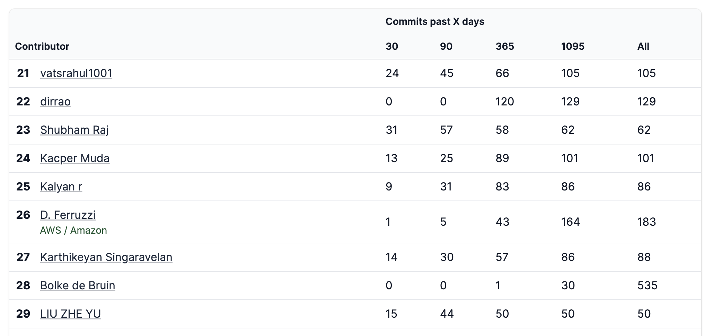
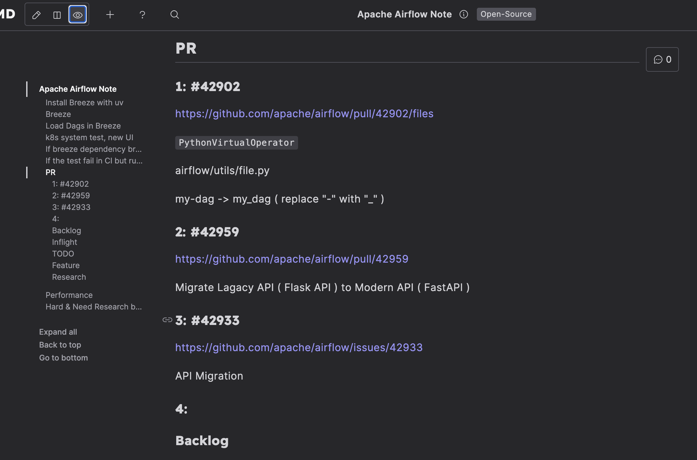
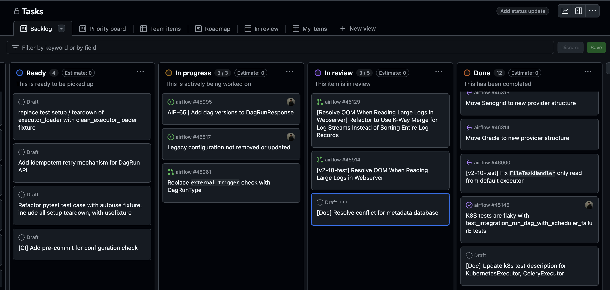
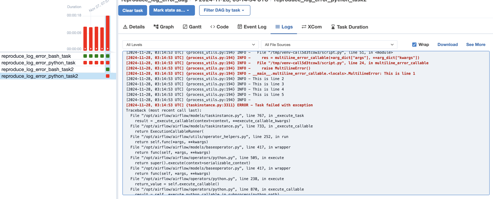
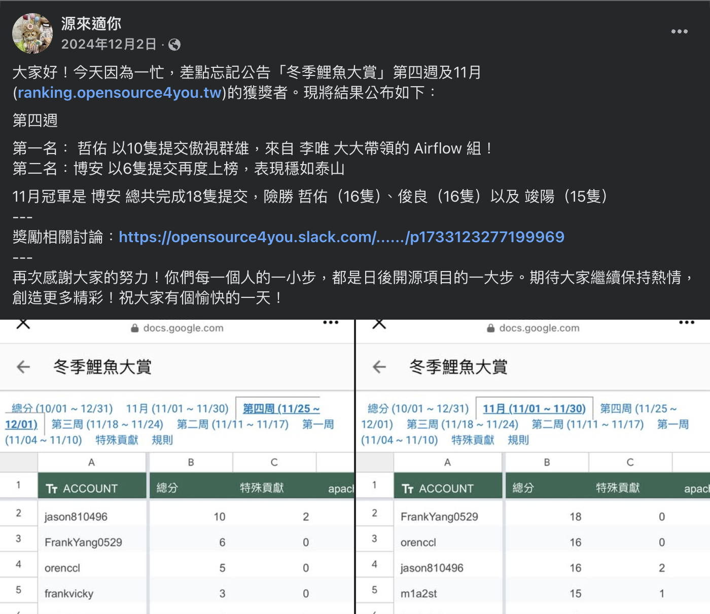
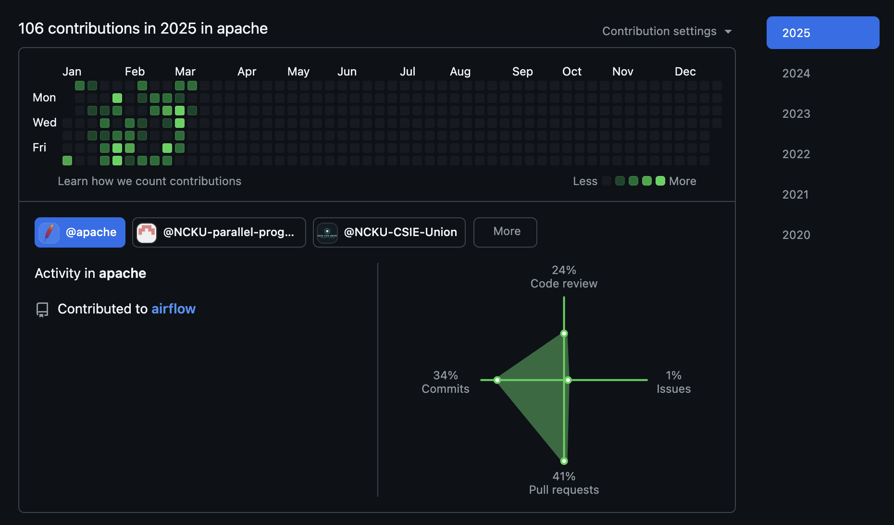

# Contributing to Apache Airflow from 0

<!-- 
## Why Start Contributing to Apache Airflow?

It all began after watching Terry’s talk: **How to Get a U.S. Engineering Offer Directly from Home**



I was really impressed by HanRu—being able to secure a U.S. engineering offer solely through open source contributions, rather than the common route of attending a prestigious foreign university to join a big company.
It was also during this time that I discovered the organization [Open Source For You](https://github.com/opensource4you). Once I joined their Slack, I found out that there are so many talented experts in Taiwan contributing to open source.

I wanted to see if I could achieve a similar goal through open source contributions.
-->

## Why Choose Apache Airflow?

I wanted to start contributing to a Top Level Project from the [Apache Foundation](https://www.apache.org/).  
I noticed that [Apache Airflow](https://github.com/apache/airflow) has **38.6k** stars.  
Even within our Data Team, Airflow is recognized as a crucial tool in Data Engineering.  
Plus, I’m most familiar with Python.

## Background

I'm [Zhe-You(Jason) Liu](https://github.com/jason810496), a CSIE junior from Taiwan 🇹🇼 with a passion for OSS contributions and an interest in backend distributed systems.

Before I actually started contributing to Apache Airflow, I had only interned in a Data Engineering–related department for just over 3 months.  
I didn’t even get a chance to write a DAG; I was mainly handling general backend tasks.

## Contribution Statistics

Let me first share the current contribution statistics:

### Total PR Count: **50+**
>   [Link to Total Merged PR](https://github.com/apache/airflow/pulls?q=is%3Amerged+is%3Apr+author%3Ajason810496+)

### GitHub Contribution Ranking (Since the Project's Inception): **Rank 72**
>   [Link to Contribution Graph on GitHub](https://github.com/apache/airflow/graphs/contributors)

### OSS Rank Contribution Ranking (Weighted by Recent Contributions): **Rank 29**
>   [Link to OSS Rank](https://ossrank.com/p/6-apache-airflow)

## First PR

I officially started contributing to Apache Airflow in early October 2024, after noticing the issue [Fix PythonOperator DAG error when DAG has hyphen in name](https://github.com/apache/airflow/issues/42796).

It was marked as a `good first issue`, so I decided to trace the problem and found that it seemed to require only a one-line change in the code. I decided to give it a try.

### Open Source For You

[Open Source For You](https://github.com/opensource4you) is an organization in Taiwan dedicated to **actively contributing to open source**.  
> Here’s a more in-depth introduction to **Open Source For You** through the [Kafka Community Spotlight: TAIWAN 🇹🇼](https://bigdata.2minutestreaming.com/p/kafka-community-spotlight-taiwan) by [Stanislav’s Big Data Stream](https://bigdata.2minutestreaming.com/).
In addition to `#kafka`, our community also includes `#airflow`.

Since the first issue was related to DAGs, I ran into some issues reproducing the problem following the steps in the [Breeze Container](https://github.com/apache/airflow/blob/main/dev/breeze/doc/README.rst) documentation.  
I reached out to committer [@Lee-W](https://github.com/Lee-W) for help.

I guess you could say I became a mentee of Lee-W (lol). From then on, whenever I encountered problems, needed a PR review, or labeling assistance, I’d always ask for his help!  
> Lee-W’s blog: [Contributing to Airflow 101: Sort of a Mentor(?), I Guess...](https://blog.wei-lee.me/posts/tech/2024/11/airflow-contribution-101/)

### First PR Merged

I submitted [my first Apache Airflow PR: Fix PythonOperator DAG error when DAG has hyphen in name #42902](https://github.com/apache/airflow/pull/42902).  
Interestingly, a colleague from another department, [@josix](https://github.com/josix), whom I hadn’t met before, helped review it !

Although I only changed one line of code, the PR involved over 20 comments exchanged during the iterative review process.  
It made me realize that open source contribution isn’t as simple as just **changing one line of code**.

Especially on the Unit Test side—since I had primarily written integration tests before, I wasn’t very experienced with mocking.

## How I Manage Tasks

Initially, I used [HackMD](https://hackmd.io/) to simply record potential issues to investigate in Markdown.  
>   
> Issue list recorded using HackMD.

Now, I manage tasks using the Kanban board in GitHub Projects, since I often work on 2–3 issues at once.  
Some tasks are under development, some await code review, and others spotted in the Issue List go into the Backlog.  
>   
> PR list managed via GitHub Projects.

## First 50 PRs


The AIP-XX references below refer to one of the proposals in the [Airflow Improvement Proposal](https://cwiki.apache.org/confluence/display/AIRFLOW).


### AIP-84: Modern REST API

Back in October last year, many AIP-84 issues were opened, primarily aimed at migrating the `legacy API` (written in Flask) to a FastAPI-based API.  
Since I was most familiar with FastAPI at the time, I ended up taking on nearly **10 API migrations**.

During these API migrations, I learned quite a bit about Airflow's architecture and became acquainted with commonly used pytest fixtures for testing, such as `dag_maker`, `dag_bag`, `create_dag_run`, `create_task_instances`, and more.

#### Refactoring the Parameter System

- [AIP-84 Refactor Filter Query Parameters #43947](https://github.com/apache/airflow/pull/43947)
- [AIP-84 Refactor SortParm #44345](https://github.com/apache/airflow/pull/44345)

**Context**  
Under the FastAPI framework, each filter (more precisely, each query parameter) inherits from `BaseParam`.  
When there are many filters in an API, using the `BaseParam` architecture helps keep the router layer clean.

The definition of `BaseParam` is as follows:  


**Problem**  
As more and more APIs are migrated to FastAPI, each one adds a class that inherits from `BaseParam` in the `common/parameters.py` module.  
For an API with _n_ entities, this results in _n_ additional classes.

Therefore, a universal Factory Pattern is needed to generate these classes with the appropriate type bindings required by FastAPI.  
After this refactoring PR, over 50 APIs utilize the `filter_param_factory`.

#### Global Unique Constraint Handler

- [AIP-84 Refactor Handling of Insert Duplicates #44322](https://github.com/apache/airflow/pull/44322)

This approach leverages FastAPI’s Exception Handler to process the Unique Constraint Error raised by SQLAlchemy,  
eliminating the need to handle this exception in each individual router.

### Fixing the Display of Logs after Applying Filters

[Fix wrong display of multiline messages in the log after filtering #44457](https://github.com/apache/airflow/pull/44457)

Before the fix, error highlighting in the logs was determined solely by a regex that searched for the string `ERROR` in the current line.  
However, it should instead rely on a `currentLevel` that tracks the current log level, ensuring that all logs categorized under `ERROR` are highlighted.

Since this directly affects the log page used by end users, it felt like a particularly rewarding PR.  
> Although the old UI is likely to be deprecated in the future, this PR will at least be included in version 2.10.x.

### Removing AIP-44 Internal API

Next, I encountered the Meta Issue [Removal of AIP-44 code #44436](https://github.com/apache/airflow/issues/44436).

The Internal API can be understood as an internal RPC (implemented using thrift RPC).  
This was my first encounter with a crowdsourced issue, and in terms of value, it was mainly driven by the fact that starting with Airflow 3.0, components such as the TaskSDK and Operators **should not directly access the Metadata Database**.

The Internal API represents a portion of the codebase that **directly accesses the Metadata Database**, and it has been criticized for being difficult to trace.

### Open Source For You – Winter Koi Fish Season

Since these crowdsourced issues are typically solved by many people together, everyone picks up a batch of tasks (possibly 5–10 sub-tasks) at a time.

Around this time, [Open Source For You](https://github.com/opensource4you) organized the Winter Koi Fish Season event, offering a Starbucks coffee reward to the top 3 contributors of the week.

With some pending PRs getting merged, this wave of PRs to remove the Internal API led to as many as 15 merged PRs in a single week. So, I unexpectedly won a Starbucks coffee reward! 😆

  
> [The Facebook post from Open Source For You](https://www.facebook.com/story.php?story_fbid=547322948293967&id=100090487996922&_rdr)

## Next Steps

### Continuing to Explore the Core

I plan to delve deeper into Airflow’s architecture, focusing on core components such as the Scheduler, Trigger, and Executor.

I also intend to explore feature details related to Airflow 3. Currently, I’m involved in issues related to [AIP-63: DAG Versioning](https://cwiki.apache.org/confluence/display/AIRFLOW/AIP-63%3A+DAG+Versioning) and [AIP-66: DAGs Bundles & Parsing](https://cwiki.apache.org/confluence/pages/viewpage.action?pageId=294816356).

While tackling tasks, it’s important to consider not just how to solve them but also the rationale behind the design and the true value of the issue, rather than simply aiming to rack up numbers.

### Engaging More in Community Discussions

This mainly includes participating in:
- GitHub Issues
- Developer Mailing List
- Slack
- AIP Documentation

### Answering More Questions on Slack

Answering questions on Slack is also part of engaging in community discussions.  
Whenever I have free time and come across topics I’m familiar with, I help answer questions in channels such as:
- `#new-contributor`
- `#contributor`
- `#airflow`
- `#user-troble-shooting`

## Conclusion

Contributing to Apache Airflow has been incredibly rewarding, and it’s a truly unique experience to collaborate with top developers from around the world!

>   
> [My GitHub HeatMap - Apache Airflow](https://github.com/jason810496?tab=overview&from=2025-03-01&to=2025-03-11&org=apache)

There’s a special sense of accomplishment when a PR gets merged, along with the recognition from reviewers.  
It’s a bit like solving algorithm problems in high school—except now, your contribution might actually be used by a company somewhere in the world!  
**It’s far more meaningful than just practicing coding challenges.**

In the future, I will write more in-depth PR write-ups to document my experiences, hoping to help others who want to contribute to Apache Airflow.