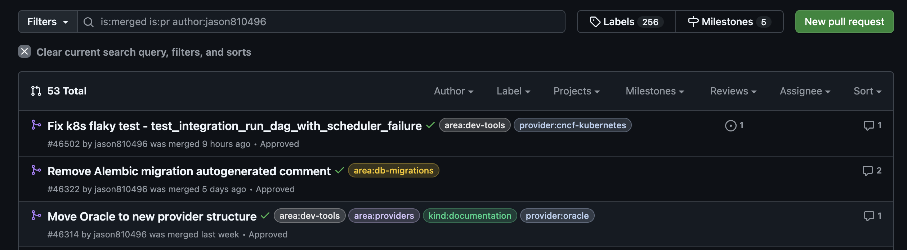
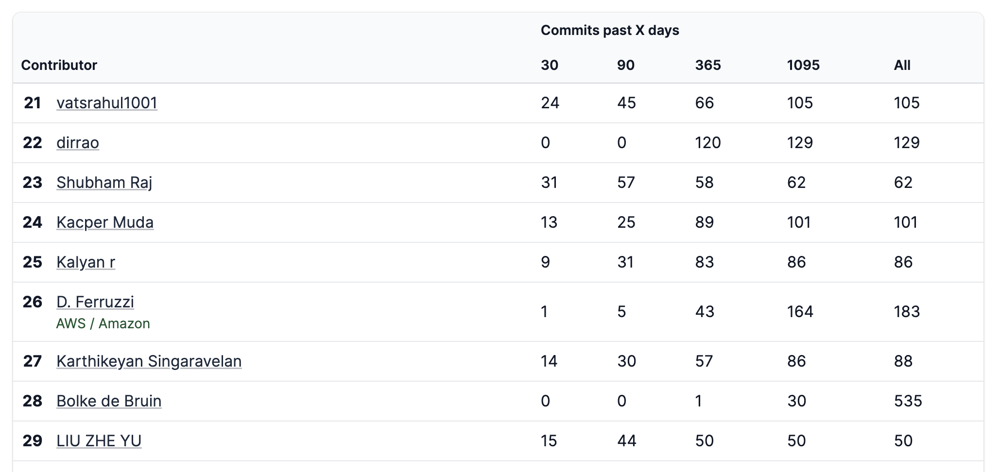
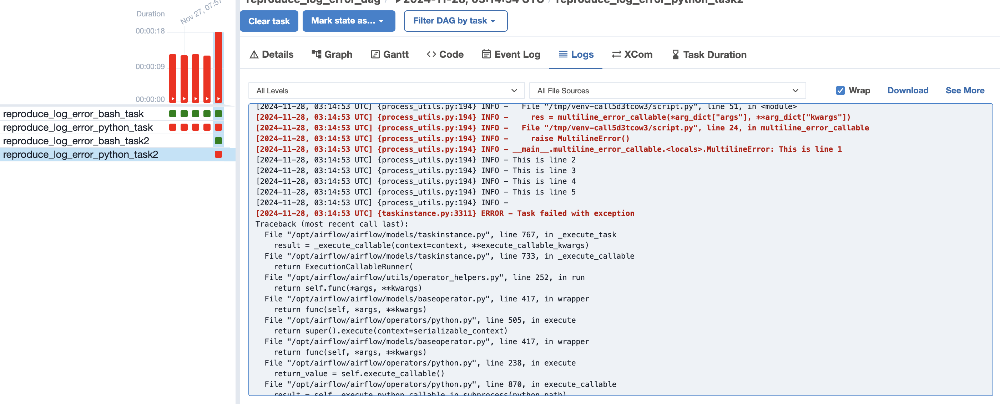
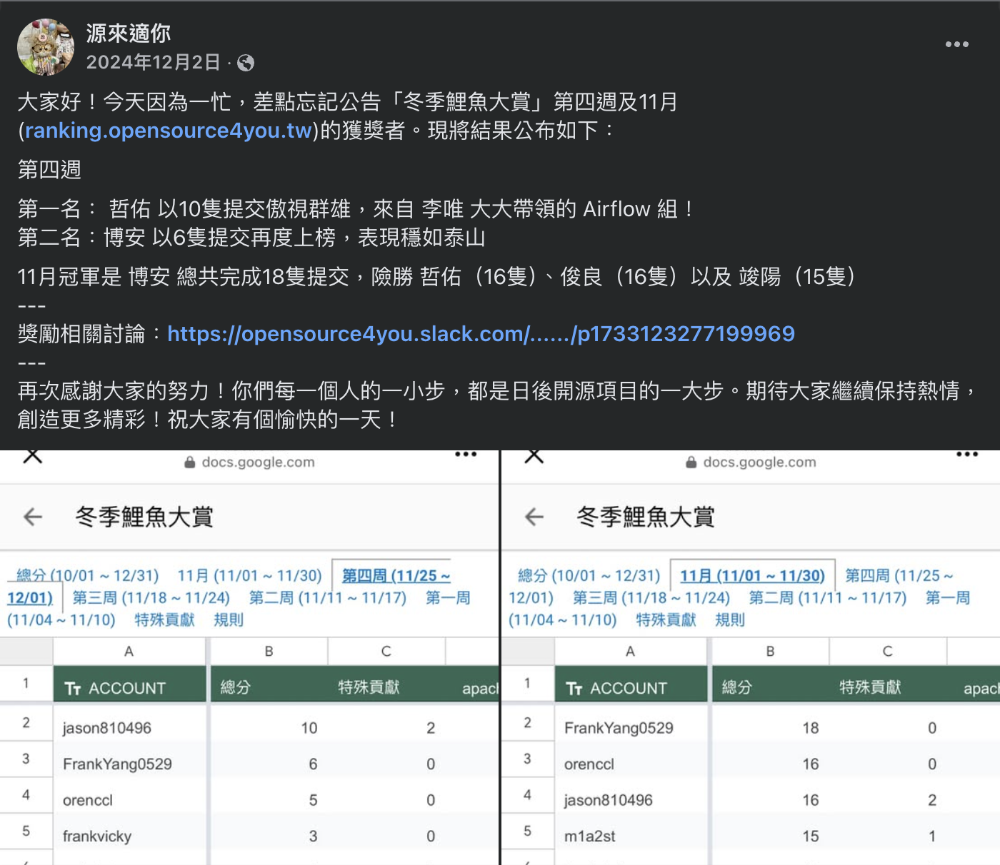
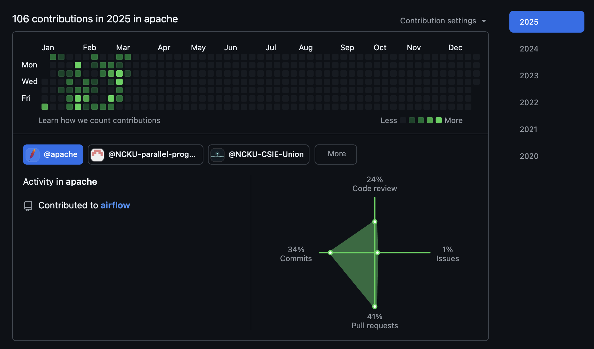

# 從 0 開始貢獻 Apache Airflow

<!-- ## 為什麼開始貢獻 Apache Airflow ?

主要是因為看了 Terry 分享的: **怎麼直接從國內拿美國工程師Offer**



覺得 HanRu 超級猛，可以靠開源貢獻拿到美國工程師 Offer  
不是透過常見的讀國外名校進入大公司  
剛好最後提到 [源來適你](https://github.com/opensource4you) 這個組織  
再進去 Slack 之後才發現原來台灣有這麼多大神都在貢獻開源  

也想試看看自己能不能透過開源貢獻達到這樣的目標   -->

## 為什麽選擇 Apache Airflow ?

想要從 [Apache Foundation](https://www.apache.org/) 的 Top Level Project 開始貢獻  
看到 [Apache Airflow](https://github.com/apache/airflow) 有 **38.6k** 的 star  
在 Data Team 看也發現 Airflow 確實也是 Data Engineering 領域的重要工具  
目前也對 Python 最為熟悉  

## 背景

在實際貢獻 Apache Airflow 之前  
我其實只有在跟 Data Engineering 相關的部門實習到當時只有 3 個月多  
負責的 task 其實連 DAG 都沒有寫到  
主要都還是負責 General Backend 的工作  

## 貢獻統計

先講一下到目前的貢獻統計  

### 總 PR 數: **50+**
> 
> [Link to Total Merged PR](https://github.com/apache/airflow/pulls?q=is%3Amerged+is%3Apr+author%3Ajason810496+)

### 在 GitHub 的貢獻排名 ( 專案從開始至今 ): **Rank 72**
> 
> [Link to Contribution Graph on GitHub](https://github.com/apache/airflow/graphs/contributors)

### 在 OSS Rank 看到的貢獻排名 ( 有根據近期貢獻加權 ): **Rank 29**
> 
> [Link to OSS Rank](https://ossrank.com/p/6-apache-airflow)

## 第一個 PR

從去年 2024 年 10 月初開始正式開始貢獻 Apache Airflow  
當是是看到 [Fix PythonOperator DAG error when DAG has hyphen in name](https://github.com/apache/airflow/issues/42796)

有被標記為 `good first issue`  
就嘗試 trace 一下看看，發現應該只需要改一行程式碼  
就決定試看看  

### 源來適你 

[源來適你](https://github.com/opensource4you) 是一個**實際貢獻開源**台灣的的組織  
> 這邊是關於 **源來適你** 更深入的介紹 [Kafka Community Spotlight: TAIWAN 🇹🇼](https://bigdata.2minutestreaming.com/p/kafka-community-spotlight-taiwan) by [Stanislav’s Big Data Stream](https://bigdata.2minutestreaming.com/) 
除了 `#kafka` 之外，也包括 `#airflow`頻道

因為第一個 Issue 剛好跟 DAG 有關  
按照 Doc 去在 [Breeze Container](https://github.com/apache/airflow/blob/main/dev/breeze/doc/README.rst) 去 reproduce 時步驟有點問題  
向 Committer [@Lee-W](https://github.com/Lee-W) 大大請教  

應該算是李維大大的 mentee xD (?)  
之後有é‡åˆ°å•é¡Œæˆ–是 PR éœ€è¦ Review 〠加 Label 都會請他幫忙 ！ 
> 李維大大的 Blog [貢獻 Airflow 101: 姑且算是個 mentor(?)...吧？](https://blog.wei-lee.me/posts/tech/2024/11/airflow-contribution-101/)

### 第一個 PR Merged

發出[第一個 Apache Airflow 的 PR: Fix PythonOperator DAG error when DAG has hyphen in name #42902](https://github.com/apache/airflow/pull/42902)  
剛好讓原本不認得的隔壁部門同事 [@josix](https://github.com/josix) 幫忙 review 到 xD  

雖然主要改的只有一行程式碼  
但中間其實有超過 20 個 comment 來回迭代修正  
也讓我知道開源其實沒有那麼剪**改一行 code** 這麼簡單  

尤其是在 Unit Test 的部分  
之前主要都寫 integration Test 比較沒有寫到 mock 的經驗  

## 管理 Tasks 的方式

前期使用 [HackMD](https://hackmd.io/) 以 Markdown 來簡單紀錄最近看到可以研究的 Issue   
> 
> 使用 HackMD 紀錄的 Issue List

目前都直接使用 GitHub Projects 的 Kanban 來管理  
因為同時可能有 2-3 個 Issue 正在解  
又會有些是在等 Code Review 的階段  
還有逛 Issue List 看到有機會做的 Issue 可以放在 Backlog  

> 
> 使用 GitHub Projects 管理的 PR List

## 前 50 個 PR


以下的 AIP-XX 都是指 [Airflow Improvement Proposal](https://cwiki.apache.org/confluence/display/AIRFLOW) 的其中一個提案

### AIP-84: Modern REST API

剛好去年 10 月開出很多 AIP-84 的 Issues  
主要是把 `legacy API` ( Flask 寫的 API ) migrate 到 FastAPI 的 API  
因為當時最熟的就是 FastAPI 所以總共接了快 **10 個 API Migration**

在做這些 API Migration 的過程中也多少學到不少 Airflow 的架構  
還有寫 test 常用到的 pytest fixture 如 `dag_maker` 〠`dag_bag` 〠`create_dag_run`、`create_task_instances` 等等  

#### 重構 Parameter System

- [AIP-84 Refactor Filter Query Parameters #43947](https://github.com/apache/airflow/pull/43947)
- [AIP-84 Refactor SortParm #44345](https://github.com/apache/airflow/pull/44345)

**Context**  
在 FastAPI 架構下，每個 filter ( 竟更精確來說是 query parameter) 都會繼承 `BaseParam`  
當 API 的 filters 很多時，透過 `BaseParam` 的架構可以讓 router 層比較乾淨  

`BaseParam` 的定義如下  



**Problem**  
但隨著越來越多 API 被 Migrate 到 FastAPI 的架構  
每個 API 都在 `common/parameters.py` 的 module 加上繼承 `BaseParam` 的 class  
有 n 個 entity 的 API 就會多出 n 個 class  

所以應該要有一個通用的 Factory Pattern 並對 FastAPI 所需的 typing 綁定來產生這些 class  
經過這個重構的 PR 應該 50+ 個 API 都有利用到 `filter_param_factory`



#### Global Unique Constraint Handler

- [AIP-84 Refactor Handling of Insert Duplicates #44322](https://github.com/apache/airflow/pull/44322)

以 FastAPI 的 Exception Handler 來處理 SQLAlchemy raise 出的 Unique Constraint Error  
就不用在各個 Router 去處理這個 Exception  

### 修正 Log 頁面的 Filter 後的顯示結果

[Fix wrong display of multiline messages in the log after filtering #44457](https://github.com/apache/airflow/pull/44457)

在修正之前原本 Error 的 highlight 只會根據 regrex 去找當前這行有沒有 `ERROR` 這個字串  
但應該要是有個 `currentLevel` 去紀錄當前的 log level  
屬於 `ERROR` 區間的 log 都需要 highlight  

因為直接跟 User 在使用的 Log 頁面有關  
也算比較有成就感的 PR  
> 雖然舊的 UI 之後應該會被 deprecated 但至少在 2.10.x 的版本都還會有包到這個 PR ~  

### 移除 AIP-44 Internal API

接著遇到 [Removal of AIP-44 code #44436](https://github.com/apache/airflow/issues/44436) 的 Meta Issue  

Internal API 可以理解為內部的 RPC ( 實際是使用 thrift RPC 實作 )  
這是第一個遇到需要 crowdsourcing 
以價值來說主要是為了 Airflow 3.0 開始
TaskSDK、Operators 等**不應該直接存取到 Metadata Database** 

而 Internal API 算是其中一部分**直接存取到 Metadata Database** 的 codebase  
也被詬病不好 trace 

### 源來適你 - 冬季鯉魚季

因為這種 crowdsource 的 Issue 通常會有很多人一起解  
大家都是一次接一個 batch ( 可能 5-10 個 sub-task )  

剛好這時候 [源來適你](https://github.com/opensource4you) 有舉辦冬季鯉魚季，會給當周 Merged PR 前 3 多的人星巴克咖啡卷  
加上之前一些 pending 的 PR 被 merged 和這波 delete Internal API 的 PR 一起  
有某一週剛好被 merged 了 15 個 PR，意外拿到咖啡卷 😆  

> [源來適你的貼文](https://www.facebook.com/story.php?story_fbid=547322948293967&id=100090487996922&_rdr)

## 接下來的方向

### 持續往 Core 研究

更深入實際 Airflow 的架構  
Scheduler、Trigger、Executor 這些核心的部分  

還有跟 Airflow 3 相關的 Feature 細節  
目前有接觸到一些跟 [AIP-63: Dag Versioning](https://cwiki.apache.org/confluence/display/AIRFLOW/AIP-63%3A+DAG+Versioning) 還有跟他有關的 [AIP-66: DAGs Bundles & Parsing](https://cwiki.apache.org/confluence/pages/viewpage.action?pageId=294816356) 相關的 Issue  

在解 Task 的同時，應該也要思考為什麼要這樣設計、這個 Issue 的價值  
而不是單純的衝數量  

### 多參與 Community 討論

主要包括這些地方  
- GitHub Issue
- Dev Mail list 
- Slack
- AIP Doc

### 多回覆 Slack 問題

其實回覆 Slack 問題也算參與 Community 討論的一部分  
有空就看到算熟悉的 context 就可以幫忙回答問題  
- `#new-contributor`
- `#contributor`
- `#airflow`
- `#user-troble-shooting`

## 結論

目前貢獻 Apache Airflow 蠻有成就感的  
也能與世界上來自各個國家的頂尖開發者一起合作  
是非常特別的感覺！  

> 
> [My GitHub HeatMap - Apache Airflow](https://github.com/jason810496?tab=overview&from=2025-03-01&to=2025-03-11&org=apache)

尤其是被 Merged 的 PR 會有一種成就感  
也會有一種被 Reviewer 認可的感覺  
跟高中刷演算法題的感覺有點像  
不過現在是貢獻開源，這個 PR 是真的會被世界上某個公司所用到 ！ 
**比起刷題是更有意義的事情**  

接下來會再寫一些文章紀錄一些比較有深度的 PR Write-up  
希望可以幫助到更多想要貢獻 Apache Airflow 的人  