# Background  

I am [Liu Zhe-You (Jason)](https://github.com/jason810496), currently a junior at [NCKU CSIE](https://www.csie.ncku.edu.tw/en/).  
I focus on contributing to open source and have a keen interest in **Distributed Systems** and **Data Engineering**.  

- **GitHub**: [https://github.com/jason810496](https://github.com/jason810496)  
- **LinkedIn**: [https://www.linkedin.com/in/zhe-you-liu/](https://www.linkedin.com/in/zhe-you-liu/)  

Before contributing to Apache Airflow, I had only interned in a **Data Engineering**-related department for about three months.  
Interestingly, my tasks didn’t even involve Airflow—I was mainly responsible for **general backend development**.  

## Why Apache Airflow?  

When I decided to contribute to open source, I wanted to start with a **Top-Level Project** from the [Apache Foundation](https://www.apache.org/).  
I noticed that [Apache Airflow](https://github.com/apache/airflow) had nearly **39.2k stars**, and after consulting with Data Teams, I confirmed that Airflow is indeed a crucial tool in **Data Engineering**.  
It was a perfect fit, especially since **Python** is my most familiar language.  

## What I Gained from Open Source Contributions  

Before diving in, I want to share what I’ve gained from contributing to open source.  
**Hopefully, this will inspire those who are still hesitating to get started!**  

1. **Growth at Both the Code Level and System Level**  

Projects under **Apache’s Top-Level Projects** are massive in scale.  
You’ll encounter numerous **design patterns** and learn how large-scale software achieves **scalability** and **fault tolerance**.  
Additionally, you’ll see how **CI pipelines** are designed to ensure system stability while using minimal resources.  

For example, in Airflow, every new feature or refactor requires careful consideration of **backward compatibility**.  
Even a small change to the codebase could potentially affect **users worldwide**.  
This kind of experience is hard to gain from personal side projects or even internal company projects.  

2. **Opportunity to Collaborate with Top Developers from Around the World**  

This is one of the coolest parts of contributing to open source.  
Even though I’m based in Taiwan, the moment I submit a PR on GitHub,  
I have the chance to receive feedback from **PMCs, Committers, and developers with 10+ or even 20+ years of experience** from around the world.  
Sometimes, I even get to collaborate with them on **new features and refactors**—a fantastic learning opportunity!  

3. **A Way to Prove Your Skills**  

Contributing to large open-source projects is a **great way to showcase your abilities**.  
Since all PRs are publicly available on **GitHub**, they serve as proof of your:  
- Problem-solving skills  
- Code quality  
- Communication ability  

Currently, there are only about **9,000 Apache Committers** worldwide.  
That makes it a highly valuable credential.  
> [Link to ASF Committer List](https://people.apache.org/committer-index.html)  

# Contribution Statistics  

Here’s a summary of my contributions so far.  
I started contributing to Apache Airflow in **early October 2024**, and the following stats are as of **March 14, 2025**.  

> 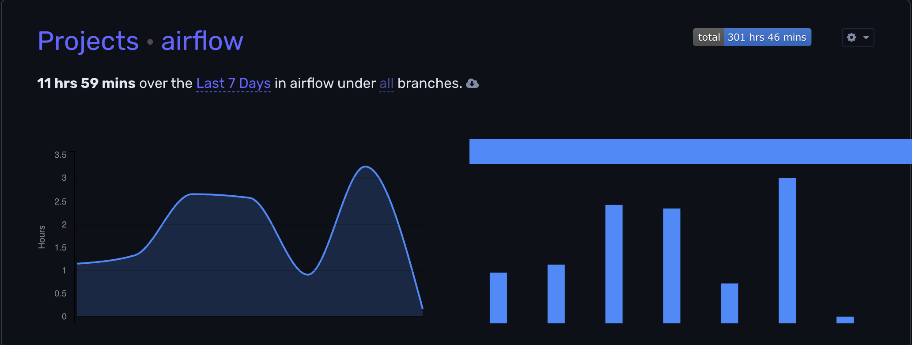  
> [Link to WakaTime Dashboard](https://wakatime.com/@jason810496)  

These **300 hours** only account for actual coding time.  
They **do not** include discussions on **GitHub, PR reviews, or Slack conversations**.  

### Total Merged PRs: **70+**  
> 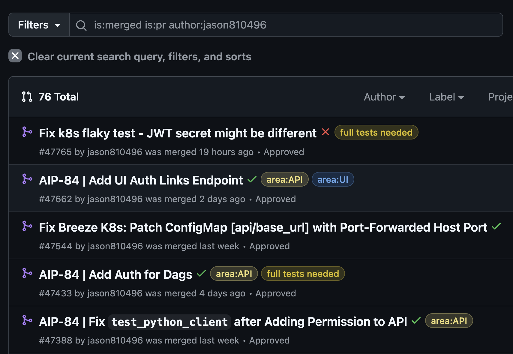  
> [Link to Total Merged PRs](https://github.com/apache/airflow/pulls?page=1&q=is%3Amerged+is%3Apr+author%3Ajason810496)  

### GitHub Contributor Ranking (All-time project ranking): **#59**  
> 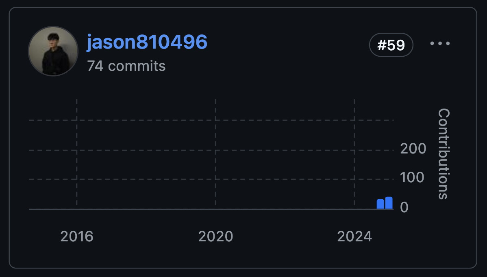  
> [Link to Contribution Graph on GitHub](https://github.com/apache/airflow/graphs/contributors)  

### OSS Rank Contribution Score (Weighted by Recent Activity): **#26**  
> 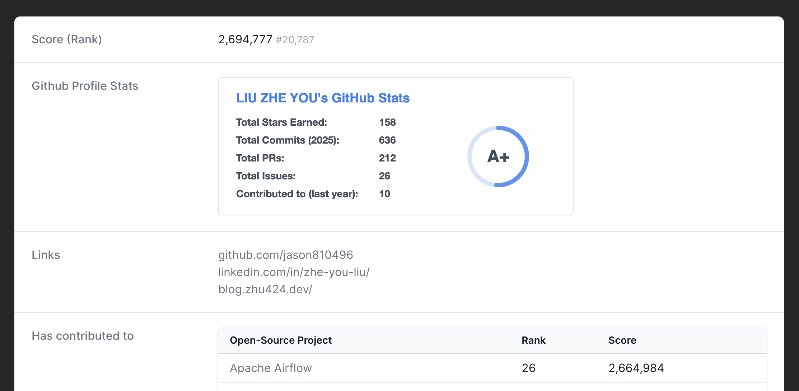  
> [Link to OSS Rank of Apache Airflow](https://ossrank.com/p/6-apache-airflow)  
> [Link to OSS Rank Profile](https://ossrank.com/c/757913-liu-zhe-yu)  

### Becoming a Committer  

On **March 14, 2025**, I was **invited to become an Apache Airflow Committer!** 🎉  
> 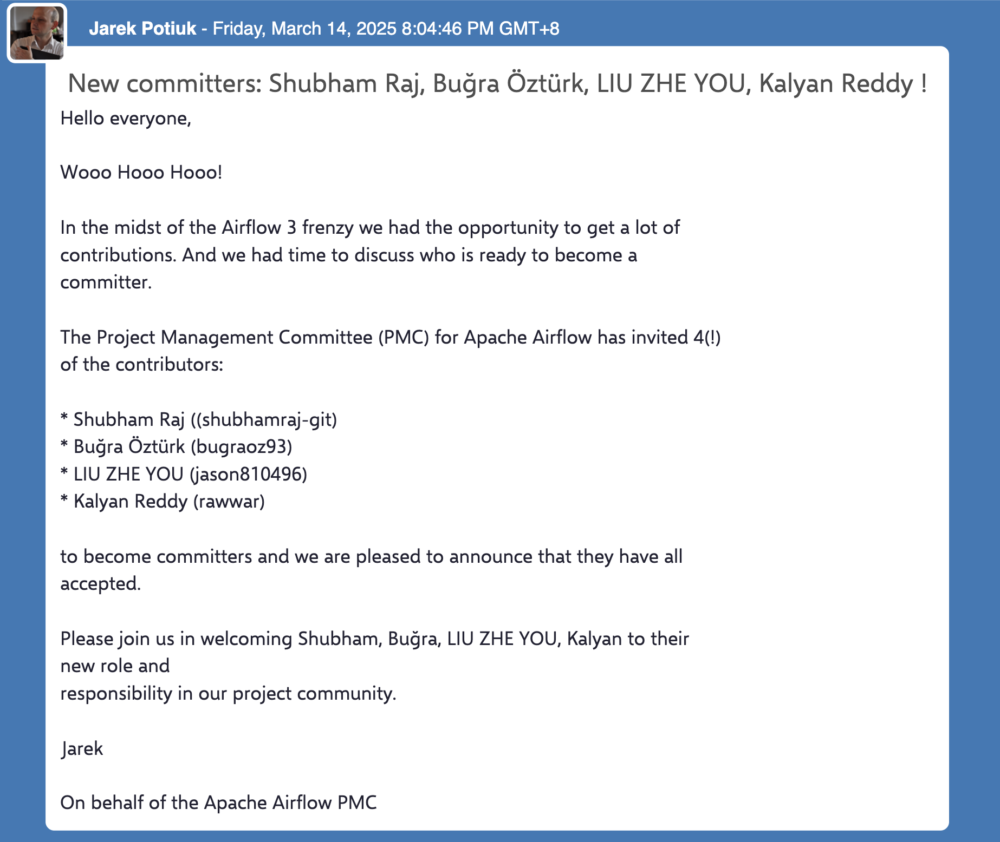
> [Announcement of New Committers](https://lists.apache.org/thread/lrjgl630mdhvzmpdt5tvp425kpqkrl8m)

I even got my official **Apache Email**!  
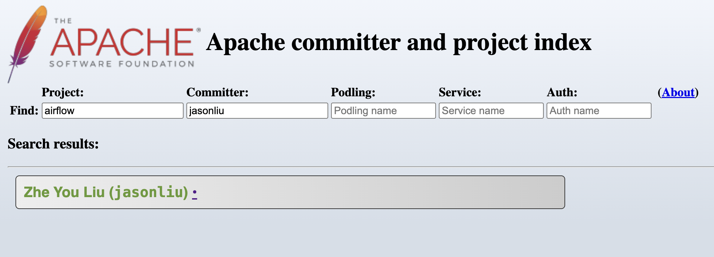  
Luckily, the **Apache ID "jasonliu"** was still available, so I grabbed it. 😆  

## How to Start Contributing to Apache Airflow  

I initially followed [@kaxil](https://github.com/kaxil)’s [Contributing Journey](https://airflowsummit.org/slides/2021/y1-ContributingJourney.pdf) presentation.  
Then, I skimmed through the [Airflow Contribution Guide](https://github.com/apache/airflow/tree/main/contributing-docs).  
Finally, I set up [Breeze (Airflow’s CLI/CI Tool for Contributors)](https://github.com/apache/airflow/blob/main/dev/breeze/doc/README.rst).  

From there, I started browsing:  
- [Apache Airflow’s Issue List](https://github.com/apache/airflow/issues)  
- [PR List](https://github.com/apache/airflow/pulls)  

## My First PR  

I officially started contributing in **early October 2024**.  
At that time, I found an issue:  
> [Fix PythonOperator DAG error when DAG has a hyphen in the name](https://github.com/apache/airflow/issues/42796)  

Since it was labeled as a **"good first issue"**, I decided to **trace the problem**.  
It turned out that the fix only required **a single line of code**, so I went ahead and submitted my first PR!  

### OpenSource4You  

> 4 in Mandarin is pronounced as "Si," which represents "For" in English.  
> So, OpenSource4You can be interpreted as "Open Source For You."  

[**OpenSource4You**](https://github.com/opensource4you/readme) is a **non-profit organization** in Taiwan dedicated to **hands-on open-source contributions**.  
It provides mentorship for contributing to various open-source projects, including:  
- [Apache Airflow](https://github.com/apache/airflow)  
- [Apache Kafka](https://github.com/apache/kafka)  
- [Apache YuniKorn](https://github.com/apache/yunikorn-core)  

Since the community primarily communicates in **Mandarin**, it's much easier to ask questions and get help.  

- [List of projects with active mentorship in **OpenSource4You**](https://github.com/opensource4you/readme?tab=readme-ov-file#%E7%9B%AE%E5%89%8D%E6%9C%89-mentor-%E5%B8%B6%E7%9A%84%E5%B0%88%E6%A1%88)  
- Learn more about **OpenSource4You**:  
  > [Kafka Community Spotlight: TAIWAN 🇹🇼](https://bigdata.2minutestreaming.com/p/kafka-community-spotlight-taiwan) by [Stanislav’s Big Data Stream](https://bigdata.2minutestreaming.com/)  

Since my first issue was related to DAGs, I followed the documentation and tried to reproduce the problem in the [Breeze Container](https://github.com/apache/airflow/blob/main/dev/breeze/doc/README.rst). However, I ran into some issues along the way.  

I reached out to **Committer [Wei Lee](https://github.com/Lee-W)** for help.  
From that moment on, I unofficially became [Wei Lee](https://github.com/Lee-W)’s mentee **xD**.  
Whenever I ran into problems or needed a **PR review or label**, I would ask for his help!  

> [Contributing to Airflow 101: So I guess I’m a mentor(?)... maybe?](https://blog.wei-lee.me/posts/tech/2024/11/airflow-contribution-101/) by [Wei Lee](https://github.com/Lee-W)  

### My First PR Got Merged  

I submitted my **first Apache Airflow PR** [Fix PythonOperator DAG error when DAG has hyphen in name #42902](https://github.com/apache/airflow/pull/42902)  
Coincidentally, my colleague from another department, [@josix](https://github.com/josix), whom I didn’t know before, ended up reviewing it **xD**.  

Although the fix was just a **single line of code**,  
the PR went through **20+ rounds of comments and revisions**.  
That experience taught me that open-source contribution is much more than just **modifying one line of code**.  

In particular, unit testing was a challenge for me.  
I was more familiar with integration tests, so I had little experience with **mocking** before.  

## How to Find Issues to Work On?  

### Getting Started: Good First Issues & Meta Issues  

The easiest way to start is by looking at **Good First Issues**:  
- [good first issue](https://github.com/apache/airflow/labels/good%20first%20issue)  
  > `good first issue`: Issues suitable for first-time contributors  

Or **Meta Issues**, which contain multiple subtasks:  
- [meta issue](https://github.com/apache/airflow/issues?q=is%3Aopen%20label%3Akind%3Ameta%20)  
  > `meta issue`: Issues with multiple subtasks, often involving refactoring or migrating multiple modules  

Meta Issues are especially beginner-friendly because once you complete **one subtask**,  
the remaining ones **follow a similar pattern**, making them easier to solve.  

If your goal is to **build up issue contributions**, this is one of the fastest ways.  
It also increases your visibility in the community and helps **establish your presence**.  

### Browsing the Issue List  

For example, I created this issue:  
[Resolve OOM when reading large logs in webserver #45079](https://github.com/apache/airflow/issues/45079)  

Since I saw [Jens](https://github.com/jscheffl) and [Jarek](https://github.com/potiuk) discussing the **Webserver OOM (Out of Memory)** issue in the comments of  
[Add ability to generate temporary downloadable link for task logs (stored on cloud storage) on UI #44753](https://github.com/apache/airflow/issues/44753)  

This caught my attention because **adding a feature to download logs from cloud storage**  
wouldn’t actually solve the **root cause** of the OOM issue.  
Instead, the real problem was **sorting and merging logs in memory**, which needed to be fixed.  

### Browsing the Open PR List  

By looking at the [Open PR List](https://github.com/apache/airflow/pulls),  
you might come across **similar content that could be refactored**.  

If you're familiar with a particular part of the codebase,  
you can even **help review** those PRs, which is another way to contribute!  

### Checking the Project Board  

Apache Airflow makes it **easy** to find open tasks through the [Project Board](https://github.com/orgs/apache/projects).  

Clicking on a project reveals a **TODO list** of tasks.  
If you find something interesting, you can leave a comment on the issue to start working on it!  

For example, my PR [Fix k8s flaky test - test_integration_run_dag_with_scheduler_failure #46502](https://github.com/apache/airflow/pull/46502)  
was found under [CI / DEV ENV planned work](https://github.com/orgs/apache/projects/403/views/2).  

I ended up working on **multiple flaky tests related to Kubernetes** as a result.  

## Overcoming the Challenge of Finding Issues  

In the beginning, **finding issues to work on is difficult**.  
The issue list might look **overwhelming** and full of things that don’t make sense.  

However, as you **solve more issues**,  
you start to **understand more of the codebase** and recognize opportunities for **refactoring or optimizations**.  

Right now, I have a personal **backlog of over 10 issues**,  
with **5–6 issues in progress or waiting for review**.  
## How to Write a PR?  

At first, I kept my PR descriptions short—  
I would just tag `related: #issue-number` or `closes: #issue-number`  
and briefly explain what was changed.  

Later, I noticed that [Wei Lee](https://github.com/Lee-W) always provided **clear PR context**.  
For example, in [fix(task_sdk): add missing type column to TIRuntimeCheckPayload #46509](https://github.com/apache/airflow/pull/46509),  
even though it was just a one-line field change, he clearly explained both the **Why** and **What**.  

So I started structuring my PRs based on **The Golden Circle**:  

- **Why**: Why is this PR needed?  
- **How**: What was changed? What’s the approach or strategy?  
- **What**: What is the expected result or outcome?  

> Sometimes, I only include **Why & How** or **Why & What**.  
> The distinction between **How** and **What** can be blurry depending on how I describe the PR changes.  
> Personally, I include all three only for **larger changes**.  

The goal is simply to help reviewers quickly understand  
**why the PR is necessary** and **what has been changed**.  

## How to Communicate?  

### Clearly Explain the Problem & Context  

Airflow discussions primarily happen on **GitHub Issues**  
(unless it's urgent or requires in-depth discussion, in which case **Slack** is used).  

So when asking questions or discussing an issue, it's important to **clearly provide all relevant context**.  

Since maintainers might be in **different time zones**,  
**each round of communication can take several hours**.  
The clearer you explain the issue, the fewer back-and-forth messages will be needed.  

### Communicate with Stakeholders in Advance  

Before working on a PR, it's helpful to discuss your approach with relevant stakeholders.  
For example, you can briefly explain your solution in the GitHub Issue or Slack and **CC key stakeholders**.  

(For instance, if solving an issue requires **modifying another component**,  
you can tag the maintainer of that component in the issue comments.)  

This helps avoid unnecessary **extensive PR revisions**  
and also increases visibility so that stakeholders **can help review or provide feedback**.  

For example, in [AIP-84 Refactor Handling of Insert Duplicates #44322](https://github.com/apache/airflow/pull/44322),  
I spent **a lot of time implementing unnecessary features**,  
only to have them **entirely removed after the review**.  

## How to Manage Tasks?  

### Early Stage: Using HackMD  

Initially, I used [HackMD](https://hackmd.io/) with Markdown  
to **jot down issues worth investigating** and keep **small notes**.  

> 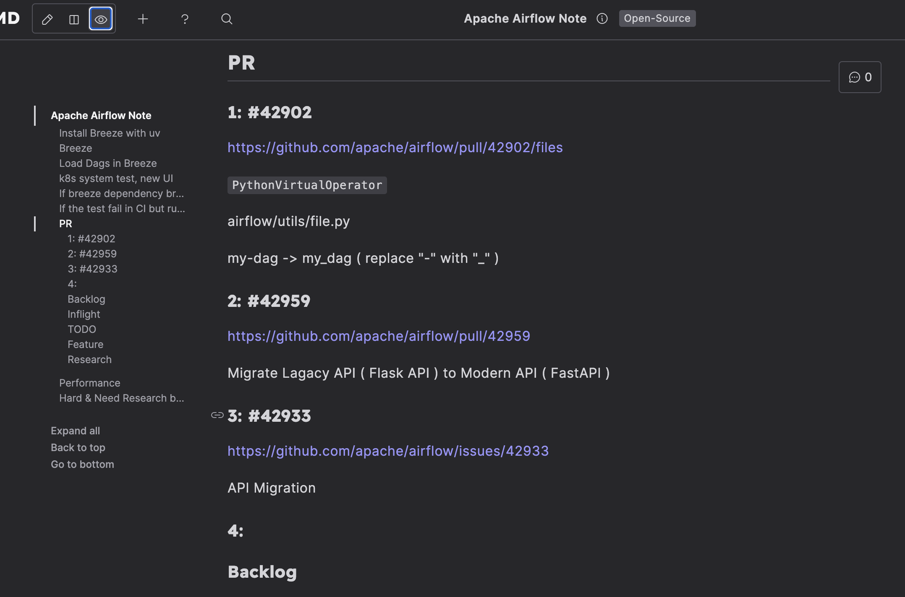  
> Issue list tracked in HackMD  

### Current Approach: GitHub Projects Kanban  

Now, I manage everything directly with **GitHub Projects’ Kanban board**.  

> You can create your **own Kanban board** in your forked repo.  

Since I often have **2-3 issues in progress**,  
with some **waiting for code review** and others **pending reviewer feedback**,  
a **Jira-like Kanban** helps keep track of everything efficiently.  
This way, I don’t **lose track of my ongoing issues**.  

If I find an interesting issue while browsing or think of something to work on,  
I add it to the **Backlog**—so I don’t forget it later.  

> 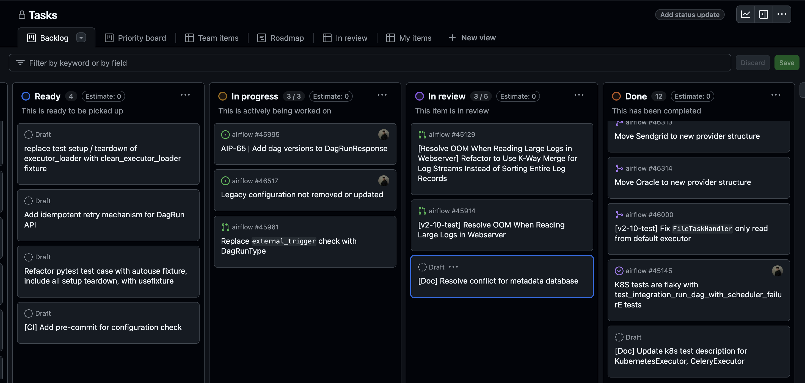  
> PR list managed using GitHub Projects
## Most Memorable PRs  

### [AIP-84 Authentications and Permissions #42360](https://github.com/apache/airflow/issues/42360)  

This is a **meta issue** for adding Authentication/Authorization to the migrated API server.  
When I first started contributing, I even [commented, asking if I could work on it](https://github.com/apache/airflow/issues/42360#issuecomment-2428225924),  
but [Pierre Jeambrun](https://github.com/pierrejeambrun) replied that [it wasn't a "Good First Issue" and suggested trying another one instead](https://github.com/apache/airflow/issues/42360#issuecomment-2428552187).  

A few weeks ago, though, [Pierre Jeambrun](https://github.com/pierrejeambrun) [tagged me and asked if I wanted to take it on](https://github.com/apache/airflow/issues/42360#issuecomment-2678563686).  
That was a pretty special moment—it felt like I wasn’t just a beginner anymore.  
Being recognized by a PMC member as **capable of handling this issue** was really encouraging.  

### [[Resolve OOM When Reading Large Logs in Webserver] Refactor to Use K-Way Merge for Log Streams Instead of Sorting Entire Log Records #45129](https://github.com/apache/airflow/pull/45129)  

I actually started working on this issue back in **December last year**.  
I conducted a **comprehensive benchmark and proof of concept** in the [issue discussion](https://github.com/apache/airflow/issues/45079),  
which showed that the change could **reduce memory usage by 90%**.  
It was also the **first PR where a PMC member praised my work** (I think?).  

At the time, I thought that once it got merged,  
I could asynchronously refactor **10 different providers**,  
essentially giving me **10 extra PRs to work on**.  

This was my first **major refactor directly related to a core feature**,  
but ironically, I was nominated as a **committer** before the PR was even merged.  

> It still hasn’t been merged yet.  
> But it **should be merged before Airflow 2.10.6 or 2.11.0**!  
> If it’s going into the **Airflow 3.0 main branch**,  
> I’ll need to spend some time resolving conflicts 🚧.  

### [Fix FileTaskHandler Only Reading from Default Executor #45631](https://github.com/apache/airflow/pull/45631)  

The actual **code change** for this issue was pretty quick to write.  
All the related **tests passed individually**,  
but **only when running the full test suite did the failure appear**.  
Even after retrying multiple times, it still failed.  

[Jarek](https://github.com/potiuk) suggested that I might need to **bisect the tests**  
to identify the one causing a side effect:  

> Likely this is a side effect of some other test that does not clean up after itself.  
> You can repeat what CI is doing — i.e. run the Core test type…  
> In many cases, you can guess which tests are related to your changes.  
> What I often do in such cases is try to bisect the issue—  
> instead of running the whole test_type ("Core") test suite,  
> I enter Breeze and run individual test packages/modules seen in the output.  

In the end, **binary search** actually helped me [find the problematic test](https://github.com/apache/airflow/pull/45631#issuecomment-2598674742)!  
I never expected **this kind of issue** to happen.  
~Who knew contributing to open source also required psychic abilities?~  

### [Fix K8s Flaky Test - JWT Secret Might Be Different #47765](https://github.com/apache/airflow/pull/47765)  

This was the last PR I submitted **before being invited as a committer**.  

One afternoon, just before heading to my **PE class**,  
I saw that [Ash](https://github.com/ashb) had tagged me in the `#internal-ci-cd` channel on Slack,  
saying that the **Kubernetes test I had fixed earlier was still very flaky**.  

> TL;DR: My Kubernetes test fix was still unstable,  
> and the CI failure rate was quite high.  

So, right before leaving, I quickly drafted a fix and **speed-ran a PR in 20 minutes**.  
Luckily, I got it **right on the first commit!**  

The funny part?  
[Jarek](https://github.com/potiuk) commented below: "Looking at it with 🍿"  

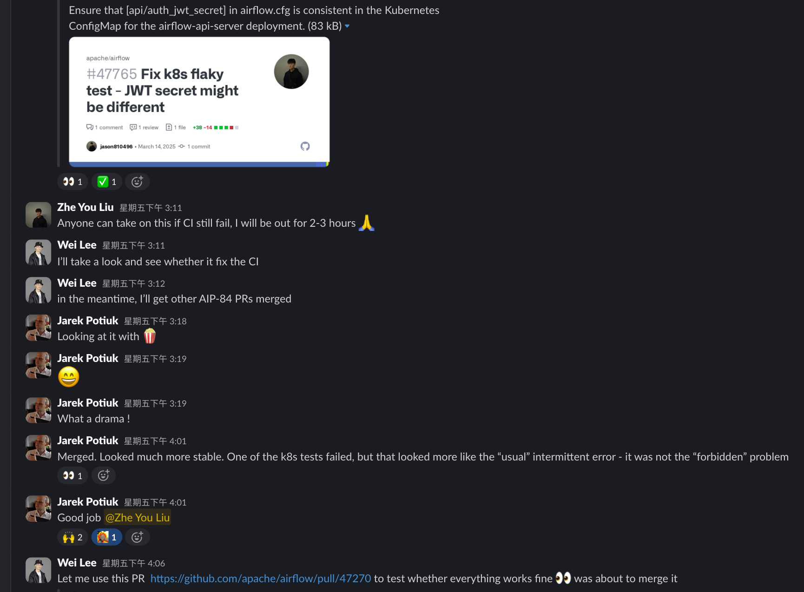  

Definitely the **most nerve-wracking yet satisfying** PR so far!  

## Becoming a Committer Is Just the Beginning  

### Understanding Airflow  

Being a **committer** ≠ **fully understanding the entire project**.  
Personally, I’d say my **current understanding of Airflow is only about 15%**.  

(So far, I’m most familiar with **API server, Task Log, Auth Manager, Executor, and Kubernetes Tests**.)  

There are still **many core Airflow features** I need to dive deeper into,  
such as **Scheduler, Trigger, Pool, and TaskSDK (a new feature in Airflow 3.0)**,  
which are **still quite unfamiliar** to me.  

### Reviewing PRs  

Previously, I focused more on **solving issues**  
and spent relatively **less time reviewing PRs**.  

Moving forward, I plan to **review more PRs**,  
including ones outside my expertise,  
so I can explore **related contexts** while reviewing.  

## Join the Fun: "Let's Contribute to Apache Airflow!"  

If you're interested in **Python, Data Engineering**, and want to start contributing to a **world-class open-source project**,  
but you're worried about complex setups or needing a high-end computer,  

**Why not try contributing to Apache Airflow?**  

Apache Airflow offers an **excellent developer experience**.  
I never expected an open-source project to have a dedicated CLI just to **make life easier for contributors and CI**!  

With this CLI, you can effortlessly run unit tests, integration tests, Kubernetes tests,  
or even spin up an Airflow system with different executors.  

> 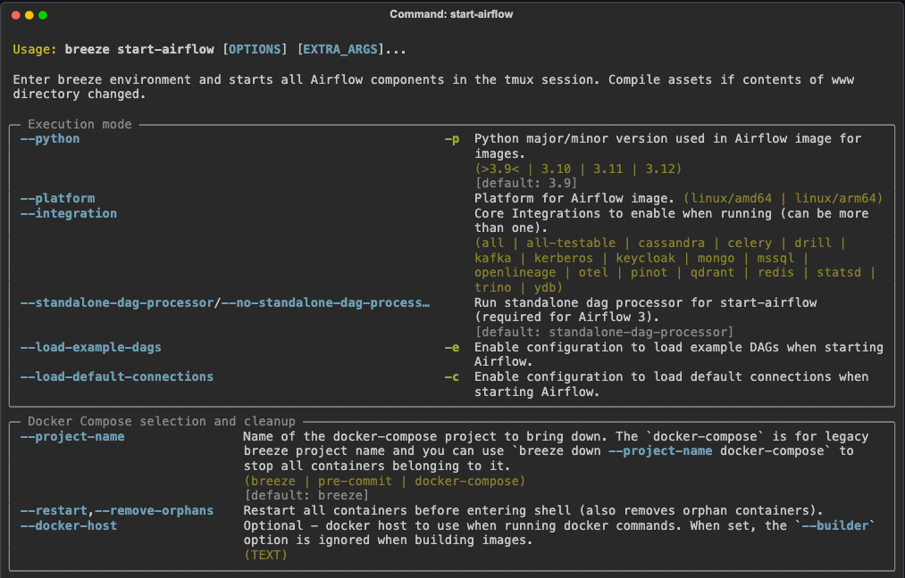  
> [`Breeze` CLI](https://github.com/apache/airflow/blob/main/dev/breeze/doc/03_developer_tasks.rst)  

It also has an **incredibly robust CI system**.  
There are over **100 [pre-commit hooks](https://pre-commit.com/)**,  
covering everything from basic linting and type checking to generating documentation, ERDs, and frontend API services—  
all designed to maintain high PR quality.  

Not to mention the powerful [GitHub Actions CI](https://github.com/apache/airflow/actions).  

> 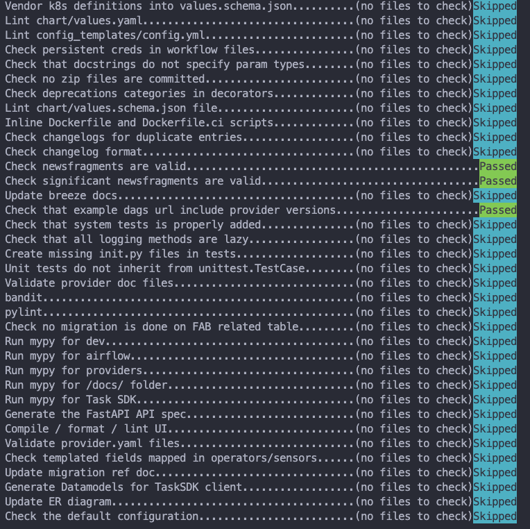  
> The pre-commit hooks that automatically run during `git commit`.  
> Even the [Available pre-commit checks](https://github.com/apache/airflow/blob/db4689f3c720056fba1c6bbe81decd2e4b1267be/contributing-docs/08_static_code_checks.rst#available-pre-commit-checks)  
> documentation is automatically updated by one of the pre-commit hooks!  

The project also has well-defined [GitHub Labels](https://github.com/apache/airflow/labels),  
with over **250 labels** to help categorize different issues efficiently.  

~And, of course, plenty of fun memes~  

- 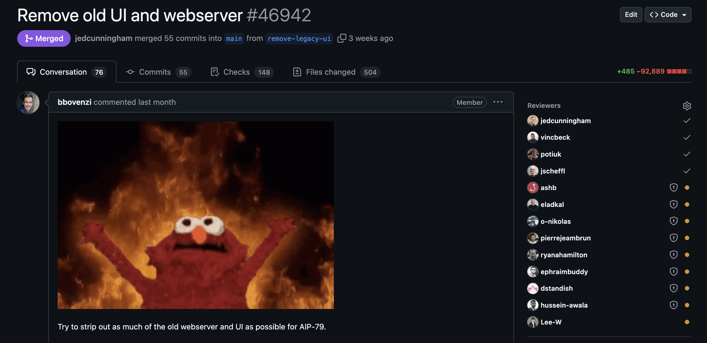  
- 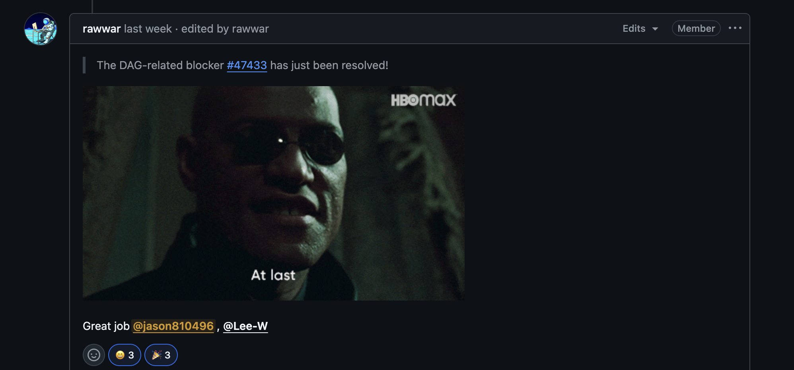  

Overall, I’d say **Apache Airflow is an incredibly beginner-friendly open-source project!**  

## Special Thanks  

A huge shoutout to:  

- [Lee-W](https://github.com/Lee-W),  
  for patiently reviewing PRs, adding labels, and re-triggering CI runs.  
  Also, for sharing new issues in the [OpenSource4You](https://github.com/opensource4you) Slack channel.  

- [Jarek](https://github.com/potiuk),  
  for always providing insightful feedback that improves PRs.  
  Often the first to respond online (seemingly 24/7!),  
  and for inviting me as a **committer**—thank you!  

- [Pierre Jeambrun](https://github.com/pierrejeambrun),  
  for reviewing **countless** API-related PRs (probably over 40!)  
  and helping debug strange test failures.  

- [Chia-Ping Tsai](https://tw.linkedin.com/in/chia7712),  
  founder of [@opensource4you](https://github.com/opensource4you).  
  Without this community, I wouldn’t have imagined being able to contribute to a **global open-source project** from Taiwan.  
  It gave me the courage to jump in and start contributing!  

I truly understand now what [@Lee-W](https://github.com/Lee-W) meant by: **"A developer who gets code reviews is living the dream."**  

>   
> **"A developer who gets code reviews is living the dream."**  

Without the support of these amazing people,  
my open-source journey **wouldn’t have been this smooth**!  

## Related Resources  

### Apache Airflow

- [GitHub](https://github.com/apache/airflow)
- [Slack](https://apache-airflow.slack.com/)
- [Dev Mail](https://lists.apache.org/list.html?dev@airflow.apache.org)

### OpenSource4You

- [GitHub](https://github.com/opensource4you)
- [Slack](https://opensource4you.slack.com/)
- [Facebook](https://www.facebook.com/opensource4you/)