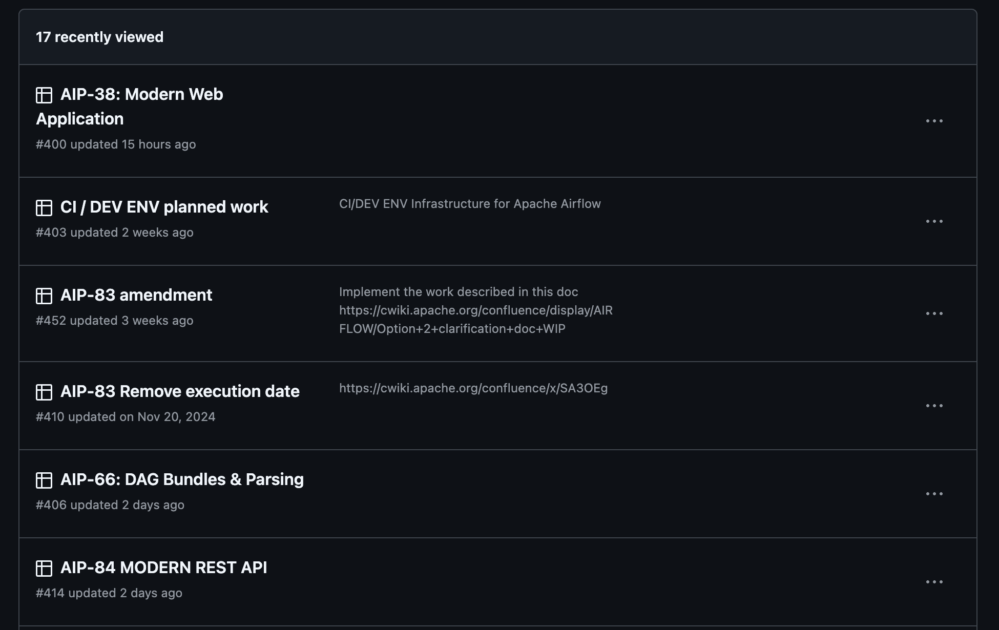
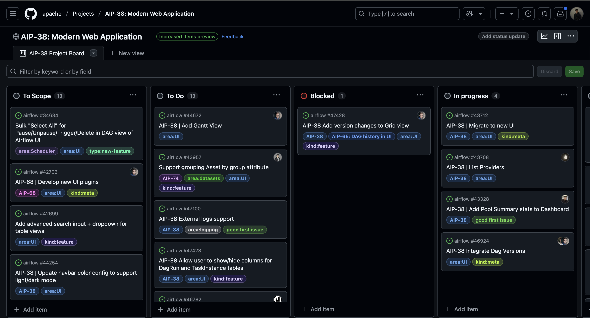

## 背景

我是[劉哲佑 (Jason)](https://github.com/jason810496)，目前大三就讀[成大資工](https://www.csie.ncku.edu.tw/en/)  
專注在貢獻開源，對 Distributed System 和 Data Engineering 領域有興趣  

- **GitHub**: https://github.com/jason810496
- **LinkedIn**: https://www.linkedin.com/in/zhe-you-liu/

在實際貢獻 Apache Airflow 之前  
我其實只有在 Data Engineering 相關的部門實習 3 個月多  
負責的 task 其實連 Airflow 都沒有碰到  
主要都還是負責 General Backend 

### 為什麽選擇 Apache Airflow ?

在決定開始貢獻開源後  
想要從 [Apache Foundation](https://www.apache.org/) 的 Top Level Project 開始  
看到 [Apache Airflow](https://github.com/apache/airflow) 有快 **39.2k** 的 star  
在 Data Team 看也發現 Airflow 確實也是 Data Engineering 領域的重要工具  
剛好自己也對 Python 最為熟悉 

### 參與開源貢獻的收穫

先分享一下到目前為止參與開源貢獻的收穫  
**希望能讓還猶豫要不要開始貢獻開源的人有更多動力！**  

1. **Code Level 和 System Level 的成長**

在 Apache Top Level Project 底下的專案都是**非常大規模**的專案  
這邊絕對能看到更多 Design Pattern, 大型軟體的 System Design 是如何達到 Scalability、Fault Tolerance  
又或是在這麼大規模的專案下，要如何設計 CI 能在盡量少的資源下保證每個 PR 對整個系統的穩定性  

像是在 Airflow，每一個新 Feature 或是 Refactor 都會需要考慮**backward compatibility**  
畢竟每一個對 codebase 的改動都有可能會影響到**全世界**的使用者  
這也是在個人 side project 或是公司內部的專案很難體驗到的

2. **有跟來自世界各地頂尖開發者一起合作的機會**

這也是參與開源貢獻很特別的地方  
就算身處在台灣，只要我們發出 PR 到 GitHub 的這一刻  
就有機會讓來自世界各地的 PMC、 Committer 、超過 10, 20年經驗的 Developer 來 Review  
或是一起合作完成一些 Feature / Refactor  
有跟他們學習的機會

3. **證明自己實力的管道**

貢獻大型開源專案是一個很好的管道來證明自己的實力  
因為每個 PR 都在 GitHub 上可以看到  
可以讓所有人看到自己解決問題的能力、code quality、溝通能力  

目前全世界只有約 9 千位 Apache Committer  
應該算是蠻有價值的證明 
> [Link to ASF Committer List](https://people.apache.org/committer-index.html)

## 貢獻統計

先講一下到目前的貢獻統計  
這是我從 2024 年 10 月初開始貢獻 Apache Airflow 至今 2025 年 3 月 14 日的統計  

> 
> [Link to WakaTime Dashboard](https://wakatime.com/@jason810496)

這半年，實際在 Coding 上花了差不多 300 小時    
當然不包含在 GitHub 上的討論、Review、或是在 Slack 上的討論  

### 總 PR 數: **70+**
> 
> [Link to Total Merged PRs](https://github.com/apache/airflow/pulls?page=1&q=is%3Amerged+is%3Apr+author%3Ajason810496)

### 在 GitHub 的貢獻排名 ( 專案從開始至今 ): **Rank 59**
> 
> [Link to Contribution Graph on GitHub](https://github.com/apache/airflow/graphs/contributors)

### 在 OSS Rank 看到的貢獻排名 ( 有根據近期貢獻加權 ): **Rank 26**
> 
> [Link to OSS Rank of Apache Airflow](https://ossrank.com/p/6-apache-airflow)  
> [Link to OSS Rank of Profile](https://ossrank.com/c/757913-liu-zhe-yu)

### 成為 Committer 

在 2025 年 3 月 14 日  
**被提名成為 Apache Airflow Committer！** 🎉   
> 
> [Announcement of New Committers](https://lists.apache.org/thread/lrjgl630mdhvzmpdt5tvp425kpqkrl8m)

拿到酷酷的 Apache Email ！ 

剛好**jasonliu**這個 Apache ID 還沒被用過，所以就用這個 ID 了 😆 

## 如何開始貢獻 Apache Airflow ?

最早開始是參考 [@kaxil](https://github.com/kaxil) 的 [ContributingJourney](https://airflowsummit.org/slides/2021/y1-ContributingJourney.pdf) 簡報  
接著把 [Airflow Contribution Guide](https://github.com/apache/airflow/tree/main/contributing-docs) 大略看了一遍  
最後把 [Breeze (專門給 Airflow Contributor 用的 CLI / CI Tool)](https://github.com/apache/airflow/blob/main/dev/breeze/doc/README.rst) 跑起來  
就開始逛 [Apache Airflow 的 Issue List](https://github.com/apache/airflow/issues) 還有 [PR List](https://github.com/apache/airflow/pulls)  

## 第一個 PR

從去年 2024 年 10 月初開始正式開始貢獻 Apache Airflow  
當是是看到 [Fix PythonOperator DAG error when DAG has hyphen in name](https://github.com/apache/airflow/issues/42796)

有被標記為 `good first issue`  
就嘗試 trace 一下看看，發現應該只需要改一行程式碼  
就決定試看看  

### 源來適你 

[**源來適你**](https://github.com/opensource4you/readme)是一個在台灣**實際貢獻開源**的非營利組織  
裡面有許多 Mentor 帶你實際貢獻開源專案，包括 [Apache Airflow](https://github.com/apache/airflow), [Apache Kafka](https://github.com/apache/kafka), [Apache YuniKorn](https://github.com/apache/yunikorn-core) 等等  
這邊都是以**中文溝通**，如果有問題可以更自在的用中文提問  
- [「源來適你」目前有 Mentor 帶的專案列表](https://github.com/opensource4you/readme?tab=readme-ov-file#%E7%9B%AE%E5%89%8D%E6%9C%89-mentor-%E5%B8%B6%E7%9A%84%E5%B0%88%E6%A1%88)
- 關於**源來適你**更深入的介紹 [Kafka Community Spotlight: TAIWAN 🇹🇼](https://bigdata.2minutestreaming.com/p/kafka-community-spotlight-taiwan) by [Stanislav’s Big Data Stream](https://bigdata.2minutestreaming.com/) 

因為第一個 Issue 剛好跟 DAG 有關  
按照 Doc 去在 [Breeze Container](https://github.com/apache/airflow/blob/main/dev/breeze/doc/README.rst) 去 reproduce 時步驟有點問題  
向 Committer [李唯](https://github.com/Lee-W) 大大請教  

從此之後應該算是[李唯](https://github.com/Lee-W)的 Mentee **xD** (?)  
之後有遇到問題或是 PR 需要 Review 、 加 Label 都會請他幫忙 ！ 
> [貢獻 Airflow 101: 姑且算是個 mentor(?)...吧？](https://blog.wei-lee.me/posts/tech/2024/11/airflow-contribution-101/) by [李唯](https://github.com/Lee-W)

### 第一個 PR Merged

發出[第一個 Apache Airflow 的 PR: Fix PythonOperator DAG error when DAG has hyphen in name #42902](https://github.com/apache/airflow/pull/42902)  
剛好讓原本不認得的隔壁部門同事 [@josix](https://github.com/josix) 幫忙 review 到 **xD**  

雖然主要改的只有一行程式碼  
但中間其實有超過 20 個 comment 來回迭代修正  
也讓我知道開源其實**沒有修改一行 code**這麼簡單  

尤其是在 Unit Test 的部分  
之前主要都寫 Integration Test 比較沒有寫到 Mock 的經驗  

## 如何找 Issue 解？

### Getting Started: Good First Issue, Meta Issue

最早當然都是從 [good first issue](https://github.com/apache/airflow/labels/good%20first%20issue) 開始解  
> `good first issue`: 適合剛開始貢獻的 Issue

或是 [meta issue](https://github.com/apache/airflow/issues?q=is%3Aopen%20label%3Akind%3Ameta%20)
> `meta issue`: 有多個 sub-task 的 Issue 通常都是需要刪除或搬運很多類似的 modules  
> 這種 Issue 通常需要很多人一起幫忙，因為有時候會有 20-30 個 modules 需要 refactor

這些大部分都算是新手友善的 Issue  
尤其是 [meta issue](https://github.com/apache/airflow/issues?q=is%3Aopen%20label%3Akind%3Ameta%20)，在解完其中一個 task 之後  
剩下的 task 都會是差不多的形式可以解完  
如果單純以「累積 Issue 數量」來說是最簡單的方式，應該也算容易被社群看到  
是剛開始貢獻蠻好提升存在感的方法  

### 逛 Issue List

以我來說，像是 [Resolve OOM when reading large logs in webserver #45079](https://github.com/apache/airflow/issues/45079) 這個 Issue 就是看到  
[Add ability to generate temporary downloadable link for task logs(stored on cloud storage) on UI #44753](https://github.com/apache/airflow/issues/44753) 底下 [Jens](https://github.com/jscheffl) 和 [Jarek](https://github.com/potiuk) 在底下提到 Webserver OOM 的問題  

[Comment by Jens](https://github.com/apache/airflow/issues/44753#issuecomment-2525071649)
> I have also espcially seen that the webserver gets OOM even if you download because the FileTaskHandler tries to sort+merge different log sources. One important thing is not only the download but also the FileTaskHandler must 1:1 stream the logs from the backend, else it will go OOM as well.
> ...

[Comment by Jarek](https://github.com/apache/airflow/issues/44753#issuecomment-2525193224)
> Mostly agree with @jscheffl -> but I still think merging logs might be useful in some cases, though the "naive" version it is done now should be either limited to certain log size that should be able to fit in memory or fixed to support arbitrary log size. Loading whole log to memory is generally bad idea (but OK if we can confirm they will fit in memory).
> ...

就覺得這邊是一個蠻值得貢獻的題目  
因為就算多加「從 Cloud Storage下載」的 Feature，實際 Webserver OOM 的 Root Cause 還是沒有解決  
應該要解決 Sort + Merge 中 OOM 的問題  

### 逛 Open PR List

在 [Open PR List](https://github.com/apache/airflow/pulls) 看別人 PR 時  
有時候也會想到類似的 content 可以 Refactor  
如果對那附近的 context 算熟悉的話，那更好！ 就可以順手幫忙 Review  

### Project Board

這也是 Apache Airflow 很友善地方  
在 [Apache Airflow > Projects](https://github.com/orgs/apache/projects) 可以看到有很多 WIP 的 Project  

點進去後可以看到哪些是 TODO 的，看到有興趣的可以去 Issue 留言說要幫忙解看看  

像是 [Fix k8s flaky test - test_integration_run_dag_with_scheduler_failure #46502](https://github.com/apache/airflow/pull/46502) 就是從 [CI / DEV ENV planned work](https://github.com/orgs/apache/projects/403/views/2) 找的  
也陸續解了很多 kubernetes 相關的 flaky test  

### 解決找不到 Issue 做的瓶頸

**前期找 Issue 確實很難**  
感覺 Issue List 都是一堆看不懂的東西  
但隨著解的 Issue 越多，看的懂 context 越多  
就越容易找到新的題目或是可以 refactor/ optimization 的方向  

目前自己存的 Backlog 也有超過 10 個 Issue  
正在做或是等待 Review 的 Issue 也有 5-6 個  

## 如何撰寫 PR ?

一開始都寫比較短  
只有標注 `related: #issue-number` 或是 `closes: #issue-number`  
並簡短的寫一下改了什麼  

過一陣子發現[李唯](https://github.com/Lee-W)都會把 PR 的 context 寫的很清楚  
以[fix(task_sdk): add missing type column to TIRuntimeCheckPayload #46509](https://github.com/apache/airflow/pull/46509)來說  
即使是改一行 field 都把 **Why** 和 **What** 寫的很清楚  

所以後來都會按照 **The Golden Circle** 來寫 PR  

- **Why**: 為什麼需要有這個 PR
- **How**: 怎麼改、改了什麼、Strategy
- **What**: Result, Outcome
> 有時候只會寫 **Why 和 How** 或是 **Why 和 What**  
> **How** 跟 **What** 有時候有點混用，主要看怎麼闡述 PR 的改動  
> 自己是只有比較大的改動才會三點都寫  

主要只是能讓 Reviewer 快速知道 **為什麼要有這個 PR** 還有 **到底改了什麼** 就可以了  

## 如何溝通？

### 清楚說明問題/ 討論的 Context

Airflow 都是使用 GitHub Issue 來討論  
( 除非是比較緊急或是需要密集討論的會用 Slack )  
所以在問問題或討論時都需要盡量把所有 context 都寫清楚  

因為 maintainer 不一定在同一個時區  
代表**每一次來回溝通可能都會過好幾小時**  
能越清楚說明自己遇到的問題  
就越有機會減少來回溝通的次數  

### 提前與 Stakeholder 溝通

在解 PR 前可以先跟 stakeholder 討論一下  
e.g. 在 GitHub Issue 和 Slack 簡單講一下自己的做法並 **CC stakeholder**  
( 例如：要解的這個 Issue 可能會需要**小改另一個 component**，就可以在目前這個 Issue comment 去 tag 那個 component 目前主要的 maintainer )  

也可以避免在 PR 有很多 comment 來回迭代，或是需要整個大改  
同時也可以讓其他 stakeholder 有機會看到自己的 PR 來幫忙 Review 或是提供意見  

以 [AIP-84 Refactor Handling of Insert Duplicates #44322](https://github.com/apache/airflow/pull/44322) 來說：中間花了蠻多時間實作了一些不必要的功能，最後 review 完還是要**全部砍掉**  

## 管理 Tasks 的方式

### 前期：使用 HackMD
前期使用 [HackMD](https://hackmd.io/) 以 Markdown 來簡單紀錄最近看到可以研究的 Issue   
還有順便記一些小筆記  
> 
> 使用 HackMD 紀錄的 Issue List

### 目前：使用 GitHub Projects 的 Kanban
目前都直接使用 **GitHub Projects 的 Kanban** 來管理  
> 可以直接從自己 Forked 的 Repo 去開自己的 Kanban  

因為同時可能有 2-3 個 Issue 正在解  
有些是在等 Code Review 的階段  
有些可能是還在等 Reviewer 的回覆的 Issue  
所以有個 Jira-like 的 Kanban 來管理是蠻方便的  
也不會漏掉自己正在解的 Issue  

在逛 Issue List 看到有機會做的 Issue 或是突然想到的 Issue 可以放在 Backlog  
也不怕過一下又忘記了  

> 
> 使用 GitHub Projects 管理的 PR List

## 非常有印象的 PR

### [AIP-84 Authentications and Permissions #42360](https://github.com/apache/airflow/issues/42360)

這是最近在幫 migrated 完的 api-server 加 Authentication/ Authorization 的 Meta Issue  
其實在[剛開始貢獻的時候就有留言說可以做看看嗎？](https://github.com/apache/airflow/issues/42360#issuecomment-2428225924)  
不過[Pierre Jeambrun](https://github.com/pierrejeambrun)大大說[這不是 `Good First Issue`  要不要換一個做做看呢](https://github.com/apache/airflow/issues/42360#issuecomment-2428552187)  

就在前幾週[Pierre Jeambrun](https://github.com/pierrejeambrun)[主動 tag 我說要來解嗎？](https://github.com/apache/airflow/issues/42360#issuecomment-2678563686)  
也覺得蠻感動的，好像自己不是小白，有被 PMC 認可  
可以勝任這個 Issue 了  

### [[Resolve OOM When Reading Large Logs in Webserver] Refactor to Use K-Way Merge for Log Streams Instead of Sorting Entire Log Records #45129](https://github.com/apache/airflow/pull/45129)

其實去年 12 月就開始在解這個 Issue   
在 [Issue 中做了算蠻完整的 benchmark, PoC](https://github.com/apache/airflow/issues/45079)發現可以**降低 90% 的 memory usage**
也是第一個被 PMC 稱讚的 PR (?)  

當時想說如果被 merge 的話也會有 10 個 providers 的實作可以非同步的 refactor  
等於多出 10 個 PR 可以做 xD 

對我來說是第一個跟 core feature 很直接相關的 refactor  
沒想到竟然先被提名成 committer 結果這個 PR 都還沒被 merged  

> 雖然到現在還沒有 merge  
> 但在 [Airflow 2.10.6 或 2.11.0 前應該會 merge 這個 refactor !](https://github.com/apache/airflow/pull/45914#issuecomment-2678254334)  
> 要進入 Airflow 3.0 的 main 話，我自己還需要花時間解一下 conflict 🚧  

### [Fix FileTaskHandler only read from default executor #45631](https://github.com/apache/airflow/pull/45631)

在解這個跟 Issue 時，實際的改動其實很快就寫完了  
但是在單跑跟我修改有關的 test 都沒有問題，**只有在跑 full test cases 時才會有問題**  
就算重跑很多次還是會 fail  

[Jarek](https://github.com/potiuk)說[可能需要**二分搜**來找到造成 side effect 的 test case](https://github.com/apache/airflow/pull/45631#issuecomment-2598517505)
> Likely this is a side effect of some other test that does not clean-up after itself - you can repeat what CI is doing - i.e. run the Core test type:
> ...
> In many cases you can guess - you know which tests you added so likely it is somehow related to your changes (but it might be that your tests simply ucovered it). What I often do in such cases is trying to bisect it - instead of runnin the whole test_type ("Core") - I just enter breeze and try to run the same sequence of tests - simply individually rin the test packages/modulles that you see printed in the output 

最後真的是透過**二分搜**[找到造成 side effect 的 test](https://github.com/apache/airflow/pull/45631#issuecomment-2598674742) !  
從來沒有想過會有這種問題！ 
~沒想到要貢獻開源也要會一些通靈術啊~  

### [Fix K8s Flaky Test - JWT Secret Might Be Different #47765](https://github.com/apache/airflow/pull/47765)  

這是被提名成 committer 的前一個 PR  
是下午在上體育課前發現 [Ash](https://github.com/ashb) 在 Slack 的 `#internal-ci-cd` tag 我  
然後說最近我修的 kubernetes test 很 Flaky  
> 簡單來說：我前陣子修 kubernetes test 蠻不穩定的，CI fail 的機率很高的  

所以在出們前快速提了大致解法，在 20 分鐘內極限 speed run 發了 PR  
結果運氣很好，剛好一次 commit 就修好了！  

好笑的地方是[Jarek](https://github.com/potiuk)在底下留言説「要邊吃爆米花🍿邊看 CI 跑的如何」  

是到目前**最驚險又驚喜**的 PR ！  

## Committer 只是開始

### 對於 Airflow 的了解
成為 Committer != 能夠 100% 掌握整個專案  
我自已認為目前對 Airflow 的了解只有 15%  
( 目前能說自己比較熟悉的是 api-server, Task Log, Auth Manager, Executor, Kubernetes Test )  

更多 Airflow 核心 Feature 還是需要花時間去了解  
例如：Scheduler, Trigger, Pool, TaskSDK ( Airflow 3.0 新 Feature ) 的實作對我來說都還是很陌生  

### Review PR

之前比較都著重在解 Issue  
幫忙 Review PR 的比例還是比較少  

接下來會多 Review 別人的 PR  
也會嘗試 Review 一些比較不熟悉的部分，順便去看附近的 context  

## 推坑：「一起貢獻 Apache Airflow 吧！」

如果你對**Python, Data Engineering** 有興趣，也想開始貢獻世界級的開源專案  
但是怕專案很難 Build 起來，或是需要很高規格的電腦才能開始  

**歡迎試試看貢獻 Apache Airflow !**  

Apache Airflow 是一個**有非常好開發者體驗**的開源專案  
從來沒有想過會有一個開源專案有為了 contributor/ CI 需求，特別寫一個專門的 CLI！ 
跑 unit test, integration test, kubernetes test, 跑起不同 executor 的 Airflow 系統都可以輕鬆搞定 
> 
> [`Breeze` CLI](https://github.com/apache/airflow/blob/main/dev/breeze/doc/03_developer_tasks.rst)

並且**有非常完整的 CI**  
有超過 100 個 [pre-commit hooks](https://pre-commit.com/) (git hooks) 包括基本的 linting, type checking, 或是生成 documentation , ERD, Frontend API Service 等，來確保基本 PR 的品質  
[GitHub Actions](https://github.com/apache/airflow/actions)上的 CI 更不用說  
> 
> 在 `git commit` 時會自動跑的 pre-commit hooks  
> 就連 [Available pre-commit checks](https://github.com/apache/airflow/blob/db4689f3c720056fba1c6bbe81decd2e4b1267be/contributing-docs/08_static_code_checks.rst#available-pre-commit-checks) 的文件也是由其中一個 pre-commit 更新的 !

在 [GitHub 的 Label](https://github.com/apache/airflow/labels) 也都有很清楚的定義  
到目前有超過 250 個 Label，可以很方便的細分不同 Issue 的 Scope  

還有各種歡樂梗圖**xD**  
- 
- 

我會說**Apache Airflow**是一個**非常新手友善**的開源專案！  

## 特別感謝

- [李唯](https://github.com/Lee-W)不厭其煩的幫忙 Review PR、加 Label、重戳 CI  
有開 Issue 時也會特別分享到[源來適你](https://github.com/opensource4you)的 Slack 頻道  

- [Jarek](https://github.com/jarek)每次都提供很多 feedback 來幫助 PR 更完整，有很常都在線上第一時間回應 ( 感覺快要 24 小時都在線上 )，也非常感謝提名我成為 Committer  

- [Pierre Jeambrun](https://github.com/pierrejeambrun)幫忙 Review 超級多跟 API 相關的 PR ( 應該有超過 40 個 PR )，也很常幫忙 debug 奇怪 test fail 的問題  

- [蔡嘉平](https://tw.linkedin.com/in/chia7712)大大創辦的[源來適你: @opensource4you](https://github.com/opensource4you)  
如果沒有[源來適你](https://github.com/opensource4you)我也不敢想像身處在台灣也能做世界級的開源貢獻  
也不會有勇氣跳坑貢獻開源

綜合以上我真的深刻的體會到[@Lee-W](https://github.com/Lee-W)說的：「有人 code review 的孩子像個寶」  
> 
> 「有人 code review 的孩子像個寶」

如果不是這些大大們的幫忙  
在貢獻開源的道路肯定是沒有這麼順利的！  

## 相關資源

### Apache Airflow

- [GitHub](https://github.com/apache/airflow)
- [Slack](https://apache-airflow.slack.com/)
- [Dev Mail](https://lists.apache.org/list.html?dev@airflow.apache.org)

### 源來適你

- [GitHub](https://github.com/opensource4you)
- [Slack](https://opensource4you.slack.com/)
- [Facebook](https://www.facebook.com/opensource4you/)