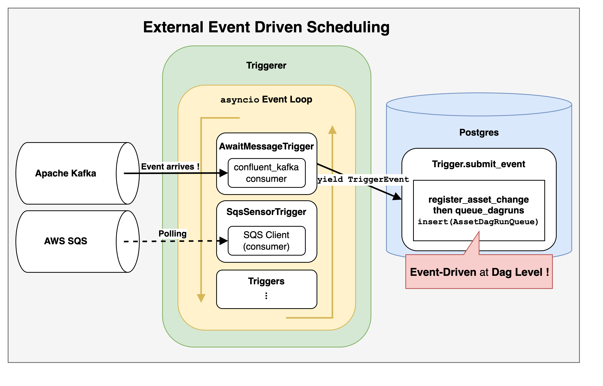



[**OpenSource4You**](https://www.facebook.com/opensource4you) is a community actively contributing to large-scale open source software projects in Taiwan.  
I will be hosting the **Airflow Mandarin Meeting** at the following time and location:

**Time**: Every other **Wednesday at 8:30 PM** starting **July 2nd** (Taiwan time UTC+8)  
**Location**: [https://opensource4you.tw/airflow/meeting](https://opensource4you.tw/airflow/meeting)  
**Calendar**: [https://opensource4you.tw/readme/calendar](https://opensource4you.tw/readme/calendar)  

If you're interested in Airflow's latest technical developments or contributing to Airflow itself.  
Welcome to join our Airflow meetings!



## What is Event-Driven Architecture?

**Event-Driven Architecture** can be simply defined as a system that "takes corresponding actions only when specific events occur."
It is particularly suitable for scenarios requiring **more immediate** responses.


The common understanding of Airflow's scheduling capabilities is based on [Cron & Time Intervals](https://airflow.apache.org/docs/apache-airflow/stable/authoring-and-scheduling/cron.html#cron-time-intervals), such as triggering a DAG periodically every X hours, daily, or monthly to complete a workflow.

**However, Airflow can also be triggered by events!**

Today, we're going to explore a new feature in Airflow 3: **External Event-Driven Scheduling**.
This is part of the [AIP-82 External event driven scheduling in Airflow](https://cwiki.apache.org/confluence/display/AIRFLOW/AIP-82+External+event+driven+scheduling+in+Airflow) proposal, and it is also highly related to the [Common Message Queue](https://airflow.apache.org/docs/apache-airflow/stable/core-concepts/message-queues.html).  
In this article, we will delve into the implementation details and application scenarios of these features.

## How to Write an Event-Driven DAG Before AIP-82

Before AIP-82, writing event-driven DAGs was possible, but it required a combination of **Continuous Scheduling, `max_active_runs=1`, and a Sensor**.

This approach involves **continuously scheduling a DAG** and using a Sensor in the first task to wait for an external event.

Here is an example of how to listen to specific Apache Kafka topics to trigger a DAG before AIP-82:
```python
# copy from https://www.astronomer.io/docs/learn/airflow-kafka
@dag(
    start_date=datetime(2023, 4, 1),
    schedule="@continuous",
    max_active_runs=1,
    catchup=False,
    render_template_as_native_obj=True,
)
def listen_to_the_stream():
    listen_for_mood = AwaitMessageTriggerFunctionSensor(
        task_id="listen_for_mood",
        kafka_config_id="kafka_listener",
        topics=[KAFKA_TOPIC],
        # the apply function will be used from within the triggerer, this is
        # why it needs to be a dot notation string
        apply_function="listen_to_the_stream.listen_function",
        poll_interval=5,
        poll_timeout=1,
        apply_function_kwargs={"pet_moods_needing_a_walk": PET_MOODS_NEEDING_A_WALK},
        event_triggered_function=event_triggered_function,
    )
```

- When the use case involves **only sporadic events**, the execution proceeds as follows:
  - Only one DagRun executes at any given time.
  - The first task of the DagRun is a Sensor that continuously polls for an external event.
    - When the external event occurs, the workflow proceeds to the next task.
  - This approach works well for sporadic events.
- However, when the use case involves a **continuous stream of many events**, the execution changes:
  - Still, only one DagRun can execute at a time.
  - Even if subsequent events arrive, the system **must wait for all tasks of the previous DagRun to complete** before starting the next one.
  - This means that an application that should provide **real-time processing** degrades into a **batch-processing** model!

Another point to consider is that if the Operator or Sensor waiting for the external event does not implement [Deferrable Operators](https://airflow.apache.org/docs/apache-airflow/stable/authoring-and-scheduling/deferring.html), it will **occupy an extra worker slot**.

## [AIP-82 External event driven scheduling in Airflow](https://cwiki.apache.org/confluence/display/AIRFLOW/AIP-82+External+event+driven+scheduling+in+Airflow)

Simply put, this is achieved by combining Assets and Triggers to create a **DAG-level event-driven architecture**.
> Since it uses Triggers, the event-driven mechanism here is **poll-based**, not **push-based**.



This approach offers the following benefits:
- **Reduces the overhead of scheduling an extra DagRun just to start polling.**
  - It directly creates a Trigger, bypassing the DagRun.
    - This eliminates the scheduling overhead for the "polling" phase, making it **more responsive**.
  - A `DagRun` is scheduled only when the conditions are met and the `AssetEvent` is updated.
- **For the end-user, it eliminates the need to define a Sensor task in the DAG.**

## AIP-82 Implementation Details

Next, we will detail the implementation specifics of AIP-82 in the Airflow core.

### [AIP-82 Create references between triggers and assets #43666](https://github.com/apache/airflow/pull/43666)

This PR adds a many-to-many relationship between the `asset` and `trigger` tables ([Many-to-Many Association Table](https://docs.sqlalchemy.org/en/20/orm/basic_relationships.html#setting-bi-directional-many-to-many)).
It only adds Foreign Keys and Indexes, so it doesn't require an [Association Object](https://docs.sqlalchemy.org/en/20/orm/basic_relationships.html#association-object) to define the many-to-many relationship.

### [AIP-82 Save references between assets and triggers #43826](https://github.com/apache/airflow/pull/43826)

There are three main parts to this PR:

1.  **End-users now have a `watchers` parameter when defining an `Asset`**
```python
# copy from https://github.com/apache/airflow/pull/43826 PR description

trigger = SqsSensorTrigger(sqs_queue="my_queue")
asset = Asset("example_asset_watchers", watchers=[trigger]) # new `watchers` parameter

with DAG(
    dag_id="example_dataset_watcher",
    schedule=[asset],
    catchup=False,
):
    task = EmptyOperator(task_id="task",)
    chain(task)
```
2.  **During DAG processing, the newly added `watchers` must also be added to the `asset` model.**
- In [bulk_write_to_db](https://github.com/apache/airflow/blob/c3f9da4846c8bde6b70aff771615d39e010decb0/airflow-core/src/airflow/models/dag.py#L1599-L1600), when an `asset` is recorded,
  - it uses [add_asset_trigger_references](https://github.com/apache/airflow/blob/c3f9da4846c8bde6b70aff771615d39e010decb0/airflow-core/src/airflow/models/dag.py#L1639-L1640) to record the newly defined `watchers`.
    - [add_asset_trigger_references](https://github.com/apache/airflow/blob/c3f9da4846c8bde6b70aff771615d39e010decb0/airflow-core/src/airflow/dag_processing/collection.py#L874-L876) is not just about "adding triggers related to the asset."
      - It's more of a **sync** operation, dividing references into `refs_to_add` and `refs_to_remove` to update the `trigger` associations for that `asset`.
  - The previous PR only defined the many-to-many relationship between `asset` and `trigger`.
    - The type of `watchers` is `list[Trigger]`.
    - This PR handles the actual writing of the `trigger` into the `asset` table.

> While reviewing the PR comments, I also learned that Airflow currently does not delete records from the `asset` table.

3.  **Serialization of `trigger`**

The remaining changes are minor adjustments to some methods, as `repr` is used to record the `trigger` in the `asset`.

> However, the use of `repr` was later replaced with `hash` because a string representation is not suitable as a unique identifier for an object.
> A `trigger` is composed of a `classpath` and `kwargs`.
> Ultimately, it is generated by `hash((classpath, json.dumps(BaseSerialization.serialize(kwargs)).encode("utf-8")))`.
>
> [AIP-82 Use hash instead of repr #44797](https://github.com/apache/airflow/pull/44797/files)

### [AIP-82 Handle trigger serialization #45562](https://github.com/apache/airflow/pull/45562/files)

This PR mainly deals with integration and unit testing for the [AIP-72 Task SDK](https://cwiki.apache.org/confluence/display/AIRFLOW/Test+cases+AIP-72+Task+Execution+Interface+aka+Task+SDK).
For AIP-82 itself, it introduces `AssetWatcher` to make the semantics of `watchers` clearer.

```python
# copy from https://github.com/apache/airflow/pull/45562 PR description
trigger = FileTrigger(....)
asset = Asset("<my_queue>", watchers=[AssetWatcher(name="my_file_watcher", trigger=trigger)])

with DAG(
    dag_id=DAG_ID,
    schedule=asset,
):
    empty_task = EmptyOperator(task_id="empty_task")

    chain(empty_task)
```

`AssetWatcher` inherits from `BaseTrigger` but adds a `name` field.

### [AIP-82 Introduce BaseEventTrigger as base class for triggers used with event driven scheduling #46391](https://github.com/apache/airflow/pull/46391)

In the [[LAZY CONSENSUS] AIP-82 - Create new interface BaseEventTrigger](https://lists.apache.org/thread/lpvq3lhjd79q097f1wy3r3n1jybo2v09) discussion thread,
[@Vicent Beck](https://github.com/vincbeck) clearly explains why an additional `BaseEventTrigger` interface is needed to work with `AssetWatcher` and restrict which triggers are suitable for Event-Driven Scheduling.

- **The example in the discussion thread is as follows:**
  - If a DAG uses an `S3KeyTrigger` as a `watcher`,
  - as long as the file `<my-file>` exists in the `<my-bucket>` bucket,
    ```python
    trigger = S3KeyTrigger(bucket_name="<my-bucket>", bucket_key="<my-file>")
    asset = Asset("s3_asset", watchers=[
      AssetWatcher(name="s3_asset_watcher", trigger=trigger)
    ])

    with DAG(
      dag_id="example_dag",
      schedule=[asset],
      catchup=False,
    ):
      ...
    ```
  - this DAG will be **triggered continuously**!
- This is not a bug but the expected behavior of the trigger.
  - However, without special restrictions on which triggers are suitable for Event-Driven Scheduling, users could inadvertently write DAGs that are triggered indefinitely, as shown above.

So, after this PR introduced the `BaseEventTrigger` interface, `AssetWatcher` will only accept subclasses that inherit from `BaseEventTrigger` to prevent infinite triggering situations.

## Common Message Queue Trigger

AIP-82 mentions the following event-driven scenarios:
> Ideally, there should be an end-to-end solution in Airflow to trigger DAGs based on external events such as:
>
> - A message has been pushed to a message queue such as Google Pub/Sub, Amazon SQS, Azure Message Bus, Apache Kafka, ...
> - A file has been created in a storage service
> - A database has been updated

Among these, it mentions triggering DAGs via a Message Queue.
So, [Vikram Koka](https://github.com/vikramkoka) proposed [[DISCUSS]: Proposing a "common message queue" abstraction](https://lists.apache.org/thread/0r3krl7swl2bzztvn4wo77mm9by8nghh).
The goal is to have a **simpler, unified interface** for users to write Event-Driven Scheduling DAGs.

Regardless of which Message Queue the user uses, they can use the same `MessageQueueTrigger(queue=...)` class and provide different `queue` URIs.

```python
# copy from https://github.com/apache/airflow/pull/46694/files

from __future__ import annotations

from airflow.models.dag import DAG
from airflow.providers.common.messaging.triggers.msg_queue import MessageQueueTrigger
from airflow.providers.standard.operators.empty import EmptyOperator
from airflow.sdk.definitions.asset import Asset, AssetWatcher

trigger = MessageQueueTrigger(queue="https://sqs.us-east-1.amazonaws.com/0123456789/my-queue")
asset = Asset("sqs_asset", watchers=[AssetWatcher(name="sqs_asset_watcher", trigger=trigger)])

with DAG(
    dag_id="example_msgq_watcher",
    schedule=[asset],
    catchup=False,
):
    EmptyOperator(task_id="task")
```

> As explained in the section on AIP-82 Introduce BaseEventTrigger as base class for triggers used with event driven scheduling #46391, `MessageQueueTrigger` will also inherit from `BaseEventTrigger` to restrict its use to Event-Driven Scheduling scenarios.

Currently, the providers that have implemented the Common Message Queue Trigger are:
- [apache-airflow-providers-amazon](https://airflow.apache.org/docs/apache-airflow-providers-amazon/stable/message-queues/index.html)
- [apache-airflow-providers-apache-kafka](https://airflow.apache.org/docs/apache-airflow-providers-apache-kafka/stable/message-queues/index.html)

## Conclusion: Advantages and Limitations

[AIP-82 External event driven scheduling in Airflow](https://cwiki.apache.org/confluence/display/AIRFLOW/AIP-82+External+event+driven+scheduling+in+Airflow) and the [Common Message Queue](https://airflow.apache.org/docs/apache-airflow/stable/core-concepts/message-queues.html) allow Airflow to:
1.  **Reduce unnecessary scheduling overhead**
2.  **Trigger DagRuns more promptly**
3.  **Simplify the writing of Event-Driven DAGs**

The current implementation still has some limitations:
1.  Only two `CommonMessageQueueTrigger` providers have been implemented because no one else has contributed them.
  - These are the aforementioned Amazon SQS and Apache Kafka implementations.
  - This limits user choice and flexibility when using Event-Driven scheduling.
2.  Database I/O bottleneck
  - DagRuns, TaskInstances, Assets, and Triggers all need to continuously update their status in the database.
  - Therefore, the database I/O bottleneck must be considered for the use case, and a reasonable polling interval must be set.

But the good news is:
Anyone can be that **"no one"**!  
It is precisely because "**no one has implemented it**" that everyone has the opportunity to contribute!

Adding a provider's Trigger is not overly difficult, but it can have a significant impact on users.
If you are interested, you can refer to [AIP-82: Add KafkaMessageQueueProvider](https://github.com/apache/airflow/pull/49938).

> [Let's be **"no one"** together!](https://www.linkedin.com/posts/zhe-you-liu_apache-airflow-kafka-activity-7343801706024943616-Xvlj?utm_source=share&utm_medium=member_desktop&rcm=ACoAADypogYB37Bb3cfyiwt5RnsZYRtLPFnOo-k)
> 

## References

- Apache Airflow
  - [authoring-and-scheduling/deferring: Deferrable, Trigger](https://airflow.apache.org/docs/apache-airflow/stable/authoring-and-scheduling/deferring.html)
- Airflow Improvement Proposal
  - [AIP-82 External event driven scheduling in Airflow](https://cwiki.apache.org/confluence/display/AIRFLOW/AIP-82+External+event+driven+scheduling+in+Airflow)
- PRs related to AIP-82
  - https://github.com/apache/airflow/pulls?q=%22AIP-82%22
  - https://github.com/apache/airflow/pull/43666/files
  - https://github.com/apache/airflow/pull/43826/files
  - https://github.com/apache/airflow/pull/45562/files
  - https://github.com/apache/airflow/pull/46912/files
  - https://github.com/apache/airflow/pull/44369/files
  - https://github.com/apache/airflow/pull/44664/files
- [AIP-82: Add KafkaMessageQueueProvider](https://github.com/apache/airflow/pull/49938)
- SQLAlchemy
  - [Many to Many Association Table](https://docs.sqlalchemy.org/en/20/orm/basic_relationships.html#setting-bi-directional-many-to-many)
  - [Association Object](https://docs.sqlalchemy.org/en/20/orm/basic_relationships.html#association-object)