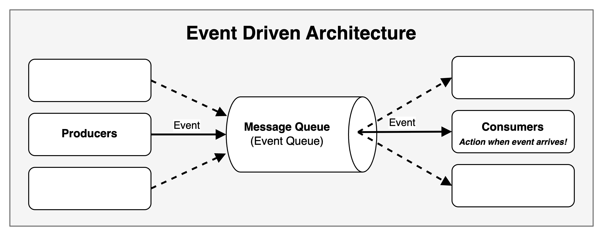
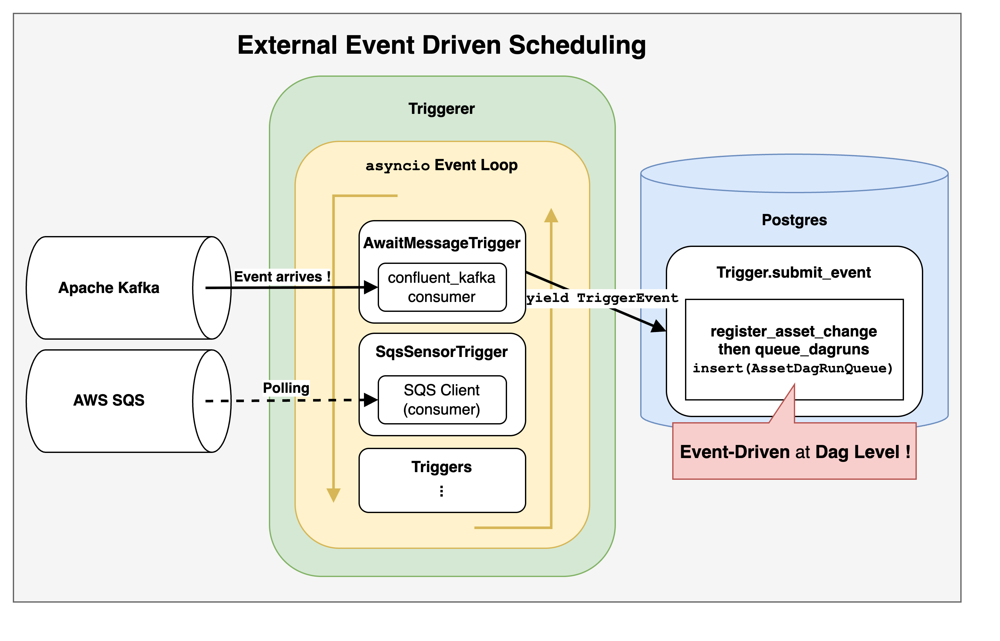
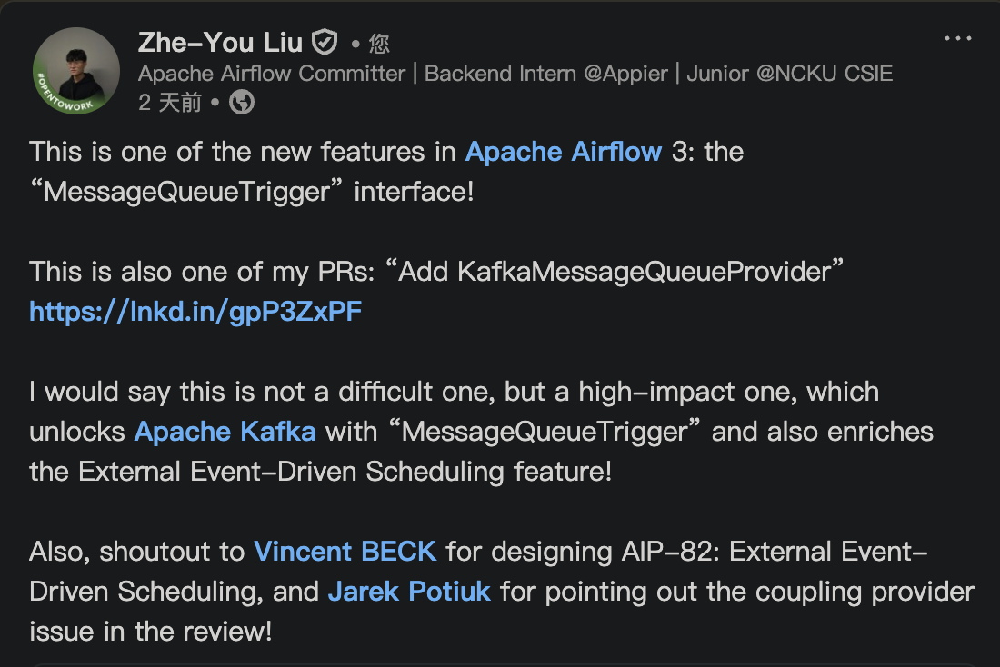



[**源來適你**](https://www.facebook.com/opensource4you) 是在台灣積極貢獻大型開源軟體的社群  
接下來我會在以下時間地點主持 **Airflow 中文會議**

**時間**： **7 月 2 日**起**隔週三晚上 20:30** (台灣時區 UTC+8)    
**地點**： [https://opensource4you.tw/airflow/meeting](https://opensource4you.tw/airflow/meeting)  
**行事曆**： [https://opensource4you.tw/readme/calendar](https://opensource4you.tw/readme/calendar)  


如果你也對 Airflow 的技術新知或對貢獻 Airflow 本身感興趣  
歡迎來 Airflow 會議共襄盛舉！




## 什麼是事件驅動 (Event Driven)

**事件驅動 (Event Driven)** 可以簡單地想成「當特定事件發生時，才要做相對應的行動」    
適用於**需要比較即時**的情境


一般來說大家對於 Airflow 適用的場境都是 [Cron & Time Intervals](https://airflow.apache.org/docs/apache-airflow/stable/authoring-and-scheduling/cron.html#cron-time-intervals) 的  
如：每 X 小時、每天、每個月才定期觸發 Dag 來完成 workflow

**不過 Airflow 也可以做到 Event Driven 來觸發的！**

而今天我們就要看看 Airflow 3 提到的一個新功能：**External Event Driven Scheduling**  
也就是 [AIP-82 External event driven scheduling in Airflow](https://cwiki.apache.org/confluence/display/AIRFLOW/AIP-82+External+event+driven+scheduling+in+Airflow) 提案  
還有與這個功能高度相關的 [Common Message Queue](https://airflow.apache.org/docs/apache-airflow/stable/core-concepts/message-queues.html)  
在這篇文章中，我們將深入探討這些功能的實作細節和應用場景。  

## 在 AIP-82 之前要如何寫 Event Driven 的 Dag

在 AIP-82 之前，當然也可以寫透過 Event Driven 來觸發的 Dag  
但是就需要使用到 **Continuous Scheduling + `max_active_runs=1` + Sensor** 才有辦法達到

也就是**無止境的 schedule 一個 Dag**  
並在該 Dag 的第一個 Task 中使用 Sensor 來等待外部事件

這邊是在 AIP-82 之前要如何聽 Apache Kafka 特定的 topics 來觸發 Dag 的範例：
```python 
# copy from https://www.astronomer.io/docs/learn/airflow-kafka
@dag(
    start_date=datetime(2023, 4, 1),
    schedule="@continuous",
    max_active_runs=1,
    catchup=False,
    render_template_as_native_obj=True,
)
def listen_to_the_stream():
    listen_for_mood = AwaitMessageTriggerFunctionSensor(
        task_id="listen_for_mood",
        kafka_config_id="kafka_listener",
        topics=[KAFKA_TOPIC],
        # the apply function will be used from within the triggerer, this is
        # why it needs to be a dot notation string
        apply_function="listen_to_the_stream.listen_function",
        poll_interval=5,
        poll_timeout=1,
        apply_function_kwargs={"pet_moods_needing_a_walk": PET_MOODS_NEEDING_A_WALK},
        event_triggered_function=event_triggered_function,
    )
```


- 當 Use Case 是**只有零星 Event** 的情況，執行的狀況會是：
  - 同一時間只有一個 DagRun 在執行
  - DagRun 的第一個 Task 會是 Sensor 持續 polling 等待外部事件發生
    - 當外部事件發生時，才繼續往下一個 Task 執行
  - 當只有零星 Event 會發生時，確實沒什麼問題
- 但是當 Use Case 是**持續有很多 Event 發生**時，執行的狀況會是：
  - 同一時間一樣只能有一個 DagRun 在執行
  - 即使有後續的 Event 進來
    - 還是**需要等到前一次 DagRun 的所有 Tasks 執行完**才能開始下一個 DagRun
  - 也就是原本應該要是**即時處理**的應用就退化成**批次處理**的方式了！


還有另外一點是：  
如果在等待外部事件的 Operator 或 Sensor 沒有實作 [Deferrable](https://airflow.apache.org/docs/apache-airflow/stable/authoring-and-scheduling/deferring.html) 的話  
就會**多佔掉一個 worker slot**


## [AIP-82 External event driven scheduling in Airflow](https://cwiki.apache.org/confluence/display/AIRFLOW/AIP-82+External+event+driven+scheduling+in+Airflow)


簡單來說  
是透過將 Asset 與 Trigger 結合來達到
**在 Dag Level 的 Event Driven 架構** 
> 因為是透過 Trigger，所以這邊的 Event Driven 是 **poll-based** 而不是 **push-based** 的



也代表有以下好處：
- **減少需要多 schedule DagRun 才能開始 polling 的 overhead**
  - 因為是直接建立一個 Trigger 跳過 DagRun
    - 也就是跳過 "為了 polling" 階段排程的 overhead，所以**更即時**
  - 當符合條件時，才更新 `AssetEvent` 並 schedule `DagRun`
- **對 End-User 來說可以在 Dag 少定義一個 Sensor 的 Task**


## AIP-82 的實作細節

接下來會詳細說明跟 AIP-82 在 Airflow 核心的實作細節  

### [AIP-82 Create references between triggers and assets #43666](https://github.com/apache/airflow/pull/43666)

多加上對 `asset` 和 `trigger` 這兩個 table 的多對多關聯 ([Many to Many Association Table](https://docs.sqlalchemy.org/en/20/orm/basic_relationships.html#setting-bi-directional-many-to-many)) 
只有加上 Foreign Key 和 Index，所以不用 [Association Object](https://docs.sqlalchemy.org/en/20/orm/basic_relationships.html#association-object) 來定義多對多關聯 

### [AIP-82 Save references between assets and triggers #43826](https://github.com/apache/airflow/pull/43826)

主要有 3 個部分：

1. **End-User 在定義 `Asset` 時多了 `watchers` parameter**
```python
# copy from https://github.com/apache/airflow/pull/43826 PR description

trigger = SqsSensorTrigger(sqs_queue="my_queue")
asset = Asset("example_asset_watchers", watchers=[trigger]) # new `watchers` parameter

with DAG(
    dag_id="example_dataset_watcher",
    schedule=[asset],
    catchup=False,
):
    task = EmptyOperator(task_id="task",)
    chain(task)
```
2. **在 Dag Processing 時，需要把多新增的 `watchers` 也加入到 `asset` model 中**
- 在 [bulk_write_to_db](https://github.com/apache/airflow/blob/c3f9da4846c8bde6b70aff771615d39e010decb0/airflow-core/src/airflow/models/dag.py#L1599-L1600) 中要記錄 `asset` 時
  - 會透過 [add_asset_trigger_references](https://github.com/apache/airflow/blob/c3f9da4846c8bde6b70aff771615d39e010decb0/airflow-core/src/airflow/models/dag.py#L1639-L1640) 記錄剛剛多定義的 `watchers`
    - [add_asset_trigger_references](https://github.com/apache/airflow/blob/c3f9da4846c8bde6b70aff771615d39e010decb0/airflow-core/src/airflow/dag_processing/collection.py#L874-L876) 不單純只有「增加該 asset 有關的 trigger 」
      - 其實比較像 **sync** 的概念： 會分為 `refs_to_add` 和 `refs_to_remove` 去更新該 `asset` 對應到的 `trigger` 關聯
  - 上一個 PR 只定義了 `asset` 和 `trigger` 的多對多關聯
    - 而 `watchers` 的 type 會是 `list[Trigger]`
    - 這個 PR 就是把 `trigger` 實際寫入到 `asset` Table 中

> 在回顧 PR Review 的 comment 時    
> 也多了解到：原來目前 Airflow 目前不會去刪除 `asset` Table 的 record  

3. **對 `trigger` 的 serialization**

剩下的改動就只是因為需要在 `asset` 記錄 `trigger` 會用 `repr` 所以需要微調一些 method

> 不過後來 `repr` 的 usage 被換成 `hash` 因為 stringfy 不適合作為物件的 unique identifier  
> 而 `trigger` 是由 `classpath` 和 `kwargs` 組成  
> 最後是由 `hash((classpath, json.dumps(BaseSerialization.serialize(kwargs)).encode("utf-8")))` 來產生  
>  
> [AIP-82 Use hash instead of repr #44797](https://github.com/apache/airflow/pull/44797/files)

### [AIP-82 Handle trigger serialization #45562](https://github.com/apache/airflow/pull/45562/files)

主要處理與 [AIP-72 TaskSDK](https://cwiki.apache.org/confluence/display/AIRFLOW/Test+cases+AIP-72+Task+Execution+Interface+aka+Task+SDK) 的整合和單元測試
以 AIP-82 本身來說，多加了 `AssetWatcher` 讓 `watchers` 的語意更清楚

```python
# copy from https://github.com/apache/airflow/pull/45562 PR description
trigger = FileTrigger(....)
asset = Asset("<my_queue>", watchers=[AssetWatcher(name="my_file_watcher", trigger=trigger)])
 
with DAG(
    dag_id=DAG_ID,
    schedule=asset,
):
    empty_task = EmptyOperator(task_id="empty_task")
 
    chain(empty_task)
```

`AssetWatcher` 還是繼承自 `BaseTrigger` 不過又多了一個 `name` 的欄位  


### [AIP-82 Introduce BaseEventTrigger as base class for triggers used with event driven scheduling #46391](https://github.com/apache/airflow/pull/46391)

在 [[LAZY CONSENSUS] AIP-82 - Create new interface BaseEventTrigger](https://lists.apache.org/thread/lpvq3lhjd79q097f1wy3r3n1jybo2v09) 討論串中  
[@Vicent Beck](https://github.com/vincbeck) 很清楚的說明為什麼還需要多增加一個 `BaseEventTrigger` 介面與 `AssetWatcher` 搭配來限制哪些是適合 Event Driven Scheduling 的 Trigger  

- **在討論串的例子是**：
  - 如果有一個 Dag 用到 `S3KeyTrigger` trigger 作為 `watchers`
  - 只要在 `<my-bucket>` bucket 中的 `<my-file>` 檔案還存在
    ```python
    trigger = S3KeyTrigger(bucket_name="<my-bucket>", bucket_key="<my-file>")
    asset = Asset("s3_asset", watchers=[
      AssetWatcher(name="s3_asset_watcher", trigger=trigger)
    ])

    with DAG(
      dag_id="example_dag",
      schedule=[asset],
      catchup=False,
    ):
      ...
    ```
  - 這個 Dag 就會**一直被觸發**！
- 這不是 Bug，而是 trigger 預期的行為
  - 但如果沒有特別限制那些 trigger 才適合 Event Driven Scheduling 的話
  - 就有可能會讓 User 寫出如上會無限被觸發的 Dag

所以經過這個 PR 加入 `BaseEventTrigger` interface 後  
`AssetWatcher` 只會接受繼承 `BaseEventTrigger` 的 subclass 來避免無限觸發的情況

## Common Message Queue Trigger

在 AIP-82 中有提到以下 Event Driven 的情境
> Ideally, there should be an end to end solution in Airflow to trigger DAGs based on external event such as:  
> 
> - A message has been pushed in a message queue such as Google Pubsub, Amazon SQS, Azure Message Bus, Apache Kafka, ...  
> - A file has been created in a storage service  
> - A database has been updated  

其中有說到透過 Message Queue 來觸發 Dag  
所以 [Vikram Koka](https://github.com/vikramkoka) 提了 [[DISCUSS]: Proposing a "common message queue" abstraction](https://lists.apache.org/thread/0r3krl7swl2bzztvn4wo77mm9by8nghh) 
應該要有一個**更簡單、統一的介面**讓 User 來寫 Event Driven Scheduling 的 Dag  


無論是 User 用哪一種 Message Queue  
都可以用同一個 `MessageQueueTrigger(queue=...)` class 並給定不同的 `queue` uri 來使用

```python
# copy from https://github.com/apache/airflow/pull/46694/files

from __future__ import annotations

from airflow.models.dag import DAG
from airflow.providers.common.messaging.triggers.msg_queue import MessageQueueTrigger
from airflow.providers.standard.operators.empty import EmptyOperator
from airflow.sdk.definitions.asset import Asset, AssetWatcher

trigger = MessageQueueTrigger(queue="https://sqs.us-east-1.amazonaws.com/0123456789/my-queue")
asset = Asset("sqs_asset", watchers=[AssetWatcher(name="sqs_asset_watcher", trigger=trigger)])

with DAG(
    dag_id="example_msgq_watcher",
    schedule=[asset],
    catchup=False,
):
    EmptyOperator(task_id="task")
```

> 根據剛剛說明的 AIP-82 Introduce BaseEventTrigger as base class for triggers used with event driven scheduling #46391   
>  
> 所以 `MessageQueueTrigger` 也會繼承自 `BaseEventTrigger` 來限制只能用在 Event Driven Scheduling 的情境

目前有實作 Common Message Queue Trigger 的 Providers 有：
- [apache-airflow-providers-amazon](https://airflow.apache.org/docs/apache-airflow-providers-amazon/stable/message-queues/index.html)
- [apache-airflow-providers-apache-kafka](https://airflow.apache.org/docs/apache-airflow-providers-apache-kafka/stable/message-queues/index.html)

## 總結：優點與限制

[AIP-82 External event driven scheduling in Airflow](https://cwiki.apache.org/confluence/display/AIRFLOW/AIP-82+External+event+driven+scheduling+in+Airflow) 與 [Common Message Queue](https://airflow.apache.org/docs/apache-airflow/stable/core-concepts/message-queues.html)  
讓 Airflow 可以  
1. **減少不必要的排程 overhead**
2. **更即時的觸發 DagRun**
3. **更簡單的寫出 Event Driven 的 Dag**
  

目前的實作還是有一些限制：  
1. 因為沒有人實作，所以只有 2 個 `CommonMessageQueueTrigger` 的 Providers
  - 也就是剛剛提到的 Amazon SQS 和 Apache Kafka 有實作
  - 這限制了 User 在使用 Event Driven 的選擇與靈活性
2. Database 的 I/O 瓶頸
  - 無論是 DagRun、TaskInstance、Asset、Trigger 都需要持續更新狀態到 Database 中
  - 所以要對 Use case 考慮 Database 的 I/O 瓶頸並設定合理的 polling interval

不過好消息是：  
大家都可以來當**沒有人**！  
就是因為「**沒有人實作**，所以大家才可以一起來實作！」

加一個 Provider 的 Trigger 不算太難，但可以會對 User 有很大的影響  
有興趣的話可以參考 [AIP-82: Add KafkaMessageQueueProvider](https://github.com/apache/airflow/pull/49938)  

> [一起來當**沒有人**！](https://www.linkedin.com/posts/zhe-you-liu_apache-airflow-kafka-activity-7343801706024943616-Xvlj?utm_source=share&utm_medium=member_desktop&rcm=ACoAADypogYB37Bb3cfyiwt5RnsZYRtLPFnOo-k)
> 


## Reference

- Apache Airflow
  - [authoring-and-scheduling/deferring: Deferrable, Trigger](https://airflow.apache.org/docs/apache-airflow/stable/authoring-and-scheduling/deferring.html)
- Airflow Improvement Proposal
  - [AIP-82 External event driven scheduling in Airflow](https://cwiki.apache.org/confluence/display/AIRFLOW/AIP-82+External+event+driven+scheduling+in+Airflow)
- 跟 AIP-82 有關的 PR
  - https://github.com/apache/airflow/pulls?q=%22AIP-82%22
  - https://github.com/apache/airflow/pull/43666/files
  - https://github.com/apache/airflow/pull/43826/files
  - https://github.com/apache/airflow/pull/45562/files
  - https://github.com/apache/airflow/pull/46912/files
  - https://github.com/apache/airflow/pull/44369/files
  - https://github.com/apache/airflow/pull/44664/files
- [AIP-82: Add KafkaMessageQueueProvider](https://github.com/apache/airflow/pull/49938)
- SQLAlchemy
  - [Many to Many Association Table](https://docs.sqlalchemy.org/en/20/orm/basic_relationships.html#setting-bi-directional-many-to-many)
  - [Association Object](https://docs.sqlalchemy.org/en/20/orm/basic_relationships.html#association-object)