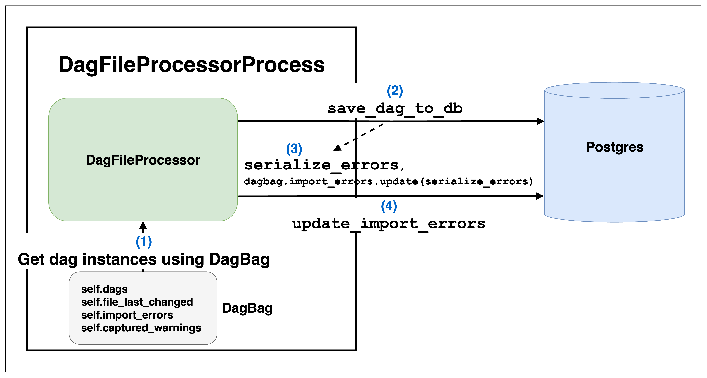
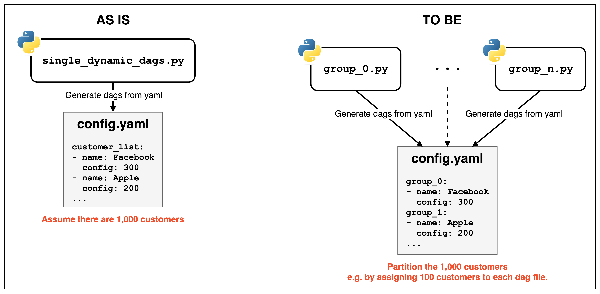




[**OpenSource4You**](https://www.facebook.com/opensource4you) is a community actively contributing to large-scale open source software projects in Taiwan.  
I will be hosting the **Airflow Mandarin Meeting** at the following time and location:

**Time**: Every other **Wednesday at 8:30 PM** starting **July 2nd** (Taiwan time UTC+8)  
**Location**: [https://opensource4you.tw/airflow/meeting](https://opensource4you.tw/airflow/meeting)  
**Calendar**: [https://opensource4you.tw/readme/calendar](https://opensource4you.tw/readme/calendar)  

If you're interested in Airflow's latest technical developments or contributing to Airflow itself.  
Welcome to join our Airflow meetings!





## How Are Python-Written Dag Files Parsed by Airflow?

This article provides an in-depth exploration of Airflow **2**'s Dag Processing mechanism.  
Airflow **3** involves core details of [AIP-72 TaskSDK](https://cwiki.apache.org/confluence/display/AIRFLOW/Test+cases+AIP-72+Task+Execution+Interface+aka+Task+SDK).  
So we'll focus on Airflow **2**'s Dag Processing mechanism for simplicity!

Whether it's Airflow 2 or 3, both involve the following core concepts:
- `DagFileProcessorManager`  
- `DagFileProcessorProcess`  
- `DagBag`  

Next, we'll explain these concepts from an overall perspective,  
then dive deeper into the details of each core concept,  
and finally summarize the Airflow Dag Processing workflow and best practices.

## Overview of Dag Processing Mechanism

> 
> The above diagram shows the high-level architecture of Airflow 2's Dag Processing mechanism

Here's an introduction to each component:
- **DagProcessor**:
  - This is the component name from the perspective of **the entire Airflow system**
- **DagFileProcessorManager**:
  - This is the code-level implementation of DagProcessor and serves as the core manager of Dag Processing
  - Uses a **queue** to manage Dag File parsing
- **DagFileProcessorProcess**:
  - This is a worker process forked by DagFileProcessorManager
  - Responsible for parsing **individual file paths**
  - And synchronizing Dags and error messages to the Metadata DB
- **DagBag**:
  - The actual interface for interacting with Dag Files
  - Returns actual Dag instances

The overall Dag Processing workflow is as follows:
1. Dag File paths to be parsed are placed into the `DagFileProcessorManager`'s queue
2. & 3. `DagFileProcessorManager` forks `DagFileProcessorProcess` subprocesses and stores them within `DagFileProcessorManager`
4. `DagFileProcessorProcess` obtains Dag instances and error messages through `DagBag`
5. `DagFileProcessorProcess` synchronizes Dag instances and error messages to the Metadata DB

## DagFileProcessorManager


**[_run_parsing_loop](https://github.com/apache/airflow/blob/b3a3591c946326467cf9c54115b9b514d89e7645/airflow/dag_processing/manager.py#L555) is the core of the entire Manager**

- The Manager tracks Dag File status with these 3 attributes: `_file_paths`, `_file_path_queue`, `_file_stats`
    - [self._file_paths: list[str]](https://github.com/apache/airflow/blob/b3a3591c946326467cf9c54115b9b514d89e7645/airflow/dag_processing/manager.py#L381) records all Dag File paths
    - [self._file_path_queue: deque[str]](https://github.com/apache/airflow/blob/b3a3591c946326467cf9c54115b9b514d89e7645/airflow/dag_processing/manager.py#L382-L383) records which Dag File paths still need to be parsed
    - [self._file_stats: dict[str, DagFileStat]](https://github.com/apache/airflow/blob/b3a3591c946326467cf9c54115b9b514d89e7645/airflow/dag_processing/manager.py#L425) records the status of each Dag File
        - Including `num_dags: int`, `import_errors: int`, `last_finish_time: datetime | None`, `last_duration: timedelta | None`, `run_count: int`, `last_num_of_db_queries: int`, etc.
- And manages `DagFileProcessorProcess` instances with the following attributes:
    - [self.waitables](https://github.com/apache/airflow/blob/b3a3591c946326467cf9c54115b9b514d89e7645/airflow/dag_processing/manager.py#L447) to track all active processes or connections
    - [self._processors: dict[str, DagFileProcessorProcess]](https://github.com/apache/airflow/blob/b3a3591c946326467cf9c54115b9b514d89e7645/airflow/dag_processing/manager.py#L420) to record the process corresponding to each Dag File
- Also provides [def set_file_paths(self, new_file_paths: list[str]):](https://github.com/apache/airflow/blob/b3a3591c946326467cf9c54115b9b514d89e7645/airflow/dag_processing/manager.py#L1094) to:
    1. Update the aforementioned `self._file_paths`, `self._file_path_queue`, `self._file_stats` 
    2. Terminate DagFileProcessorProcess instances that are processing "deleted files"
        - [processor.terminate()](https://github.com/apache/airflow/blob/b3a3591c946326467cf9c54115b9b514d89e7645/airflow/dag_processing/manager.py#L1119)
        - [self._file_stats.pop(file_path)](https://github.com/apache/airflow/blob/b3a3591c946326467cf9c54115b9b514d89e7645/airflow/dag_processing/manager.py#L1120)

**In each loop, the following tasks are performed**: Only listing the steps most relevant to Dag parsing

1. [self._refresh_dag_dir()](https://github.com/apache/airflow/blob/b3a3591c946326467cf9c54115b9b514d89e7645/airflow/dag_processing/manager.py#L562)
    1. Updates the time difference since the last refresh, and only re-reads the Dag Directory if it's greater than the `[scheduler/dag_dir_list_interval]` setting [dag_filelocs = {full_loc for path in self._file_paths for full_loc in _iter_dag_filelocs(path)}](https://github.com/apache/airflow/blob/b3a3591c946326467cf9c54115b9b514d89e7645/airflow/dag_processing/manager.py#L852)]
    2. Finally removes "Dags of deleted files" from the Metadata DB [SerializedDagModel.remove_deleted_dags](https://github.com/apache/airflow/blob/b3a3591c946326467cf9c54115b9b514d89e7645/airflow/dag_processing/manager.py#L856)
2. [self.prepare_file_path_queue()](https://github.com/apache/airflow/blob/b3a3591c946326467cf9c54115b9b514d89e7645/airflow/dag_processing/manager.py#L640)
    1. If it detects "files have been deleted", it also updates `self._file_paths`, `self._file_path_queue`, `self._file_stats` through the previously mentioned [set_file_paths](https://github.com/apache/airflow/blob/b3a3591c946326467cf9c54115b9b514d89e7645/airflow/dag_processing/manager.py#L1094)
    2. Then adds Dag File paths **excluding** the union of [file_paths_in_progress = set(self._processors)](https://github.com/apache/airflow/blob/b3a3591c946326467cf9c54115b9b514d89e7645/airflow/dag_processing/manager.py#L1271), [file_paths_recently_processed](https://github.com/apache/airflow/blob/b3a3591c946326467cf9c54115b9b514d89e7645/airflow/dag_processing/manager.py#L1307) and [files_paths_at_run_limit](https://github.com/apache/airflow/blob/b3a3591c946326467cf9c54115b9b514d89e7645/airflow/dag_processing/manager.py#L1324) to `self._file_path_queue`
3. [self.start_new_processes()](https://github.com/apache/airflow/blob/b3a3591c946326467cf9c54115b9b514d89e7645/airflow/dag_processing/manager.py#L651)
    - Within the `[dag_processor/parsing_processes]` limit [while self._parallelism > len(self._processors) and self._file_path_queue:](https://github.com/apache/airflow/blob/b3a3591c946326467cf9c54115b9b514d89e7645/airflow/dag_processing/manager.py#L1217)
    - Starts a `DagFileProcessorProcess` for each Dag File to parse [processor = self._create_process(](https://github.com/apache/airflow/blob/b3a3591c946326467cf9c54115b9b514d89e7645/airflow/dag_processing/manager.py#L1224)
    - And adds the `DagFileProcessorProcess` instance to [self.waitables](https://github.com/apache/airflow/blob/b3a3591c946326467cf9c54115b9b514d89e7645/airflow/dag_processing/manager.py#L447) and [self._processors](https://github.com/apache/airflow/blob/b3a3591c946326467cf9c54115b9b514d89e7645/airflow/dag_processing/manager.py#L420)
      - [self._processors[file_path] = processor](https://github.com/apache/airflow/blob/b3a3591c946326467cf9c54115b9b514d89e7645/airflow/dag_processing/manager.py#L1243)
      - [self.waitables[processor.waitable_handle] = processor](https://github.com/apache/airflow/blob/b3a3591c946326467cf9c54115b9b514d89e7645/airflow/dag_processing/manager.py#L1244)
4. [self.collect_results()](https://github.com/apache/airflow/blob/b3a3591c946326467cf9c54115b9b514d89e7645/airflow/dag_processing/manager.py#L667)
    - Waits for results from multiple `DagFileProcessorProcess` instances and updates them to `self._file_stats`
    - Also cleans up completed processes from `self.waitables` and `self._processors`
    - ```python
      ready = multiprocessing.connection.wait(
          self.waitables.keys() - [self._direct_scheduler_conn], timeout=0
      )

      for sentinel in ready:
          if sentinel is not self._direct_scheduler_conn:
              processor = cast(DagFileProcessorProcess, self.waitables[sentinel])
              self.waitables.pop(processor.waitable_handle)
              self._processors.pop(processor.file_path)
              self._collect_results_from_processor(processor)
      ```

## DagFileProcessorProcess


          
**`DagFileProcessorProcess` uses [DagBag](#dagbag) to get the parsed Dags results for that path**

- [_run_file_processor](https://github.com/apache/airflow/blob/b3a3591c946326467cf9c54115b9b514d89e7645/airflow/dag_processing/processor.py#L248) is the actual target function of `DagFileProcessorProcess`
    - Mainly executes [dag_file_processor.process_file](https://github.com/apache/airflow/blob/b3a3591c946326467cf9c54115b9b514d89e7645/airflow/dag_processing/processor.py#L188) and returns `tuple[number of dags found, count of import errors, last number of db queries]` as `self._result`
      1. First gets DagBag with `file_path` [dagbag = DagFileProcessor._get_dagbag(file_path)](https://github.com/apache/airflow/blob/b3a3591c946326467cf9c54115b9b514d89e7645/airflow/dag_processing/processor.py#L918)
        - The `_get_dagbag` method simply constructs a DagBag [DagBag(file_path, include_examples=False)](https://github.com/apache/airflow/blob/b3a3591c946326467cf9c54115b9b514d89e7645/airflow/dag_processing/processor.py#L882)
        - For details about DagBag, refer to the [DagBag](#dagbag) section
      2. Synchronizes all Dags obtained through DagBag to the Metadata DB [serialize_errors = DagFileProcessor.save_dag_to_db(dags=dagbag.dags, dag_directory=self._dag_directory, pickle_dags=False)](https://github.com/apache/airflow/blob/b3a3591c946326467cf9c54115b9b514d89e7645/airflow/dag_processing/processor.py#L976)
        - [DagBag.sync_to_db](https://github.com/apache/airflow/blob/b3a3591c946326467cf9c54115b9b514d89e7645/airflow/models/dagbag.py#L736)
            - [Dag.bulk_write_to_db](https://github.com/apache/airflow/blob/b3a3591c946326467cf9c54115b9b514d89e7645/airflow/models/dagbag.py#L724)
      3. Updates the `serialize_errors` from the previous step to `import_errors` [DagFileProcessor.update_import_errors(file_last_changed=dagbag.file_last_changed, import_errors=dagbag.import_errors, processor_subdir=self._dag_directory, )](https://github.com/apache/airflow/blob/b3a3591c946326467cf9c54115b9b514d89e7645/airflow/dag_processing/processor.py#L952-L956)
      4. Finally updates Dag warnings [self.update_dag_warnings(dagbag=dagbag)](https://github.com/apache/airflow/blob/b3a3591c946326467cf9c54115b9b514d89e7645/airflow/dag_processing/processor.py#L962)
        > Here we can also see that the lifecycle of import errors or Dag warnings in the UI is handled by DagFileProcessorProcess!    

## DagBag


- `DagBag` is Airflow's internal interface for finally reading Dag Files
  - Whether it's the Dag Processor writing Dags to the Metadata DB
  - Or the Scheduler or API Server reading Dags
  - All go through `DagBag` to handle it, and `DagBag`'s constructor has a [read_dags_from_db: bool](https://github.com/apache/airflow/blob/b3a3591c946326467cf9c54115b9b514d89e7645/airflow/models/dagbag.py#L129) option
    - For the Dag Processor: `read_dags_from_db` is always set to `False`, because the Dag Processor indeed needs to read Dags from Dag Files to synchronize Dag status
    - But for the Scheduler or API Server: `read_dags_from_db` is set to `True`, which ensures that Dags read in different deployments are consistent
  - And provides the following attributes for other Airflow components to use:
    1. [self.dags: dict[str, Dag]](https://github.com/apache/airflow/blob/b3a3591c946326467cf9c54115b9b514d89e7645/airflow/models/dagbag.py#L158) 
    2. [self.file_last_changed: dict[str, datetime]](https://github.com/apache/airflow/blob/b3a3591c946326467cf9c54115b9b514d89e7645/airflow/models/dagbag.py#L160)
    3. [self.import_errors: dict[str, str]](https://github.com/apache/airflow/blob/b3a3591c946326467cf9c54115b9b514d89e7645/airflow/models/dagbag.py#L161)
    4. [self.captured_warnings: dict[str, tuple[str, ...]]](https://github.com/apache/airflow/blob/b3a3591c946326467cf9c54115b9b514d89e7645/airflow/models/dagbag.py#L162)
- [collect_dags](https://github.com/apache/airflow/blob/b3a3591c946326467cf9c54115b9b514d89e7645/airflow/models/dagbag.py#L566) is the entry point for getting Dag instances from Dag Files
    - Reads from `.py` files [self._load_modules_from_file](https://github.com/apache/airflow/blob/7654e1a49b074d5dc06dd1218369399430dfcfc9/airflow-core/src/airflow/models/dagbag.py#L335)
    - Or reads from `.zip` archives [self._load_modules_from_zip](https://github.com/apache/airflow/blob/7654e1a49b074d5dc06dd1218369399430dfcfc9/airflow-core/src/airflow/models/dagbag.py#L337)
    - [self._process_modules](https://github.com/apache/airflow/blob/7654e1a49b074d5dc06dd1218369399430dfcfc9/airflow-core/src/airflow/models/dagbag.py#L348)
        - This is the **most time and resource-intensive part** of the entire Dag Processing
            - Not only does it need to load modules, but it also performs various processing and checks on Dag objects
            - This is why I believe subprocess handling is necessary
        - After actually reading modules from Python files, gets Dag instances with `isinstance(o, (DAG, SDKDAG))`
        - `top_level_dags = {(o, m) for m in mods for o in m.__dict__.values() if isinstance(o, (Dag, SDKDag))}`
        - And uses [self.bag_dag](https://github.com/apache/airflow/blob/7654e1a49b074d5dc06dd1218369399430dfcfc9/airflow-core/src/airflow/models/dagbag.py#L538) to check if the Dag is valid
            1. Whether there are cycles
            2. Dag policies
            3. Whether there are duplicate Dag IDs
            4. Only adds to the DagBag if everything is fine [self.dags[dag.dag_id] = dag](https://github.com/apache/airflow/blob/7654e1a49b074d5dc06dd1218369399430dfcfc9/airflow-core/src/airflow/models/dagbag.py#L591)

## Summary: Best Practices Related to Dag Processing

Through this article, we can understand the relationship between `DagFileProcessorManager`, `DagFileProcessorProcess`, and `DagBag`.  
Here are several key points I think are worth noting:

1. **`DagFileProcessorManager` manages all Dag File paths to be parsed using a queue**
  - Acts as a dispatcher and manages all `DagFileProcessorProcess` subprocesses
2. **Each file path is handled by one `DagFileProcessorProcess`**: 
  - This process gets Dag instances and error messages through `DagBag`
      - This step is the **most time and resource-intensive part**!
        - A single Python file might contain just 1 Dag instance or potentially 1,000 Dag instances
        - And each Dag instance needs to undergo various checks!
  - And synchronizes this information to the Metadata DB
3. **`DagBag` is the final interface for getting Dag instances**: Whether Read-Only or Read-Write, all go through `DagBag` to obtain them

### Best Practices for Generating Large Numbers of Dags Through Dynamic Dags

Suppose there's **one Python file** with only one Dynamic Dag that reads `config.yaml`  
And through `config.yaml`, it generates **1,000** different Dags  
> `config.yaml` can be any external state, like `xxx.json`  
> Or a list generated by code, like a `for` loop  

`config.yaml`:
```yaml
customer_list:
- name: Facebook
  config: 300
- name: Apple
  config: 200
... 
```

`single_dynamic_dag.py`:
```python
with open("config.yaml", 'r') as f:
  customers = yaml.safe_load(f)

for customer in customers:

    @dag(
      dag_id=f"{customer}_dag",
      start_date=datetime(2022, 2, 1)
    )
    def dynamic_generated_dag():
        @task
        def print_message(message):
            print(message)
    
    dynamic_generated_dag()
```

This approach causes  
these **1,000** Dag instances to be processed by only **1** `DagFileProcessorProcess`  
> This also means  
> This 1 process has to handle 1,000 Dag instances alone!  
>  
> Because **1 Python file** is handled by **1 DagFileProcessorProcess**  
> Airflow cannot predict in advance how many Dag instances this Python file will generate  

This is one of the reasons why **some Dags occasionally disappear suddenly** when using Dynamic Dags **to generate large numbers of Dags** in a **single Python file**  

> For example:  
> When loading the 800th Dag instance  
> `DagFileProcessorManager` determines that `DagFileProcessorProcess` has been running too long and times out  
> It directly terminates this process  
>   
> Then proceeds to the next round of Dag Processing  
> Causing the remaining 200 Dags to be judged as **"deleted"!**  
> So you see 200 fewer Dags in the UI  
>  
> But it's possible that in the next round of Dag Processing, it doesn't exceed the timeout  
> And you can see all 1,000 Dags in the UI again  
>  
> This creates the phenomenon of "Dags occasionally disappearing suddenly"



To avoid this problem  
simply use a **partition** approach

For example:  
Add **grouping** concepts to `config.yaml` and add some identical Python files  
to let different `DagFileProcessorProcess` instances handle different groups  
> Of course, you need another `source_dag.py` and `partition.yaml` configuration to maintain a single source of truth  
> And let the CI/CD pipeline automatically generate these grouped Dag Files  

`config.yaml` with partition:
```yaml
group_0:
- name: Facebook
  config: 300
group_1:
- name: Apple
  config: 200
```

`group_0.py`:
```python
# get the current group name from the file path
current_file_name = os.path.basename(__file__)
current_group = current_file_name.split('.')[0]

# only import the customers for the current group
with open("config.yaml", 'r') as f:
  customers = yaml.safe_load(f)[current_group]

# generate the Dags for the current group
for customer in customers:
    @dag(
      dag_id=f"{current_group}_{customer}_dag",
      start_date=datetime(2022, 2, 1)
    )
    def dynamic_generated_dag():
        @task
        def print_message(message):
            print(message)
    dynamic_generated_dag()
```
