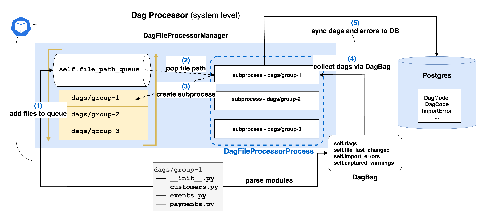
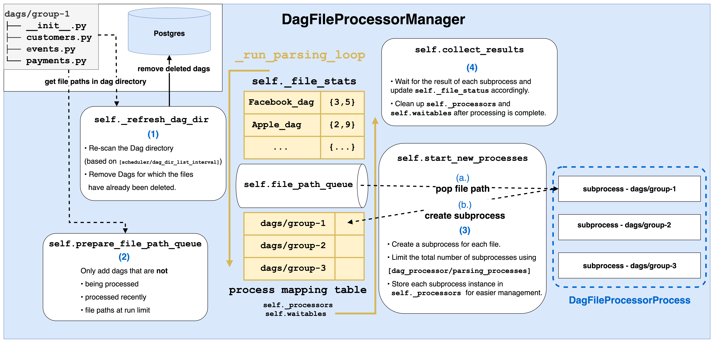




[**源來是你**](https://www.facebook.com/opensource4you) 是在台灣積極貢獻大型開與軟體的社群  
接下來我會在以下時間地點主持 **Airflow 中文會議**

**時間**： **7 月 2 日**起**隔週三晚上 20:30** (台灣時區 UTC+8)    
**地點**： [https://opensource4you.tw/airflow/meeting](https://opensource4you.tw/airflow/meeting)  
**行事曆**： [https://opensource4you.tw/readme/calendar](https://opensource4you.tw/readme/calendar)  


如果你也對 Airflow 的技術新知或對貢獻 Airflow 本身感興趣  
歡迎來 Airflow 會議共襄盛舉！





## Python 撰寫的 Dag File 是如何被 Airflow 解析的？

本篇文章會深入研究 Airflow **2** 的 Dag Processing 機制  
Airflow **3** 會牽涉 [AIP-72 TaskSDK](https://cwiki.apache.org/confluence/display/AIRFLOW/Test+cases+AIP-72+Task+Execution+Interface+aka+Task+SDK) 的核心細節  
所以這邊會以 Airflow **2** 的 Dag Processing 機制來說明比較簡單！ 

無論是 Airflow 2 或 3 都會涉及以下核心概念
- `DagFileProcessorManager`  
- `DagFileProcessorProcess`  
- `DagBag`  

接下來會以整體的角度來說明這些概念  
再進一步深入到各個核心概念的細節  
最後總結 Airflow Dag Processing 流程與最佳實踐

## 概述 Dag Processing 機制

> 
> 附圖是 Airflow 2 的 Dag Processing 機制 high level 的架構圖

以下是各個 component 的簡介：
- **DagProcessor**:
  - 是以 **整個 Airflow 系統** 的角度出發的 component 名稱
- **DagFileProcessorManager**:
  - 是 DagProcessor 在 code level 的實作，也是管理 Dag Processing 的核心
  - 使用 **queue** 來管理 Dag File 的解析
- **DagFileProcessorProcess**:
  - 是 DagFileProcessorManager fork 出來的 worker process
  - 負責解析**單一 file path**
  - 和同步 Dag 與錯誤訊息到 Metadata DB
- **DagBag**:
  - 實際與 Dag File 互動的介面
  - 回傳實際的 Dag instances

整個 Dag Processing 大致的流程如下：
1. 把待解析的 Dag File 路徑放到 `DagFileProcessorManager` 的 queue 中
2. & 3. `DagFileProcessorManager` 會 fork 出 `DagFileProcessorProcess` subprocess 並存在 `DagFileProcessorManager` 中
4. `DagFileProcessorProcess` 透過 `DagBag` 拿到 Dag instances 和錯誤訊息
5. `DagFileProcessorProcess` 會把 Dag instances 和錯誤訊息同步到 Metadata DB

## DagFileProcessorManager




**[_run_parsing_loop](https://github.com/apache/airflow/blob/b3a3591c946326467cf9c54115b9b514d89e7645/airflow/dag_processing/manager.py#L555) 是整個 Manager 的核心**

- Manager 會以 `_file_paths`, `_file_path_queue`, `_file_stats` 這 3 個屬性來記錄 Dag File 的狀態
    - [self._file_paths: list[str]](https://github.com/apache/airflow/blob/b3a3591c946326467cf9c54115b9b514d89e7645/airflow/dag_processing/manager.py#L381) 記錄所有 Dag File 的路徑
    - [self._file_path_queue: deque[str]](https://github.com/apache/airflow/blob/b3a3591c946326467cf9c54115b9b514d89e7645/airflow/dag_processing/manager.py#L382-L383) 記錄還有哪些 Dag File 的路徑需要解析
    - [self._file_stats: dict[str, DagFileStat]](https://github.com/apache/airflow/blob/b3a3591c946326467cf9c54115b9b514d89e7645/airflow/dag_processing/manager.py#L425) 記錄每個 Dag File 的狀態
        - `num_dags: int`, `import_errors: int`, `last_finish_time: datetime | None`, `last_duration: timedelta | None`, `run_count: int`, `last_num_of_db_queries: int` 等
- 並由以下屬性來管理 `DagFileProcessorProcess` instance
    - [self.waitables](https://github.com/apache/airflow/blob/b3a3591c946326467cf9c54115b9b514d89e7645/airflow/dag_processing/manager.py#L447) 來追蹤所有活躍的 process 或連線
    - [self._processors: dict[str, DagFileProcessorProcess]](https://github.com/apache/airflow/blob/b3a3591c946326467cf9c54115b9b514d89e7645/airflow/dag_processing/manager.py#L420) 來記錄每個 Dag File 相相對應的 process
- 也提供 [def set_file_paths(self, new_file_paths: list[str]):](https://github.com/apache/airflow/blob/b3a3591c946326467cf9c54115b9b514d89e7645/airflow/dag_processing/manager.py#L1094) 來
    1. 更新上面所提的 `self._file_paths`, `self._file_path_queue`, `self._file_stats` 
    2. Terminate 正在處理 "被刪除檔案的" DagFileProcessorProcess
        - [processor.terminate()](https://github.com/apache/airflow/blob/b3a3591c946326467cf9c54115b9b514d89e7645/airflow/dag_processing/manager.py#L1119)
        - [self._file_stats.pop(file_path)](https://github.com/apache/airflow/blob/b3a3591c946326467cf9c54115b9b514d89e7645/airflow/dag_processing/manager.py#L1120)

**在每次 loop 中會做以下幾件事**： 這邊只有列出跟與解析 Dag 最相關的步驟

1. [self._refresh_dag_dir()](https://github.com/apache/airflow/blob/b3a3591c946326467cf9c54115b9b514d89e7645/airflow/dag_processing/manager.py#L562)
    1. 更新距離上次 refresh 的時間差，如果大於 `[scheduler/dag_dir_list_interval]` 設定才會重新讀取 Dag Directory [dag_filelocs = {full_loc for path in self._file_paths for full_loc in _iter_dag_filelocs(path)}](https://github.com/apache/airflow/blob/b3a3591c946326467cf9c54115b9b514d89e7645/airflow/dag_processing/manager.py#L852)]
    2. 在最後把 "被刪除檔案的 Dag" 從 Metadata DB 中刪除 [SerializedDagModel.remove_deleted_dags](https://github.com/apache/airflow/blob/b3a3591c946326467cf9c54115b9b514d89e7645/airflow/dag_processing/manager.py#L856)
2. [self.prepare_file_path_queue()](https://github.com/apache/airflow/blob/b3a3591c946326467cf9c54115b9b514d89e7645/airflow/dag_processing/manager.py#L640)
    1. 如果發現 "有檔案被刪除" 的情況，也會透過剛剛所提的 [set_file_paths](https://github.com/apache/airflow/blob/b3a3591c946326467cf9c54115b9b514d89e7645/airflow/dag_processing/manager.py#L1094) 來更新 `self._file_paths`, `self._file_path_queue`, `self._file_stats`
    2. 再把 [file_paths_in_progress = set(self._processors)](https://github.com/apache/airflow/blob/b3a3591c946326467cf9c54115b9b514d89e7645/airflow/dag_processing/manager.py#L1271), [file_paths_recently_processed](https://github.com/apache/airflow/blob/b3a3591c946326467cf9c54115b9b514d89e7645/airflow/dag_processing/manager.py#L1307) 和 [files_paths_at_run_limit](https://github.com/apache/airflow/blob/b3a3591c946326467cf9c54115b9b514d89e7645/airflow/dag_processing/manager.py#L1324) 這 3 者取聯集完 **以外** 的 Dag File 路徑加入到 `self._file_path_queue` 中
3. [self.start_new_processes()](https://github.com/apache/airflow/blob/b3a3591c946326467cf9c54115b9b514d89e7645/airflow/dag_processing/manager.py#L651)
    - 會在 `[dag_processor/parsing_processes]` 限制下   [while self._parallelism > len(self._processors) and self._file_path_queue:](https://github.com/apache/airflow/blob/b3a3591c946326467cf9c54115b9b514d89e7645/airflow/dag_processing/manager.py#L1217)
    - 對於每一個 Dag File 都起一個 `DagFileProcessorProcess` 來解析 [processor = self._create_process(](https://github.com/apache/airflow/blob/b3a3591c946326467cf9c54115b9b514d89e7645/airflow/dag_processing/manager.py#L1224)
    - 並把 `DagFileProcessorProcess` 的 instance 加到 [self.waitables](https://github.com/apache/airflow/blob/b3a3591c946326467cf9c54115b9b514d89e7645/airflow/dag_processing/manager.py#L447) 和 [self._processors](https://github.com/apache/airflow/blob/b3a3591c946326467cf9c54115b9b514d89e7645/airflow/dag_processing/manager.py#L420) 中
      - [self._processors[file_path] = processor](https://github.com/apache/airflow/blob/b3a3591c946326467cf9c54115b9b514d89e7645/airflow/dag_processing/manager.py#L1243)
      - [self.waitables[processor.waitable_handle] = processor](https://github.com/apache/airflow/blob/b3a3591c946326467cf9c54115b9b514d89e7645/airflow/dag_processing/manager.py#L1244)
4. [self.collect_results()](https://github.com/apache/airflow/blob/b3a3591c946326467cf9c54115b9b514d89e7645/airflow/dag_processing/manager.py#L667)
    - 等待多個 `DagFileProcessorProcess` 的結果並更新到 `self._file_stats` 中
    - 也清理 `self.waitables` 和 `self._processors` 中已經完成的 process
    - ```python
      ready = multiprocessing.connection.wait(
          self.waitables.keys() - [self._direct_scheduler_conn], timeout=0
      )

      for sentinel in ready:
          if sentinel is not self._direct_scheduler_conn:
              processor = cast(DagFileProcessorProcess, self.waitables[sentinel])
              self.waitables.pop(processor.waitable_handle)
              self._processors.pop(processor.file_path)
              self._collect_results_from_processor(processor)
      ```

## DagFileProcessorProcess


          
**`DagFileProcessorProcess` 會以 [DagBag](#dagbag) 去拿到該路徑下解析完 Dags 的結果**

- [_run_file_processor](https://github.com/apache/airflow/blob/b3a3591c946326467cf9c54115b9b514d89e7645/airflow/dag_processing/processor.py#L248) 是 `DagFileProcessorProcess` 實際的 target function
    - 主要執行 [dag_file_processor.process_file](https://github.com/apache/airflow/blob/b3a3591c946326467cf9c54115b9b514d89e7645/airflow/dag_processing/processor.py#L188) 並回傳 `tuple[number of dags found, count of import errors, last number of db queries]` 作為 `self._result`
      1. 先以 `file_path` 拿到 DagBag [dagbag = DagFileProcessor._get_dagbag(file_path)](https://github.com/apache/airflow/blob/b3a3591c946326467cf9c54115b9b514d89e7645/airflow/dag_processing/processor.py#L918)
        - 而 `_get_dagbag` method 就真的是 construct 一個 DagBag [DagBag(file_path, include_examples=False)](https://github.com/apache/airflow/blob/b3a3591c946326467cf9c54115b9b514d89e7645/airflow/dag_processing/processor.py#L882)
        - 關於 DagBag 的細節可以參考 [DagBag](#dagbag) 這個章節
      2. 把透過 DagBag 拿到的 Dag 都同步到 Metadata DB [serialize_errors = DagFileProcessor.save_dag_to_db(dags=dagbag.dags, dag_directory=self._dag_directory, pickle_dags=False)](https://github.com/apache/airflow/blob/b3a3591c946326467cf9c54115b9b514d89e7645/airflow/dag_processing/processor.py#L976)
        - [DagBag.sync_to_db](https://github.com/apache/airflow/blob/b3a3591c946326467cf9c54115b9b514d89e7645/airflow/models/dagbag.py#L736)
            - [DAG.bulk_write_to_db](https://github.com/apache/airflow/blob/b3a3591c946326467cf9c54115b9b514d89e7645/airflow/models/dagbag.py#L724)
      3. 把上一步拿到的 `serialize_errors` 更新到 `import_errors` 中 [DagFileProcessor.update_import_errors(file_last_changed=dagbag.file_last_changed, import_errors=dagbag.import_errors, processor_subdir=self._dag_directory, )](https://github.com/apache/airflow/blob/b3a3591c946326467cf9c54115b9b514d89e7645/airflow/dag_processing/processor.py#L952-L956)
      4. 最後更新 Dag 的警告 [self.update_dag_warnings(dagbag=dagbag)](https://github.com/apache/airflow/blob/b3a3591c946326467cf9c54115b9b514d89e7645/airflow/dag_processing/processor.py#L962)
        > 到這邊我們也可以知道 UI 上 import errors 或 Dag 警告的 Lifecycle 都是由 DagFileProcessorProcess 來處理的!    


## DagBag


- `DagBag` 是 Airflow 內部最終讀取 Dag File 的介面
  - 無論是 Dag Processor 要把 Dag 寫入到 Metadata DB 中
  - 或是 Scheduler 或 API Server 要讀取 Dag 
  - 都會透過 `DagBag` 來處理，而`DagBag` 的 constructor 有 [read_dags_from_db: bool](https://github.com/apache/airflow/blob/b3a3591c946326467cf9c54115b9b514d89e7645/airflow/models/dagbag.py#L129) 選項
    - 所對於 Dag Processor 來說： 一定會把 `read_dags_from_db` 設定為 `False`，因為 Dag Processor 的確需要從 Dag File 中讀取 Dag 來同步 Dag 的狀態
    - 但對於 Scheduler 或 API Server 來說： `read_dags_from_db` 會被設定為 `True`，可以保證在不同 deployment 中讀到的 Dag 是一致的
  - 並提供以下屬性讓其他 Airflow 的 component 使用：
    1. [self.dags: dict[str, DAG]](https://github.com/apache/airflow/blob/b3a3591c946326467cf9c54115b9b514d89e7645/airflow/models/dagbag.py#L158) 
    2. [self.file_last_changed: dict[str, datetime]](https://github.com/apache/airflow/blob/b3a3591c946326467cf9c54115b9b514d89e7645/airflow/models/dagbag.py#L160)
    3. [self.import_errors: dict[str, str]](https://github.com/apache/airflow/blob/b3a3591c946326467cf9c54115b9b514d89e7645/airflow/models/dagbag.py#L161)
    4. [self.captured_warnings: dict[str, tuple[str, ...]]](https://github.com/apache/airflow/blob/b3a3591c946326467cf9c54115b9b514d89e7645/airflow/models/dagbag.py#L162)
- [collect_dags](https://github.com/apache/airflow/blob/b3a3591c946326467cf9c54115b9b514d89e7645/airflow/models/dagbag.py#L566) 是從 Dag File 中取得 Dag instance 的 entry point
    - 從 `.py` 檔案讀取[self._load_modules_from_file](https://github.com/apache/airflow/blob/7654e1a49b074d5dc06dd1218369399430dfcfc9/airflow-core/src/airflow/models/dagbag.py#L335)
    - 或 `.zip` 壓縮檔讀取 [self._load_modules_from_zip](https://github.com/apache/airflow/blob/7654e1a49b074d5dc06dd1218369399430dfcfc9/airflow-core/src/airflow/models/dagbag.py#L337)
    - [self._process_modules](https://github.com/apache/airflow/blob/7654e1a49b074d5dc06dd1218369399430dfcfc9/airflow-core/src/airflow/models/dagbag.py#L348)
        - 是整個 Dag Processing 中**最花時間與資源的部分**
            - 不只要 load modules 也會對 Dag objects 做各種處理與檢查
            - 這也是我認為 為什麼需要用 subprocess 來處理的原因
        - 實際從 Python 檔案讀 modules 後，以 `isinstance(o, (DAG, SDKDAG))` 拿到 Dags 的 instance
        - `top_level_dags = {(o, m) for m in mods for o in m.__dict__.values() if isinstance(o, (DAG, SDKDAG))}`
        - 並以 [self.bag_dag](https://github.com/apache/airflow/blob/7654e1a49b074d5dc06dd1218369399430dfcfc9/airflow-core/src/airflow/models/dagbag.py#L538) 檢查該 Dag 是否合法
            1. 是否有 cycle
            2. Dag policies
            3. 是否有重複的 Dag ID
            4. 都沒問題的話才加入到該 DagBag 中 [self.dags[dag.dag_id] = dag](https://github.com/apache/airflow/blob/7654e1a49b074d5dc06dd1218369399430dfcfc9/airflow-core/src/airflow/models/dagbag.py#L591)

## 總結：與 Dag Processing 有關的最佳實踐

透過文章可以了解 `DagFileProcessorManager`, `DagFileProcessorProcess`, `DagBag` 三者之間的關係  
以下是幾個我覺得值得注意的重點

1. **`DagFileProcessorManager` 會以 queue 來管理所有待解析的 Dag File 路徑**
  - 擔任 dispatcher 的角色，並管理所有的 `DagFileProcessorProcess` subprocesses
2. **每一個 file path 都是由一個 `DagFileProcessorProcess` 來處理**: 
  - 這個 process 會透過 `DagBag` 來拿到 Dag instance 和錯誤訊息
      - 這個步驟會是 **最花時間與資源的部分** !
        - 單一個 python file 內，可能只有 1 個 Dag instance 也有可能有 1,000 個 Dag instances  
        - 而且需要對每個 Dag instance 去做各種檢查！
  - 並把這些資訊同步到 Metadata DB 中
3. **`DagBag` 是最後拿到 Dag instance 的介面**: 無論是 Read-Only 還是 Read-Write 都會透過 `DagBag` 來取得

### 透過 Dynamic Dag 生成大量 Dags 的最佳實踐

假設現在有**一個 Python 檔** 裡面只有一個讀取 `config.yaml` 的 Dynamic Dag  
並且透過 `config.yaml` 會產生 **1,000** 個不同的 Dags  
> `config.yaml` 可以是任何外部狀態，如 `xxx.json`  
> 或用 code 生成的 list，如 `for` loop 


`config.yaml`:
```yaml
customer_list:
- name: Facebook
  config: 300
- name: Apple
  config: 200
... 
```

`single_dynamic_dag.py`:
```python
with open("config.yaml", 'r') as f:
  customers = yaml.safe_load(f)

for customer in customers:

    @dag(
      dag_id=f"{customer}_dag",
      start_date=datetime(2022, 2, 1)
    )
    def dynamic_generated_dag():
        @task
        def print_message(message):
            print(message)
    
    dynamic_generated_dag()
```


這樣的寫法會導致  
這 **1,000** 個 Dag instances 只被 **1 個** `DagFileProcessorProcess` 來處理    
> 這也代表  
> 這 1 個 process 要單獨處理 1,000 個 Dag instances!  
>  
> 因為 **1 個 Python 檔** 是由 **1 個 DagFileProcessorProcess** 處理的  
> Airflow 沒有辦法預先知道這個 Python 檔會產生多少個 Dag instances  

這也是在 **單一 Python 檔** 使用 Dynamic Dag **去產生大量 Dags** 時  
**有些 Dags 會偶爾突然消失**的原因之一  
> 例如：  
> 在 load 到第 800 個 Dag instance 時   
> `DagFileProcessorManager` 認為 `DagFileProcessorProcess` 跑太久 timeout 了   
> 就直接 terminate 這個 process  
>   
> 又進行下一輪的 Dag Processing   
> 導致剩下的 200 個 Dag 被判斷為 **"被刪除"！**   
> 所以就在 UI 看到怎麼少了 200 個 Dag  
>  
> 但有可能再下一輪的 Dag Processing 沒有超過 timeout  
> 又可以在 UI 上看到 1,000 個 Dags  
>  
> 就會有這種「 Dags 偶爾突然消失」的現象發生  


如果要避免這個問題  
只需要使用 **partition** 的方式來處理

例如：  
把 `config.yaml` 多加**分組**的概念，並多加一些相同的 Python 檔  
來讓不同的 `DagFileProcessorProcess` 處理不同的分組  
> 當然需要有另一個 `source_dag.py` 和 `partition.yaml` 設定來維護好 single source of truth  
> 並且讓 CI/CD pipeline 自動生成這些分組的 Dag Files  

`config.yaml` with partition:
```yaml
group_0:
- name: Facebook
  config: 300
group_1:
- name: Apple
  config: 200
```

`group_0.py`:
```python
# get the current group name from the file path
current_file_name = os.path.basename(__file__)
current_group = current_file_name.split('.')[0]

# only import the customers for the current group
with open("config.yaml", 'r') as f:
  customers = yaml.safe_load(f)[current_group]

# generate the Dags for the current group
for customer in customers:
    @dag(
      dag_id=f"{current_group}_{customer}_dag",
      start_date=datetime(2022, 2, 1)
    )
    def dynamic_generated_dag():
        @task
        def print_message(message):
            print(message)
    dynamic_generated_dag()
```

