
  


## Introduction

Attending [Apache CommunityOverCode Asia](https://asia.communityovercode.org/) made one thing clear: large enterprises across Asia, especially in China, have developed an open source technology stack quite different from the cloud data architectures common in North America.

Apache CommunityOverCode North America felt like a meeting point for Apache projects, cloud vendors, commercial products, and international users. Apache CommunityOverCode Asia brought the large-scale data use cases that Chinese enterprises have spent years tackling onto the Apache stage. Its agenda dealt directly with production traffic and business pressures from live streaming, short videos, real-time recommendations, holiday promotions, flash sales, and risk control.

## Regional Tech Stack Differences

My clearest takeaway was the distinctly regional character of China's data infrastructure stack.

In North America or Taiwan, a conversation about data platforms quickly brings to mind [Snowflake](https://docs.snowflake.com/), [Databricks](https://docs.databricks.com/), [BigQuery](https://cloud.google.com/bigquery/docs), [dbt](https://docs.getdbt.com/docs/introduction), [Apache Airflow](https://airflow.apache.org/docs/), [Apache Kafka](https://kafka.apache.org/documentation/), [Apache Spark](https://spark.apache.org/docs/latest/), [Kubernetes](https://kubernetes.io/docs/home/), and an assortment of managed cloud services. Many Chinese companies use a different mix. They have spent years building open source stacks that other companies in China then adopt, contribute to, and commercialize.

For real-time computing, Chinese data platforms tend to center on [Apache Flink](https://flink.apache.org/) instead of defaulting to [Apache Spark](https://spark.apache.org/) for every processing task. Projects such as [Apache Doris](https://doris.apache.org/) and [Apache Paimon](https://paimon.apache.org/) also came up repeatedly in discussions about OLAP and lakehouse architectures.

[Apache Airflow](https://airflow.apache.org/) was almost absent from orchestration discussions. A conversation about data pipelines in North America or Taiwan nearly always includes [Airflow](https://airflow.apache.org/docs/). Yet after reviewing the Asia program and speaking with people at almost every booth, the only engineer I met who had heard of [Airflow](https://airflow.apache.org/docs/) worked at the [Cloudera](https://docs.cloudera.com/) booth.

This goes beyond technical preferences. From on-site conversations, case studies, and booth materials, it was clear that some projects had most of their users inside China and little visibility elsewhere.


  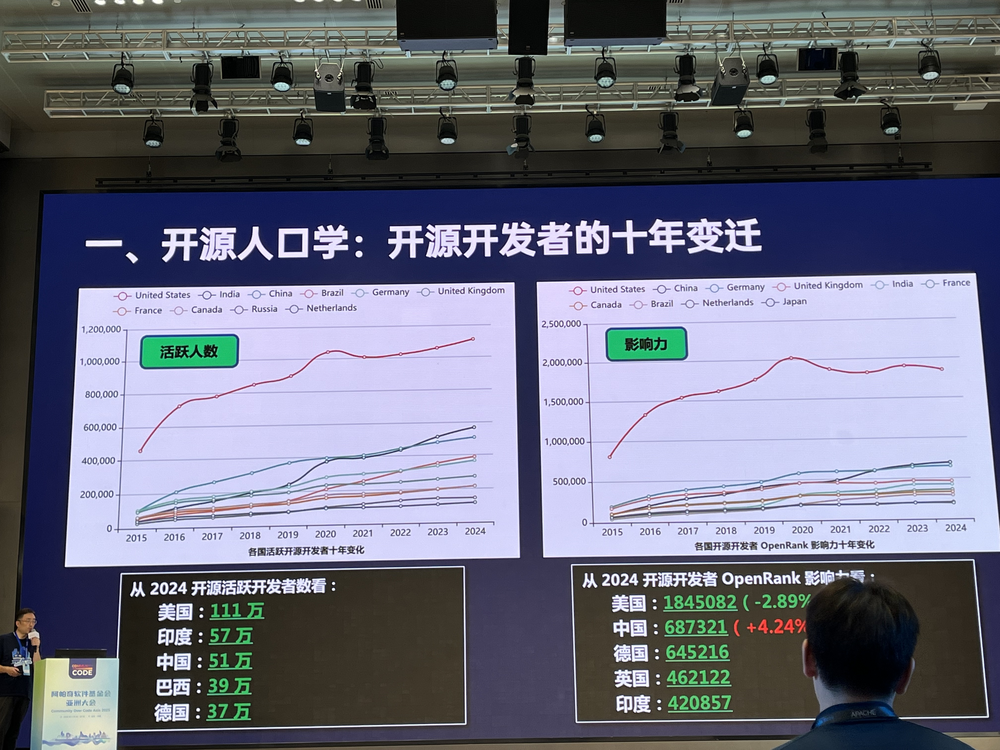
  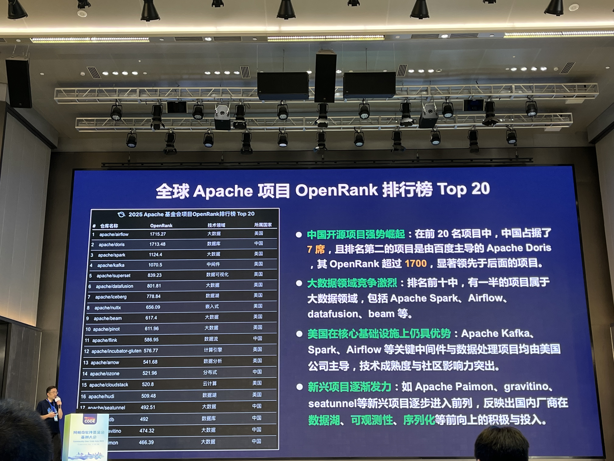
  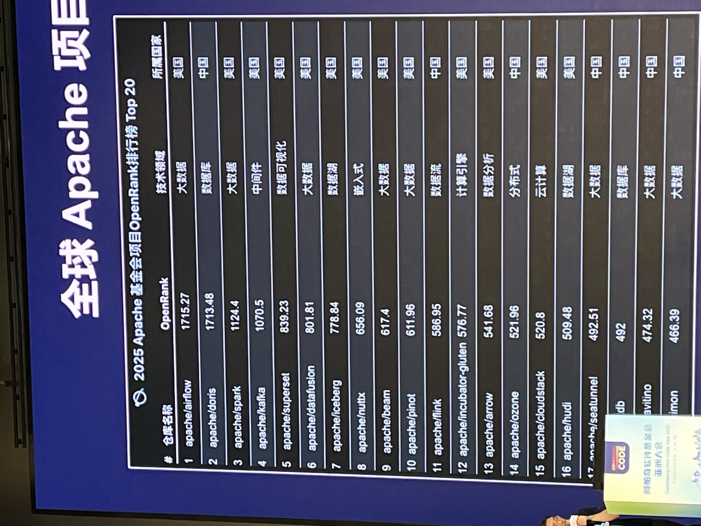


An open source project can live under Apache and conduct its work through English documentation, GitHub issues, and mailing lists, while its users, contributors, vendors, and best practices remain concentrated in one language, industry, or region. The Apache brand is global, but adoption is not evenly distributed. These projects still follow "The Apache Way," yet at CoC Asia most user discussions and development work took place in Chinese in WeChat groups.

## Ant Group's High-SLA Streaming Pipeline

The standout session for me on the afternoon of Day 1 was:

[Ant Group's Next Generation High SLA Stream Computing System Built on Apache Technology Stack](https://asia.communityovercode.org/sessions/streaming-880299.html)

The speaker began with three practical questions:

1. How can BI logic be made easier to implement?
2. How should the SLA of a data pipeline be defined?
3. How can the SLA of a data pipeline be guaranteed?

The system optimized the entire data pipeline lifecycle rather than one isolated component. It distinguished among release, maintenance, managed, and unmanaged stages. It also covered how to observe and protect a pipeline when metrics are unavailable from upstream systems. Underneath sat a SQL layer, a compute interface, and a design that compiled the same semantics for different compute engines, including [Flink](https://flink.apache.org/) and [Spark](https://spark.apache.org/docs/latest/).

What impressed me was how the SLA shaped the system instead of serving as a basic alerting rule. From bare-metal tiers and fault tolerance to master, hot, cold, and switch backups, pipeline-wide observability, and automatic recovery, every layer supported the same goal: the pipeline had to deliver a guaranteed level of service.

By March 2025, this high-SLA stream computing system had moved beyond a proof of concept and was already being engineered for production.

The talk made me think about where [Airflow](https://airflow.apache.org/docs/) is heading in 2026. Its data workflow capabilities are expanding for the AI era through work such as the [Common AI Provider](https://airflow.apache.org/blog/common-ai-provider/), [AIP-105 Pluggable Retry Policies](https://cwiki.apache.org/confluence/display/AIRFLOW/AIP-105%3A%2BPluggable%2BRetry%2BPolicies), and the Common AI Provider's [LLM Retry Policy](https://airflow.apache.org/docs/apache-airflow-providers-common-ai/stable/retry_policies.html). A retry policy that understands errors, outputs, context, and repair strategies can go beyond blindly rerunning a failed task and move toward a self-healing data pipeline.

[Astronomer](https://www.astronomer.io/) is also working on [Astro disaster recovery](https://www.astronomer.io/docs/astro/disaster-recovery) and [Astro Private Cloud data plane failover](https://www.astronomer.io/docs/astro-private-cloud/data-plane-failover). High-SLA pipelines no longer need to be exclusive to companies the size of Ant Group. In 2026, even a company with dozens or hundreds of employees can combine the Apache stack, managed platforms, AI retry policies, and standardized observability to build self-service, observable, self-healing pipelines when data infrastructure is critical to the business.

This is where [Airflow](https://airflow.apache.org/docs/) gets interesting to me. It can serve as a data platform's control plane, coordinating workflows and handling observability, retries, governance, and self-healing. Maybe it can also spare data engineers a few 3 a.m. pipeline repairs.

## A Shared Runtime for AI/ML Workloads: Ray


  
  


CoC Asia gave me a much clearer sense of the role [Ray](https://docs.ray.io/en/master/ray-overview/index.html) plays in AI/ML workloads. Although this was an Apache conference, Ray, now part of the [PyTorch Foundation](https://pytorch.org/foundation/), came up in session after session.

That contrasted with the Chinese data stack I described earlier. Many Chinese enterprises build their own data infrastructure or modify it heavily, sometimes producing new Apache projects in the process. At the AI/ML runtime layer, however, I saw more teams build on [Ray](https://docs.ray.io/en/master/ray-overview/index.html) instead of inventing another distributed runtime.

My guess is that distributed AI runtimes are too broad and difficult for every company to rebuild. Resource scheduling, mixed GPU/CPU workloads, distributed training, batch inference, model serving, fault tolerance, autoscaling, and observability are all hard problems. With [Ray](https://docs.ray.io/en/master/ray-overview/index.html) providing a general-purpose execution layer, companies can focus on platform features, permissions, data integration, task templates, cost controls, and internal workflows.

## Streaming-First Data Infrastructure

The Asia program also treated streaming as the center of data infrastructure.

By comparison, I do not remember streaming compute engines being as central at Apache CommunityOverCode North America. In Asia, [Apache Flink](https://flink.apache.org/), [Apache Pulsar](https://pulsar.apache.org/docs/), message queues, streaming joins, and streaming warehouses belonged on the main stage. Their prominence reflected the business requirements behind them.

Large internet companies in China run many high-frequency, latency-sensitive services: short-video recommendations, interactive live streams, live commerce, flash sales, ad delivery, and real-time risk control. Their requirements for latency, throughput, stability, and data freshness naturally push engineering teams toward streaming-first architectures. Message queues do more than buffer systems; they feed the entire real-time data flow. Stream processing is not an add-on to batch pipelines. Many product features depend on it.


  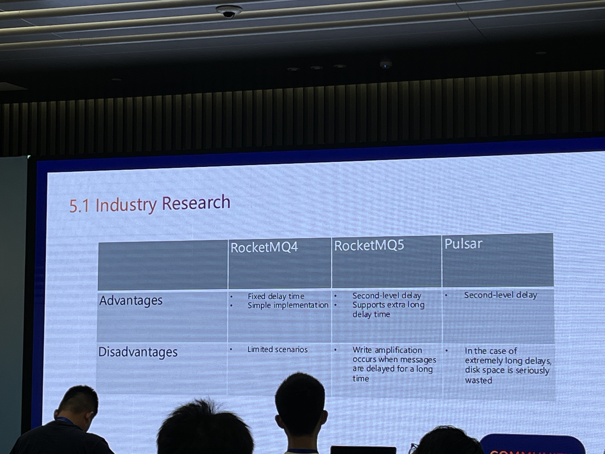
  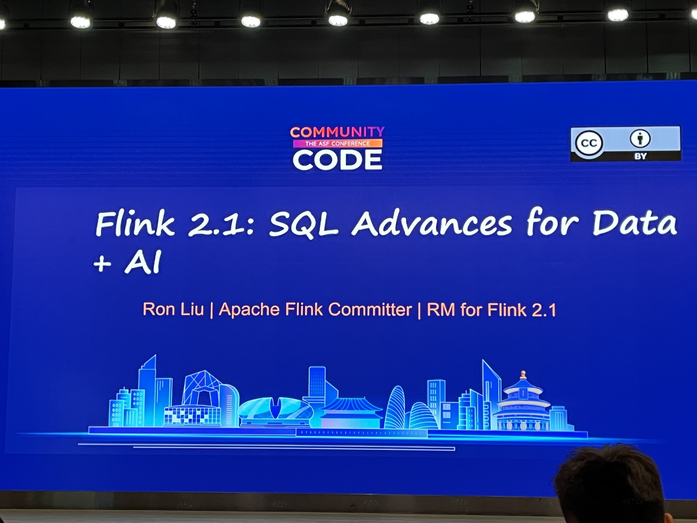


Many of the core problems in large internet services involve networks of relationships rather than single-table analytics. Users, products, livestreamers, content, transactions, devices, IP addresses, risk-control events, and recommendation paths all connect to one another. When those relationships are complex and need real-time processing, graph and streaming naturally appear together.

One interesting session, [Accelerating Multi-stream Join by Stream Graph Computing](https://asia.communityovercode.org/sessions/streaming-907134.html), explored how stream graph computing can accelerate multi-stream joins. It recast a streaming join as an incremental computation problem on a graph. For business problems built around relationships and paths, graph computing can power real-time feature pipelines, risk-control rules, and recommendation systems.

[Apache Fluss](https://fluss.apache.org/) was another memorable example of this streaming-first trend.

The project [entered the Apache Incubator in June 2025](https://incubator.apache.org/clutch/fluss.html), only about a month before Apache CommunityOverCode Asia ran from July 25 to 27. When I heard about Fluss at the conference, it was brand new to the Apache ecosystem.

> 
> As an aside, I watched [ChiaPing Tsai](https://github.com/chia7712), a [Kafka](https://kafka.apache.org/documentation/) PMC member, ask how Kafka might address the areas where [Fluss](https://fluss.apache.org/) claims an advantage.

The session I remember most clearly was [When Flink Meets Fluss: The Future of Streaming Warehouse](https://asia.communityovercode.org/sessions/streaming-889266.html). Rather than present [Fluss](https://fluss.apache.org/) as "yet another storage system," the speaker situated it within the [Flink](https://flink.apache.org/) ecosystem. [Kafka](https://kafka.apache.org/documentation/) and [Flink](https://flink.apache.org/) are already a common combination for streaming warehouses and real-time analytics. But as data moves among message queues, stream processing, online serving, and lakehouse storage, the boundaries between systems become harder to manage. Fluss is one response to that complexity.

I first encountered Fluss in July 2025. By May 2026, while writing this article, I was seeing more posts and videos about it on LinkedIn and YouTube. If I exclude open source models and focus on data infrastructure, [Fluss](https://fluss.apache.org/) is also one of the Apache projects from a Chinese company that I now see most often in international discussions.

I also made sure to attend the session from the OpenSource4You [#apache-kafka channel](https://opensource4you.slack.com/archives/C06MSQ9V4F3). I usually lurk there, so it was great to see [JiunnYang Huang](https://github.com/m1a2st), [PoAn Yang](https://github.com/FrankYang0529), [TengYao Chi](https://github.com/frankvicky), and [KuanPo Tseng](https://github.com/brandboat) present the major contributions that went into [Kafka 4.0](https://kafka.apache.org/40/documentation.html). The discussion between [ChiaPing Tsai](https://github.com/chia7712) and the Fluss speaker about the hardest problems in streaming systems was another highlight.

## Enterprise Investment in Open Source

The conference made Chinese companies' commitment to open source hard to miss. It goes beyond individual engineers contributing on their own. Companies use open source to build technical influence, recruit engineers, commercialize technology, and help set standards.

At the venue, I saw companies building data platforms with Apache projects and turning internal capabilities into open source projects of their own. Some even count open source work in performance reviews. That differs sharply from the way Taiwanese companies often treat open source as free software to use.

## Open Source Is Not the Same as Open Governance

One distinction still matters: open source and open governance are not the same thing.

Many open source projects from China appear to begin when a company releases its internal tech stack. These projects often have a clear business need, production use cases tested at scale, and engineers assigned to long-term maintenance. That lets them grow quickly. Their governance, however, usually starts with a single stakeholder: one company supplies the roadmap, most of the maintainers, and the main production requirements.

Donating a project to the ASF does not create multi-party governance overnight. The ASF emphasizes [Community over Code](https://www.apache.org/foundation/) and consensus-based, community-driven governance. The [Apache Incubator](https://incubator.apache.org/) helps podlings learn the Apache approach. From what I saw at the conference, though, most maintenance work on many projects still came from the original company. A real gap remains between publishing source code and sharing governance among independent stakeholders.

That is the tension I see in China's open source ecosystem. It produces a huge volume of software, backed by genuine corporate investment. Yet some projects still operate like company infrastructure released to the public instead of communities governed from the start by independent companies and individual contributors.

This helps explain why Chinese companies have more opportunities to build their own data infrastructure through OSS than Taiwanese companies do. Large internet services in China have enough users, traffic, data, and complex business requirements to support a team dedicated to internal infrastructure. That team can eventually open source the technology, commercialize it, or donate it to a foundation. Many Taiwanese companies operate at a different scale. Cloud services, managed databases, managed [Kafka](https://kafka.apache.org/documentation/), managed [Airflow](https://airflow.apache.org/docs/), and managed warehouses often cost much less than an in-house data infrastructure team.

The difference is largely economic. Until a service becomes large enough to require in-house infrastructure, a company will struggle to justify a full-time team maintaining an open source data stack. As a result, open source in Taiwan appears more often through community and individual contributions than through large infrastructure projects incubated by companies.

## How Open Source Projects Become Companies

Several sessions connected OSS with commercialization and startups. I attended two on the morning of Day 2:

- From Commits to Capital: Turning Open Source Passion into a Startup Journey by William Guo
- The Three Things That Make or Break a Software Startup by Rui Su


  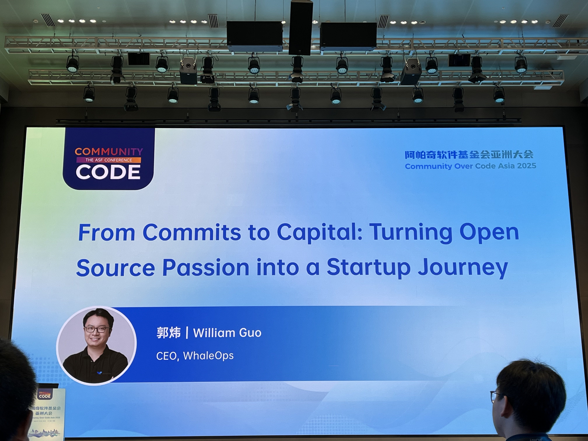
  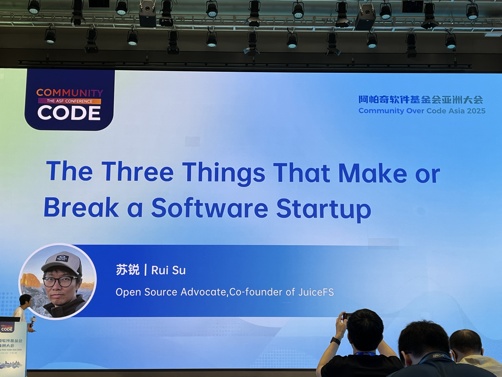


These sessions interested me because they moved beyond project governance and technical roadmaps to ask a blunt question: how does an OSS project led by engineers and contributors become a startup that can survive?

I saw fewer OSS-to-startup talks at Apache CommunityOverCode North America, where sessions tended to focus on technical evolution, use cases, foundation governance, release processes, and maintainer collaboration. The Asia event put open source projects, enterprise use cases, product development, and commercialization into the same conversation.

The most practical lesson from the first session was that GitHub stars alone cannot turn an Apache project into a business. Stars show attention, not revenue. A viable company still needs product value, business value, market value, and a large enough addressable market.

The speaker did not romanticize open source startups. Professional services can turn the company into a consultancy, while managed services face direct competition from cloud vendors. An open core model means maintaining both community and commercial editions. Open-sourcing too many enterprise features lets competitors modify them and underbid you, but holding back too much erodes the community's trust.

The hard part is drawing the line between the open source core and enterprise features such as RBAC, environment separation, auditing, and governance. The company must then turn contributors, users, and early adopters into paying customers without weakening the community that made the project valuable.

The second session covered startup fundamentals: early marketing, blogs, tutorial videos, SEO, use cases, building in public, and *Crossing the Chasm*. Technical enthusiasts may bring GitHub stars, but early adopters are willing to test the product inside a company. The founder also has to lead sales at the beginning because no one else understands the problem as well.

Together, the two sessions connected back to the regional technology stack I saw earlier. Real-world use cases and corporate investment give engineers a reason to contribute. That can sustain open source projects and commercial companies, along with people moving between them.

## Taiwan's Tech Community Is Not Small

After attending both Apache CommunityOverCode Asia and CoC North America, I came away with a stronger appreciation for the scale of Taiwan's tech community.

Judging by attendance and community participation, COSCUP, SITCON, and PyCon Taiwan are substantial events. Their crowds often felt denser than those at Apache CommunityOverCode Asia or North America. Taiwan has no shortage of technical events or engineers willing to share. The real differences lie in industry structure, how companies invest, and whether community energy turns into sustained open source contributions.

Taiwan also started early. The first [COSCUP](https://coscup.org/2006/) was held in 2006, while China's [Kaiyuanshe](https://kaiyuanshe.cn/article/How-to-join-KAIYUANSHE) was founded in 2014. By that measure, Taiwan was not late to open source community building; COSCUP predates Kaiyuanshe by eight years.

China's current volume of open source contributions is much greater than Taiwan's. The [2024 China Open Source Annual Report](https://kaiyuanshe.github.io/2024-China-Open-Source-Report/data.html) documents rapid growth in contributors, projects, and adoption. Much of that work is concentrated in projects incubated by Chinese companies rather than upstream projects with established global adoption, but the total remains impressive.

The key difference is whether companies treat open source as a formal engineering strategy, not how active the community is. Taiwan has a strong community culture. Large Chinese companies, however, serve far more users, operate at greater scale, and assign more employees to open source maintenance. Under those conditions, open source grows from event culture into company-funded engineering work.

Taiwanese communities excel at organizing events and giving students and engineers their first exposure to new technology. To help more people move into large open source projects such as [Apache](https://github.com/apache/), [CNCF](https://www.cncf.io/), and the [Linux Foundation](https://www.linuxfoundation.org/), I keep thinking about how to:

- Turn attending talks into opening real pull requests.
- Connect individual learning with company-sponsored engineering time.
- Follow one-off events with weekly reviews, mentoring, and issue triage.
- Help strong Taiwanese engineers gain visibility within international projects.

At Apache CommunityOverCode Asia, I saw how much momentum companies, communities, students, and the ASF can build together. [OpenSource4You](https://github.com/opensource4you/readme) has been doing this work for years. Thanks again, ChiaPing.

## Friends from TAC

Although I did not receive a TAC (Travel Assistance Committee) grant for Apache CoC Asia, I still spent much of the conference at the Apache booth helping to hand out stickers.

I enjoyed spending time with Owen, Peter, Ryan, Simon, and Nick from the TAC group. Much of the value of an international conference comes between sessions, over meals, and at evening gatherings, where engineers from different places can compare notes on open source, careers, and project maintenance.

I was also happy to see that Simon and Nick's careers have both been going especially well.


  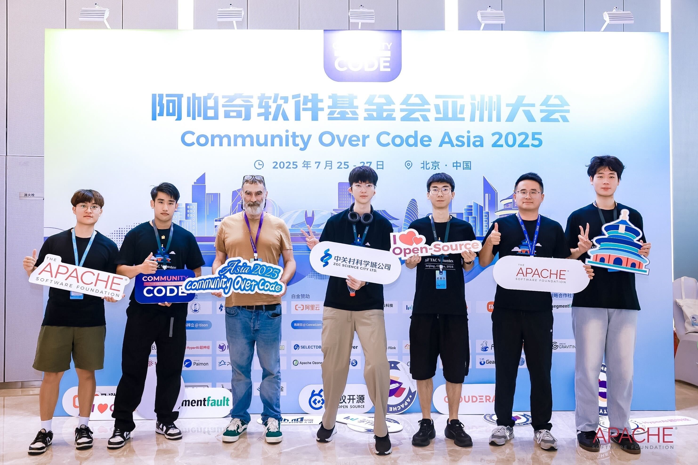
  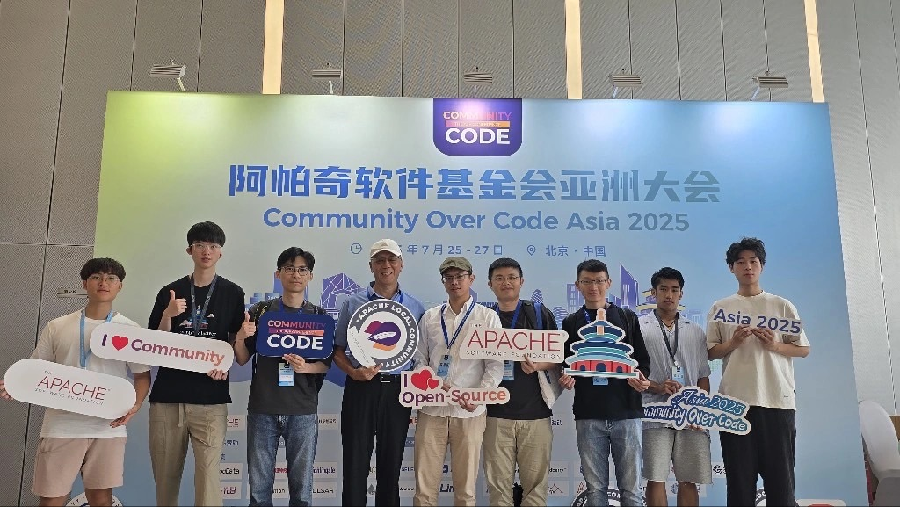


## An OpenSource4You Apache Kafka and Apache Gravitino Gathering

ChiaPing invited everyone from the OpenSource4You [#apache-kafka](https://opensource4you.slack.com/archives/C06MSQ9V4F3) and [#apache-gravitino](https://opensource4you.slack.com/archives/C07473LAC15) channels who happened to be in Beijing to dinner. We talked about Apache projects, communities, and companies. It was fun to meet people in person whom I had previously known only through their online contributions.

## The Conference Buffet

The conference buffet was far more varied than I expected. Most of the flavors were new to me but still easy to enjoy.


  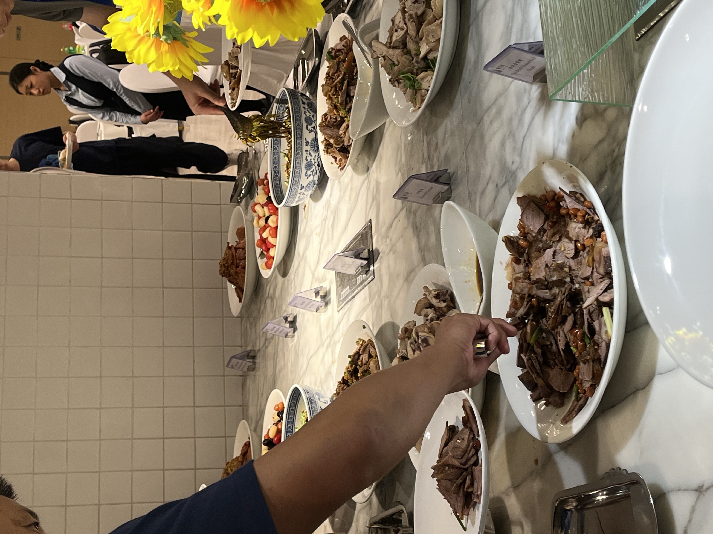
  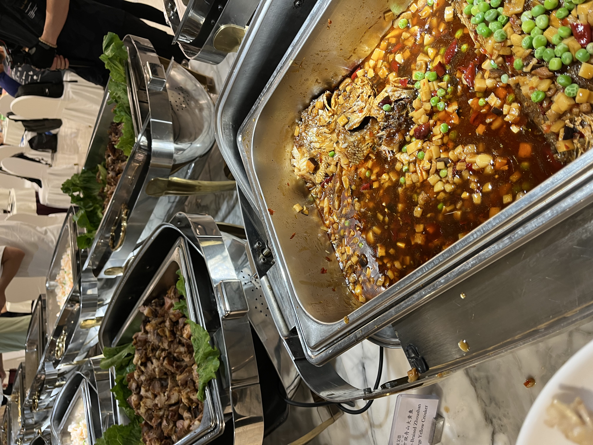
  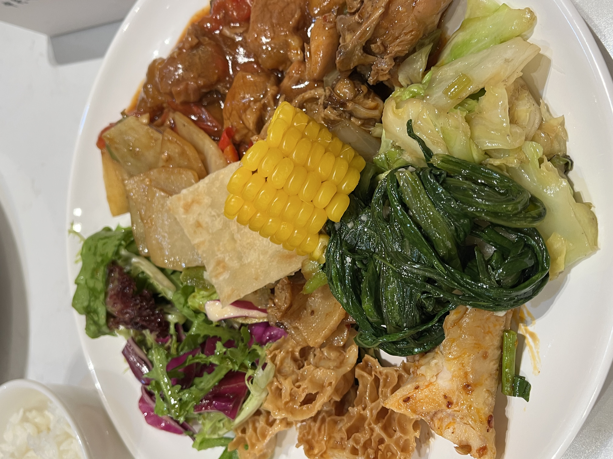


## Exploring and Eating Around Beijing

Outside the conference, I explored the Old Summer Palace and the Qianmen area, and stopped by Peking University. A tip for anyone planning a similar trip: book visits to popular attractions at least a month ahead, or you may end up like us, staring at Peking University from outside the gate.


  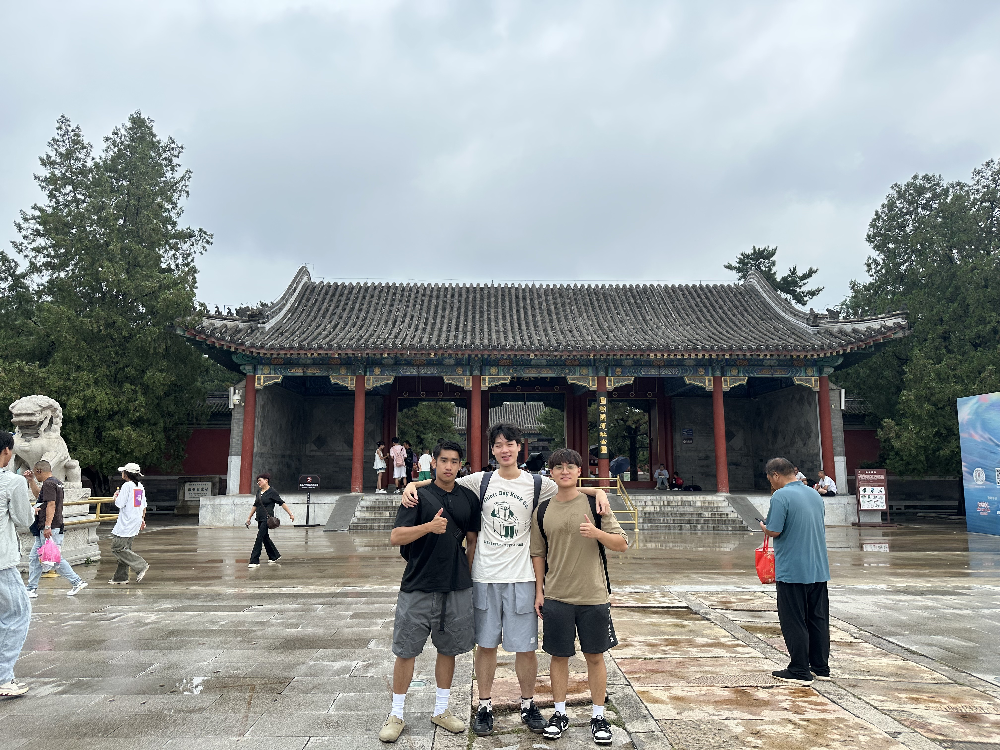
  
  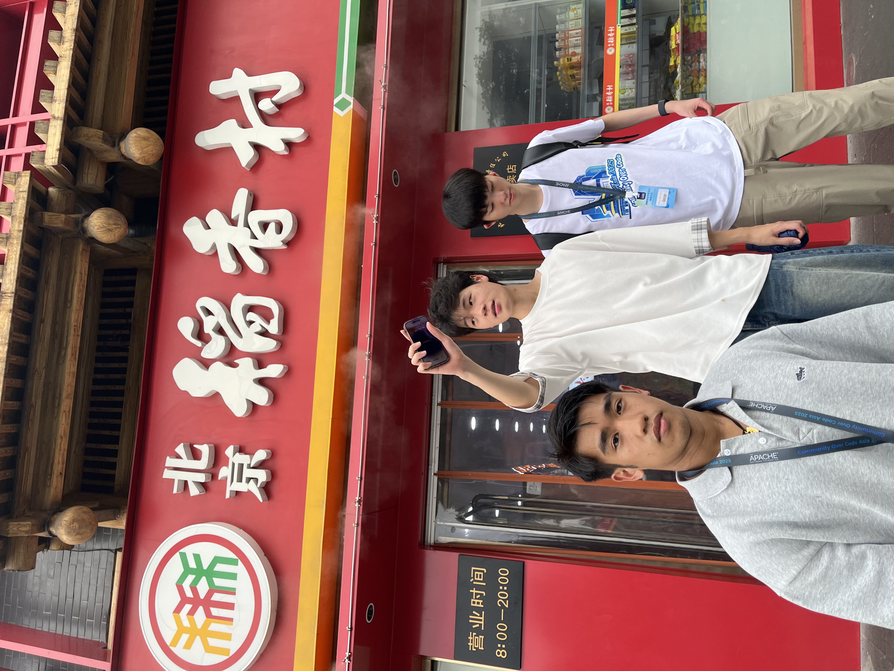
  
  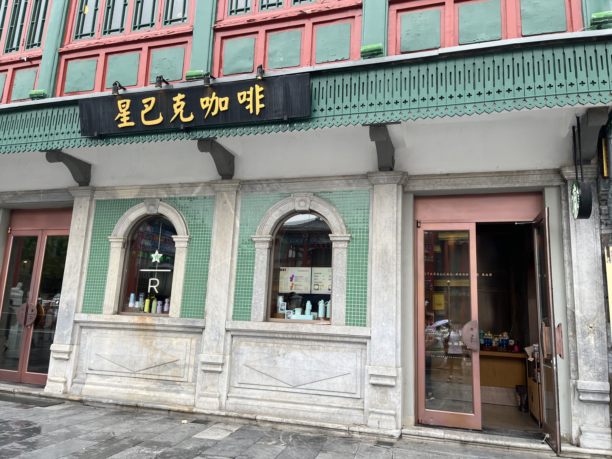
  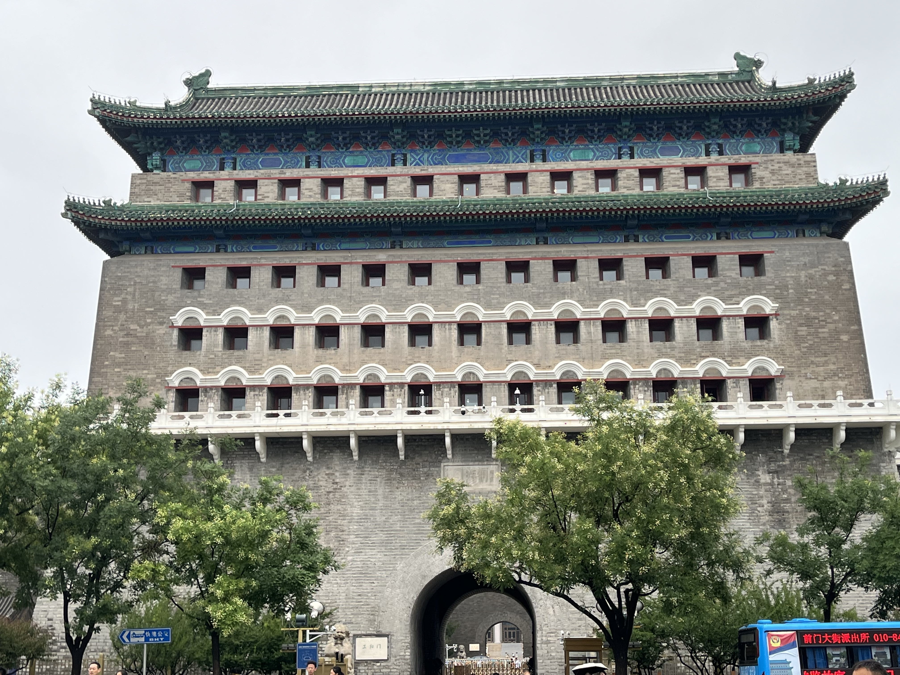


We ate our way through spicy fish, lamb skewers, yogurt, and finally roast duck at Quanjude. The one thing I missed was douzhi.


  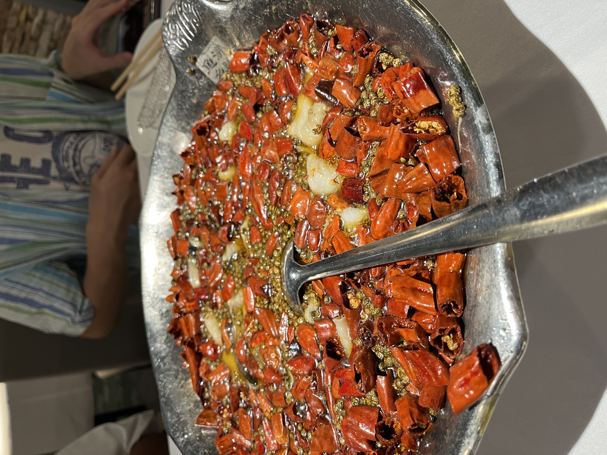
  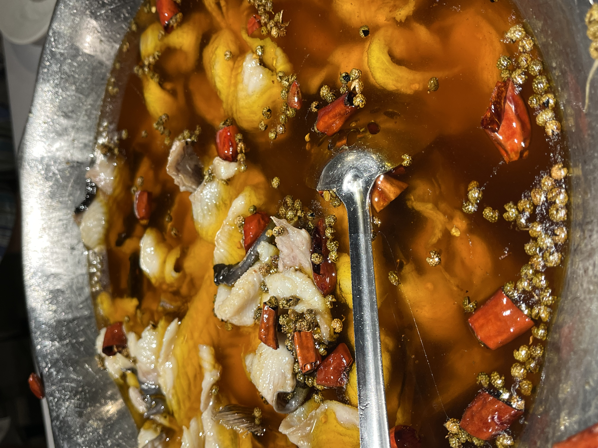
  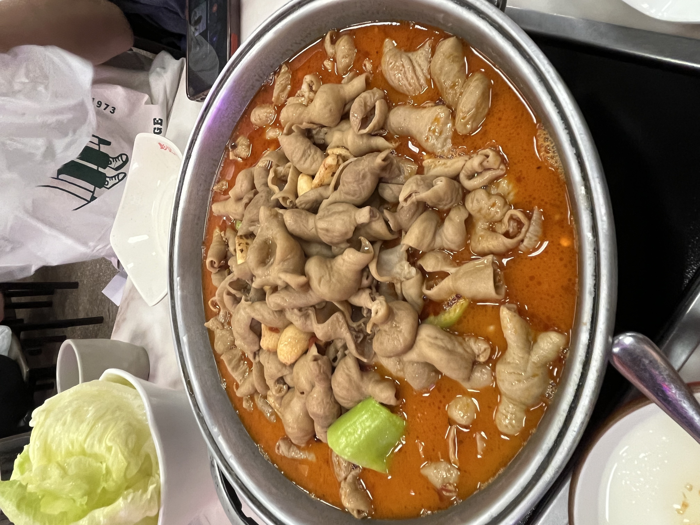
  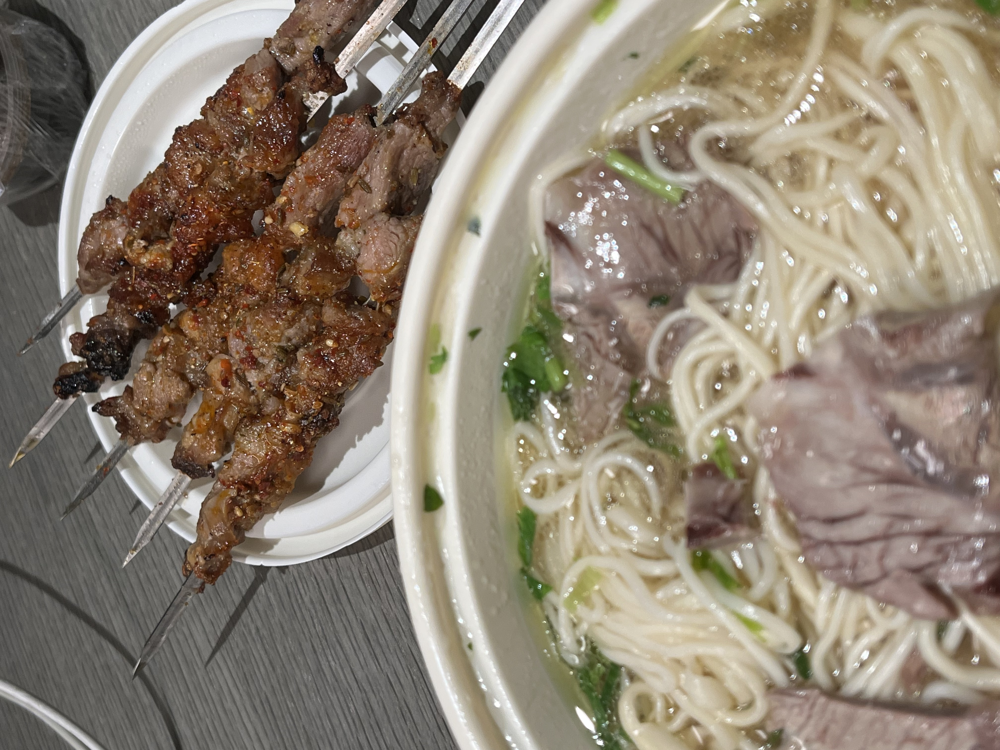
  
  
  
  
  
  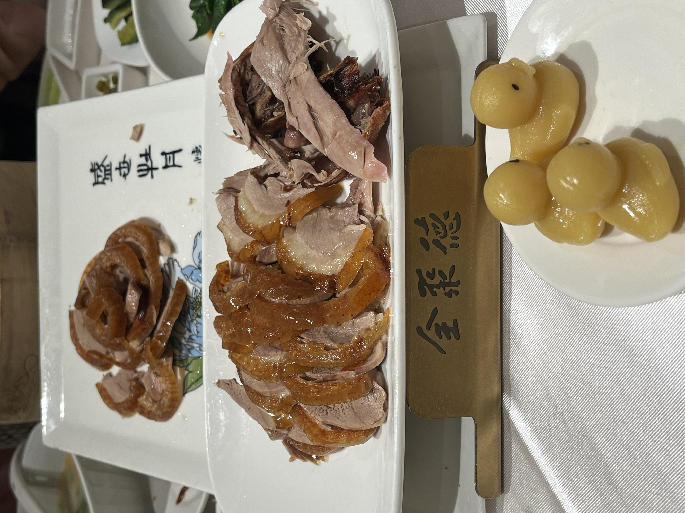
  
  


## Special Thanks

I especially want to thank [ChiaPing](https://github.com/chia7712). When I was still a student last year, I did not receive travel support for Apache CommunityOverCode Asia. Without ChiaPing's help, I probably would not have joined Owen and Peter from NCKU at the conference and experienced it for myself.

At the time, attending Apache's annual conference in Asia and speaking with local companies at their booths was a rare opportunity. Almost no one there knew about [Airflow](https://airflow.apache.org/docs/), so I embraced my extroverted side and went from booth to booth explaining it. Along the way, I learned what problems each project solved and where it fit within the broader data infrastructure stack.

## Questions I Took Away

After the conference, I kept coming back to these questions:

1. When we talk about open source, do we also care about open governance?
2. Can Taiwan develop a distinctive regional open source data stack rather than remain solely a user of tools built elsewhere?
3. Are Taiwanese companies willing to treat open source contributions as part of their engineering capability and technical brand rather than as an after-hours hobby for employees?
4. Can we build long-term mentoring programs like [GSoC](https://summerofcode.withgoogle.com/) or the Open Source Promotion Plan so that students can contribute directly to major projects?

My original plan was simply to attend technical talks about Apache. CoC Asia showed me how code and foundation governance intersect with corporate strategy, talent development, business models, regional industry structures, and engineering culture.

That experience gave me more reason to keep contributing to [Apache Airflow](https://airflow.apache.org/docs/). As data pipelines become more real-time and complex, with AI-assisted operations and self-healing, there is still plenty of room to advance an openly governed orchestration system like Airflow.
