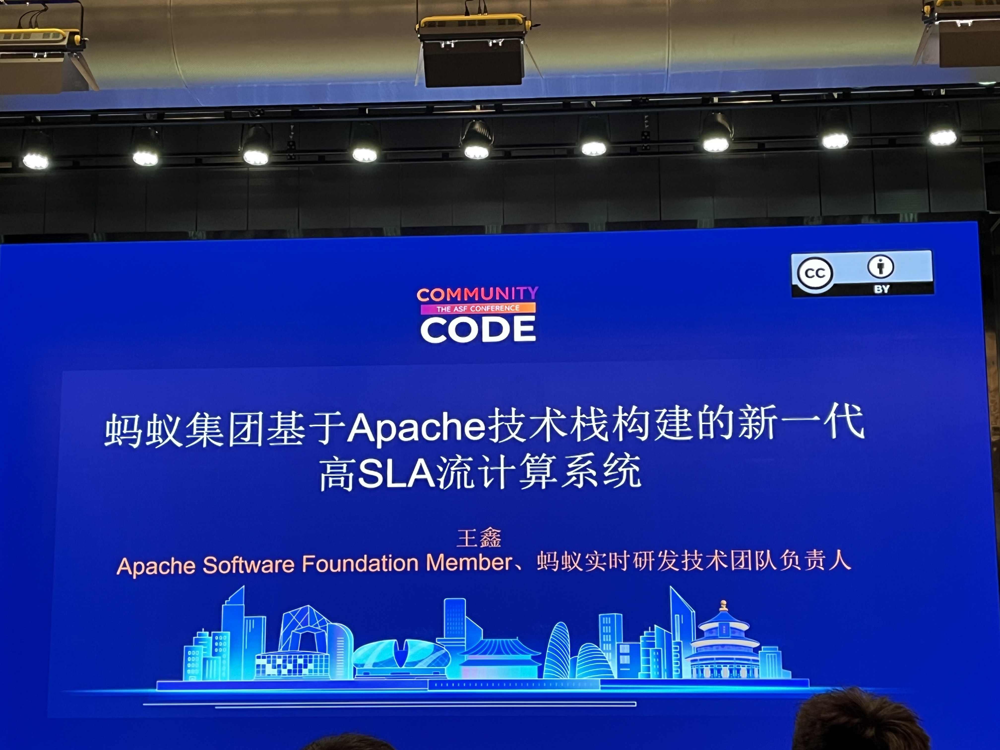
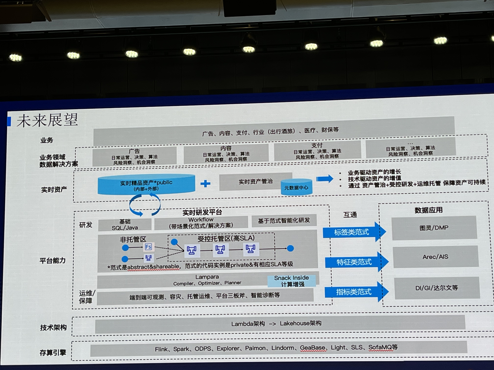
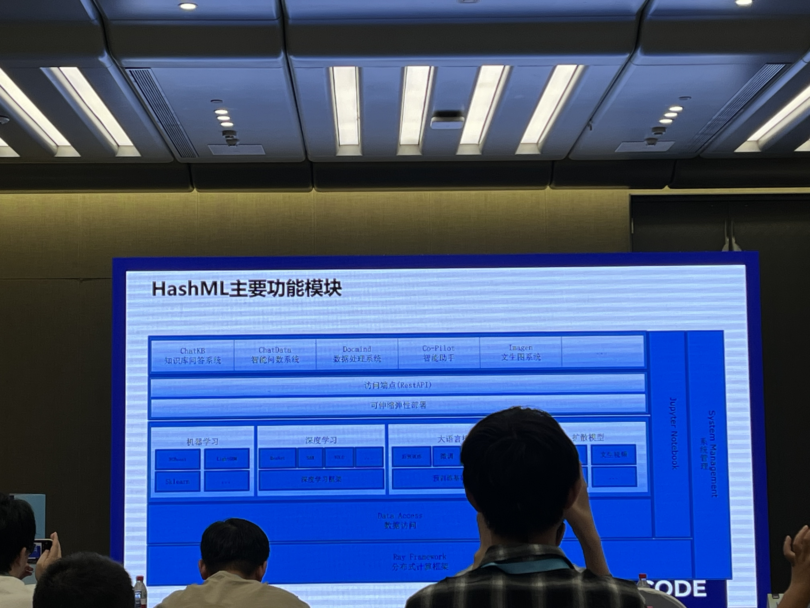
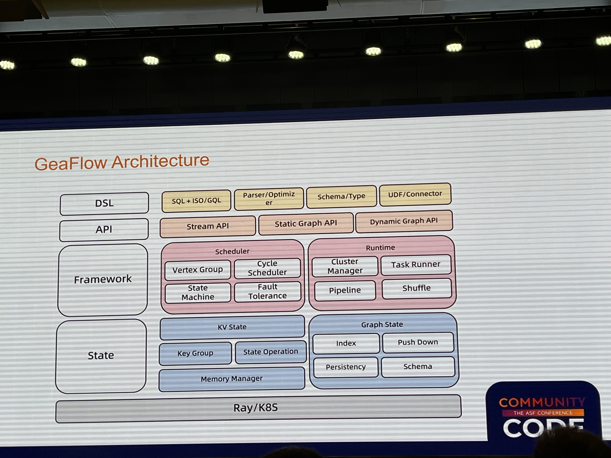
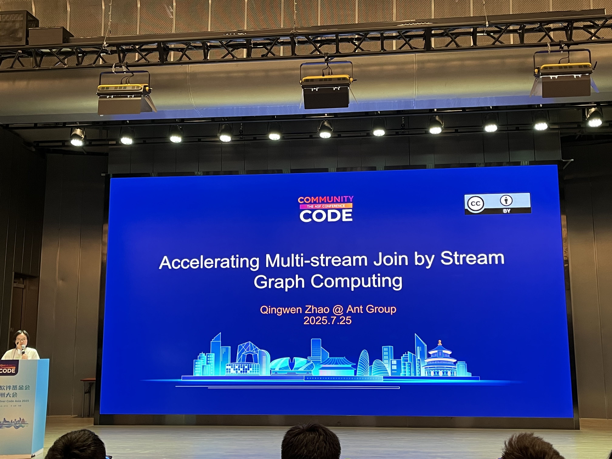
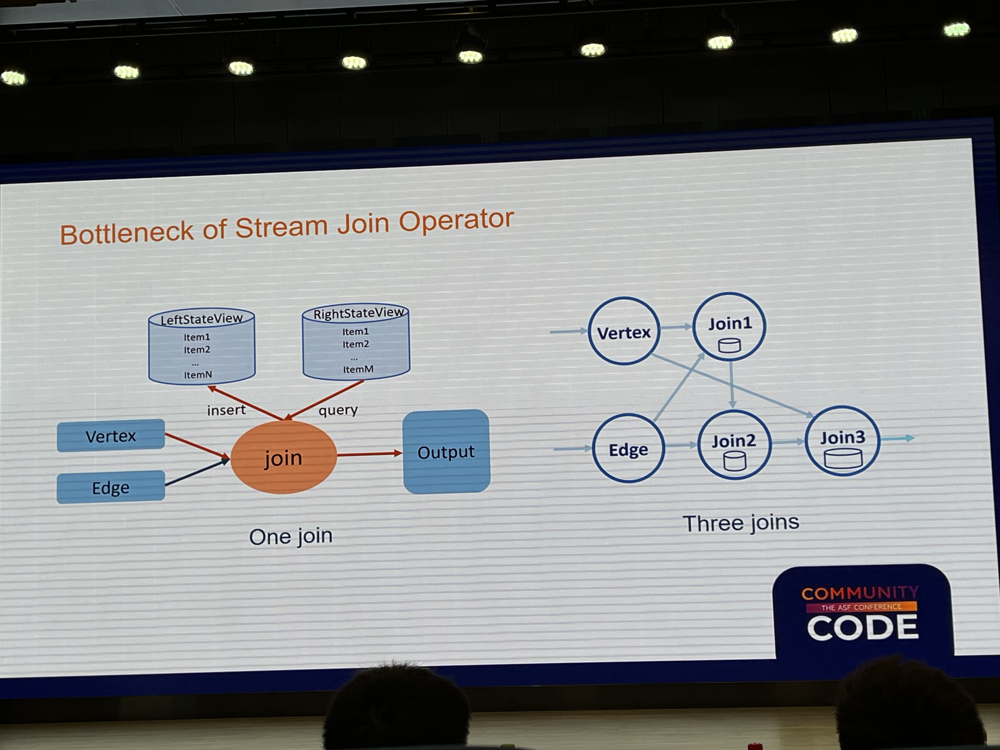
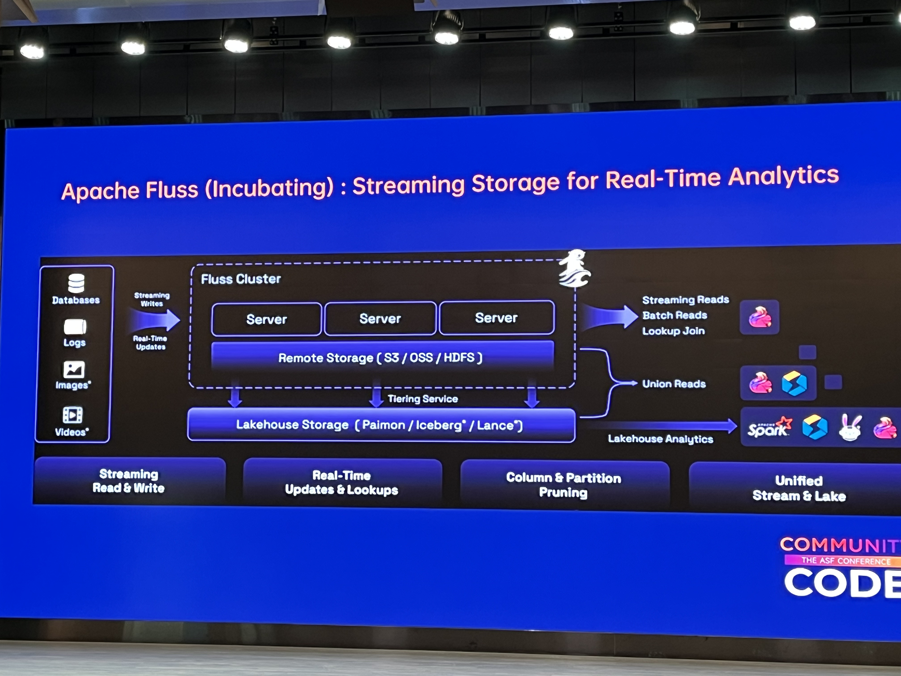
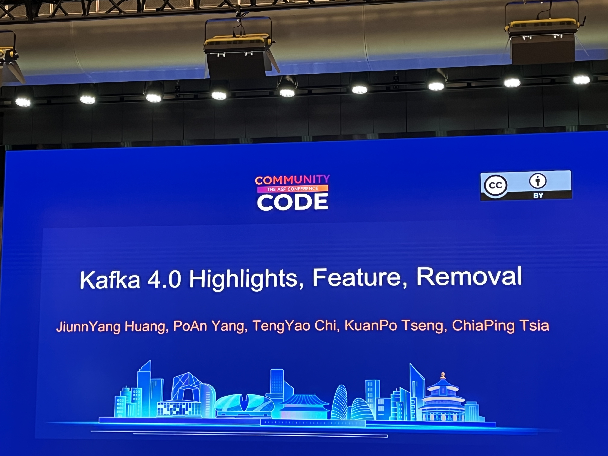
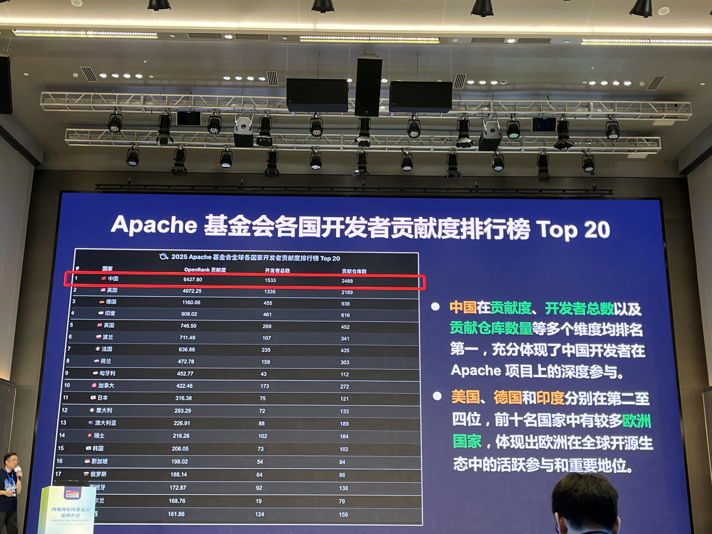


  


## 前言

這次參加 [Apache CommunityOverCode Asia](https://asia.communityovercode.org/) 後，最大的感受不是「又聽了幾場 Apache 專案的技術分享」，而是很明顯地看到亞洲，尤其是中國大型企業，長出一套跟北美常見雲端資料架構不太一樣的開源技術路線。

如果說 Apache CommunityOverCode North America 給我的感覺比較像是 Apache 專案、雲端廠商、商業產品和國際使用者之間的交會點，那 **Apache CommunityOverCode Asia 更像是把中國企業內部長期累積的大規模資料場景搬到 Apache 舞台上**。這裡的 session 會很自然地談到直播、短影音、即時推薦、節慶促銷、搶購、風控等在生產環境中發生的流量和業務壓力。

## 區域性的 Tech Stack 差異

這次最直觀的觀察是：**中國資料基礎設施有非常強的區域性 tech stack**。

在北美或台灣討論 data platform 時，我們很容易想到的是 [Snowflake](https://docs.snowflake.com/)、[Databricks](https://docs.databricks.com/)、[BigQuery](https://cloud.google.com/bigquery/docs)、[dbt](https://docs.getdbt.com/docs/introduction)、[Apache Airflow](https://airflow.apache.org/docs/)、[Apache Kafka](https://kafka.apache.org/documentation/)、[Apache Spark](https://spark.apache.org/docs/latest/)、[Kubernetes](https://kubernetes.io/docs/home/)，加上一堆雲端代管服務。但在中國的場景裡，很多企業並不是直接把這套組合搬進來，而是長期建出自己的開源堆疊，再由中國內部其他企業互相引用、貢獻和商業化。

即時計算會大量圍繞 [Apache Flink](https://flink.apache.org/)，而不是只把 [Apache Spark](https://spark.apache.org/) 當成資料處理的預設答案；OLAP 和 Lakehouse 的討論裡，也可以看到 [Apache Doris](https://doris.apache.org/)、[Apache Paimon](https://paimon.apache.org/) 這類專案被反覆提到。

**讓我印象深刻的是在 orchestration 的場景幾乎見不到 [Apache Airflow](https://airflow.apache.org/) 的蹤影，在北美或台灣講到 Data Pipeline 一定會講到 [Airflow](https://airflow.apache.org/docs/)，但是在 Asia 的議程與幾乎所有的攤位聊過後，只有在 [Cloudera](https://docs.cloudera.com/) 攤位的工程師知道 [Airflow](https://airflow.apache.org/docs/) 的存在**。

這背後不是單純的「技術偏好不同」。這些專案很多是從中國企業自己的場景長出來，再被其他中國企業採用。從現場交流、案例分享和攤位資料來看，某些專案的使用者分布也明顯集中在中國境內；中國地區以外的使用者能見度相對低很多。


  
  
  


開源專案可以放在 Apache，也可以用英文文件、GitHub issue 和 mailing list 運作，但實際使用者、貢獻者、商業公司和最佳實踐，仍然可能高度集中在某個語言、產業或區域裡。Apache 的品牌是全球的，技術採用卻不一定平均地全球化。雖然也都有按照著 "The Apache Way" 進行，但多數的用戶討論和開發貢獻**都是在微信群以中文討論**。

## Ant Group 的高 SLA Streaming Pipeline

Day 1 下午最讓我印象深的是這場：

[Ant Group's Next Generation High SLA Stream Computing System Built on Apache Technology Stack](https://asia.communityovercode.org/sessions/streaming-880299.html)

講者從幾個非常實際的問題切入：

1. 如何降低 BI logic 的實作難度？
2. 如何定義 data pipeline 的 SLA？
3. 如何保證 data pipeline 的 SLA？

這套系統不是單點優化，而是端到端地處理 pipeline 的生命週期。它會區分 release process、maintaining mode、managed process 和 not managed process；也會處理上游系統無法取得 metrics 時，整條 pipeline 要怎麼觀測和保護。底層還有 SQL layer、compute interface，以及把同一套語意 compile 到 [Flink](https://flink.apache.org/)、[Spark](https://spark.apache.org/docs/latest/) 等不同 compute engine 的設計。

它讓我印象深的不是某一個技術名詞，而是「SLA」在這裡不是簡單的告警規則，而是系統設計的中心。從 bare metal 分級、fault tolerance、master backup、hot backup、cold backup、switch backup，到整條 pipeline metrics 的 observation 和 auto recovery，全部都圍繞一件事：資料管線不能只是能跑，還要能被保證。

講者提到這套高 SLA stream computing system 在 2025 年 3 月就已經不是概念驗證，而是實際要面對生產環境的工程實踐。

**這讓我想到在 2026 年當下 [Airflow](https://airflow.apache.org/docs/) 的發展：它正在往更多 AI-era 的 data workflow 能力前進**，例如 [Common AI Provider](https://airflow.apache.org/blog/common-ai-provider/)、[AIP-105 Pluggable Retry Policies](https://cwiki.apache.org/confluence/display/AIRFLOW/AIP-105%3A%2BPluggable%2BRetry%2BPolicies)，以及 [common-ai provider](https://airflow.apache.org/docs/apache-airflow-providers-common-ai/stable/index.html) 裡的 [LLM Retry Policy](https://airflow.apache.org/docs/apache-airflow-providers-common-ai/stable/retry_policies.html)。如果 retry policy 可以更聰明地理解錯誤、輸出、上下文和修復策略，那它就不只是「失敗後重跑 task」，而是可以往 **self-healing data pipeline** 的方向演進。

再加上 [Astronomer](https://www.astronomer.io/) 已經在做 [Astro disaster recovery](https://www.astronomer.io/docs/astro/disaster-recovery) 和 [Astro Private Cloud data plane failover](https://www.astronomer.io/docs/astro-private-cloud/data-plane-failover)，我覺得高 SLA pipeline 不應該再只是螞蟻這種巨型公司的專利。到了 2026 年，就算是一家只有數十、數百人的公司，只要資料管線是核心基礎設施，也應該有能力用 Apache stack、managed platform、AI retry policy 和標準化 observation，建立自助式、可觀測、可自我修復的 data pipeline。

這也是我覺得 [Airflow](https://airflow.apache.org/docs/) 接下來很有趣的地方，它可以成為 data platform 裡負責協調、觀測、重試、治理和自我修復的控制平面 (希望可以讓資料工程師真的不用半夜 3 點起床修 pipeline ！)

## AI / ML Workload 的共同 Runtime: Ray


  
  


除了 streaming 和 data infra，這次也讓我更明顯感覺到 [Ray](https://docs.ray.io/en/master/ray-overview/index.html) 在 AI / ML workload 裡的位置。雖然是在 Apache 的年會，但它 (目前屬於 [PyTorch Foundation](https://pytorch.org/foundation/)) 還是在多個 session 被反覆提到。

這點跟前面提到的中國 data stack 很不一樣。很多中國企業會自建或深度魔改 data infra，甚至長出新的 Apache 專案；但在 AI / ML runtime 這層，我看到的趨勢更像是 **「build on top of [Ray](https://docs.ray.io/en/master/ray-overview/index.html)」**，而不是每家公司都重新發明一套 distributed runtime。

我推測是 Distributed AI runtime 的問題太深了：資源排程、GPU / CPU 混合 workload、distributed training、batch inference、model serving、fault tolerance、autoscaling、observability，每一項都很難。如果 [Ray](https://docs.ray.io/en/master/ray-overview/index.html) 已經成為一個足夠通用的 execution layer，公司更實際的做法通常是把自己的平台能力、權限、資料接入、任務模板、成本治理和內部 workflow 建在它上面，而不是從零重寫一個 distributed runtime。

## Streaming-first 的資料基礎設施

另一個很明顯的差異是：Asia 議程裡的資料基礎設施很自然地以 streaming 為中心。

我在 Apache CommunityOverCode North America 的印象裡，Streaming Compute Engine 並不是那麼核心的主軸；但在 Asia，[Apache Flink](https://flink.apache.org/)、[Apache Pulsar](https://pulsar.apache.org/docs/)、message queue、streaming join、streaming warehouse 這類議題會很自然地出現在主舞台上。這背後不只是技術偏好，而是業務場景本身的差異。

中國大型網路公司的高頻場景太多了：短影音推薦、直播互動、直播電商、秒殺活動、廣告投放、即時風控。這些場景對延遲、吞吐量、穩定性和資料新鮮度的要求，會自然把工程團隊推向 streaming-first 的架構。Message queue 不只是系統之間的緩衝層，而是整個即時資料流的入口；stream processing 也不只是 batch pipeline 的補充，而是很多業務功能能不能成立的核心。


  
  


這也解釋了為什麼 Graph Computing 比我想像中更常出現。很多大型網路服務的核心問題本來就不是單表分析，而是關係網路：使用者、商品、主播、內容、交易、設備、IP、風控事件、推薦鏈路，全部都互相連在一起。當資料關係本身很複雜，而且還要即時處理時，graph 和 streaming 就很自然地被放在一起討論。

這次有一個有趣的 session 是 [Accelerating Multi-stream Join by Stream Graph Computing](https://asia.communityovercode.org/sessions/streaming-907134.html)。它談的是用 Stream Graph Computing 加速多流 join，也就是把 streaming join 的問題轉成圖上的增量計算問題來看。當業務問題本質上是關係和路徑，graph compute engine 就不只是學術味很重的題目，而是有機會成為 real-time feature、風控規則和推薦系統的一部分。

[Apache Fluss](https://fluss.apache.org/) 則是這個 streaming-first 趨勢裡另一個讓我印象很深的例子。

這個專案在 [2025 年 6 月進入 Apache Incubator](https://incubator.apache.org/clutch/fluss.html)，而 Apache CommunityOverCode Asia 2025 是 2025 年 7 月 25 到 27 日舉辦。也就是說，當時在會場聽到它時，它幾乎就是剛進入 Apache 生態、還很新的專案。

> 
> 題外話，在 session 最後還現場見識 [Kafka](https://kafka.apache.org/documentation/) PMC [嘉平](https://github.com/chia7712) 老大詢問 [Fluss](https://fluss.apache.org/) 之於 [Kafka](https://kafka.apache.org/documentation/) 的優勢中，要如何以 [Kafka](https://kafka.apache.org/documentation/) 的角度解決。

我印象最深的是 [When Flink Meets Fluss: The Future of Streaming Warehouse](https://asia.communityovercode.org/sessions/streaming-889266.html) 這場。它不是把 [Fluss](https://fluss.apache.org/) 包裝成「又一個 storage system」，而是很明確地放在 [Flink](https://flink.apache.org/) 生態裡看：[Kafka](https://kafka.apache.org/documentation/) + [Flink](https://flink.apache.org/) 已經是 streaming warehouse 和 real-time analytics 的常見組合，但當資料在 message queue、stream processing、online serving、lakehouse storage 之間來回流動時，系統邊界會變得越來越複雜。它的出現，某種程度上就是在回應這種複雜度。

我在 2025 年 7 月是第一次看到這個專案；但到寫這篇文章的 2026 年 5 月，已經在 LinkedIn、YouTube 上看到越來越多關於 [Fluss](https://fluss.apache.org/) 的文章和影片，也是到目前在國際上比較會看到的中國企業開源 Apache 專案 (如果撇除開源模型外，單純跟 Data Infra 有關的專案)

最後當然也要參加 OpenSource4You 的 [#apache-kafka 頻道](https://opensource4you.slack.com/archives/C06MSQ9V4F3) 的 session。平常都淺水在頻道內，這次看到 [JiunnYang Huang](https://github.com/m1a2st)、[PoAn Yang](https://github.com/FrankYang0529)、[TengYao Chi](https://github.com/frankvicky)、[KuanPo Tseng](https://github.com/brandboat) 現場分享 [Kafka 4.0](https://kafka.apache.org/40/documentation.html) 的新功能，還有最後 [ChiaPing Tsai](https://github.com/chia7712) 在 Fluss 議程現場與講者討論 streaming 場景的核心痛點該如何解決，特別精彩。

## 企業對開源的投入

這次也很明顯感受到中國企業對開源的重視。不是只有工程師個人貢獻，而是企業會把開源當成技術影響力、招募、商業化和標準制定的一部分。

在現場可以看到很多公司用 Apache 專案建立自己的 data platform，也會把內部能力抽象成開源專案。這種量體和投入程度，甚至是把「開源軟體」當作績效的其中一部分。跟台灣公司普遍把開源當成「可以使用的免費軟體」有很大的差異。

我也在現場看到很多很年輕的工程師，可能 24、26 歲，就已經在大公司負責維護某些 Apache 或開源專案的重要模組，職級也已經是 Senior Engineer。這件事對我印象深刻，在中國企業的就業環境並沒有完全局限於像是台灣企業必須要碩士的學歷。

## Open Source 不等於 Open Governance

不過這裡也有一個我覺得需要分開看的問題：**Open Source 和 Open Governance 不是同一件事**。

很多中國的開源專案，應該是公司先把內部 tech stack open source 出來。這種模式通常有很明確的商業需求、很完整的生產場景，也有公司願意投入工程師長期維護，所以專案可以長得很快。但治理上，它一開始往往還是 single stakeholder：主要 roadmap、主要 maintainer、主要 production requirement，都來自同一家公司。

即使有些專案後來捐到 ASF，治理也不會在一夕之間變成真正多方共同維護。ASF 強調 [Community over Code](https://www.apache.org/foundation/) 和 consensus-based、community-driven governance；[Apache Incubator](https://incubator.apache.org/) 也會協助 podling 學習 Apache style 的治理方式。但從現場觀察來看，**很多專案的主要維護量體仍然高度集中在原本的公司**。這不是說它們不好，而是要承認「程式碼開源」和「由多個獨立 stakeholder 共同治理」之間還有一段距離。

這也是我覺得中國開源很有意思的矛盾：它的 open source 量體很大，企業投入也很真實，但有些專案更像是公司級基礎設施的對外開源，而不是一開始就由多個公司、個人和使用者共同塑造的 open governance community。

這件事也解釋了為什麼中國企業比較有機會用 OSS 長出自己的 data infra，而台灣比較少。中國大型網路服務的商業需求、使用者人數、流量規模和資料量，足以支撐一整個團隊長期維護內部 data infra，甚至把它開源、商業化、捐到基金會。台灣很多公司的規模和資料量則不同：直接使用雲端服務、代管資料庫、managed [Kafka](https://kafka.apache.org/documentation/)、managed [Airflow](https://airflow.apache.org/docs/)、managed warehouse，常常比養一整個 data infra 團隊便宜很多。

所以台灣不是沒有工程能力，而是經濟模式不一樣。當服務規模還沒大到必須自建底層系統時，公司很難合理化讓一批工程師全職維護開源 data stack。這也讓台灣的開源更常出現在社群、個人貢獻，而不是公司自己孵化出大型 data infrastructure project。

## 開源專案如何變成公司

這次議程裡有多場把 OSS、商業化和 startup 放在一起談的 session。Day 2 早上我聽了其中兩場：

- From Commits to Capital: Turning Open Source Passion into a Startup Journey by William Guo
- The Three Things That Make or Break a Software Startup by Rui Su


  
  


這類議題讓我覺得很有意思，因為它不是單純講專案治理或技術 roadmap，而是直接問：一個由工程師和 contributor 推動的 OSS project，要怎麼變成可以活下來的 startup？

這種 OSS 到創業的 talk，是我在 Apache CommunityOverCode North America 比較少看到的。NA 場更多時候聚焦在技術演進、使用案例、基金會治理、release process、maintainer 協作；Asia 場則更直接把開源專案、企業場景、產品化和商業化放在同一個桌面上討論。

第一場讓我覺得最實際的是：一個 Apache project 要變成商業公司，不能只靠 GitHub stars。Stars 代表注意力，但不代表收入；真正重要的是 product value、business value、market value 和 total addressable market。

它也沒有把 open source startup 講得很浪漫。開源專案商業化會面對很多困難：Professional Services 容易變成人力服務；Managed Service 會遇到雲端廠商競爭；Open Core 要同時維護開源版和商業版；Enterprise Features 如果開得太多，投標時可能被別人魔改後用更低價格搶走；但如果關太多，又會傷害開源社群信任。

所以商業化的本質不是「把開源專案包成產品」而已，而是要很清楚地決定：

- 哪些能力屬於開源核心？
- 哪些能力是 enterprise-grade features，例如 RBAC、environment separation、audit、governance？
- 如何把 contributor、user、early adopter 轉成付費客戶？

第二場則更偏 startup 基本功：early marketing、blog、tutorial video、SEO、use cases、build in public，以及 Crossing the Chasm。技術 enthusiast 會幫你帶來 GitHub stars，但 early adopters 才會真的願意把產品放進公司場景裡測試。Founder 在早期也一定是最大的 sales，因為只有 founder 最知道產品真正想解的問題。

這兩場連在一起看，其實跟前面的區域性 tech stack 是同一件事：如果一個地方有足夠多真實場景、足夠多企業願意投入、足夠多工程師願意貢獻，就會自然長出開源專案、商業公司和人才循環。

## 台灣的技術活動其實不小

參加完 Apache CommunityOverCode Asia 後（還有 CoC NA 場），**我反而更覺得台灣的技術社群並不小**。

**如果只看現場人流和社群動員，COSCUP、SITCON、PyCon Taiwan 其實都非常有規模，很多時候甚至比我在 Apache CommunityOverCode Asia 或 North America 感受到的人潮更密集**。台灣不是沒有技術活動，也不是沒有工程師願意分享；真正的差異可能在於產業結構、企業投入方式，以及我們有沒有把社群能量轉成長期開源貢獻。

從時間線來看，台灣其實開始得很早。[COSCUP 2006](https://coscup.org/2006/) 在 2006 年就已經舉辦，而中國的 [開源社](https://kaiyuanshe.cn/article/How-to-join-KAIYUANSHE) 是 2014 年成立。也就是說，**如果只看開源社群活動的歷史，台灣並沒有比較晚開始；COSCUP 甚至比開源社早了很多年**。

但如果看現在開源貢獻的量體，中國明顯比台灣大非常多。[2024 China Open Source Annual Report](https://kaiyuanshe.github.io/2024-China-Open-Source-Report/data.html) 也可以看到中國開源生態在 contributor、project、adoption 上的快速成長。即使很多貢獻集中在中國企業自己孵化的專案，未必都是貢獻到全球已經廣泛採用的上游專案，它的總量仍然很可觀。

這中間的差異不只是社群活不活躍，而是企業是否把開源當成正式工程策略。台灣有很強的社群文化，但中國大型企業有更大的商業場景、更大的服務規模，以及更多被公司正式分配到開源維護上的人力。這些條件疊在一起，才會讓開源從活動文化變成產業級的工程投入。

台灣社群很擅長辦活動，也很擅長讓學生和工程師第一次接觸技術。但如果要讓更多人進入 [Apache](https://github.com/apache/)、[CNCF](https://www.cncf.io/)、[Linux Foundation](https://www.linuxfoundation.org/) 這類大型開源專案，我自己會思考的是

- 把「聽 talk」接到「真的發 PR」。
- 把「個人學習」接到「公司願意投入工程時間」。
- 把「一次性活動」接到「每週固定 review、mentor、issue triage」。
- 把「台灣工程師很強」接到「在國際專案裡被看見」。

這也是我在 Apache CommunityOverCode Asia 看到的不是台灣缺少什麼，而是看到當企業、社群、學生和開源基金會真的接在一起時，可以形成多大的推力。這也是 [源來適你](https://github.com/opensource4you/readme) 目前在推動的（再次感謝嘉平！）

## TAC 夥伴

雖然我這次沒有申請到 Apache CoC Asia 的 TAC (Traval Assistance Committee) 補助，但也是待在 Apache 的攤位順便幫忙發發貼紙。

這次也很開心能跟 Owen、Peter、Ryan、Simon、Nick 這些 TAC 夥伴一起在會場交流。很多時候參加國際會議最有價值的不是單向聽 talk，而是在議程之間、吃飯時、會後聚會裡，跟不同地方的工程師交換對開源、職涯、專案維護和公司文化的看法。

也恭喜 Simon 和 Nick 最近都在事業發展的非常順利！


  
  


## Open Source 4 You 的 Apache Kafka, Apache Gravitino 聚會

嘉平也揪了有在 OpenSource4You [#apache-kafka](https://opensource4you.slack.com/archives/C06MSQ9V4F3)、[#apache-gravitino](https://opensource4you.slack.com/archives/C07473LAC15) 頻道中剛好在北京夥伴一起吃飯，聊了很多關於 Apache 專案、社群、企業的話題。看到真實的網友見面會也是很有趣的經驗，尤其是當你平常在網路上看到他們分享技術見解、專案更新，這次終於在現場看到本人。

## 會場提供的 Buffet

會場提供的 buffet 也比我預期豐富很多，都很不錯吃都是不太有吃過的口味但也不會吃的太不習慣。


  
  
  


## 北京走走與吃的東西

會議之外，也趁這次去北京走了一些地方。去了圓明園、北京大學、前門附近 (順便提醒下一次會去的夥伴們要一個月前提早申請各個景點參訪，不然會像我們只能在北京大學前面乾瞪眼)


  
  
  
  
  
  


這趟我們也自己吃蠻多的像是麻辣魚、羊肉串、酸奶，到最後去全聚德吃烤鴨，但是忘記喝到豆汁了。


  
  
  
  
  
  
  
  
  
  
  
  


## 特別感謝

**最後也想特別感謝[嘉平](https://github.com/chia7712)。去年我還是學生的時候，其實沒有申請到 Apache CommunityOverCode Asia 的補助；如果不是嘉平的幫忙，我大概也不會有機會跟成大小夥伴的 Owen、Peter 一起去現場增廣見聞。**

對當時的我來說，能真的走進 Apache 的亞洲年會現場，當地公司的企業攤位去交流也是非常難得的經驗。
那邊幾乎沒有人知道 [Airflow](https://airflow.apache.org/docs/)，所以我就儘管在那邊當 E 人去各個攤位介紹 Airflow 到底是什麼同時也順便理解各個專案解決的問題，以及它們在整個 Data Infra 階層中的位置。

## 我帶走的幾個問題

這次會後，我覺得最值得繼續思考的是這幾個問題：

1. 我們談 open source 時，是否也同時在意 open governance？
2. 台灣是否也能長出更有區域特色的開源 data stack，而不是永遠只當國外工具的使用者？
3. 台灣企業是否願意把開源貢獻當成工程能力和技術品牌的一部分，而不是只把它當成員工下班後的興趣？
4. 我們能不能建立更像 [GSoC](https://summerofcode.withgoogle.com/) 或開源之夏的長期 mentor 機制，讓學生真的進入大型專案？

我原本只是想來聽 Apache 相關技術，但我從 CoC Asia 看到的是，開源不只是程式碼，也不只是基金會治理。它同時是公司戰略、人才訓練、商業模式、區域產業結構和工程文化。

對我來說，這也是繼續貢獻 [Apache Airflow](https://airflow.apache.org/docs/) 很大的動力。因為當 data pipeline 變得越來越即時、越來越複雜、越來越需要 AI 協作和自我修復，Airflow 這種 open governance 的 workflow orchestration system 還有很多值得往前推的地方。

