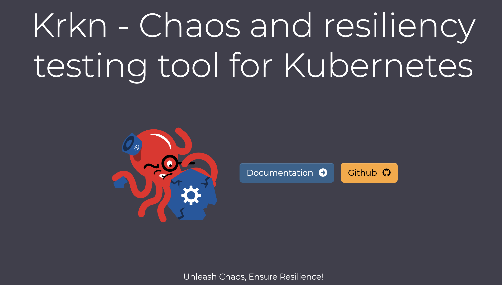
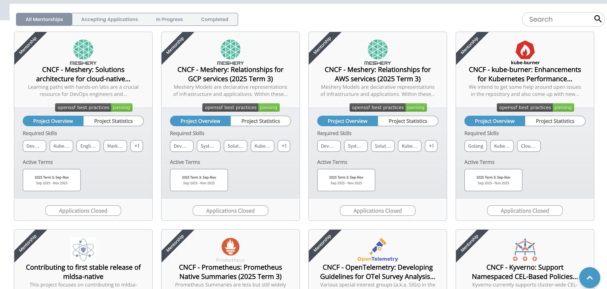
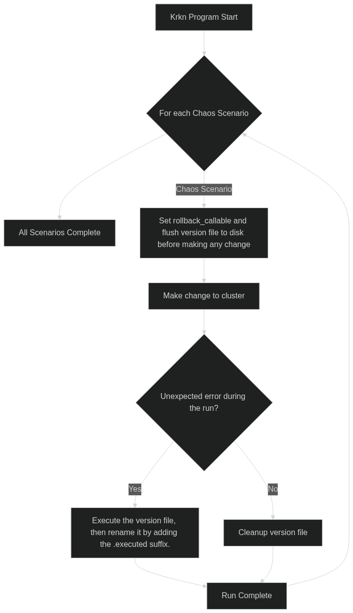

## What is LFX Mentorship

[The Linux Foundation](https://www.linuxfoundation.org/) [LFX Mentorship](https://docs.linuxfoundation.org/lfx/mentorship) is a **[paid](https://docs.linuxfoundation.org/lfx/mentorship/mentee-stipends) internship program for open source projects**, similar to [Google Summer of Code](https://summerofcode.withgoogle.com/), but LFX Mentorship **has three terms each year**:

- **Term 1**: March - May
- **Term 2**: June - August
- **Term 3**: September - November

Each term features different projects from organizations like [CNCF](https://www.cncf.io/), [RISC-V](https://riscv.org/), or [Linux Kernel](https://www.kernel.org/), and **each project has a mentor**.
A single project may open multiple positions in the same term, and you can apply for up to three projects, but **each project only selects one mentee**.

You can find detailed information about each project on [GitHub: cncf/mentoring](https://github.com/cncf/mentoring/tree/main/programs/lfx-mentorship) or the [LFX Mentorship website](https://docs.linuxfoundation.org/lfx/mentorship).

This time, I only applied for the [CNCF Krkn (sandbox)](https://github.com/krkn-chaos/krkn) project, specifically the [CNCF - Krkn: Chaos scenario rollback feature (2025 Term 2)](https://mentorship.lfx.linuxfoundation.org/project/92e42a9c-fc0a-46bf-8ca7-69ad673dcce0), and was fortunate to be selected.


## Introduction to CNCF Krkn (sandbox)

> 
> Krkn is pronounced "Kraken"

[CNCF Krkn (sandbox)](https://github.com/krkn-chaos/krkn) is a chaos and resiliency testing tool designed for Kubernetes, open-sourced by the [Red Hat](https://www.redhat.com/) Chaos Engineering team.

- It tests system resilience by injecting intentional failures into Kubernetes clusters.
- It provides **multiple chaos scenarios** for users to choose from:
  - For example: [resource hogging](https://krkn-chaos.dev/docs/scenarios/hog-scenarios/), [network latency](https://krkn-chaos.dev/docs/scenarios/network-chaos-scenario/), [node failures](https://krkn-chaos.dev/docs/scenarios/node-scenarios/), etc.
  - See the full list at [Krkn Scenarios](https://krkn-chaos.dev/docs/scenarios/)
- It also offers [health checks](https://krkn-chaos.dev/docs/krkn/health-checks/), [telemetry](https://krkn-chaos.dev/docs/krkn/telemetry/), and [performance monitoring](https://krkn-chaos.dev/docs/krkn/config/#performance-monitoring) to help users monitor system status during tests.
- Users only need to adjust the [config.yaml](https://krkn-chaos.dev/docs/krkn/config/#sample-config-file) to set test parameters and targets.

Essentially, Krkn uses Python's Kubernetes Client to create Kubernetes resources (such as Pod, Job, NetworkPolicy, etc.) based on the chaos scenarios specified in `config.yaml`, simulating failure scenarios.

### Project Goal: Chaos Scenario Rollback Feature

As a chaos testing tool for Kubernetes, having a **robust rollback** feature is crucial.

All chaos scenarios are implemented based on the common interface [AbstractScenarioPlugin](https://github.com/krkn-chaos/krkn/blob/main/krkn/scenario_plugins/abstract_scenario_plugin.py#L16).
The goal of this project was to **design and implement a rollback interface applicable to all chaos scenarios**, allowing users to restore the system to its original state after tests or errors.

Since these scenarios ultimately simulate failures by creating Kubernetes resources, the core challenge was to **track these resources** and **correctly delete or restore them** after the test.

## How to Apply for LFX Mentorship

> 
> You can apply for projects directly after registering an account on the [LFX Mentorship website](https://docs.linuxfoundation.org/lfx/mentorship).

For each project application, you need to answer the following questions:

- **Self-introduction**: Includes questions such as
  1. What is your current status? Are you a student or transitioning into a new career?
  2. What are your goals and aspirations?
  3. Why are you interested in this mentorship opportunity?
  4. Tell us something that makes you unique as an applicant.
- **Address**
- **Contact information**: GitHub or LinkedIn
- **Skills**
  - Tag-based form, with an additional paragraph for extra descriptions
- **Cover Letter**: You must answer the following questions and submit as a PDF
  1. How did you find out about our mentorship program?
  2. Why are you interested in this program?
  3. What experience and knowledge/skills do you have that are applicable to this program?
  4. What do you hope to gain from this mentorship experience?

The Cover Letter is **the most critical part**.
In addition to answering the required questions, you can:
- Explain your past experience
- Describe your proposed solution for the project

I wrote a PoC beforehand and explained my design in the Cover Letter, including a link to the PoC branch and key code snippets, with a table of contents at the top to help the mentor quickly find important sections.

## My Proposal: Alembic-like File-based Rollback Mechanism

For this project, I proposed an [Alembic](https://alembic.sqlalchemy.org/)-like state management mechanism based on files, aiming to robustly track and manage the state of Kubernetes resources. The core idea is to serialize each rollback operation (rollback callable) and the corresponding Kubernetes resource state (namespace, pod_name, service_name, etc.) into an executable Python file as a version file, using a nanosecond timestamp as the filename to ensure uniqueness and order. During rollback, **you simply execute these version files in chronological order** to restore previous states step by step.

### Design Considerations for State Management

1. **Store state in memory**
   - If the process crashes, the state cannot be persisted.
2. **Store state in a local database (e.g., SQLite)**
   - This approach is a bit overkill and over-engineered.
3. **Git-like state management**
   - Use commits to record state changes.
   - Kubernetes resource state changes are complex and not easily managed this way.
   - May also record unrelated state changes.
4. **Serialize state as YAML or JSON**
   - The final command to execute the version file would be coupled to each scenario's implementation.
   - Rollback execution would depend on Krkn's code.
5. **[Alembic](https://alembic.sqlalchemy.org/)-like state management**

### Final Design

Ultimately, I implemented **state serialization as Python files**, ensuring:
- Rollback operations are reliably saved to disk even if the main Krkn process fails.
- Version files are readable and clearly record resource identifiers for rollback.
- A clear history is provided.
- Rollback execution is decoupled from scenario implementations:
  - These version files can be executed independently.
  - Execution does not depend on Krkn's scenario implementations.
  - They can be run on any Python environment.

The final **directory structure** is as follows:

- **Versions Directory**: Root directory for all version files, default `/tmp/kraken-rollback`
  - **Rollback Context Directory**: Format `<timestamp (ns)>-<run_uuid>`. Each chaos scenario run generates a unique Run UUID to distinguish rollback contexts.
    - **Version Files**: Named `<chaos_scenario_name>_<timestamp (ns)>_<random_suffix>.py`
- Example:
  ```
  /tmp/kraken-rollback/
  ├── 1755488223093251000-168dce4c-fdb4-4e8c-aa5b-7f919777801b
  │   └── network_chaos_scenarios_1755488221668750000_fphcbojh.py
  ├── 1755496143932815000-7d32bf81-2c0d-4d56-b75b-b0702b2c45f9
  │   └── network_chaos_ng_scenarios_1755496142436906000_btmcxrri.py
  └── 1755523261039221000-0ddd9f07-bcd8-47bc-bf89-f9c4f2503ead
  ```

The complete **Rollback Lifecycle**:

<!-- 
flowchart TD
    Start[Krkn Program Start] --> Loop{For each Chaos Scenario}
    Loop  --> End[All Scenarios Complete]
    Loop -- Chaos Scenario --> RollbackSetup[Set rollback_callable and flush version file to disk before making any change]
    RollbackSetup --> ClusterChange[Make change to cluster]
    ClusterChange --> ErrorCheck{Unexpected error during the run?}
    ErrorCheck -- Yes --> ExecuteRollback[Execute the version file, then rename it by adding the .executed suffix.]
    ExecuteRollback --> RunComplete[Run Complete]
    ErrorCheck -- No --> Cleanup[Cleanup version file]
    Cleanup --> RunComplete
    RunComplete --> Loop
    
-->




### Pull Requests

The final implementation included the following main parts:
- [krkn-chaos/krkn: Core Implementation #853](https://github.com/krkn-chaos/krkn/pull/853) (covered in Perform Rollback, so closed)
- [krkn-chaos/krkn: Perform rollback #879](https://github.com/krkn-chaos/krkn/pull/879)
- [krkn-chaos/krkn: Refactor Execution #895](https://github.com/krkn-chaos/krkn/pull/895/files#diff-888e010c46145bade0dc61bc1f4073634d525d57ffe61901beec9656236b2af9)
- [krkn-chaos/website: Add Overall Documentation #125](https://github.com/krkn-chaos/website/pull/125)

## Collaboration Experience with the Red Hat Chaos Engineering Team

One major advantage of LFX Mentorship is the opportunity to work closely with project maintainers and mentors.
In this project, I was glad to collaborate with members of the **Red Hat Chaos Engineering team** ([@Tullio](https://github.com/tsebastiani), [@Ravi](https://github.com/chaitanyaenr) and [@Paige](https://github.com/paigerube14)), which taught me a lot about real-world chaos engineering use cases and Kubernetes.

The mentors and I were located in Italy, the US, and Taiwan, but we still managed to find a suitable meeting time—Friday nights at 10 PM (UTC+8) in Taiwan.
We also communicated via the [krkn Slack channel](https://kubernetes.slack.com/archives/C05SFMHRWK1).

> 
> Weekly checkpoint meeting at 10 PM (UTC+8)
> Special thanks to [@Tullio](https://github.com/tsebastiani) and [@Ravi](https://github.com/chaitanyaenr) for their discussions and feedback at every meeting.

Since I had already completed the core PoC when applying, our first meeting was to confirm mutual understanding of the proposal.
Subsequent meetings covered:

- **Aligning design details**
  - Rollback lifecycle
  - Signal handler and cleanup design
  - Rollback interface setup
  - Version file and directory structure
  - How to execute version files
- **Feature discussions**
  - Adding `list-rollback` and `execute-rollback` commands
  - Instead of deleting version files, add the `.executed` suffix
- **Code review**
  - Review new and modified implementations since the last meeting
  - Discuss potential issues (thread-safety, API interface)
- **Progress confirmation**
  - Clarify priorities for the next meeting

> 
> I organized TODOs and notes during each checkpoint meeting

### Discussing Real-world CNCF Krkn Use Cases

In the early meetings, I asked my mentors about real-world use cases for CNCF Krkn.
Currently, Krkn is mainly used by the Red Hat Chaos Engineering team to test the resilience and limits of OpenShift, including performance bottlenecks in clusters with thousands of nodes.

Besides Red Hat, [MarketAxess](https://www.marketaxess.com/) also uses and contributes to Krkn.
> [Krkn Adopters](https://github.com/krkn-chaos/krkn/blob/main/ADOPTERS.md)

### API Interface Design Discussion

I spent quite some time with [@Tullio](https://github.com/tsebastiani) discussing the design of the `set_rollback_callable` interface.
Initially, I leaned toward a more extensible design that could serialize various parameters.

However, Tullio offered a different perspective: dynamic parameter serialization for future extensibility was a bit over-engineered.
Since Krkn ultimately creates or modifies Kubernetes resource definitions, and all methods that can execute `set_rollback_callable` are subsets of `AbstractScenarioPlugin`, a cleaner interface is possible.

After some back-and-forth, I understood the mentor's experience and viewpoint.
Whether it's Deployment, Service, Pod, or other Kubernetes resources, they're just identifiers. There's no need to design a complex serialization mechanism for parameter naming like `deployment_name`, `service_name`, `pod_name`, etc.
Dependency injection for the Kubernetes client, namespace, and resource identifier is sufficient.

When designing interfaces, it's important to consider the KISS (Keep It Simple, Stupid) principle and avoid unnecessary complexity.

## Summary

For students, LFX Mentorship is an **international remote internship for contributing to open source projects**.
I highly recommend giving it a try!

**International Communication**

The most interesting part of LFX is collaborating closely with mentors from different countries and cultural backgrounds.
At first, I needed live subtitles on Google Meet to understand, but eventually I could communicate directly, which greatly improved my spoken English.

When contributing to Apache Airflow, most communication is via text in Issues and PRs, with few opportunities for spoken interaction (and the community meetings are usually at midnight Taiwan time).

**Working with Top Maintainers**

Collaborating with the Red Hat Chaos Engineering team gave me deeper insights into cloud native and container technologies.
Working directly with project mentors helped me better understand project requirements and challenges, while also honing my high-level design and low-level implementation skills.

**Paid Open Source Internship**

Although LFX's stipend is adjusted based on [Purchasing Power Parity (PPP)](https://en.wikipedia.org/wiki/Purchasing_power_parity), it's a rare opportunity for students to get paid for open source work.
The stipend is paid in two installments, and in Taiwan, you need to fill out a wire transfer form to receive it.

**From a Maintainer's Perspective**

As an Apache Airflow committer, I better understand what maintainers expect from applicants and the mentor's thought process during code reviews. I always review my own PRs and clearly explain changes to help maintainers quickly grasp my design.

If you can clearly explain the Why, How, and What in your Cover Letter and propose concrete solutions for the project's needs, you'll have a better chance of standing out.

## Reference

- [LFX Mentorship](https://docs.linuxfoundation.org/lfx/mentorship)
- [CNCF Krkn Documentation](https://krkn-chaos.dev/)
- [GitHub: CNCF Krkn (sandbox)](https://github.com/krkn-chaos/krkn)
- [GitHub: Krkn-Chaos (Open Source Tool from Red Hat Chaos Engineering Team)](https://github.com/krkn-chaos)
