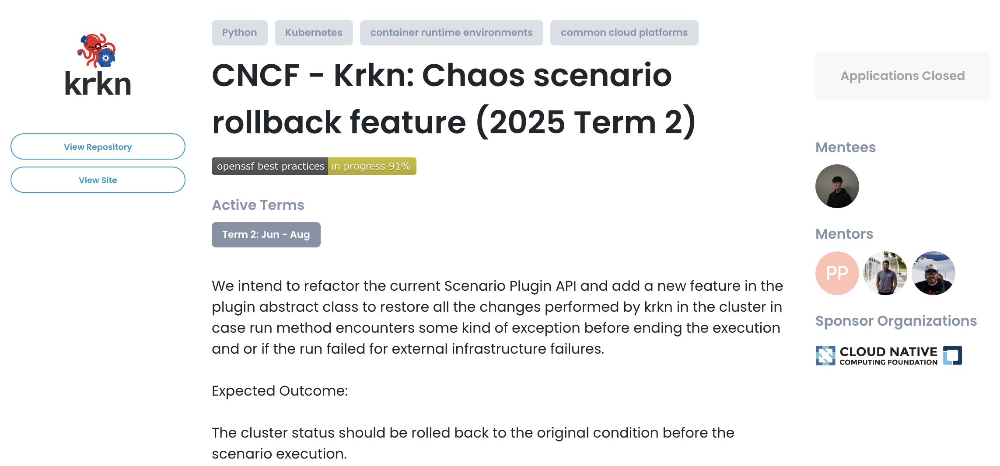
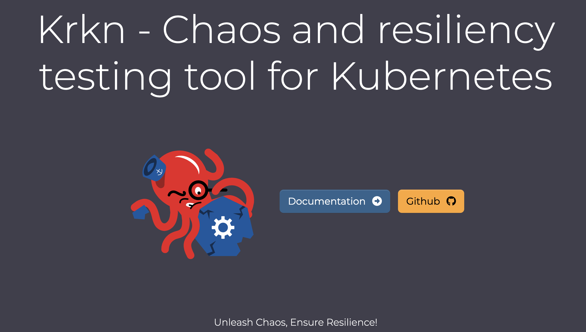
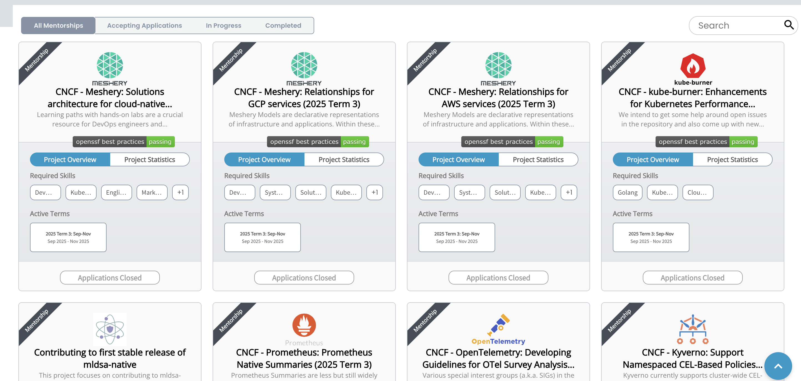
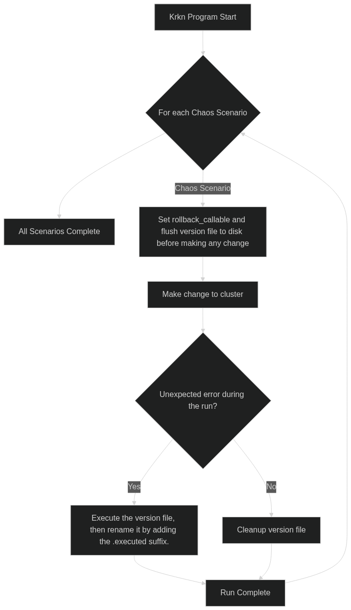
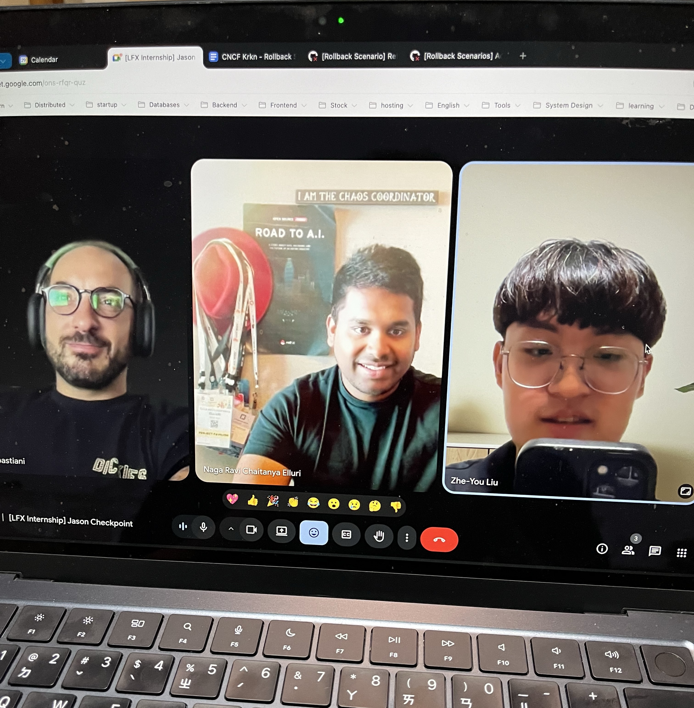
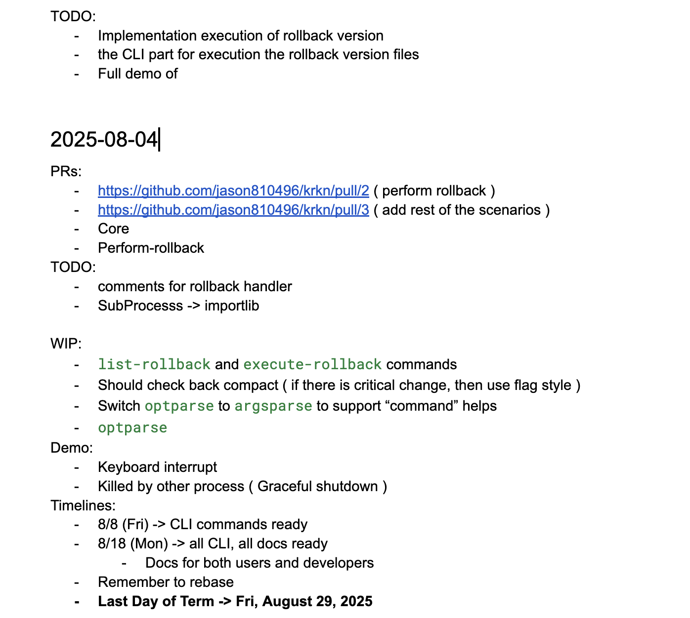

**LFX Mentorship - 在台灣也能與國際頂尖的 Maintainer 合作，做有薪水的開源實習！**

## 什麼是 LFX Mentorship

[The Linux Foundation](https://www.linuxfoundation.org/) 的 [LFX Mentorship](https://docs.linuxfoundation.org/lfx/mentorship) 是一個**做開源專案而且[有薪水](https://docs.linuxfoundation.org/lfx/mentorship/mentee-stipends)的實習計劃**與 [Google Summer of Code](https://summerofcode.withgoogle.com/) 類似，不過 LFX Mentorship **一年有 3 個時段**，分別是：

- **Term 1**: 3 月 - 5 月
- **Term 2**: 6 月 - 8 月
- **Term 3**: 9 月 - 11 月

每季都會有 [CNCF](https://www.cncf.io/)、[RISC-V](https://riscv.org/) 或 [Linux Kernel](https://www.kernel.org/) 的不同項目參與 LFX Mentorship，並且**會有 Mentor 指導**。  
同一個項目也有可能會在同一期開出多個專案，最多可以報名 3 個專案，但是**每個專案只會收一位 Mentee**。  

各個專案的詳細內容可以在 [GitHub: cncf/mentoring](https://github.com/cncf/mentoring/tree/main/programs/lfx-mentorship) 或 [LFX Mentorship 官網](https://docs.linuxfoundation.org/lfx/mentorship) 找到

這次我只有申請 [CNCF Krkn (sandbox)](https://github.com/krkn-chaos/krkn) 項目的 [CNCF - Krkn: Chaos scenario rollback feature (2025 Term 2)](https://mentorship.lfx.linuxfoundation.org/project/92e42a9c-fc0a-46bf-8ca7-69ad673dcce0) 專案，也很幸運剛好有被錄取



## 簡介 CNCF Krkn (sandbox)


> 
> Krkn 發音為 "Kraken"

[CNCF Krkn (sandbox)](https://github.com/krkn-chaos/krkn) 是一個為 Kubernetes 設計的混沌與韌性測試工具 (Chaos and resiliency testing tool)，由 [Red Hat](https://www.redhat.com/) 的 Chaos Engineering 團隊開源。

- 透過對 Kubernetes cluster 注入刻意的失敗，來測試系統的韌性
- 提供**多種混沌情境 (chaos scenarios)**，讓使用者可以選擇不同的測試方式
  - 如：[佔用資源](https://krkn-chaos.dev/docs/scenarios/hog-scenarios/)、[網路延遲](https://krkn-chaos.dev/docs/scenarios/network-chaos-scenario/)、[節點故障](https://krkn-chaos.dev/docs/scenarios/node-scenarios/) 等
  - 完整的情境列表可以參考 [Krkn Scenarios](https://krkn-chaos.dev/docs/scenarios/)
- 也提供[健康檢查](https://krkn-chaos.dev/docs/krkn/health-checks/)、[Telemetry](https://krkn-chaos.dev/docs/krkn/telemetry/)、[效能監控](https://krkn-chaos.dev/docs/krkn/config/#performance-monitoring)等，幫助使用者監控測試過程中的系統狀態
- 使用者只需要透過調整 [config.yaml](https://krkn-chaos.dev/docs/krkn/config/#sample-config-file) 來設定測試參數及對象

[CNCF Krkn (sandbox)](https://github.com/krkn-chaos/krkn) 本質是透過 Python 的 Kubernetes Client 並根據 `config.yaml` 指定的混沌情境來創建 Kubernetes 資源 (如 Pod, Job, NetworkPolicy 等)，並且創建這些資源來模擬失敗情境

### 專案目標：Chaos scenario rollback feature

作為一個 Kubernetes 的混沌測試工具  
能夠**穩健的回滾 (rollback)** 是非常重要的功能

簡介提到的各個混沌情境都是基於 [AbstractScenarioPlugin](https://github.com/krkn-chaos/krkn/blob/main/krkn/scenario_plugins/abstract_scenario_plugin.py#L16) 這個共通介面實作  
這次的專案目標是**設計並實作一個適用於各個混沌情境的回滾介面**  
讓使用者在測試結束後或發生錯誤時，可以正確地將系統恢復到原本的狀態

因為這些混沌情境最終都是透過創建一些 Kubernetes 資源來模擬失敗情境  
所以這次專案的主要核心是在思考要怎麼**追蹤這些資源**  
並且在測試結束後**正確地刪除這些資源**或**恢復到原本的狀態**

## 如何申請 LFX Mentorship

> 
> 直接在 [LFX Mentorship 官網](https://docs.linuxfoundation.org/lfx/mentorship) 註冊帳號後就可以選專案申請

在申請每個專案時，都需要重新填寫以下問題

- **自我介紹**: 會包含以下問題
  1. What is your current status, are you a student/transitioning into a new career?
  2. What are your goals and aspirations? 
  3. Why are you interested in this mentorship opportunity?
  4. Tell us something that makes you unique as an applicant.
- **地址**
- **聯絡方式**: GitHub 或 LinkedIn 
- **Skills**
  - 是填標籤的表單
  - 也有可以填額外的描述的段落表單
- **Cover Letter**: 以下是必須要回答的問題，最後以 PDF 回傳
  1. How did you find out about our mentorship program?
  2. Why are you interested in this program?
  3. What experience and knowledge/skills do you have that are applicable to this program?
  4. What do you hope to get out of this mentorship experience?

Cover Letter 是**最關鍵**的部分  
除了回答必填的問題之外，還可以
- 說明自己過去的經驗
- 講解對於專案的解決方案
  
我自己是寫了一版 PoC 後  
並在 Cover Letter 中說明為什麼要這樣設計，也附上 PoC 的 Branch 連結與比較關鍵的 Code 片段，在開頭加上目錄方便 Mentor 跳到想看的重點

## 我的提案：基於文件的狀態管理回滾機制

在這次專案中，我提出了一個基於文件的 [Alembic](https://alembic.sqlalchemy.org/)-like 狀態管理機制，主要目的是為了能夠更穩健地追蹤和管理 Kubernetes 資源的狀態。這個機制的核心思想是將每個 rollback 操作 (rollback callable) 和相對應的 Kubernetes 資源狀態 (namespace, pod_name, service_name ... ) 都**序列化到一個可執行的 Python 檔案**作為版本文件 (version file)，並以奈秒級 (nano second) 時間戳 (timestamp) 做為檔案名稱，確保每個版本文件都是唯一且有序的。 在 rollback 時，**只需要按照時間順序執行這些版本文件**，就能夠依序回滾到之前的狀態。

### 設計狀態管理的考量

1. **直接把狀態存在記憶體 (memory)**
  - 如果 process crash 後就沒辦法持久狀態
2. **直接把狀態存在本地的資料庫 (如 SQLite)**
  - 有一點 overkill 也 over-engineered
3. **git like 的方式管理狀態變化**
  - 透過 commit 的方式來記錄狀態變化
  - 但 Kubernetes 的資源狀態變化相對複雜，不容易用 git 的方式來管理
  - 也會保存到與該混沌測試無關的其他狀態改變
4. **以 yaml 或 json 的方式來序列化狀態**
  - 以最後執行 version file 的 command 會與各個混沌情境的實作耦合
  - 執行 rollback 會依賴 Krkn 的程式碼
5. **以 [Alembic](https://alembic.sqlalchemy.org/) 的方式來管理狀態**

### 最終設計

最後**以 Python 檔案的方式來序列化狀態**實作，這樣可以保證
- 回滾操作即使在 Krkn 主程式意外失敗時，也能可靠地保存至 Disk
- Version files 以開發者可閱讀的格式清楚記錄
  - 可以識別並在 rollback 時還原的 resource identifier
- 提供清楚的歷史紀錄
- Decouple 實際執行 rollback 與各個混沌情境的實作
  - 這些 version files 可以被獨立地執行
  - 在執行時，也不需要依賴 Krkn 中各個混沌情境的實作
  - 甚至可以在任意有 Python 環境上執行


而最後**定義的目錄結構**如下

- **Versions Directory**: 所有版本檔案的根目錄，預設為 `/tmp/kraken-rollback`
  - **Rollback Context Directory**: 格式為 `<timestamp (ns)>-<run_uuid>` 由於每次 chaos scenario 的 Run 都會產生一個獨特的 Run UUID，這個 UUID 用於區別 rollback 操作的 context
    - **Version Files**: 每個版本檔案的命名格式為 `<chaos_scenario_name>_<timestamp (ns)>_<random_suffix>.py`
- 會像是
  ```
  /tmp/kraken-rollback/
  ├── 1755488223093251000-168dce4c-fdb4-4e8c-aa5b-7f919777801b
  │   └── network_chaos_scenarios_1755488221668750000_fphcbojh.py
  ├── 1755496143932815000-7d32bf81-2c0d-4d56-b75b-b0702b2c45f9
  │   └── network_chaos_ng_scenarios_1755496142436906000_btmcxrri.py
  └── 1755523261039221000-0ddd9f07-bcd8-47bc-bf89-f9c4f2503ead
  ```


完整 **Rollback 生命週期**如下：

<!-- 
flowchart TD
    Start[Krkn Program Start] --> Loop{For each Chaos Scenario}
    Loop  --> End[All Scenarios Complete]
    Loop -- Chaos Scenario --> RollbackSetup[Set rollback_callable and flush version file to disk before making any change]
    RollbackSetup --> ClusterChange[Make change to cluster]
    ClusterChange --> ErrorCheck{Unexpected error during the run?}
    ErrorCheck -- Yes --> ExecuteRollback[Execute the version file, then rename it by adding the .executed suffix.]
    ExecuteRollback --> RunComplete[Run Complete]
    ErrorCheck -- No --> Cleanup[Cleanup version file]
    Cleanup --> RunComplete
    RunComplete --> Loop
    
-->




### Pull Requests

最後的實作中，主要包含以下幾個部分：
- [krkn-chaos/krkn: Core Implementation #853](https://github.com/krkn-chaos/krkn/pull/853) (涵蓋在 Perform Rollback 的所以 closed 掉)
- [krkn-chaos/krkn: Perform rollback #879](https://github.com/krkn-chaos/krkn/pull/879)
- [krkn-chaos/krkn: Refactor Execution #895](https://github.com/krkn-chaos/krkn/pull/895/files#diff-888e010c46145bade0dc61bc1f4073634d525d57ffe61901beec9656236b2af9)
- [krkn-chaos/website: Add Overall Documentation #125](https://github.com/krkn-chaos/website/pull/125)

## 與 Red Hat Chaos Engineering 團隊的合作經驗

LFX Mentorship 的一大優勢是能夠直接與專案的 Maintainer 和 Mentor 有更密切的合作。
在這次專案中，很開心能與 **Red Hat Chaos Engineering 團隊**的成員合作（[@Tullio](https://github.com/tsebastiani)、[@Ravi](https://github.com/chaitanyaenr) 和 [@Paige](https://github.com/paigerube14)），這讓我學到了很多關於混沌工程實際的使用案例和 Kubernetes 的知識。

時區方面，Mentors 與我分別在義大利、美國與台灣，但我們還是能找到共同適合開會的時間！最後是訂在每週五晚上台灣時間 10 點 (UTC+8)  
也會在 [krkn 的 Slack 頻道](https://kubernetes.slack.com/archives/C05SFMHRWK1) 線下聯絡

> 
> 每週五晚上 10 點 (UTC+8) 的 Checkpoint Meeting  
> 非常感謝 [@Tullio](https://github.com/tsebastiani) 和 [@Ravi](https://github.com/chaitanyaenr) 每次會議的討論與 feedback  

因為在申請專案時就有做完核心的 PoC，也在第一次會議確認雙方對提案的理解都是一致的    
接下來的會議我們討論涵蓋：

- **對齊設計細節**
  - Rollback 的整體生命週期
  - Signal Handler 與 Cleanup 的設計
  - 設定 Rollback 的介面
  - 版本文件 (version file) 與目錄結構
  - 如何執行版本文件
- **新增功能討論**
  - 新增 `list-rollback` 和 `execute-rollback` commands
  - 不直接刪除版本文件，而是加上 `.executed` 後綴
- **過 Code Review** 
  - 過上一次會議後多新增、修改的實作
  - 討論潛在的問題 (Thread-safety, API 介面)
- **確認實作進度**
  - 釐清 TODO 的優先順序
  - 確認下次會議前的目標

> 
> 在每次 checkpoint 會議的同時我會順邊整理 TODO 和其他筆記

### 討論 CNCF Krkn 實際的案例

在前幾次的會議我請教 Mentor 關於 CNCF Krkn 的實際應用案例  
現在 CNCF Krkn 主要是被 Red Hat Chaos Engineering 團隊用來測試 OpenShift 的韌性與極限，有拿 Krkn 來測試數千個 Node 的 Openshift 集群的效能瓶頸  

目前除了 Red Hat 也有 [MarketAxess](https://www.marketaxess.com/) 這家公司在使用及貢獻 Krkn
> [Krkn Adopters](https://github.com/krkn-chaos/krkn/blob/main/ADOPTERS.md)

### 討論 API 介面設計

最一開始花蠻多時間與 [@Tullio](https://github.com/tsebastiani) 討論 `set_rollback_callable` 的介面設計  
一開始我請向於更有擴展性、能針對各種參數做序列化的設計  

但 Tullio 提出了不同的看法，為了未來的擴展性做動態參數的序列化有一點 over-engineered  
因為 Krkn 最終都是創建、修改 Kubernetes 資源的定義  
而且能夠執行 `set_rollback_callable` 的 method 也都會是 `AbstractScenarioPlugin` 的子集，所以一定有辦法找到更乾淨的介面

在一段來回溝通才理解到 Mentor 的經驗與視角  
確實無論是 Deployment、Service、Pod 還是其他 Kubernetes 資源  
終究只是一個 identifier 而已，不用特別為了能夠以 `deployment_name`, `service_name`, `pod_name` 等 parameter naming 而設計一個複雜的序列化機制  
只需要有 Kubernetes Client 的依賴注入、namespace、resource identifier 其實就足夠了

在設計介面時，可以再多想一下從 KISS (Keep It Simple, Stupid) 的角度出發，避免不必要的複雜性。


## 總結

對學生來說 LFX Mentorship 是一個**貢獻開源專案的國際遠端實習**
非常推薦大家可以嘗試申請！

**國際溝通**

LFX 實習計畫最有趣的部分就是可以與來自不同國家、不同文化背景的 Mentor 一起密切合作  
從一開始還是需要開 Google Meet 的即時字幕才能聽懂到後來可以直接通懂，這讓我在英文口語溝通上有了很大的進步  

在貢獻 Apache Airflow 主要都是透過在 Issue 和 PR 的文字溝通  
不會遇到太多口語溝通的機會 (也剛好是 Airflow 的社群會議時間都在台灣的半夜)

**與頂尖的 Maintainer 合作**

這次與 Red Hat 的 Chaos Engineering 團隊合作，讓我了解更多關於 Cloud Native 和 Container 底層的知識。
而且直接與專案的 Mentor 合作，這讓我能夠更深入地了解專案的需求和挑戰，同時也邊琢磨自己在 High level 設計和 Low level 實作的能力。

**有薪水的開源實習**

雖然 LFX 的薪水會根據 [購買力平價 (PPP)](https://en.wikipedia.org/wiki/Purchasing_power_parity) 來調整  
但對於學生來說有薪水的開源實習機會也是非常難得的  
總共分兩期給，在台灣的話會需要填電匯單才能收款


**從 Maintainer 的角度出發**

同時也是 Apache Airflow 的 committer，也比較能夠知道 Maintainer 對於申請者的期待和理解 Mentor 在 Code Review 時的思考邏輯。在發 PR 時也會先自己 Code Review 一遍也清楚說明改動，讓 Maintainer 能更快的理解我的設計思路  

在提案的 Cover Letter 中如果能夠清楚地解釋 Why、How、What，並且能夠針對專案的需求提出具體的解決方案應該是有助於被看見的。

## Reference

- [LFX Mentorship](https://docs.linuxfoundation.org/lfx/mentorship)
- [CNCF Krkn Documentation](https://krkn-chaos.dev/)
- [GitHub: CNCF Krkn (sandbox)](https://github.com/krkn-chaos/krkn)
- [GitHub: Krkn-Chaos (Open Source Tool from Red Hat Chaos Engineering Team)](https://github.com/krkn-chaos)
