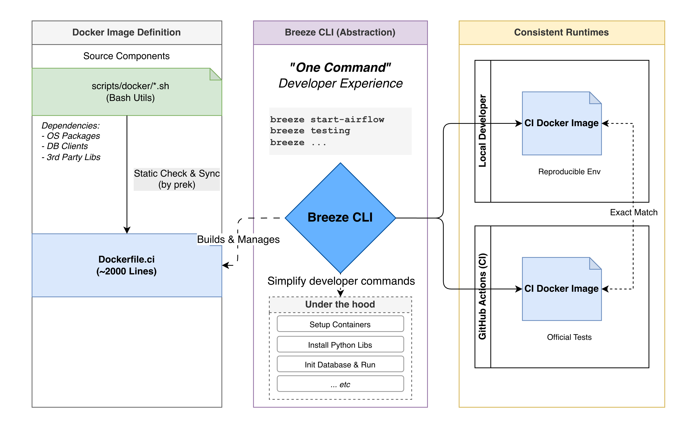

# Apache Airflow 的持續整合系統

持續整合作 (CI, Continuous Integration) 是作為保證大型軟體品質的重要一環，任何微小的 fix, new feature 或即使是修改一行文件都會經過規模大小不一的整合測試 (integration tests) 來確保不會破壞現有的功能，保證軟體的穩定性與可靠性。

以上個月 (2025 年 12 月) 到今天 (2026 年 1 月 14 日) 為例，**即使是在聖誕和新年假期**，Apache Airflow 合併**超過 600 個 PR**，而每個 PR 都會觸發 CI 系統來執行測試。這些測試涵蓋了從單元測試 (unit tests) 到系統測試 (system tests)，確保每一個改動都不會引入新的錯誤。


在個一個月內，總共跑了超過 **兩十萬 次 GitHub Action Jobs**，跑了接近 **三百萬分鐘的測試時間 (約等於 2000 天)**。這代表每一個對 CI 的優化都能夠大幅減少整體的測試時間和資源消耗，讓開發者能夠更快地收到回饋，提升開發效率。

這篇文章將介紹 Apache Airflow 的 CI 系統架構，並說明 Apache Airflow 的 CI 是如何達到

- **Remote 和 Local 執行環境的一致性與可重現性**
- **如何動態且最大程度自動化的根據 PR 的內容來決定要跑哪些測試**
- **可組合 (Composable) 的 CI 工作流程設計**
- **提升開發者體驗 (Developer Experience, DX)**


## 環境的一致性

為了避免「在我電腦上可以跑」的問題，Apache Airflow 的 CI 使用 **`Docker`** 來確保每一個測試環境的一致性。無論是開發者在本地，還是在 GitHub Actions 上正式的執行 CI 測試，都使用專門的 Docker 映像檔 (Docker Images)，確保環境的一致性和可重現性。

> 
> ["It worked on my computer"](https://www.reddit.com/r/ProgrammerHumor/comments/ts6d8s/it_worked_on_my_computer/)

專門給 CI 使用的 Dockerfile 大約 **2000** 行的，是由靜態檢查把 [ 多個位於 `scripts/docker` 的 bash scripts ](https://github.com/apache/airflow/tree/26a9d3b81b1d514ac00476885ba29676cd8f27e6/scripts/docker) 同步到最終 [Dockerfile.ci](https://github.com/apache/airflow/blob/26a9d3b81b1d514ac00476885ba29676cd8f27e6/Dockerfile.ci#L1-L2)。能夠更模組化的使用共用 bash utils 來下載不同第三方服務需要的 dependencies (OS, packaging, 各種 DB client libraries, 第三方服務的 client libraries 等等)。


## Apache Airflow CI 和 Developer Experience 的關鍵框架 - Breeze

> [!quote] **開發者體驗 (Developer Experience)**
> 我們當然可以給出詳細需要下完哪 n 個 command 來設定系統或安裝完本地 dependencies 的文件
> 但如果能夠有一個**多抽象一層、封裝更好的 CLI 工具**  
> 讓開發者**只需要執行一個 command** 就能夠完成所有的安裝和設定
> 
> 這樣不只提升貢獻者的開發者體驗  
> 同時也減少
> - 需要維護多份環境設定文件
> - Local 環境設置步驟與實際 CI 環境的不一致性的風險



[Breeze](https://github.com/apache/airflow/tree/main/dev/breeze) 就是達到以上概念 **專門為貢獻 Apache Airflow 而設計的 CLI 工具**，它提供了一個統一的介面來管理開發和測試環境。Breeze 允許開發者在本地機器上模擬 CI 環境、一鍵啟動 Airflow 並且能夠執行各種測試和檢查.

- 提供簡單的命令來啟動和管理開發環境
- 自動化常見靜態檢查和測試流程
- 讓正式的 CI 環境也使用與 Local 完全相同的設定和流程來執行測試: **確保本地可以重現正式 CI 環境**
  - [如 `breeze ci-image load --from-pr 12345 --python 3.10 --github-token <your_github_token>`](https://github.com/apache/airflow/blob/7bb3f203c24fca914cd296af47d6f00fa735feba/dev/breeze/doc/ci/07_running_ci_locally.md#getting-the-ci-image-from-failing-job)

## 有哪些測試類型來保證持續整合的品質？

Apache Airflow CI 系統定義的測試類型大約有 20 多種，主要分為以下幾個範圍：

**核心測試:**

- 單元測試
- API 測試
- 系統測試


**子系統測試:**

- UI 測試 / UI E2E 測試
- Helm 測試
- Kubernetes 測試
- Go SDK 測試
- Task SDK 測試 / Task SDK 整合測試
- Airflow CTL 測試 / Airflow CTL 整合測試
- WWW 測試

**靜態檢查和掃描:**

- MyPy (型別檢查)
- Python Scans
- JavaScript Scans
- API Codegen
- CodeQL Scans

**其他特定測試:**
- Amazon System Tests
- Providers 相容性測試 (**會以 Airflow 的不同版本來測試該 Provider 修改後的相容性**)
- Coverage

完整的測試類型可以參考 [FileGroupForCi](https://github.com/apache/airflow/blob/26a9d3b81b1d514ac00476885ba29676cd8f27e6/dev/breeze/src/airflow_breeze/utils/selective_checks.py#L101-L137) 的定義。  

像是在近期 Airflow 才引入 [Airflow E2E Test](https://github.com/apache/airflow/blob/7524107bf5ca6254abf43e024c33c1fb5e1dd7c6/.github/workflows/airflow-e2e-tests.yml#L20-L21) 來保證如 [Remote Logging](https://airflow.apache.org/docs/apache-airflow/3.1.6/administration-and-deployment/logging-monitoring/logging-tasks.html) 這種需要和外部系統互動的功能能夠正常運作，和由 Playwright 撰寫的 [UI End-to-End Tests](https://github.com/apache/airflow/blob/7524107bf5ca6254abf43e024c33c1fb5e1dd7c6/.github/workflows/ui-e2e-tests.yml#L20-L21) 來降低在新增許多新 UI 功能後導致 UI regression 的風險。

> 所以 Airflow E2E Tests 和 UI E2E Tests 都是目前還有許多貢獻空間的測試類型！  
> 並且最近新增的 Airflow E2E Tests 確實有預先抓到過其他 unit test 和 system test 沒有抓到的 bug，如: [Move Airflow Config Parser to shared library #57744](https://github.com/apache/airflow/pull/57744)  
> 尤其是現在 Airflow 3 正在做許多 client/server 架構的 migration/重構，所以 E2E Tests 的重要性會越來越高。

## 如何歸類該 PR 的改動屬於那些子系統？

Apache Airflow 使用 [@kaxil](https://github.com/kaxil) 開發的 [boring-cyborg](https://github.com/kaxil/boring-cyborg) 根據路徑來自動標相對應的 PR Labels。 如各個核心的子系統 `area:CLI`, `area:API`, `area:Scheduler` 又或是各種第三方整合的 providers 如 `provider:apache-cassandra`, `provider:apache-iceberg` 等等。

不過目前自動標的 PR Labels 並沒有直接被 Airflow CI 使用，主要是被 Providers Release 使用到。

## 一些對於 Airflow CI 來說關鍵的 GitHub Actions 功能

這邊會以兩個問題來說明 Airflow CI 最關鍵的地方

### 要如何在 Jobs 之間傳遞資訊？

**GitHub Actions 要如何做到 Airflow XCom？**  
上游的 job 可以定義 `jobs.<job_id>.outputs` 來定義要輸出變數  

**upstream job example**

```yaml
jobs:
  upstream-job:
    runs-on: ubuntu-latest
    outputs:
      output1: ${{ steps.step1.outputs.test }}
      output2: ${{ steps.step2.outputs.test }}
    steps:
      - id: step1
        run: echo "test=hello" >> "$GITHUB_OUTPUT"
      - id: step2
        run: echo "test=world" >> "$GITHUB_OUTPUT"
```

只要在 steps 中執行的任何 command 能夠 redirect 變數到 `$GITHUB_OUTPUT` ，就能夠被定義成 job 的輸出變數。  
如: 我們也可以執行一個 python script 並將結果寫入 `$GITHUB_OUTPUT`。

```python
# generate_upstream_outputs.py
import os

if __name__ == "__main__":
  with open(os.environ['GITHUB_OUTPUT'], 'a') as f:
    for i in range(3):
      f.write(f"output{i}=value-{i}\n")
```

即使是用 script 動態產生的輸出變數，還是需要在 `jobs.<job_id>.outputs` 中定義要需要輸出給其他下游 job 的變數名稱。  
以這個範例來說，雖然 `generate_upstream_outputs.py` 會產生 `output0`, `output1`, `output2` 三個輸出變數，但只有 `output1` 和 `output2` 被定義在 `jobs.upstream-job.outputs` 中，所以下游 job 只能存取到這兩個變數。

```yaml
jobs:
  upstream-job:
    runs-on: ubuntu-latest
    outputs:
      # downstream job can only access outputs defined here
      # so the `generate-outputs.outputs.output0` is not accessible
      output1: ${{ steps.generate-outputs.outputs.output1 }}
      output2: ${{ steps.generate-outputs.outputs.output2 }}
    steps:
      - id: generate-outputs
        run: python generate_upstream_outputs.py
```

**downstream job example**

然後在下游的 job 使用 `needs.<job_id>.outputs.<output_name>` 來取得上游 job 的輸出變數。

```yaml
jobs:
# Assuming upstream-job is defined above
  downstream-job:
    runs-on: ubuntu-latest
    needs: [upstream-job] # We need to declare the dependency here !!!
    steps:
      - name: Use outputs from upstream job
        run: |
          echo "Output 1: ${{ needs.upstream-job.outputs.output1 }}"
          echo "Output 2: ${{ needs.upstream-job.outputs.output2 }}"
```

- https://docs.github.com/en/actions/how-tos/write-workflows/choose-what-workflows-do/pass-job-outputs
- https://docs.github.com/en/actions/reference/workflows-and-actions/workflow-syntax#jobsjob_idoutputs
- https://docs.github.com/en/actions/reference/workflows-and-actions/workflow-syntax#jobsjob_idneeds

### 要如何只跑特定的 Job？

**GitHub Actions 要如何做到 Airflow 的 Condition？**  
可以透過 `jobs.<job_id>.if` 來定義 job 執行的條件。

**example**

```yaml
jobs:
  conditional-job:
    runs-on: ubuntu-latest
    if: ${{ github.event_name == 'pull_request' && contains(github.event.pull_request.labels.*.name, 'run-conditional-job') }}
    steps:
      - name: Run only on PRs with specific label
        run: echo "This job runs only on PRs with 'run-conditional-job' label."
```

- https://docs.github.com/en/actions/reference/workflows-and-actions/workflow-syntax#jobsjob_idif


## 為測試剪枝 - Selective Checks 機制


如文章最一開頭，每個月都會有**數十萬次的 GitHub Action Jobs** 被觸發執行，所以應該要有自動化的機制來**根據 PR 的內容來決定要跑哪些測試**，以避免不必要的測試浪費資源和時間。

> 我們應該不希望因為改官方文檔而觸發 Kubernetes System Tests 這種需要大量資源的測試對吧？  
> 相對應的，如果是改動到 Kubernetes 相關的程式碼，卻沒有觸發 Kubernetes System Tests，那就糟糕了。

我一開始以為 Selective Checks 主要是根據 PR 上由 boring bot 自動標的 PR Label 來決定要跑哪些測試。但實際上 Selective Checks **主要是根據當前 PR 所更改到的檔案範圍**來決定要跑哪些測試，PR Label 只是其中一個輔助的資訊來源之一。


而在 GitHub Action 中是透過 `build-info` 這個 job 來執行 Selective Checks，並將結果輸出成多個 flags 供下游的各個子系統測試 job 使用。

```yaml
jobs:
# ...
  build-info:
    # At build-info stage we do not yet have outputs so we need to hard-code the runs-on to public runners
    outputs:
      # ...
      run-api-codegen: ${{ steps.selective-checks.outputs.run-api-codegen }}
      run-api-tests: ${{ steps.selective-checks.outputs.run-api-tests }}
      run-coverage: ${{ steps.source-run-info.outputs.run-coverage }}
      run-go-sdk-tests: ${{ steps.selective-checks.outputs.run-go-sdk-tests }}
      run-helm-tests: ${{ steps.selective-checks.outputs.run-helm-tests }}
      run-kubernetes-tests: ${{ steps.selective-checks.outputs.run-kubernetes-tests }}
      run-mypy: ${{ steps.selective-checks.outputs.run-mypy }}
      run-system-tests: ${{ steps.selective-checks.outputs.run-system-tests }}
      run-task-sdk-tests: ${{ steps.selective-checks.outputs.run-task-sdk-tests }}
      run-task-sdk-integration-tests: ${{ steps.selective-checks.outputs.run-task-sdk-integration-tests }}
      runner-type: ${{ steps.selective-checks.outputs.runner-type }}
      run-ui-tests: ${{ steps.selective-checks.outputs.run-ui-tests }}
      run-ui-e2e-tests: ${{ steps.selective-checks.outputs.run-ui-e2e-tests }}
      run-unit-tests: ${{ steps.selective-checks.outputs.run-unit-tests }}
      run-www-tests: ${{ steps.selective-checks.outputs.run-www-tests }}
      # ...
    steps:
    # some setup steps ...
    - name: "Install Breeze"
      uses: ./.github/actions/breeze
      id: breeze
    - name: "Get information about the Workflow"
      id: source-run-info
      run: breeze ci get-workflow-info 2>> ${GITHUB_OUTPUT}
      env:
        SKIP_BREEZE_SELF_UPGRADE_CHECK: "true"
    - name: Selective checks
      id: selective-checks
      env:
        PR_LABELS: "${{ steps.source-run-info.outputs.pr-labels }}"
        COMMIT_REF: "${{ github.sha }}"
        VERBOSE: "false"
      run: breeze ci selective-check 2>> ${GITHUB_OUTPUT}
```

[Remove experimental note from EdgeExecutor #10714](https://github.com/apache/airflow/actions/runs/20952103684/job/60207742385?pr=60446) 以這個 PR 為例，`build-info` job 的詳細執行結果:

> [!note]+ `breeze ci get-workflow-info 2>> ${GITHUB_OUTPUT}` 拿到的實際內容
> 
>  ```bash
> pr-labels = ['backport-to-v3-1-test']
> target-repo = apache/airflow
> head-repo = eladkal/airflow
> pr-number = 60446
> event-name = pull_request
> runs-on = ["ubuntu-22.04"]
> canary-run = false
> run-coverage = false
> head-ref = edge
> ```


> [!note]+ `breeze ci selective-check 2>> ${GITHUB_OUTPUT}` 執行結果
>  
> `GITHUB_OUTPUT` 內容 (`stderr` 被重定向到 `${GITHUB_OUTPUT}`)
> ```bash
> all-python-versions = ['3.10']
> all-python-versions-list-as-string = 3.10
> all-versions = false
> amd-runners = ["ubuntu-22.04"]
> any-provider-yaml-or-pyproject-toml-changed = false
> arm-runners = ["ubuntu-22.04-arm"]
> ['airflow-core/docs/core-concepts/executor/index.rst']
> basic-checks-only = false
> ci-image-build = true
> common-compat-changed-without-next-version = false
> core-test-types-list-as-strings-in-json = [{"description": "API...Serialization", "test_types": "API Always CLI Core Other Serialization"}]
> debug-resources = false
> default-branch = main
> default-constraints-branch = constraints-main
> default-helm-version = v3.17.3
> default-kind-version = v0.30.0
> default-kubernetes-version = v1.30.13
> default-mysql-version = 8.0
> default-postgres-version = 14
> default-python-version = 3.10
> disable-airflow-repo-cache = false
> prod-image-build = false
> provider-dependency-bump = false
> providers-compatibility-tests-matrix = [{"python-version": "3.10", "airflow-version": "2.11.0", "remove-providers": "common.messaging edge3 fab git keycloak", "run-unit-tests": "true"}, 
> {"python-version": "3.10", "airflow-version": "3.0.6", "remove-providers": "", "run-unit-tests": "true"}, {"python-version": "3.10", "airflow-version": "3.1.5", "remove-providers": "", "run-unit-tests":
> "true"}]
> providers-test-types-list-as-strings-in-json = null
> pyproject-toml-changed = false
> python-versions = ['3.10']
> python-versions-list-as-string = 3.10
> run-airflow-ctl-integration-tests = false
> run-airflow-ctl-tests = false
> run-amazon-tests = false
> run-api-codegen = false
> run-api-tests = false
> run-go-sdk-tests = false
> run-helm-tests = false
> run-javascript-scans = false
> run-kubernetes-tests = false
> run-mypy = false
> run-ol-tests = false
> run-python-scans = false
> run-system-tests = true
> run-task-sdk-integration-tests = false
> run-task-sdk-tests = false
> run-ui-e2e-tests = false
> run-ui-tests = false
> run-unit-tests = true
> runner-type = ["ubuntu-22.04"]
> shared-distributions-as-json = ["secrets_masker", "plugins_manager", "secrets_backend", "listeners", "dagnode", "configuration", "module_loading", "logging", "timezones", "observability"]
> skip-prek-hooks = check-provider-yaml-valid,flynt,identity,lint-helm-chart,ts-compile-lint-simple-auth-manager-ui,ts-compile-lint-ui
> skip-providers-tests = true
> sqlite-exclude = []
> testable-core-integrations = ['kerberos', 'redis']
> testable-providers-integrations = ['celery', 'cassandra', 'drill', 'tinkerpop', 'kafka', 'mongo', 'pinot', 'qdrant', 'redis', 'trino', 'ydb']
> ui-english-translation-changed = false
> upgrade-to-newer-dependencies = false
> ```
>
> `stdout` 內容:
> ```
> Changed files:
>
> ('airflow-core/docs/core-concepts/executor/index.rst',)
> FileGroupForCi.ENVIRONMENT_FILES did not match any file.
> FileGroupForCi.API_FILES did not match any file.
> FileGroupForCi.GIT_PROVIDER_FILES did not match any file.
> FileGroupForCi.STANDARD_PROVIDER_FILES did not match any file.
> FileGroupForCi.TESTS_UTILS_FILES did not match any file.
> FileGroupForCi.ALL_SOURCE_FILES matched 1 files.
> ['airflow-core/docs/core-concepts/executor/index.rst']
> FileGroupForCi.UI_FILES did not match any file.
> FileGroupForCi.ALL_SOURCE_FILES enabled because it matched 1 changed files
> SelectiveCoreTestType.API did not match any file.
> SelectiveCoreTestType.CLI did not match any file.
> SelectiveCoreTestType.SERIALIZATION did not match any file.
> FileGroupForCi.KUBERNETES_FILES did not match any file.
> FileGroupForCi.SYSTEM_TEST_FILES did not match any file.
> FileGroupForCi.ALL_PROVIDERS_PYTHON_FILES did not match any file.
> FileGroupForCi.ALL_PROVIDERS_DISTRIBUTION_CONFIG_FILES did not match any file.
> FileGroupForCi.ALWAYS_TESTS_FILES did not match any file.
> Remaining non test/always files: 1
> We should run all core tests except providers.There are 1 changed files that seems to fall into Core/Other category
> {'airflow-core/docs/core-concepts/executor/index.rst'}
> Selected core test type candidates to run:
> ['API', 'Always', 'CLI', 'Core', 'Other', 'Serialization']
> FileGroupForCi.DOC_FILES matched 1 files.
> ['airflow-core/docs/core-concepts/executor/index.rst']
> FileGroupForCi.DOC_FILES enabled because it matched 1 changed files
> FileGroupForCi.API_FILES disabled because it did not match any changed files
> FileGroupForCi.ASSET_FILES did not match any file.
> FileGroupForCi.ASSET_FILES disabled because it did not match any changed files
> FileGroupForCi.ALL_PYPROJECT_TOML_FILES did not match any file.
> FileGroupForCi.TASK_SDK_FILES did not match any file.
> FileGroupForCi.TASK_SDK_FILES disabled because it did not match any changed files
> FileGroupForCi.DEVEL_TOML_FILES did not match any file.
> FileGroupForCi.ALL_AIRFLOW_PYTHON_FILES did not match any file.
> FileGroupForCi.ALL_DEV_PYTHON_FILES did not match any file.
> FileGroupForCi.ALL_DEVEL_COMMON_PYTHON_FILES did not match any file.
> FileGroupForCi.ALL_AIRFLOW_CTL_PYTHON_FILES did not match any file.
> FileGroupForCi.KUBERNETES_FILES disabled because it did not match any changed files
> FileGroupForCi.HELM_FILES did not match any file.
> FileGroupForCi.HELM_FILES disabled because it did not match any changed files
> FileGroupForCi.TASK_SDK_FILES disabled because it did not match any changed files
> FileGroupForCi.TASK_SDK_INTEGRATION_TEST_FILES did not match any file.
> FileGroupForCi.TASK_SDK_INTEGRATION_TEST_FILES disabled because it did not match any changed files
> FileGroupForCi.AIRFLOW_CTL_FILES did not match any file.
> FileGroupForCi.AIRFLOW_CTL_FILES disabled because it did not match any changed files
> FileGroupForCi.AIRFLOW_CTL_INTEGRATION_TEST_FILES did not match any file.
> FileGroupForCi.AIRFLOW_CTL_INTEGRATION_TEST_FILES disabled because it did not match any changed files
> FileGroupForCi.UI_FILES disabled because it did not match any changed files
> FileGroupForCi.AIRFLOW_CTL_FILES disabled because it did not match any changed files
> FileGroupForCi.API_CODEGEN_FILES did not match any file.
> FileGroupForCi.API_CODEGEN_FILES disabled because it did not match any changed files
> FileGroupForCi.GO_SDK_FILES did not match any file.
> FileGroupForCi.GO_SDK_FILES disabled because it did not match any changed files
> FileGroupForCi.JAVASCRIPT_PRODUCTION_FILES did not match any file.
> FileGroupForCi.JAVASCRIPT_PRODUCTION_FILES disabled because it did not match any changed files
> FileGroupForCi.PYTHON_PRODUCTION_FILES did not match any file.
> FileGroupForCi.PYTHON_PRODUCTION_FILES disabled because it did not match any changed files
> FileGroupForCi.ALL_PYTHON_FILES did not match any file.
> FileGroupForCi.UI_ENGLISH_TRANSLATION_FILES did not match any file.
> ```

- [breeze/doc/ci - README](https://github.com/apache/airflow/tree/main/dev/breeze/doc/ci)
- [`breeze ci selective-check` CLI entrypoint](https://github.com/apache/airflow/blob/26a9d3b81b1d514ac00476885ba29676cd8f27e6/dev/breeze/src/airflow_breeze/commands/ci_commands.py#L260-L271)
- [最核心的 `SelectiveChecks` class - 會列出所有符合某組測試判斷的條件](https://github.com/apache/airflow/blob/26a9d3b81b1d514ac00476885ba29676cd8f27e6/dev/breeze/src/airflow_breeze/utils/selective_checks.py#L448) 
  - [這邊所有的 public property 都會被當作 Selective checks 的 output](https://github.com/apache/airflow/blob/26a9d3b81b1d514ac00476885ba29676cd8f27e6/dev/breeze/src/airflow_breeze/utils/selective_checks.py#L486-L495)

### 各個子系統測試的 Job 定義

各個子系統測試都是依賴 `build-info` job 的輸出變數**再搭配 `jobs.<job_id>.if` 條件**來決定要不要跑這個 Job，就可以有效率的省略不必要的測試。

並且都只有 `needs: [build-info, build-ci-images]`的依賴關係，所以各個子系統測試都是**平行執行的**。

```yaml
jobs:
# ...
  tests-helm:
    name: "Helm tests"
    uses: ./.github/workflows/helm-tests.yml
    needs: [build-info, build-ci-images]
    permissions:
      contents: read
      packages: read
    with:
    # partial list of inputs passed from build-info job
      runners: ${{ needs.build-info.outputs.runner-type }}
      platform: ${{ needs.build-info.outputs.platform }}
      helm-test-packages: ${{ needs.build-info.outputs.helm-test-packages }}
      default-python-version: "${{ needs.build-info.outputs.default-python-version }}"
      use-uv: ${{ needs.build-info.outputs.use-uv }}
    # only if helm tests are required
    # based on the selective checks output
    if: >
      needs.build-info.outputs.run-helm-tests == 'true' &&
      needs.build-info.outputs.default-branch == 'main' &&
      needs.build-info.outputs.latest-versions-only != 'true'
```

- 完整的 [jobs.tests-helm](https://github.com/apache/airflow/blob/26a9d3b81b1d514ac00476885ba29676cd8f27e6/.github/workflows/ci-amd-arm.yml#L381-L382) 定義

### 核心判斷條件


**第一層：全域觸發條件**: 直接執行完整測試

以下任何一條滿足時，**觸發完整測試**：
- **PUSH / SCHEDULE / WORKFLOW_DISPATCH** GitHub 事件
- **缺少 commit_ref** 無法判斷修改範圍
- **pyproject.toml** 或相依性設定檔被修改
- **Provider 相依性** 生成檔案被修改

**第二層：版本選擇**: 決定測試版本範圍

| 標籤 | 版本範圍 |
|------|---------|
| 全域觸發 OR `all versions` | 所有版本 (Python/PostgreSQL/MySQL/Kubernetes) |
| `latest versions only` | 最新版本 |
| `default versions only` 或無標籤 | 預設版本 |

**第三層：測試類型選擇**: 根據更改的檔案決定要跑哪些測試

| 修改檔案類型 | 觸發的測試 |
|-----------|---------|
| 原始碼檔案 | 單元測試、型態檢查 |
| API 相關檔案 | API 測試 |
| UI 檔案 | UI 測試、UI E2E 測試 |
| Kubernetes 設定 | Kubernetes 系統測試、Helm 測試 |
| Task SDK 檔案 | Task SDK 測試 |
| Go SDK 檔案 | Go SDK 測試 |
| Airflow CTL 檔案 | Airflow CTL 測試 |
| 環境/API/Provider 設定 | 執行完整測試 |
| 文件檔案 | 文件建置 |

**第四層：專項檢查**: 靜態檢查和掃描

- **型態檢查 (MyPy)**：修改 Python 檔案時執行
- **JavaScript 靜態掃描**：修改生產環境 JavaScript 檔案時執行
- **安全檢查 (CodeQL)**：修改任何原始碼檔案時執行

**第五層：檢查是否需要 Build CI Image**: 需要時才建置

- 需要執行任何測試 (單元、API、UI、Kubernetes、Helm 等)
- `pyproject.toml` 被修改
- Provider 設定檔被修改


### 實際範例

| 場景 | 修改內容 | 判斷結果 | 執行的測試 |
|------|---------|---------|---------|
| **只修改 UI 檔案** | `frontend/src/App.tsx` | 非完整測試 + 僅 UI 檔案 | 跳過單元測試<br/>執行 UI 測試、UI E2E 測試 |
| **修改 Python 原始碼** | `airflow-core/src/airflow/operators/bash.py` | 非完整測試 + 源代碼檔案符合 | 執行單元測試<br/>執行型態檢查 (MyPy) |
| **修改 pyproject.toml** | `airflow-core/pyproject.toml` | 相依性設定檔被修改 | 完整測試<br/>所有版本 |
| **定時觸發 (Schedule)** | SCHEDULE 事件 | GitHub 事件符合 | 完整測試<br/>所有版本<br/>所有 providers |

## 總結

Apache Airflow 的 CI 系統透過

1. **以 Containerization 確保環境一致性**
2. **以 Breeze CLI 封裝開發流程提升開發者體驗**
3. **利用 GitHub Actions 的 Outputs 和 Conditions 功能實現工作流程的組合性**
4. **透過 Selective Checks 機制根據 PR 內容動態決定測試範圍**

來達到多層次的條件判斷和自動化機制，實現了高效且靈活的持續整合流程。  
其中最重要的 Selective Checks 機制可以盡可能的省略不必要的測試，更詳細的規則參考 [核心判斷條件](#核心判斷條件) 小結。

不過要如何取捨「節省整合測試資源」和「測試的完整性」也是值得討論的問題  
以目前的 Selective Checks 機制來說，其實只要改到 Core 都會跑完整的 Core 測試 (單元測試, API 測試, 系統測試)  
雖然這樣會花比較多的測試資源，但也能夠最大程度確保 Core 的穩定性。  
在[源來適你的 Airflow 會議](https://docs.google.com/document/d/1i0xRWXTYc8UFqWGkklnFVQgK8C3NPmAnY7XUKweZCos/edit?tab=t.0#heading=h.lbmppok7rjhg)跟[嘉平](https://github.com/chia7712)討論到這個問題，結論應該是「**測試完整性優於節省測試資源**」，畢竟為了減少測試資源而犧牲軟體品質是不值得的。

另外一個值得注意的是，幾乎所有子系統測試都是**平行執行**的，但是都依賴 `build-ci-images` 這個 job 來建置 CI Docker Image，所以如果能更進一步減少 `build-ci-images` 的執行時間，將能夠大幅提升整體 CI 流程的速度。

如果想要更詳細了解 Apache Airflow CI 系統，歡迎參考以下資源：

- [@Jarek](https://github.com/potiuk) 的 [Split tests to core/providers/task-sdk/integration/system #43979](https://github.com/apache/airflow/pull/43979) (約有 4000 多行的變更) PR，這是把 CI 系統拆分成多個子系統測試的關鍵 PR。
- [breeze/doc/ci - README](https://github.com/apache/airflow/tree/main/dev/breeze/doc/ci)
- [`breeze ci selective-check` CLI entrypoint](https://github.com/apache/airflow/blob/26a9d3b81b1d514ac00476885ba29676cd8f27e6/dev/breeze/src/airflow_breeze/commands/ci_commands.py#L260-L271)
- [最核心的 `SelectiveChecks` class - 會列出所有符合某組測試判斷的條件](https://github.com/apache/airflow/blob/26a9d3b81b1d514ac00476885ba29676cd8f27e6/dev/breeze/src/airflow_breeze/utils/selective_checks.py#L448) 
  - [這邊所有的 public property 都會被當作 Selective checks 的 output](https://github.com/apache/airflow/blob/26a9d3b81b1d514ac00476885ba29676cd8f27e6/dev/breeze/src/airflow_breeze/utils/selective_checks.py#L486-L495)
- [apache/airflow GitHub Project - CI / DEV ENV planned work](https://github.com/orgs/apache/projects/403)