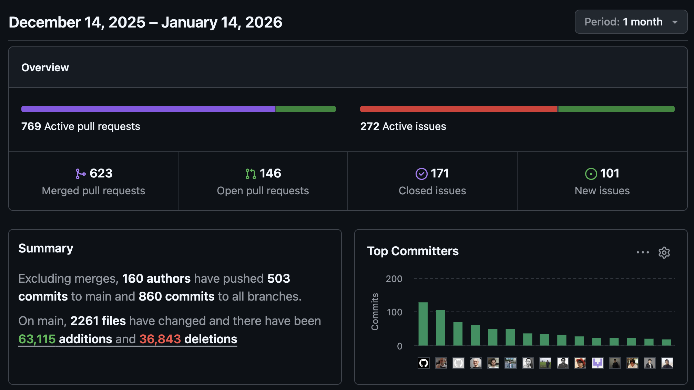
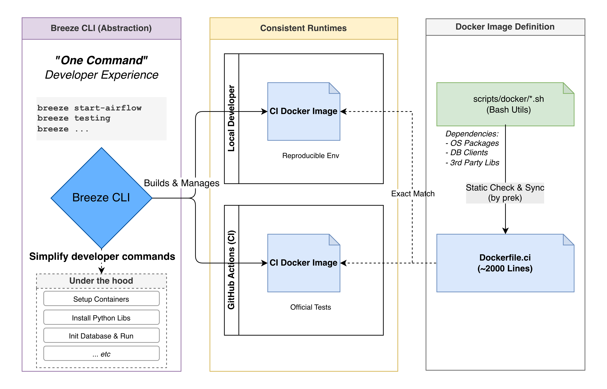
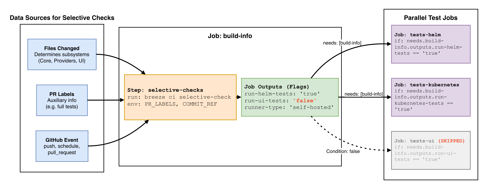
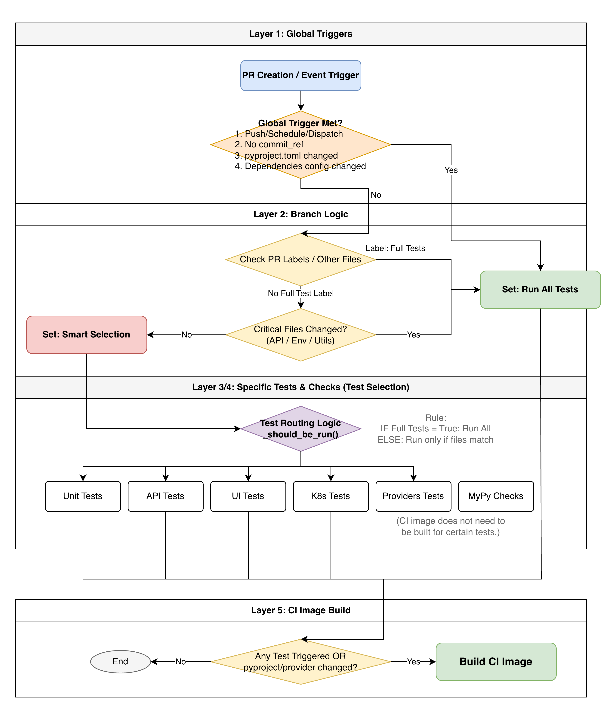

# Apache Airflow’s CI System

Continuous Integration (CI) is critical for keeping large software projects healthy. Even a tiny bug fix, a new feature, or a one-line documentation tweak can trigger different levels of integration tests to ensure nothing breaks and the project remains stable.

For example, from last month (Dec 2025) to today (Jan 14, 2026), **even during Christmas and New Year’s**, Apache Airflow merged **600+ PRs**. Every PR triggers CI runs. These runs span from unit tests to system tests, helping catch regressions early.



Within about a month, there were **200,000+ GitHub Actions jobs** and nearly **three million minutes** of test time (roughly **2,000 days**). At this scale, even small CI optimizations can significantly reduce total runtime and cost—while giving developers faster feedback.

This post breaks down the architecture behind Airflow’s CI and explains how it achieves:

- **Reproducible environments across remote CI and local development**
- **Highly automated test selection based on PR changes**
- **Composable CI workflows**
- **A better developer experience (DX)**


## Reproducible environments

To avoid the classic “it works on my machine” problem, Airflow’s CI relies on **Docker** to standardize test environments. Whether you run tests locally or in GitHub Actions, Airflow uses dedicated Docker images to keep environments consistent and reproducible.

> 
> ["It worked on my computer"](https://www.reddit.com/r/ProgrammerHumor/comments/ts6d8s/it_worked_on_my_computer/)

The CI Dockerfile is roughly **2,000 lines** long. It’s generated by syncing a set of bash scripts under [`scripts/docker`](https://github.com/apache/airflow/tree/26a9d3b81b1d514ac00476885ba29676cd8f27e6/scripts/docker) into the final [Dockerfile.ci](https://github.com/apache/airflow/blob/26a9d3b81b1d514ac00476885ba29676cd8f27e6/Dockerfile.ci#L1-L2). This makes it easier to share utilities and modularize dependency installation (OS packages, Python packaging tools, DB clients, third‑party service clients, etc.).


## Breeze: the backbone of Airflow CI and developer experience

> [!quote] **Developer Experience (DX)**
> We could write detailed docs listing a long sequence of commands to set up dependencies and configure a local environment.
> But if we provide a higher-level, well-encapsulated CLI tool,
> developers can set everything up with **one command**.
>
> That doesn’t just improve DX.
> It also reduces:
> - the burden of maintaining multiple setup documents
> - the risk that local setup steps drift away from the real CI environment



[Breeze](https://github.com/apache/airflow/tree/main/dev/breeze) is Airflow’s CLI specifically designed for contributors. It provides a unified interface to manage development and test environments. With Breeze, contributors can emulate CI locally, bring up Airflow quickly, and run a wide range of tests and checks.

- Simple commands to start and manage the dev environment
- Automation for common checks and test flows
- The official CI environment runs the same configuration and flow as local runs: **you can reproduce CI locally**
  - e.g. [`breeze ci-image load --from-pr 12345 --python 3.10 --github-token <your_github_token>`](https://github.com/apache/airflow/blob/7bb3f203c24fca914cd296af47d6f00fa735feba/dev/breeze/doc/ci/07_running_ci_locally.md#getting-the-ci-image-from-failing-job)


## What test types does Airflow CI run?

Airflow defines **20+** CI test and check types. At a high level:

**Core tests:**

- Unit tests
- API tests
- System tests


**Subsystem tests:**

- UI tests / UI E2E tests
- Helm tests
- Kubernetes tests
- Go SDK tests
- Task SDK tests / Task SDK integration tests
- Airflow CTL tests / Airflow CTL integration tests
- WWW tests

**Static checks and scans:**

- MyPy (type checking)
- Python scans
- JavaScript scans
- API codegen
- CodeQL scans

**Other targeted tests:**

- Amazon system tests
- Providers compatibility tests (**validate provider changes across multiple Airflow versions**)
- Coverage

For the full list, see the `FileGroupForCi` definition in [Selective Checks](https://github.com/apache/airflow/blob/26a9d3b81b1d514ac00476885ba29676cd8f27e6/dev/breeze/src/airflow_breeze/utils/selective_checks.py#L101-L137).

Recently, Airflow introduced [Airflow E2E tests](https://github.com/apache/airflow/blob/7524107bf5ca6254abf43e024c33c1fb5e1dd7c6/.github/workflows/airflow-e2e-tests.yml#L20-L21) to validate workflows that depend on external systems—such as [Remote Logging](https://airflow.apache.org/docs/apache-airflow/3.1.6/administration-and-deployment/logging-monitoring/logging-tasks.html). It also has Playwright-based [UI end-to-end tests](https://github.com/apache/airflow/blob/7524107bf5ca6254abf43e024c33c1fb5e1dd7c6/.github/workflows/ui-e2e-tests.yml#L20-L21) to reduce UI regressions as the UI surface grows.

> Airflow E2E tests and UI E2E tests are both areas with lots of room for contribution.
> The newer Airflow E2E tests have already caught bugs that unit tests and system tests did not—e.g. [Move Airflow Config Parser to shared library #57744](https://github.com/apache/airflow/pull/57744).
> With Airflow 3 doing substantial client/server migrations and refactors, E2E testing becomes increasingly important.


## How does Airflow label a PR’s area of change?

Airflow uses [boring-cyborg](https://github.com/kaxil/boring-cyborg) (built by [@kaxil](https://github.com/kaxil)) to automatically apply PR labels based on changed paths. This includes core subsystem labels like `area:CLI`, `area:API`, and `area:Scheduler`, as well as provider labels like `provider:apache-cassandra` and `provider:apache-iceberg`.

Today, those auto-applied labels are not directly used by Airflow CI. They’re primarily used for provider releases.


## Key GitHub Actions primitives used in Airflow CI

This section answers two practical questions.


### How do you pass data between jobs?

**How do you do “Airflow XCom” in GitHub Actions?**

An upstream job can define outputs via `jobs.<job_id>.outputs`.

**Upstream job example**

```yaml
jobs:
  upstream-job:
    runs-on: ubuntu-latest
    outputs:
      output1: ${{ steps.step1.outputs.test }}
      output2: ${{ steps.step2.outputs.test }}
    steps:
      - id: step1
        run: echo "test=hello" >> "$GITHUB_OUTPUT"
      - id: step2
        run: echo "test=world" >> "$GITHUB_OUTPUT"
```

Any command that writes key/value pairs into `$GITHUB_OUTPUT` can define step outputs.
For example, you can run a Python script and append results into `$GITHUB_OUTPUT`:

```python
# generate_upstream_outputs.py
import os

if __name__ == "__main__":
  with open(os.environ['GITHUB_OUTPUT'], 'a') as f:
    for i in range(3):
      f.write(f"output{i}=value-{i}\n")
```

Even if outputs are produced dynamically, downstream jobs can only access outputs explicitly defined under `jobs.<job_id>.outputs`.
In the example below, the script creates `output0`, `output1`, `output2`, but only `output1` and `output2` are exposed:

```yaml
jobs:
  upstream-job:
    runs-on: ubuntu-latest
    outputs:
      # downstream job can only access outputs defined here
      # so the `generate-outputs.outputs.output0` is not accessible
      output1: ${{ steps.generate-outputs.outputs.output1 }}
      output2: ${{ steps.generate-outputs.outputs.output2 }}
    steps:
      - id: generate-outputs
        run: python generate_upstream_outputs.py
```

**Downstream job example**

Downstream jobs can reference upstream outputs via `needs.<job_id>.outputs.<output_name>`:

```yaml
jobs:
  # Assuming upstream-job is defined above
  downstream-job:
    runs-on: ubuntu-latest
    needs: [upstream-job] # We need to declare the dependency here !!!
    steps:
      - name: Use outputs from upstream job
        run: |
          echo "Output 1: ${{ needs.upstream-job.outputs.output1 }}"
          echo "Output 2: ${{ needs.upstream-job.outputs.output2 }}"
```

- https://docs.github.com/en/actions/how-tos/write-workflows/choose-what-workflows-do/pass-job-outputs
- https://docs.github.com/en/actions/reference/workflows-and-actions/workflow-syntax#jobsjob_idoutputs
- https://docs.github.com/en/actions/reference/workflows-and-actions/workflow-syntax#jobsjob_idneeds


### How do you run only specific jobs?

**How do you do “Airflow conditions” in GitHub Actions?**

Use `jobs.<job_id>.if` to control whether a job runs.

**Example**

```yaml
jobs:
  conditional-job:
    runs-on: ubuntu-latest
    if: ${{ github.event_name == 'pull_request' && contains(github.event.pull_request.labels.*.name, 'run-conditional-job') }}
    steps:
      - name: Run only on PRs with specific label
        run: echo "This job runs only on PRs with 'run-conditional-job' label."
```

- https://docs.github.com/en/actions/reference/workflows-and-actions/workflow-syntax#jobsjob_idif


## Pruning the test matrix: Selective Checks



As mentioned at the beginning, Airflow triggers **tens of thousands** of GitHub Actions jobs every month. To avoid wasting resources, Airflow needs an automated mechanism to decide **which tests should run** based on what changed in a PR.

> You probably don’t want a documentation-only PR to trigger heavyweight Kubernetes system tests.
> Conversely, if Kubernetes-related code changes do *not* trigger the relevant tests, that’s a serious problem.

At first, I assumed Selective Checks was mostly driven by PR labels applied by boring-cyborg. In practice, Selective Checks is primarily based on **the set of files changed in the PR**, and labels are only one possible additional signal.

Signals include:

- Changed files
  - which subsystem they belong to (Core, Providers, UI, Helm chart, Kubernetes, Airflow CTL, Task SDK, etc.)
  - number of files
- Special files (e.g. `pyproject.toml`, CI framework internals)
- GitHub Actions event (push, schedule, pull_request, etc.)
- PR labels (currently not tightly integrated with `area:xxx` labels)

In GitHub Actions, Airflow runs Selective Checks in the `build-info` job and publishes a set of flags for downstream jobs.

```yaml
jobs:
# ...
  build-info:
    # At build-info stage we do not yet have outputs so we need to hard-code the runs-on to public runners
    outputs:
      # ...
      run-api-codegen: ${{ steps.selective-checks.outputs.run-api-codegen }}
      run-api-tests: ${{ steps.selective-checks.outputs.run-api-tests }}
      run-coverage: ${{ steps.source-run-info.outputs.run-coverage }}
      run-go-sdk-tests: ${{ steps.selective-checks.outputs.run-go-sdk-tests }}
      run-helm-tests: ${{ steps.selective-checks.outputs.run-helm-tests }}
      run-kubernetes-tests: ${{ steps.selective-checks.outputs.run-kubernetes-tests }}
      run-mypy: ${{ steps.selective-checks.outputs.run-mypy }}
      run-system-tests: ${{ steps.selective-checks.outputs.run-system-tests }}
      run-task-sdk-tests: ${{ steps.selective-checks.outputs.run-task-sdk-tests }}
      run-task-sdk-integration-tests: ${{ steps.selective-checks.outputs.run-task-sdk-integration-tests }}
      runner-type: ${{ steps.selective-checks.outputs.runner-type }}
      run-ui-tests: ${{ steps.selective-checks.outputs.run-ui-tests }}
      run-ui-e2e-tests: ${{ steps.selective-checks.outputs.run-ui-e2e-tests }}
      run-unit-tests: ${{ steps.selective-checks.outputs.run-unit-tests }}
      run-www-tests: ${{ steps.selective-checks.outputs.run-www-tests }}
      # ...
    steps:
    # some setup steps ...
    - name: "Install Breeze"
      uses: ./.github/actions/breeze
      id: breeze
    - name: "Get information about the Workflow"
      id: source-run-info
      run: breeze ci get-workflow-info 2>> ${GITHUB_OUTPUT}
      env:
        SKIP_BREEZE_SELF_UPGRADE_CHECK: "true"
    - name: Selective checks
      id: selective-checks
      env:
        PR_LABELS: "${{ steps.source-run-info.outputs.pr-labels }}"
        COMMIT_REF: "${{ github.sha }}"
        VERBOSE: "false"
      run: breeze ci selective-check 2>> ${GITHUB_OUTPUT}
```

Using [Remove experimental note from EdgeExecutor #60446](https://github.com/apache/airflow/actions/runs/20952103684/job/60207742385?pr=60446) as an example, below is what the `build-info` job produced.

> [!note]+ Output from `breeze ci get-workflow-info 2>> ${GITHUB_OUTPUT}`
>
> ```bash
> pr-labels = ['backport-to-v3-1-test']
> target-repo = apache/airflow
> head-repo = eladkal/airflow
> pr-number = 60446
> event-name = pull_request
> runs-on = ["ubuntu-22.04"]
> canary-run = false
> run-coverage = false
> head-ref = edge
> ```

> [!note]+ Output from `breeze ci selective-check 2>> ${GITHUB_OUTPUT}`
>
> `GITHUB_OUTPUT` content (`stderr` is redirected to `${GITHUB_OUTPUT}`)
>
> ```bash
> all-python-versions = ['3.10']
> all-python-versions-list-as-string = 3.10
> all-versions = false
> amd-runners = ["ubuntu-22.04"]
> any-provider-yaml-or-pyproject-toml-changed = false
> arm-runners = ["ubuntu-22.04-arm"]
> ['airflow-core/docs/core-concepts/executor/index.rst']
> basic-checks-only = false
> ci-image-build = true
> common-compat-changed-without-next-version = false
> core-test-types-list-as-strings-in-json = [{"description": "API...Serialization", "test_types": "API Always CLI Core Other Serialization"}]
> debug-resources = false
> default-branch = main
> default-constraints-branch = constraints-main
> default-helm-version = v3.17.3
> default-kind-version = v0.30.0
> default-kubernetes-version = v1.30.13
> default-mysql-version = 8.0
> default-postgres-version = 14
> default-python-version = 3.10
> disable-airflow-repo-cache = false
> prod-image-build = false
> provider-dependency-bump = false
> providers-compatibility-tests-matrix = [{"python-version": "3.10", "airflow-version": "2.11.0", "remove-providers": "common.messaging edge3 fab git keycloak", "run-unit-tests": "true"}, {"python-version": "3.10", "airflow-version": "3.0.6", "remove-providers": "", "run-unit-tests": "true"}, {"python-version": "3.10", "airflow-version": "3.1.5", "remove-providers": "", "run-unit-tests": "true"}]
> providers-test-types-list-as-strings-in-json = null
> pyproject-toml-changed = false
> python-versions = ['3.10']
> python-versions-list-as-string = 3.10
> run-airflow-ctl-integration-tests = false
> run-airflow-ctl-tests = false
> run-amazon-tests = false
> run-api-codegen = false
> run-api-tests = false
> run-go-sdk-tests = false
> run-helm-tests = false
> run-javascript-scans = false
> run-kubernetes-tests = false
> run-mypy = false
> run-ol-tests = false
> run-python-scans = false
> run-system-tests = true
> run-task-sdk-integration-tests = false
> run-task-sdk-tests = false
> run-ui-e2e-tests = false
> run-ui-tests = false
> run-unit-tests = true
> runner-type = ["ubuntu-22.04"]
> shared-distributions-as-json = ["secrets_masker", "plugins_manager", "secrets_backend", "listeners", "dagnode", "configuration", "module_loading", "logging", "timezones", "observability"]
> skip-prek-hooks = check-provider-yaml-valid,flynt,identity,lint-helm-chart,ts-compile-lint-simple-auth-manager-ui,ts-compile-lint-ui
> skip-providers-tests = true
> sqlite-exclude = []
> testable-core-integrations = ['kerberos', 'redis']
> testable-providers-integrations = ['celery', 'cassandra', 'drill', 'tinkerpop', 'kafka', 'mongo', 'pinot', 'qdrant', 'redis', 'trino', 'ydb']
> ui-english-translation-changed = false
> upgrade-to-newer-dependencies = false
> ```
>
> `stdout` content:
> ```
> Changed files:
>
> ('airflow-core/docs/core-concepts/executor/index.rst',)
> FileGroupForCi.ENVIRONMENT_FILES did not match any file.
> FileGroupForCi.API_FILES did not match any file.
> FileGroupForCi.GIT_PROVIDER_FILES did not match any file.
> FileGroupForCi.STANDARD_PROVIDER_FILES did not match any file.
> FileGroupForCi.TESTS_UTILS_FILES did not match any file.
> FileGroupForCi.ALL_SOURCE_FILES matched 1 files.
> ['airflow-core/docs/core-concepts/executor/index.rst']
> FileGroupForCi.UI_FILES did not match any file.
> FileGroupForCi.ALL_SOURCE_FILES enabled because it matched 1 changed files
> SelectiveCoreTestType.API did not match any file.
> SelectiveCoreTestType.CLI did not match any file.
> SelectiveCoreTestType.SERIALIZATION did not match any file.
> FileGroupForCi.KUBERNETES_FILES did not match any file.
> FileGroupForCi.SYSTEM_TEST_FILES did not match any file.
> FileGroupForCi.ALL_PROVIDERS_PYTHON_FILES did not match any file.
> FileGroupForCi.ALL_PROVIDERS_DISTRIBUTION_CONFIG_FILES did not match any file.
> FileGroupForCi.ALWAYS_TESTS_FILES did not match any file.
> Remaining non test/always files: 1
> We should run all core tests except providers. There are 1 changed files that seems to fall into Core/Other category
> {'airflow-core/docs/core-concepts/executor/index.rst'}
> Selected core test type candidates to run:
> ['API', 'Always', 'CLI', 'Core', 'Other', 'Serialization']
> FileGroupForCi.DOC_FILES matched 1 files.
> ['airflow-core/docs/core-concepts/executor/index.rst']
> FileGroupForCi.DOC_FILES enabled because it matched 1 changed files
> FileGroupForCi.API_FILES disabled because it did not match any changed files
> FileGroupForCi.ASSET_FILES did not match any file.
> FileGroupForCi.ASSET_FILES disabled because it did not match any changed files
> FileGroupForCi.ALL_PYPROJECT_TOML_FILES did not match any file.
> FileGroupForCi.TASK_SDK_FILES did not match any file.
> FileGroupForCi.TASK_SDK_FILES disabled because it did not match any changed files
> FileGroupForCi.DEVEL_TOML_FILES did not match any file.
> FileGroupForCi.ALL_AIRFLOW_PYTHON_FILES did not match any file.
> FileGroupForCi.ALL_DEV_PYTHON_FILES did not match any file.
> FileGroupForCi.ALL_DEVEL_COMMON_PYTHON_FILES did not match any file.
> FileGroupForCi.ALL_AIRFLOW_CTL_PYTHON_FILES did not match any file.
> FileGroupForCi.KUBERNETES_FILES disabled because it did not match any changed files
> FileGroupForCi.HELM_FILES did not match any file.
> FileGroupForCi.HELM_FILES disabled because it did not match any changed files
> FileGroupForCi.TASK_SDK_FILES disabled because it did not match any changed files
> FileGroupForCi.TASK_SDK_INTEGRATION_TEST_FILES did not match any file.
> FileGroupForCi.TASK_SDK_INTEGRATION_TEST_FILES disabled because it did not match any changed files
> FileGroupForCi.AIRFLOW_CTL_FILES did not match any file.
> FileGroupForCi.AIRFLOW_CTL_FILES disabled because it did not match any changed files
> FileGroupForCi.AIRFLOW_CTL_INTEGRATION_TEST_FILES did not match any file.
> FileGroupForCi.AIRFLOW_CTL_INTEGRATION_TEST_FILES disabled because it did not match any changed files
> FileGroupForCi.UI_FILES disabled because it did not match any changed files
> FileGroupForCi.AIRFLOW_CTL_FILES disabled because it did not match any changed files
> FileGroupForCi.API_CODEGEN_FILES did not match any file.
> FileGroupForCi.API_CODEGEN_FILES disabled because it did not match any changed files
> FileGroupForCi.GO_SDK_FILES did not match any file.
> FileGroupForCi.GO_SDK_FILES disabled because it did not match any changed files
> FileGroupForCi.JAVASCRIPT_PRODUCTION_FILES did not match any file.
> FileGroupForCi.JAVASCRIPT_PRODUCTION_FILES disabled because it did not match any changed files
> FileGroupForCi.PYTHON_PRODUCTION_FILES did not match any file.
> FileGroupForCi.PYTHON_PRODUCTION_FILES disabled because it did not match any changed files
> FileGroupForCi.ALL_PYTHON_FILES did not match any file.
> FileGroupForCi.UI_ENGLISH_TRANSLATION_FILES did not match any file.
> ```

- [breeze/doc/ci - README](https://github.com/apache/airflow/tree/main/dev/breeze/doc/ci)
- [`breeze ci selective-check` CLI entrypoint](https://github.com/apache/airflow/blob/26a9d3b81b1d514ac00476885ba29676cd8f27e6/dev/breeze/src/airflow_breeze/commands/ci_commands.py#L260-L271)
- [The `SelectiveChecks` class (core logic that lists matched conditions)](https://github.com/apache/airflow/blob/26a9d3b81b1d514ac00476885ba29676cd8f27e6/dev/breeze/src/airflow_breeze/utils/selective_checks.py#L448)
  - [All public properties are treated as Selective Checks outputs](https://github.com/apache/airflow/blob/26a9d3b81b1d514ac00476885ba29676cd8f27e6/dev/breeze/src/airflow_breeze/utils/selective_checks.py#L486-L495)


### Subsystem test job definitions

Each subsystem test job consumes output flags from the `build-info` job and uses `jobs.<job_id>.if` conditions to decide whether it should run. This is how Airflow avoids unnecessary tests.

Most subsystem jobs only depend on `needs: [build-info, build-ci-images]`, so they can run **in parallel**.

```yaml
jobs:
# ...
  tests-helm:
    name: "Helm tests"
    uses: ./.github/workflows/helm-tests.yml
    needs: [build-info, build-ci-images]
    permissions:
      contents: read
      packages: read
    with:
    # partial list of inputs passed from build-info job
      runners: ${{ needs.build-info.outputs.runner-type }}
      platform: ${{ needs.build-info.outputs.platform }}
      helm-test-packages: ${{ needs.build-info.outputs.helm-test-packages }}
      default-python-version: "${{ needs.build-info.outputs.default-python-version }}"
      use-uv: ${{ needs.build-info.outputs.use-uv }}
    # only if helm tests are required
    # based on the selective checks output
    if: >
      needs.build-info.outputs.run-helm-tests == 'true' &&
      needs.build-info.outputs.default-branch == 'main' &&
      needs.build-info.outputs.latest-versions-only != 'true'
```

- Full `jobs.tests-helm` definition: https://github.com/apache/airflow/blob/26a9d3b81b1d514ac00476885ba29676cd8f27e6/.github/workflows/ci-amd-arm.yml#L381-L382


### Core decision logic



**Layer 1: Global triggers** → run the full suite

If any of the following is true, Airflow runs the **full test suite**:
- **PUSH / SCHEDULE / WORKFLOW_DISPATCH** GitHub event
- **Missing `commit_ref`**, so the change set can’t be determined
- **`pyproject.toml`** or other dependency/build config was changed
- **Provider dependency generated files** were changed

**Layer 2: Version selection** → decide the test matrix size

| Label | Versions |
|------|---------|
| Global trigger OR `all versions` | All versions (Python/PostgreSQL/MySQL/Kubernetes) |
| `latest versions only` | Latest versions only |
| `default versions only` or no label | Default versions |

**Layer 3: Test type routing** → decide which tests to run

| Changed file category | Tests to run |
|-----------|---------|
| Source code files | Unit tests, type checks |
| API-related files | API tests |
| UI files | UI tests, UI E2E tests |
| Kubernetes configs | Kubernetes system tests, Helm tests |
| Task SDK files | Task SDK tests |
| Go SDK files | Go SDK tests |
| Airflow CTL files | Airflow CTL tests |
| Environment/API/Provider configs | Run the full suite |
| Documentation files | Docs build |

**Layer 4: Additional checks** → static checks and scans

- **Type checking (MyPy)**: when Python files change
- **JavaScript scans**: when production JavaScript changes
- **Security scans (CodeQL)**: when any source code changes

**Layer 5: Should we build the CI image?** → build only when needed

- Any tests are triggered (unit/API/UI/Kubernetes/Helm, etc.)
- `pyproject.toml` changed
- Provider config changed


### Practical examples

| Scenario | What changed | Decision | Tests |
|------|---------|---------|---------|
| **UI-only change** | `frontend/src/App.tsx` | Not full-suite + UI-only | Skip unit tests<br/>Run UI tests and UI E2E tests |
| **Python source change** | `airflow-core/src/airflow/operators/bash.py` | Not full-suite + source files matched | Run unit tests<br/>Run type checks (MyPy) |
| **`pyproject.toml` change** | `airflow-core/pyproject.toml` | Dependency/build config changed | Full suite<br/>All versions |
| **Scheduled run** | SCHEDULE event | Global trigger matched | Full suite<br/>All versions<br/>All providers |


## Summary

Airflow’s CI architecture combines:

1. **Containerization** for reproducible environments
2. **Breeze CLI** to standardize contributor workflows and improve DX
3. **GitHub Actions outputs and conditions** to build composable workflows
4. **Selective Checks** to choose an appropriate test scope based on PR changes

This multi-layered decision system keeps CI both flexible and efficient.
Selective Checks in particular helps skip unnecessary tests. For the detailed rules, see the [Core decision logic](#core-decision-logic) section.

There’s also an important trade-off between “saving CI resources” and “test completeness.”
In Airflow’s current Selective Checks behavior, changes to core often trigger a broad set of core tests (unit/API/system). That costs more, but maximizes safety.
In the [OpenSource4You Airflow meeting](https://docs.google.com/document/d/1i0xRWXTYc8UFqWGkklnFVQgK8C3NPmAnY7XUKweZCos/edit?tab=t.0#heading=h.lbmppok7rjhg) I discussed this with [Chia-Ping](https://github.com/chia7712), and the conclusion was: **test completeness is more important than saving CI minutes**.

Another thing worth noting: most subsystem tests run **in parallel**, but they commonly depend on `build-ci-images` to build the CI Docker image. Further optimizing `build-ci-images` can significantly improve end-to-end CI time.

If you want to dive deeper, here are some useful references:

- [@Jarek](https://github.com/potiuk)’s PR: [Split tests to core/providers/task-sdk/integration/system #43979](https://github.com/apache/airflow/pull/43979) (4,000+ lines of changes)
- [breeze/doc/ci - README](https://github.com/apache/airflow/tree/main/dev/breeze/doc/ci)
- [`breeze ci selective-check` CLI entrypoint](https://github.com/apache/airflow/blob/26a9d3b81b1d514ac00476885ba29676cd8f27e6/dev/breeze/src/airflow_breeze/commands/ci_commands.py#L260-L271)
- [The `SelectiveChecks` class (core logic that lists matched conditions)](https://github.com/apache/airflow/blob/26a9d3b81b1d514ac00476885ba29676cd8f27e6/dev/breeze/src/airflow_breeze/utils/selective_checks.py#L448)
  - [All public properties are treated as Selective Checks outputs](https://github.com/apache/airflow/blob/26a9d3b81b1d514ac00476885ba29676cd8f27e6/dev/breeze/src/airflow_breeze/utils/selective_checks.py#L486-L495)
- [apache/airflow GitHub Project - CI / DEV ENV planned work](https://github.com/orgs/apache/projects/403)